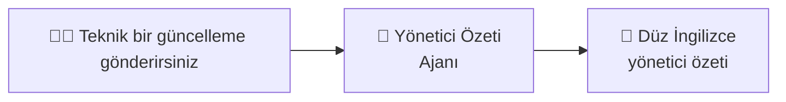

# Modül 0 - Giriş

⏱️ ~10 dk

> [!WARNING]
> **Önizleme & Sınırlamalar:** [Barındırılan Ajanlar](https://learn.microsoft.com/azure/foundry/agents/concepts/hosted-agents) şu anda **genel önizlemede** - üretim iş yükleri için önerilmez. Aşağıdakilere dikkat edin:
> - **Desteklenen bölgeler sınırlıdır** - kaynak oluşturmadan önce [bölge kullanılabilirliğini](https://learn.microsoft.com/azure/foundry/agents/concepts/hosted-agents#region-availability) kontrol edin. Desteklenmeyen bir bölge seçerseniz, dağıtım başarısız olur.
> - `azure-ai-agentserver-agentframework` paketi ön-sürümdür - API'ler sürümler arasında değişebilir.
> - Ölçek sınırları: barındırılan ajanlar 0–5 replika destekler (ölçeği sıfıra alma dahil).
> - Bu atölyede gösterilen bazı özellikler, servis GA aşamasına ilerlerken değişebilir.

## Neler inşa edeceksiniz

Bu atölyede, karmaşık teknik güncellemeleri alıp sade İngilizce yönetici özetleri olarak yeniden yazan bir **"Yöneticiymişim Gibi Açıkla"** ajansı - barındırılan bir yapay zeka ajanı oluşturacaksınız.

```mermaid
flowchart LR
    A["🧑‍💻 Teknik bir güncelleme gönderirsiniz"] --> B["🤖 Yönetici Özeti\nAjanı"]
    B --> C["📝 Düz İngilizce\nyönetici özeti"]
```

**Ajans şunları kullanır:**
- **Microsoft Agent Framework** - ajan mantığı ve yapısı için
- **Foundry Toolkit for VS Code** - iskelet oluşturma, yerel test ve dağıtım için
- **Bir AI modeli** (ör. `gpt-4.1-mini/gpt-5-mini`) - özetleri oluşturmak için

Bu laboratuvarın sonunda, Agent Inspector ile yerelde test edebileceğiniz ve isteğe bağlı olarak buluta dağıtabileceğiniz çalışan bir ajana sahip olacaksınız.

---

## Barındırılan ajanlar nedir?

**Barındırılan ajan**, Microsoft Foundry'de yönetilen bir hizmet olarak çalışan bir yapay zeka ajanıdır. Kendi altyapınızı yönetmek yerine, ajan kodunuzu bir konteyner içinde paketlersiniz ve Foundry ölçeklendirmeyi, barındırmayı ve standart bir HTTP uç noktası ile erişimi yönetir.

| Kavram | Anlamı |
|---------|--------------|
| **Ajan** | Kullanıcı mesajını alan, bir AI modelini çağıran ve yapılandırılmış bir yanıt döndüren Python kodunuz |
| **Barındırılan** | Foundry konteynerinizi sizin için çalıştırır - VM yok, Kubernetes yok, yönetilecek altyapı yok |
| **Yanıtlar protokolü** | Herhangi bir istemcinin ajanınızla etkileşim kurması için çağırabileceği standart bir HTTP API (`POST /responses`) |
| **Agent Inspector** | Dağıtımdan önce ajanınızla sohbet etmenize izin veren yerel test arayüzü (Foundry Toolkit'e entegre) |

Bu atölyede sıfırdan tam barındırılan bir ajana geçecek veya tercih ederseniz yerel testte duracaksınız.

---

## Yolunuzu seçin

> ⚠️ **Devam etmeden önce bir yol seçin.** Seçiminiz hangi araçları yükleyeceğinizi ve hangi modüllerin uygulanacağını belirler. Daha sonra Abonelik alırsanız Yol B'den → Yol A'ya geçebilirsiniz.

<strong>🅰️ Yol A - Azure bulutu (Azure aboneliği gerektirir)</strong>

| | Detaylar |
|---|---|
| **Kimler için?** | Aktif bir Azure aboneliğiniz var ve Foundry kaynakları oluşturabilirsiniz |
| **Model** | Foundry üzerinden Azure OpenAI (ör. `gpt-4.1-mini/gpt-5-mini`) |
| **Kapsanan modüller** | Tüm modüller (00–07) |
| **Buluta dağıtım?** | ✅ Evet - tam uçtan uca dağıtım |

<strong>🅱️ Yol B - Yerel / ücretsiz katman (Azure aboneliği gerekmez)</strong>

| | Detaylar |
|---|---|
| **Kimler için?** | MVP’ler, öğrenciler veya Azure erişimi olmayan herkes |
| **Model** | **Foundry Local** (ücretsiz, bilgisayarınızda çalışır) |
| **Kapsanan modüller** | Modüller 00–04 (dağıtım ve bulut doğrulaması atlanır) |
| **Buluta dağıtım?** | ❌ Hayır - sadece Agent Inspector ile yerel test |

---

## Tüm yollar: Gerekli araçlar

Aşağıdaki her aracı yükleyin. Yükledikten sonra, kontrol komutunu çalıştırarak düzgün çalıştığını doğrulayın.

| # | Araç | Sürüm | Kurulum | Doğrulama (Beklenen Çıktı) |
|---|------|---------|---------|---------------------------|
| 1 | **Visual Studio Code** | En yeni | [code.visualstudio.com](https://code.visualstudio.com/) | Hata olmadan açılır |
| 2 | **Python** | 3.12 veya üzeri | [python.org/downloads](https://www.python.org/downloads/) | `python --version` $\rightarrow$ `Python 3.12.x` |
| 3 | **Foundry Toolkit for VS Code** | En yeni | Eklenti ID'si: `ms-windows-ai-studio.windows-ai-studio` | Activity Bar’da Foundry simgesi |
| 4 | **Python uzantısı VS Code için** | En yeni | Eklenti ID'si: `ms-python.python` | Eklentiler panelinde kurulu |

> [!TIP]
> **Kurulum için profesyonel ipuçları:**
> - **Python PATH (Windows):** Python yükleyicisinin ilk ekranında her zaman **"Add Python to PATH"** seçeneğini işaretleyin. Bunu yapmazsanız `python` terminalde tanınmaz.
> - **Birden çok Python sürümü:** Hem Python 3.10 hem de 3.12 yüklüyse, sanal ortamınız için doğru sürüm kullanılsın diye `python3.12 -m venv .venv` komutunu kullanın.
> - **Docker WSL 2 (Windows):** Docker Desktop yüklemesinde, **WSL 2 backend** seçili olduğundan emin olun. Hyper-V ile Docker daha yavaştır ve Foundry konteyner derlemelerinde sorun çıkarabilir.
> - **Docker başlamıyor mu?** Docker Desktop'u başlattıktan sonra 30–60 saniye bekleyin. `docker info` çalıştırın - "Cannot connect to the Docker daemon" görüyorsanız, Docker henüz başlatılıyor demektir.
> - **VS Code eklentileri yüklenmiyor mu?** Eklentileri yükledikten sonra pencereyi yenileyin: `Ctrl+Shift+P` → `Developer: Reload Window`.

> **Windows kullanıcıları:** Python yüklerken **"Add Python to PATH"** seçeneğini işaretleyin.

**Sonraki:** [01 - Kurulum →](01-setup.md)

---

<!-- CO-OP TRANSLATOR DISCLAIMER START -->
**Feragatname**:
Bu belge, AI çeviri hizmeti [Co-op Translator](https://github.com/Azure/co-op-translator) kullanılarak çevrilmiştir. Doğruluk için çaba sarf etsek de, otomatik çevirilerin hata veya yanlışlık içerebileceğini lütfen unutmayınız. Orijinal belge, kendi dilinde yetkili kaynak olarak kabul edilmelidir. Kritik bilgiler için profesyonel insan çevirisi önerilir. Bu çevirinin kullanımı sonucu ortaya çıkabilecek yanlış anlamalardan veya yanlış yorumlamalardan sorumlu değiliz.
<!-- CO-OP TRANSLATOR DISCLAIMER END -->