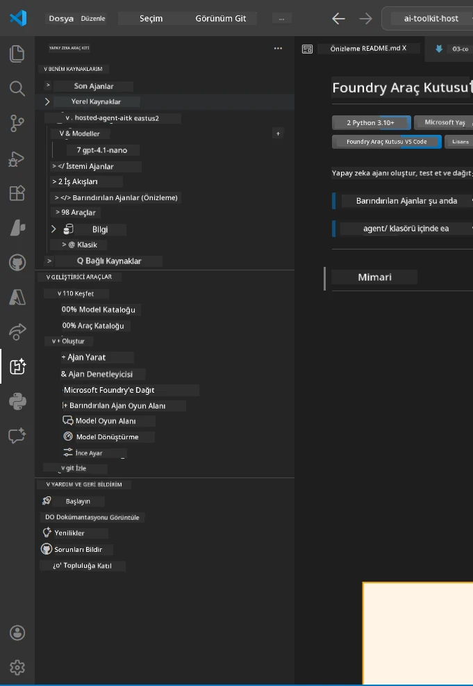
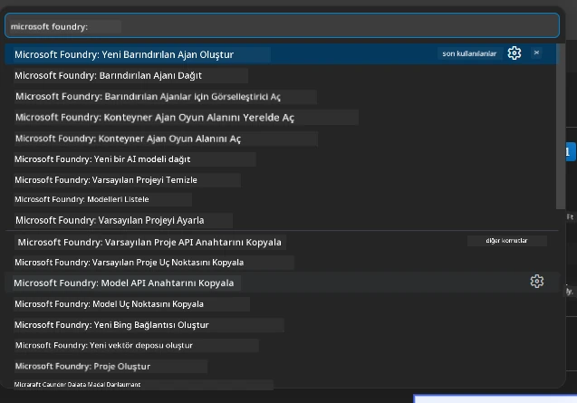

# Modül 1 - Foundry Toolkit & Foundry Uzantısını Yükleyin

Bu modül, bu atölye çalışması için iki önemli VS Code uzantısının yüklenmesi ve doğrulanması adımlarını anlatır. Eğer bunları zaten [Modül 0](00-prerequisites.md) sırasında yüklediyseniz, bu modülü uzantıların doğru çalıştığını doğrulamak için kullanın.

---

## Adım 1: Microsoft Foundry Uzantısını Yükleyin

**Microsoft Foundry for VS Code** uzantısı, Foundry projeleri oluşturmak, modelleri dağıtmak, barındırılan ajanlar iskeletini oluşturmak ve doğrudan VS Code’dan dağıtım yapmak için ana aracınızdır.

1. VS Code’u açın.
2. `Ctrl+Shift+X` tuşlarına basarak **Uzantılar** panelini açın.
3. Üstteki arama kutusuna şunu yazın: **Microsoft Foundry**
4. Başlığı **Microsoft Foundry for Visual Studio Code** olan sonucu bulun.
   - Yayıncı: **Microsoft**
   - Uzantı Kimliği: `TeamsDevApp.vscode-ai-foundry`
5. **Yükle** düğmesine tıklayın.
6. Kurulum tamamlanana kadar bekleyin (küçük bir ilerleme göstergesi göreceksiniz).
7. Kurulumdan sonra, VS Code’un sol tarafındaki **Etkinlik Çubuğu**’na (dikey simge çubuğu) bakın. Yeni bir **Microsoft Foundry** simgesi görmelisiniz (elmas/AI simgesi gibi).
8. **Microsoft Foundry** simgesine tıklayarak yan panel görünümünü açın. Şu bölümleri görmelisiniz:
   - **Kaynaklar** (veya Projeler)
   - **Ajanlar**
   - **Modeller**

> **Simge görünmüyorsa:** VS Code’u yeniden yüklemeyi deneyin (`Ctrl+Shift+P` → `Developer: Reload Window`).

---

## Adım 2: Foundry Toolkit Uzantısını Yükleyin

**Foundry Toolkit** uzantısı, ajanları yerel olarak test edip hata ayıklamak için görsel bir arayüz olan [**Agent Inspector**](https://learn.microsoft.com/azure/foundry/agents/how-to/vs-code-agents-workflow-pro-code) sağlamanın yanı sıra oyun alanı, model yönetimi ve değerlendirme araçları sunar.

1. Uzantılar panelinde (`Ctrl+Shift+X`), arama kutusunu temizleyip şunu yazın: **Foundry Toolkit**
2. Sonuçlarda **Foundry Toolkit**’i bulun.
   - Yayıncı: **Microsoft**
   - Uzantı Kimliği: `ms-windows-ai-studio.windows-ai-studio`
3. **Yükle** düğmesine tıklayın.
4. Kurulumdan sonra, Etkinlik Çubuğu’nda **Foundry Toolkit** simgesi belirir (robot/parıltı simgesi gibi).
5. **Foundry Toolkit** simgesine tıklayarak yan panel görünümünü açın. Karşılama ekranını ve şu seçenekleri görmelisiniz:
   - **Modeller**
   - **Oyun Alanı**
   - **Ajanlar**

---

## Adım 3: Her iki uzantının çalıştığını doğrulayın

### 3.1 Microsoft Foundry Uzantısını Doğrulama

1. Etkinlik Çubuğu’nda **Microsoft Foundry** simgesine tıklayın.
2. Azure’a giriş yaptıysanız (Modül 0’dan), **Kaynaklar** altında projeleriniz görünmelidir.
3. Giriş yapmanız istenirse, **Giriş Yap** düğmesine tıklayın ve kimlik doğrulama adımlarını izleyin.
4. Yan panelin sorunsuz açıldığını onaylayın.

### 3.2 Foundry Toolkit Uzantısını Doğrulama

1. Etkinlik Çubuğu’nda **Foundry Toolkit** simgesine tıklayın.
2. Karşılama görünümünün veya ana panelin sorunsuz yüklendiğini doğrulayın.
3. Henüz bir yapılandırma yapmanız gerekmez - Agent Inspector’ı [Modül 5](05-test-locally.md) içinde kullanacağız.

### 3.3 Komut Paletiyle Doğrulama

1. `Ctrl+Shift+P` tuşlarına basarak Komut Paleti’ni açın.
2. **"Microsoft Foundry"** yazın - şu komutları görmelisiniz:
   - `Microsoft Foundry: Yeni Barındırılan Ajan Oluştur`
   - `Microsoft Foundry: Barındırılan Ajanı Dağıt`
   - `Microsoft Foundry: Model Kataloğunu Aç`
3. Komut Paleti’ni kapatmak için `Escape` tuşuna basın.
4. Komut Paleti’ni tekrar açın ve **"Foundry Toolkit"** yazın - şu komutları görmelisiniz:
   - `Foundry Toolkit: Agent Inspector'ı Aç`

> Bu komutları göremiyorsanız, uzantılar doğru yüklenmemiş olabilir. Kaldırıp yeniden yüklemeyi deneyin.

---

## Bu uzantılar bu atölyede ne yapar

| Uzantı | Ne yapar | Ne zaman kullanacaksınız |
|--------|-----------|--------------------------|
| **Microsoft Foundry for VS Code** | Foundry projeleri oluşturur, modelleri dağıtır, **[barındırılan ajanları](https://learn.microsoft.com/azure/foundry/agents/concepts/hosted-agents) iskeletler** (otomatik olarak `agent.yaml`, `main.py`, `Dockerfile`, `requirements.txt` oluşturur), [Foundry Agent Service](https://learn.microsoft.com/azure/foundry/agents/overview) üzerine dağıtım yapar | Modüller 2, 3, 6, 7 |
| **Foundry Toolkit** | Ajanları yerel test/ayrıntılı hata ayıklama için Agent Inspector, oyun alanı arayüzü, model yönetimi | Modüller 5, 7 |

> **Foundry uzantısı bu atölyedeki en kritik araçtır.** Uçtan uca yaşam döngüsünü yönetir: iskelet oluştur → yapılandır → dağıt → doğrula. Foundry Toolkit, yerel test için görsel Agent Inspector ile destek sağlar.

---

### Kontrol Listesi

- [ ] Microsoft Foundry simgesi Etkinlik Çubuğu’nda görünür
- [ ] Tıklayınca yan panel sorunsuz açılır
- [ ] Foundry Toolkit simgesi Etkinlik Çubuğu’nda görünür
- [ ] Tıklayınca yan panel sorunsuz açılır
- [ ] `Ctrl+Shift+P` → "Microsoft Foundry" yazınca kullanılabilir komutlar görünür
- [ ] `Ctrl+Shift+P` → "Foundry Toolkit" yazınca kullanılabilir komutlar görünür

---

**Önceki:** [00 - Önkoşullar](00-prerequisites.md) · **Sonraki:** [02 - Foundry Projesi Oluştur →](02-create-foundry-project.md)

---

<!-- CO-OP TRANSLATOR DISCLAIMER START -->
**Feragatname**:  
Bu belge, AI çeviri hizmeti [Co-op Translator](https://github.com/Azure/co-op-translator) kullanılarak çevrilmiştir. Doğruluğa özen göstersek de, otomatik çevirilerin hatalar veya yanlışlıklar içerebileceğini lütfen unutmayınız. Orijinal belge, kendi ana dilinde yetkili kaynak olarak kabul edilmelidir. Kritik bilgiler için profesyonel insan çevirisi önerilir. Bu çevirinin kullanımı sonucu ortaya çıkabilecek herhangi bir yanlış anlama veya yanlış yorumlamadan sorumlu değiliz.
<!-- CO-OP TRANSLATOR DISCLAIMER END -->