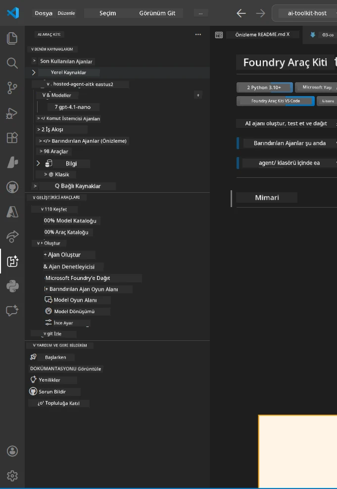
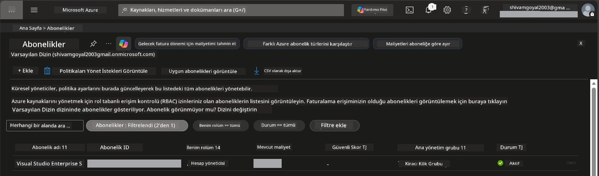
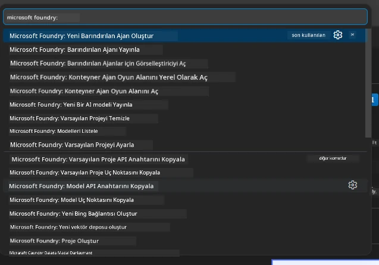
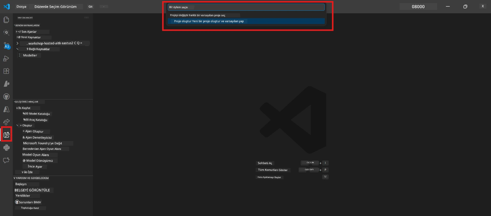
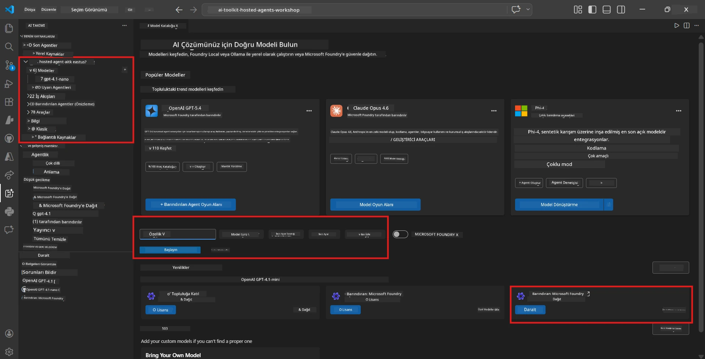
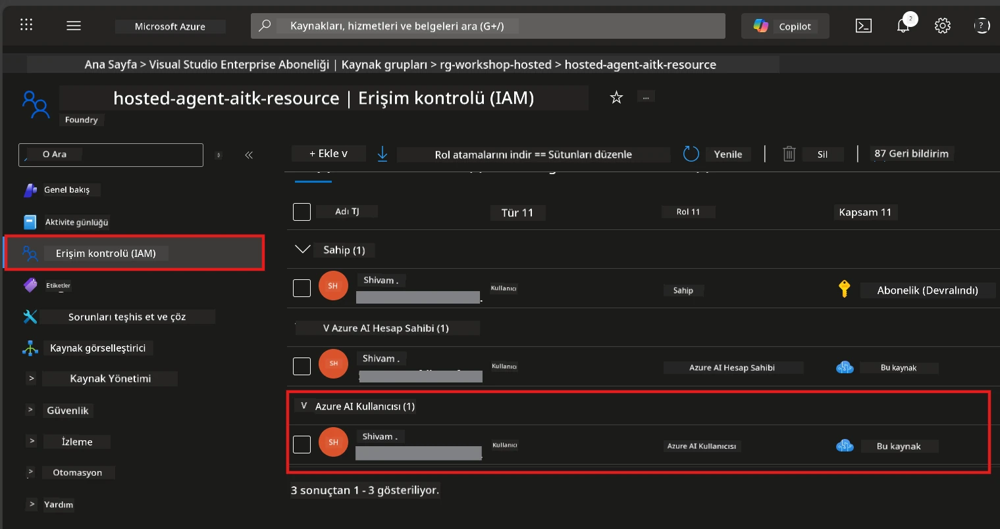

# Kurulum: Uzantı, Proje ve Model

⏱️ ~15 dk

Bu modülde, Foundry Toolkit uzantısını kurar ve doğrular, bir Foundry projesi oluşturur (veya bağlanırsınız) ve ajanınızın kullanacağı bir modeli dağıtırsınız.

## Adım 1: Foundry Toolkit'i Kurun

**Foundry Toolkit for VS Code**, bu atölye için birincil uzantıdır. Proje oluşturma, model dağıtımı, ajan iskeleti oluşturma, yerel test (Agent Inspector) ve bulut dağıtımı - tümü VS Code üzerinden sunulmaktadır.

1. VS Code'u açın ve ardından **Uzantılar** panelini açmak için `Ctrl+Shift+X`'e basın.
2. **Foundry Toolkit** için arama yapın.
3. **Foundry Toolkit for VS Code**'u yükleyin (Yayıncı: Microsoft, ID: `ms-windows-ai-studio.windows-ai-studio`).
4. Kurulumdan sonra, **Foundry Toolkit** simgesi Etkinlik Çubuğunda (sol yan çubuk) görünür.

> *Not: Etkinlik Çubuğu, eski uzantı sürümlerinde "AI TOOLKIT" olarak görünebilir. İşlevsellik aynıdır.*



## Adım 2: Erişiminize göre kurulum yapın

> **Yolunuzu seçin:** Kurulumunuza uyan aşağıdaki bölümü genişletin. Yalnızca **bir** yol tamamlamanız gerekir.

<details>
<summary><strong>🅰️ Yol A - Azure bulutu (Azure aboneliği gerektirir)</strong></summary>

### Azure CLI

1. [learn.microsoft.com/cli/azure/install-azure-cli](https://learn.microsoft.com/cli/azure/install-azure-cli) adresinden yükleyin.
2. Doğrulayın: `az --version` (2.80.0+ beklenir).
3. Oturum açın: `az login`

### Kimlik Doğrulama Seçenekleri

[Microsoft Agent Framework](https://learn.microsoft.com/agent-framework/overview/) [`DefaultAzureCredential`](https://learn.microsoft.com/azure/developer/python/sdk/authentication/credential-chains#defaultazurecredential-overview) kullanır; bu da birçok kimlik doğrulama yöntemini sırayla dener. Ortamınıza uygun olanı seçin:

#### Seçenek 1: VS Code Hesapları (atölyeler için önerilir)
1. VS Code'un sol alt köşesindeki **Hesaplar** simgesine (insan silüeti) tıklayın.
2. **Microsoft Foundry kullanmak için oturum aç** (veya **Azure ile oturum aç**) seçeneğini seçin.
3. Bir tarayıcı açılır - aboneliğinize erişimi olan Azure hesabınızla oturum açın.
4. VS Code'a geri dönün. Sol alt köşede hesap adınızı görmelisiniz.

#### Seçenek 2: Azure CLI
```bash
az login
az account set --subscription "<your-subscription-id>"
```

#### Seçenek 3: Hizmet Prensibi (Enterprise/CI)
Kilitli ortamlar veya CI/CD boru hatları için, `.env` dosyanıza şu ortam değişkenlerini ekleyin:
```env
AZURE_TENANT_ID=<your-tenant-id>
AZURE_CLIENT_ID=<your-client-id>
AZURE_CLIENT_SECRET=<your-client-secret>
```

> **`DefaultAzureCredential` nasıl çalışır:** Önce ortam değişkenlerini, sonra yönetilen kimliği, sonra VS Code oturum açmayı, ardından Azure CLI'yı dener - ve ilk başarılı olanı kullanır. Ayrıntılar için [kimlik zinciri belgelerine](https://learn.microsoft.com/azure/developer/python/sdk/authentication/credential-chains#defaultazurecredential-overview) bakın.

### Azure Developer CLI (azd)

1. Yükleyin: `winget install microsoft.azd` (Windows) veya bkz. [yükleme dokümanları](https://learn.microsoft.com/azure/developer/azure-developer-cli/install-azd).
2. Doğrulayın: `azd version`
3. Oturum açın: `azd auth login`

### Docker Desktop (isteğe bağlı)

Docker, konteynerleri yerel olarak derlemek isterseniz gerekir. Foundry uzantısı dağıtım sırasında yapıları otomatik olarak yönetir.

1. [docs.docker.com/get-docker](https://docs.docker.com/get-docker/) adresinden yükleyin.
2. Doğrulayın: `docker info`

### Azure aboneliği & RBAC

1. [portal.azure.com](https://portal.azure.com) adresinde oturum açın.
2. **Abonelikler** bölümüne gidin ve en az birinin **Aktif** olduğunu onaylayın.
3. **Abonelik Kimliğinizi** not edin - Modül 01'de ihtiyacınız olacak.



#### RBAC Senaryo Tablosu

[Hosted Agent](https://learn.microsoft.com/azure/foundry/agents/concepts/hosted-agents) dağıtımı, standart Azure `Sahip` ve `Katkıda Bulunan` rollerinde olmayan **veri eylemi** izinleri gerektirir. Aşağıdaki tablodan hangi rollere ihtiyacınız olduğunu belirleyin:

| Senaryo | Gereken roller | Atanacak yer |
|----------|---------------|----------------------|
| Yeni Foundry projesi oluşturma | Foundry kaynağında **Azure AI Sahibi** | Azure Portal'da Foundry kaynağı |
| Var olan projeye dağıtım (yeni kaynaklar) | Abonelikte **Azure AI Sahibi** + **Katkıda Bulunan** | Abonelik + Foundry kaynağı |
| Tam yapılandırılmış projeye dağıtım | Hesapta **Okuyucu** + projede **Azure AI Kullanıcısı** | Azure Portal'da Hesap + Proje |
| Yalnızca yerel test (dağıtım yok) | Projede **Azure AI Kullanıcısı** | Azure Portal'da Proje |

> **Önemli nokta:** Azure `Sahip` ve `Katkıda Bulunan` rolleri yalnızca *yönetim* izinlerini kapsar (ARM işlemleri). Ajan oluşturmak ve dağıtmak için gereken `agents/write` gibi *veri eylemleri* için [**Azure AI Kullanıcı**](https://learn.microsoft.com/azure/foundry/concepts/rbac-foundry#built-in-roles) (veya daha yüksek) rolüne ihtiyacınız var.

## Foundry projesine bağlanın veya oluşturun



1. `Ctrl+Shift+P` tuşlarına basın → **Foundry Toolkit: Create Project** yazın → seçin.
2. Açılır menüden **Azure aboneliğinizi** seçin.
3. Bir **kaynak grubu** seçin veya oluşturun (örneğin, `rg-hosted-agents-workshop`).
4. Host edilmiş ajanları destekleyen bir **bölge** seçin: `East US`, `West US 2` veya `Sweden Central`. Bölge kullanılabilirliği için bkz. [bölge bilgisi](https://learn.microsoft.com/azure/foundry/agents/concepts/hosted-agents#region-availability).
5. Bir proje adı girin (örneğin, `workshop-agents`).
6. Sağlama işlemi için 2–5 dakika bekleyin. VS Code’da bir ilerleme bildirimi görünür.
7. Tamamlandığında, projeniz **Foundry Toolkit** yan çubuğunda **BENİM KAYNAKLARIM** altında görünür.



## Model dağıtımı ve RBAC ataması

Host edilmiş ajanın yanıt oluşturmak için bir AI modeline ihtiyacı var.

#### Model Seçim Matrisi
İhtiyacınıza bağlı olarak farklı model katmanları arasından seçim yapabilirsiniz:

| Model | En İyisi | Maliyet | Notlar |
|-------|----------|--------|--------|
| `gpt-4.1` | Yüksek kaliteli, ayrıntılı yanıtlar | Daha yüksek | En iyi sonuçlar, nihai test için önerilir |
| `gpt-4.1-mini/gpt-5-mini` | Hızlı yineleme, düşük maliyet | Daha düşük | Atölye geliştirme ve hızlı test için uygun |
| `gpt-4.1-nano` | Hafif görevler | En düşük | En ekonomik, ancak basit yanıtlar verir |

1. `Ctrl+Shift+P` tuşlarına basın → **Foundry Toolkit: Open Model Catalog** yazın (veya yan çubuktan GELİŞTİRİCİ ARAÇLAR > Model Kataloğu'na tıklayın).
2. Katalogda **gpt-4.1** arayın.
3. **OpenAI GPT-4.1-mini** (veya daha iyi kalite için `gpt-5-mini`) bulun ve **Deploy**’a tıklayın.



4. Dağıtım yapılandırmasında:
   - **Dağıtım adı:** Varsayılanı bırakın veya özel bir ad girin. **Bu adı not edin.**
   - **Hedef:** **Foundry Toolkit'e dağıt**'ı seçin → projenizi seçin.
5. **Deploy**'a tıklayın ve 1–3 dakika bekleyin.

> **Öneri:** Atölye için `gpt-4.1-mini/gpt-5-mini` kullanın - hızlı, uygun fiyatlı ve iyi sonuçlar verir.

### Değerlerinizi not edin

Dağıtımdan sonra, bunları not edin (Modül 03’te ihtiyacınız olacak):

| Değer | Nerede bulunur |
|-------|----------------|
| **Proje uç noktası** | Yan çubuktan projenize tıklayın → detay görünümde URL gösterilir (örneğin, `https://<account>.services.ai.azure.com/api/projects/<project>`) |
| **Model dağıtım adı** | Projeyi genişletin → **Modeller** → dağıttığınız modelin yanındaki ad (örneğin, `gpt-4.1-mini/gpt-5-mini`) |

### RBAC rolü atama

> ⚠️ **En sık atlanan adımdır.** Doğru rol olmadan, Modül 05’te dağıtım başarısız olur.

#### Hangi rol gerekir?
Senaryonuza bağlı olarak aşağıdaki rol kombinasyonlarına ihtiyacınız var:

| Senaryo | Gereken roller | Atanacak yer |
|----------|---------------|----------------------|
| Yeni Foundry projesi oluşturma | Foundry kaynağında **Azure AI Sahibi** | Azure Portal'da Foundry kaynağı |
| Var olan projeye dağıtım (yeni kaynaklar) | Abonelikte **Azure AI Sahibi** + **Katkıda Bulunan** | Abonelik + Foundry kaynağı |
| Tam yapılandırılmış projeye dağıtım | Hesapta **Okuyucu** + projede **Azure AI Kullanıcısı** | Azure Portal'da Hesap + Proje |

**Önemli nokta:** Azure `Sahip` ve `Katkıda Bulunan` rolleri sadece *yönetim* izinlerini kapsar. Ajan oluşturmak ve dağıtmak için gereken `agents/write` gibi *veri eylemleri* için **Azure AI Kullanıcısı** (veya daha yüksek) gerekir.

1. [portal.azure.com](https://portal.azure.com) adresini açın.
2. **Foundry projenizin** adını arayın → **"Foundry Toolkit Projesi"** türündeki sonucu tıklayın (ana hesabı değil).
3. Sol menüden **Erişim kontrolü (IAM)**’ı seçin.
4. **+ Ekle**'ye tıklayın → **Rol ataması ekle**.
5. **Rol sekmesi:** **Azure AI Kullanıcısı** aranır, seçilir, **İleri** tıklanır.
6. **Üyeler sekmesi:** **Kullanıcı, grup veya hizmet prensibi** seçin → **+ Üyeleri seç** → kendinizi bulun ve seçin → **Seç** tıklayın.
7. **İncele + ata** → tekrar **İncele + ata** tıklayın.
8. Dağıtımın yayılması için **1–2 dakika bekleyin**.

> **Bu rol neden?** Azure `Sahip`/`Katkıda Bulunan` sadece yönetim izinleri verir. **Azure AI Kullanıcısı** rolü, ajan oluşturup dağıtmak için gereken `agents/write` veri eylemini sağlar. Ayrıntılar için [Foundry RBAC belgeleri](https://learn.microsoft.com/azure/foundry/concepts/rbac-foundry#built-in-roles)'ne bakın.



</details>

<details>
<summary><strong>🅱️ Yol B - Yerel / ücretsiz katman (Azure aboneliği gerekmez)</strong></summary>

### Foundry Local

Foundry Local, AI modellerini kendi makinenizde çalıştırmanızı sağlar - bulut hesabı gerekmez. Foundry Toolkit ile aşağıdaki gibi Foundry Local modellerine erişebilirsiniz:

1. Foundry Toolkit uzantısına gidin.
2. Foundry Toolkit gezinmesinde **Geliştirici Araçları** > **Model Kataloğu**'nu seçin.
3. Yeni pencerede, navigasyon çubuğundan **yerel (local)**’i seçin.
4. **Phi 4 Mini**'ye kaydırın ve **ekle düğmesine** tıklayın; modelin indirildiğini belirten bir açılır pencere görünür.
5. Model indirildikten sonra sonraki adıma geçebilirsiniz.

</details>

### ✅ Kontrol Noktası


- [ ] `Ctrl+Shift+P` → "Foundry Toolkit" kullanılabilir komutları gösteriyor
- [ ] Foundry Toolkit uzantısı kurulmuş ve yan çubuk hatasız yükleniyor
- [ ] VS Code düzgün açılıp çalışıyor
- [ ] `python --version` 3.10+ gösteriyor
- [ ] Foundry Toolkit simgesi VS Code Etkinlik Çubuğunda görünür
- [ ] **Yol A:** `az login` başarılı, abonelik Aktif
- [ ] **Yol B:** Foundry Local çalışıyor (`foundry local status`)
- [ ] **Yol A:** Foundry projesi yan çubukta görünür, model dağıtılmış, Azure AI Kullanıcı rolü atanmış
- [ ] **Yol B:** Foundry Local bir model ile çalışıyor
- [ ] **Uç nokta** ve **model dağıtım adı** not edildi


**Önceki:** [00 - Ön Gereksinimler](00-prerequisites.md) · **Sonraki:** [02 - Host Edilmiş Ajan Oluştur →](02-create-hosted-agent.md)

---

<!-- CO-OP TRANSLATOR DISCLAIMER START -->
**Feragatname**:
Bu belge, AI çeviri hizmeti [Co-op Translator](https://github.com/Azure/co-op-translator) kullanılarak çevrilmiştir. Doğruluk için çaba sarf etsek de, otomatik çevirilerin hata veya yanlışlık içerebileceğini lütfen unutmayınız. Orijinal belge, kendi dilinde yetkili kaynak olarak kabul edilmelidir. Kritik bilgiler için profesyonel insan çevirisi önerilir. Bu çevirinin kullanımı sonucu ortaya çıkabilecek yanlış anlamalardan veya yanlış yorumlamalardan sorumlu değiliz.
<!-- CO-OP TRANSLATOR DISCLAIMER END -->