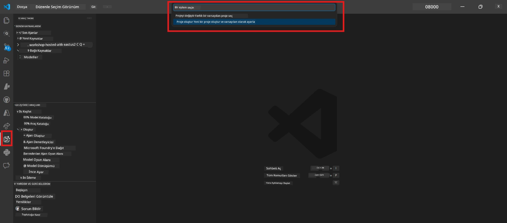
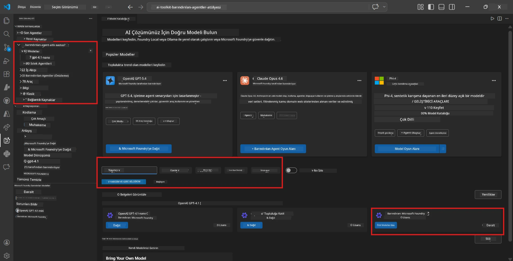
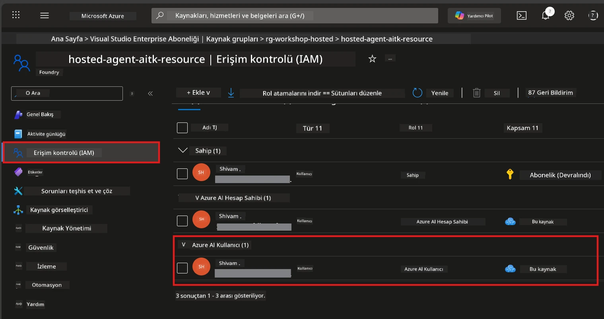

# Modül 2 - Bir Foundry Projesi Oluşturun ve Bir Model Dağıtın

Bu modülde, bir Microsoft Foundry projesi oluşturur (veya seçer) ve temsilcinizin kullanacağı bir modeli dağıtırsınız. Her adım açıkça yazılmıştır - onları sırayla takip edin.

> Zaten dağıtılmış bir model içeren bir Foundry projeniz varsa, [Modül 3](03-create-hosted-agent.md)'e geçebilirsiniz.

---

## Adım 1: VS Code'dan bir Foundry projesi oluşturun

Microsoft Foundry uzantısını kullanarak VS Code'dan çıkmadan bir proje oluşturacaksınız.

1. **Komut Paletini** açmak için `Ctrl+Shift+P` tuşlarına basın.
2. Yazın: **Microsoft Foundry: Create Project** ve seçin.
3. Bir açılır menü görünür - listeden **Azure aboneliğinizi** seçin.
4. Sizden bir **kaynak grubu** seçmeniz veya oluşturmanız istenir:
   - Yeni bir tane oluşturmak için: bir isim yazın (örn. `rg-hosted-agents-workshop`) ve Enter'a basın.
   - Var olan birini kullanmak için: açılır menüden seçin.
5. Bir **bölge** seçin. **Önemli:** Hosted agents destekleyen bir bölge seçin. [bölge uygunluğunu](https://learn.microsoft.com/azure/foundry/agents/concepts/hosted-agents#region-availability) kontrol edin - yaygın seçimler `East US`, `West US 2` veya `Sweden Central`'dır.
6. Foundry projesi için bir **isim** girin (örn. `workshop-agents`).
7. Enter'a basın ve oluşturma işleminin tamamlanmasını bekleyin.

> **Oluşturma 2-5 dakika sürer.** VS Code'un sağ alt köşesinde ilerleme bildirimi göreceksiniz. Oluşturma sırasında VS Code'u kapatmayın.

8. Tamamlandığında, **Microsoft Foundry** yan panelinde yeni projeniz **Resources** altında gösterilir.
9. Proje adına tıklayarak genişletin ve **Models + endpoints** ve **Agents** gibi bölümlerin göründüğünden emin olun.



### Alternatif: Foundry Portal üzerinden oluşturma

Tarayıcıyı kullanmayı tercih ediyorsanız:

1. [https://ai.azure.com](https://ai.azure.com) sitesini açın ve oturum açın.
2. Ana sayfada **Create project** butonuna tıklayın.
3. Proje adı girin, aboneliğinizi, kaynak grubunuzu ve bölgeyi seçin.
4. **Create** butonuna tıklayın ve oluşturmanın tamamlanmasını bekleyin.
5. Oluşturulduktan sonra VS Code'a dönün - proje yenilemeden sonra Foundry yan panelinde görünmelidir (yenileme ikonu tıklayın).

---

## Adım 2: Bir model dağıtın

[hosted agent](https://learn.microsoft.com/azure/foundry/agents/concepts/hosted-agents)'inizin yanıt üretmesi için Azure OpenAI modeline ihtiyacı vardır. Şimdi birini [dağıtacaksınız](https://learn.microsoft.com/azure/ai-foundry/openai/how-to/create-resource#deploy-a-model).

1. **Komut Paletini** açmak için `Ctrl+Shift+P` tuşlarına basın.
2. Yazın: **Microsoft Foundry: Open [Model Catalog](https://learn.microsoft.com/azure/ai-foundry/openai/concepts/models)** ve seçin.
3. Model Kataloğu görünümü VS Code'da açılır. Arama çubuğunu kullanarak veya gezerek **gpt-4.1** modelini bulun.
4. **gpt-4.1** model kartına (veya daha az maliyet tercih ederseniz `gpt-4.1-mini`) tıklayın.
5. **Deploy** butonuna tıklayın.


6. Dağıtım yapılandırmasında:
   - **Deployment name**: Varsayılanı bırakın (örn. `gpt-4.1`) veya özel bir isim girin. **Bu ismi unutmayın** - Modül 4'te ihtiyacınız olacak.
   - **Target**: **Deploy to Microsoft Foundry** seçin ve az önce oluşturduğunuz projeyi seçin.
7. **Deploy** butonuna tıklayın ve dağıtımın tamamlanmasını bekleyin (1-3 dakika).

### Model seçimi

| Model | En iyi kullanım | Maliyet | Notlar |
|-------|-----------------|---------|--------|
| `gpt-4.1` | Yüksek kaliteli, ayrıntılı yanıtlar | Yüksek | En iyi sonuçlar, son testler için önerilir |
| `gpt-4.1-mini` | Hızlı iterasyon, düşük maliyet | Düşük | Atölye geliştirme ve hızlı test için uygun |
| `gpt-4.1-nano` | Hafif görevler | En düşük | En ekonomik, ancak basit yanıtlar üretir |

> **Bu atölye için öneri:** Geliştirme ve test için `gpt-4.1-mini` kullanın. Hızlı, ucuz ve egzersizler için iyi sonuçlar verir.

### Model dağıtımını doğrulama

1. **Microsoft Foundry** yan panelinde projenizi genişletin.
2. **Models + endpoints** (veya benzeri bölüm) altında bakın.
3. Dağıttığınız modeli (örn. `gpt-4.1-mini`) **Succeeded** veya **Active** durumu ile görmelisiniz.
4. Model dağıtımına tıklayarak detaylarını görüntüleyin.
5. Bu iki değeri **not edin** - Modül 4'te ihtiyacınız olacak:

   | Ayar | Nereden bulunur | Örnek değer |
   |-------|-----------------|--------------|
   | **Project endpoint** | Foundry yan panelinde proje adına tıklayın. Detay görünümünde endpoint URL'si gösterilir. | `https://<account>.services.ai.azure.com/api/projects/<project>` |
   | **Model deployment name** | Dağıtılan modelin yanında gösterilen isim. | `gpt-4.1-mini` |

---

## Adım 3: Gerekli RBAC rollerini atayın

Bu, **en sık atlanan adımdır**. Doğru roller olmadan, Modül 6'daki dağıtım izin hatasıyla başarısız olur.

### 3.1 Kendi hesabınıza Azure AI User rolünü atayın

1. Bir tarayıcı açın ve [https://portal.azure.com](https://portal.azure.com) adresine gidin.
2. Üst arama çubuğuna **Foundry projenizin** adını yazın ve sonuçlardan seçin.
   - **Önemli:** Anne hesap/hub değil, **proje** kaynağına gidin (tür: "Microsoft Foundry project").
3. Proje sol menüsünde **Access control (IAM)** seçeneğine tıklayın.
4. Üstteki **+ Add** butonuna tıklayın → **Add role assignment** seçin.
5. **Role** sekmesinde [**Azure AI User**](https://learn.microsoft.com/azure/foundry/concepts/rbac-foundry#built-in-roles) aratın ve seçin. **Next** butonuna tıklayın.
6. **Members** sekmesinde:
   - **User, group, or service principal** seçin.
   - **+ Select members**e tıklayın.
   - İsminizi veya e-postanızı aratın, kendinizi seçin ve **Select**e basın.
7. **Review + assign** → Sonra tekrar **Review + assign**e tıklayarak onaylayın.



### 3.2 (İsteğe bağlı) Azure AI Developer rolünü atayın

Projede ek kaynaklar oluşturmanız veya dağıtımları programatik yönetmeniz gerekiyorsa:

1. Yukarıdaki adımları tekrarlayın, ancak 5. adımda **Azure AI Developer** rolünü seçin.
2. Buna **sadece proje** değil, **Foundry kaynağı (hesap)** seviyesinde atama yapabilirsiniz.

### 3.3 Rol atamalarınızı doğrulayın

1. Projenin **Access control (IAM)** sayfasında **Role assignments** sekmesine gidin.
2. İsminizi arayın.
3. Proje kapsamı için en az **Azure AI User** rolünün listelendiğini görmelisiniz.

> **Neden önemli:** [`Azure AI User`](https://learn.microsoft.com/azure/foundry/concepts/rbac-foundry#built-in-roles) rolü, `Microsoft.CognitiveServices/accounts/AIServices/agents/write` veri eylemini verir. Bunu almadan dağıtımda şöyle bir hata görürsünüz:
>
> ```
> Error: lacks the required data action 
> Microsoft.CognitiveServices/accounts/AIServices/agents/write 
> to perform POST /api/projects/{projectName}/assistants operation.
> ```
>
> Daha fazla detay için [Modül 8 - Sorun Giderme](08-troubleshooting.md)'ye bakın.

---

### Kontrol Listesi

- [ ] Foundry projesi mevcut ve VS Code'daki Microsoft Foundry yan panelinde görünür
- [ ] En az bir model dağıtılmış (örn. `gpt-4.1-mini`) ve durumu **Succeeded**
- [ ] **Proje endpoint** URL'si ve **model dağıtım adı** not edildi
- [ ] **Azure AI User** rolü **proje** seviyesinde atanmış (Azure Portal → IAM → Rollerde doğrulayın)
- [ ] Proje, [hosted agents için desteklenen bölge](https://learn.microsoft.com/azure/foundry/agents/concepts/hosted-agents#region-availability) içinde

---

**Önceki:** [01 - Foundry Araç Seti Kurulumu](01-install-foundry-toolkit.md) · **Sonraki:** [03 - Barındırılan Bir Ajan Oluşturun →](03-create-hosted-agent.md)

---

<!-- CO-OP TRANSLATOR DISCLAIMER START -->
**Feragatname**:  
Bu belge, AI çeviri servisi [Co-op Translator](https://github.com/Azure/co-op-translator) kullanılarak çevrilmiştir. Doğruluk için çaba göstersek de, otomatik çevirilerin hata veya yanlışlıklar içerebileceğini lütfen dikkate alınız. Orijinal belge, ana dilinde otoritatif kaynak olarak kabul edilmelidir. Kritik bilgiler için profesyonel insan çevirisi önerilir. Bu çevirinin kullanımı sonucu oluşabilecek yanlış anlamalar veya yorum hatalarından sorumlu değiliz.
<!-- CO-OP TRANSLATOR DISCLAIMER END -->