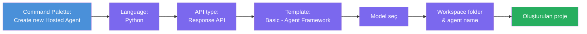
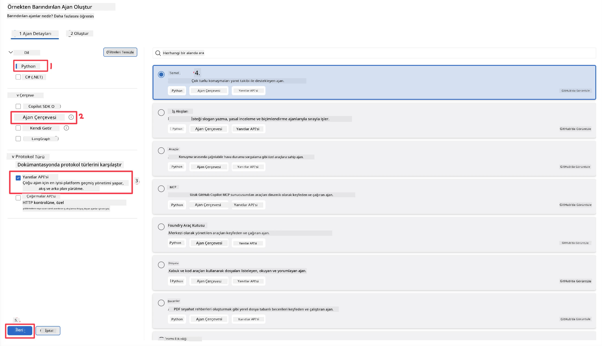
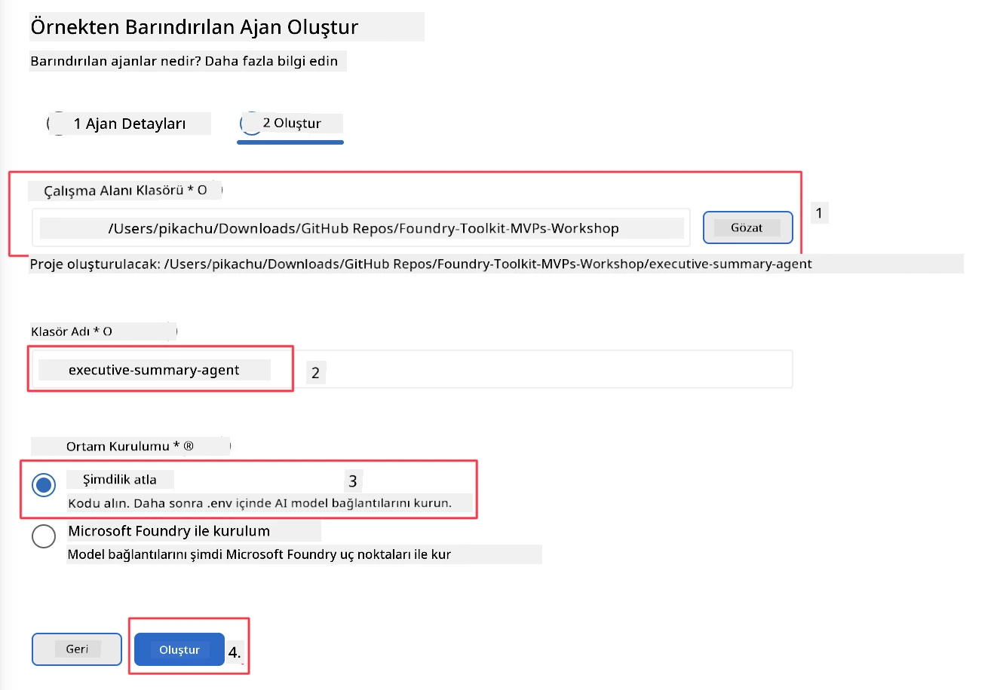

# Modül 2 - Yeni Bir Hosted Agent Oluşturun

⏱️ ~5 dakika

Bu modülde, Foundry Toolkit'i kullanarak **barındırılan bir agent projesi iskeleti oluşturuyorsunuz**. İskelet, tam proje yapısını — `agent.yaml`, `main.py`, `Dockerfile`, `requirements.txt` ve VS Code hata ayıklama yapılandırması — oluşturur, böylece agent’ın davranışını özelleştirmeye odaklanabilirsiniz.

> **Ana kavram:** Bu laboratuvardaki `agent/` klasörü, Foundry Toolkit'in ürettiği şeyin bir örneğidir. Bu dosyaları sıfırdan yazmazsınız.

### İskelet sihirbazı akışı



---

## Adım 1: Hosted Agent oluşturma sihirbazını açın

1. **Komut Paletini** açmak için `Ctrl+Shift+P` tuşlarına basın.
2. Yazın: **Foundry Toolkit: Create new Hosted Agent** ve seçin.

> **Alternatif: Foundry Portal üzerinden oluşturma**
> Tarayıcıyı tercih ediyorsanız, projenizi [https://ai.azure.com](https://ai.azure.com) üzerinden oluşturabilirsiniz. Proje hazırlandıktan sonra VS Code’a dönüp **Foundry Toolkit** yan panelini kullanarak ona bağlanın.

> **Alternatif:** Foundry Toolkit yan panelinde **Hosted Agents (Preview)** yanındaki **+** simgesine tıklayın.

## Adım 2: Ayarları seçin



1. Soldaki gezinme/seçenek bölümünde şunları seçin:

| Menü | Seçim | Notlar |
|--------|-----------|-------|
| **Dil** | Python | C# da destekleniyor |
| **Çerçeve** | Agent Framework | Agent Framework SDK kullanılarak basit başlangıç noktası |
| **API tipi** | Response API | `POST /responses` - platform tarafından yönetilen geçmişle sohbet tarzı |
| **Şablon** | Basic | Agent Framework SDK ile basit başlangıç noktası |

2. Seçimi yaptıktan sonra **Next** butonuna tıklayın



3. Sonraki pencerede şu seçenekleri seçin:

| Menü | Seçim | Notlar |
|--------|-----------|-------|
| **Workspace klasörü** | Hedef klasör seçin | örn., `/workspace/Foundry_Toolkit_for_VSCode_Lab/` veya bu reposyodaki bir alt klasör |
| **Agent adı** | Bir isim girin | örn., `executive-summary-agent` |
| **Ortam Kurulumu** | şimdilik kurulumu atla |  |

Agent’ımızı oluşturmak için **create** butonuna tıklayın. Barındırılan agent adıyla yeni bir klasör oluşturulacak.

## Adım 3: Oluşturulan projeyi inceleyin

İskelet oluşturma tamamlandıktan sonra, Explorer’da (`Ctrl+Shift+E`) şu dosyaları gördüğünüzden emin olun:

```
📂 my-agent/
├── .env                ← Environment variables (placeholders)
├── .vscode/
│   ├── launch.json     ← Debug config (F5 → run + Agent Inspector)
│   └── tasks.json      ← VS Code task definitions
├── agent.yaml          ← Agent definition (kind: hosted)
├── Dockerfile          ← Container config for deployment
├── main.py             ← Agent entry point (your main code)
└── requirements.txt    ← Python dependencies
```

### Önemli dosyalar açıklandı

| Dosya | Amacı |
|------|---------|
| `agent.yaml` | Agent’ı `kind: hosted` olarak bildirir, ortam değişkenlerini eşler, `/responses` protokolünü tanımlar |
| `main.py` | `FoundryChatClient` oluşturur → talimatlarla birlikte bir `Agent` içine sarar → `ResponsesHostServer` ile 8088 portunda servis sağlar |
| `Dockerfile` | `python:3.12-slim` kullanır, bağımlılıkları kurar, 8088 portunu açar, `main.py` çalıştırır |
| `requirements.txt` | `agent-framework-foundry`, `agent-framework-foundry-hosting`, `mcp`, `debugpy` |

> **Önemli:** İskelet agent klasörünü doğrudan VS Code’da açın (yani `agent/` klasörünü) ki `.vscode/launch.json` ve `tasks.json` F5 hata ayıklaması için doğru çalışsın.

---

### ✅ Kontrol noktası

- [ ] İskelet proje tüm beklenen dosyalarla oluşturuldu
- [ ] `agent.yaml` içinde `kind: hosted` ve `protocol: responses` görünüyor
- [ ] `main.py` içinde `Agent`, `FoundryChatClient`, `ResponsesHostServer` içe aktarılmış
- [ ] Agent klasörü VS Code’da çalışma alanı kökü olarak açık

---

**Önceki:** [01 - Kurulum](01-setup.md) · **Sonraki:** [03 - Yapılandır & Kod →](03-configure-and-code.md)

---

<!-- CO-OP TRANSLATOR DISCLAIMER START -->
**Feragatname**:
Bu belge, AI çeviri hizmeti [Co-op Translator](https://github.com/Azure/co-op-translator) kullanılarak çevrilmiştir. Doğruluk için çaba sarf etsek de, otomatik çevirilerin hata veya yanlışlık içerebileceğini lütfen unutmayınız. Orijinal belge, kendi dilinde yetkili kaynak olarak kabul edilmelidir. Kritik bilgiler için profesyonel insan çevirisi önerilir. Bu çevirinin kullanımı sonucu ortaya çıkabilecek yanlış anlamalardan veya yanlış yorumlamalardan sorumlu değiliz.
<!-- CO-OP TRANSLATOR DISCLAIMER END -->