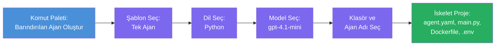

# Modül 3 - Yeni Bir Barındırılan Temsilci Oluşturma (Foundry Eklentisi Tarafından Otomatik Oluşturuldu)

Bu modülde, Microsoft Foundry eklentisini kullanarak **yeni bir [barındırılan temsilci](https://learn.microsoft.com/azure/foundry/agents/concepts/hosted-agents) projesi oluşturursunuz**. Eklenti, `agent.yaml`, `main.py`, `Dockerfile`, `requirements.txt`, bir `.env` dosyası ve VS Code hata ayıklama yapılandırması dahil olmak üzere tüm proje yapısını sizin için oluşturur. Oluşturma işleminden sonra, bu dosyaları temsilcinize ait talimatlar, araçlar ve yapılandırma ile özelleştirirsiniz.

> **Ana kavram:** Bu laboratuvarda `agent/` klasörü, Foundry eklentisinin bu oluşturma komutu çalıştırıldığında oluşturduğu dosyalara bir örnektir. Bu dosyaları sıfırdan yazmazsınız - eklenti oluşturur, siz de üzerinde değişiklik yaparsınız.

### Oluşturma sihirbazı akışı


---

## Adım 1: Barındırılan Temsilci Oluştur sihirbazını açın

1. `Ctrl+Shift+P` tuşlarına basarak **Komut Paleti**ni açın.
2. Şunu yazın: **Microsoft Foundry: Create a New Hosted Agent** ve seçin.
3. Barındırılan temsilci oluşturma sihirbazı açılır.

> **Alternatif yol:** Bu sihirbazı Microsoft Foundry yan panelinden → **Agents** yanındaki **+** simgesine tıklayarak veya sağ tıklayıp **Create New Hosted Agent** seçeneğini seçerek de açabilirsiniz.

---

## Adım 2: Şablonunuzu seçin

Sihirbaz size bir şablon seçmenizi ister. Şu seçenekleri göreceksiniz:

| Şablon | Açıklama | Ne zaman kullanılır |
|--------|----------|---------------------|
| **Single Agent** | Kendi modeli, talimatları ve isteğe bağlı araçları olan tek bir temsilci | Bu atölye çalışması (Lab 01) |
| **Multi-Agent Workflow** | Ardışık olarak işbirliği yapan birden fazla temsilci | Lab 02 |

1. **Single Agent** seçin.
2. **Next**e tıklayın (veya seçim otomatik devam eder).

---

## Adım 3: Programlama dilini seçin

1. **Python** (bu atölye çalışması için önerilir) seçin.
2. **Next**e tıklayın.

> **C# da desteklenir** eğer .NET tercih ederseniz. Oluşturma yapısı benzerdir (`main.py` yerine `Program.cs` kullanılır).

---

## Adım 4: Modelinizi seçin

1. Sihirbaz Foundry projenizde dağıtılan modelleri gösterir (Modül 2’den).
2. Dağıttığınız modeli seçin - örneğin **gpt-4.1-mini**.
3. **Next**e tıklayın.

> Model görmüyorsanız, önce [Modül 2](02-create-foundry-project.md) bölümüne gidip bir model dağıtın.

---

## Adım 5: Klasör konumu ve temsilci adı seçin

1. Bir dosya penceresi açılır - projenin oluşturulacağı **hedef klasörü** seçin. Bu atölye için:
   - Yeni başlıyorsanız: herhangi bir klasör seçin (örneğin `C:\Projects\my-agent`)
   - Atölye deposunda çalışıyorsanız: `workshop/lab01-single-agent/agent/` klasörü altında yeni bir alt klasör oluşturun
2. Barındırılan temsilci için bir **isim** girin (örneğin `executive-summary-agent` veya `my-first-agent`).
3. **Create**e tıklayın (veya Enter’a basın).

---

## Adım 6: Oluşturma tamamlanana kadar bekleyin

1. VS Code, oluşturulan proje ile **yeni bir pencere** açar.
2. Projenin tam olarak yüklenmesi için birkaç saniye bekleyin.
3. Explorer panelinde (`Ctrl+Shift+E`) şu dosyaları görmelisiniz:

```
📂 my-first-agent/
├── .env                ← Environment variables (auto-generated with placeholders)
├── .vscode/
│   └── launch.json     ← Debug configuration (F5 to run + Agent Inspector)
├── agent.yaml          ← Agent definition (kind: hosted)
├── Dockerfile          ← Container configuration for deployment
├── main.py             ← Agent entry point (your main code file)
└── requirements.txt    ← Python dependencies
```

> **Bu laboratuvardaki `agent/` klasörüyle aynı yapıdır**. Foundry eklentisi bu dosyaları otomatik oluşturur - elle oluşturmanız gerekmez.

> **Atölye notu:** Bu atölye deposunda `.vscode/` klasörü **çalışma alanı kökünde** (her proje içinde değil) yer almaktadır. İçinde ortak bir `launch.json` ve `tasks.json` vardır ve iki hata ayıklama yapılandırması içerir - **"Lab01 - Single Agent"** ve **"Lab02 - Multi-Agent"** - her biri doğru labın `cwd` dizinine yönlendirir. F5’e bastığınızda, üst açılır menüden üzerinde çalıştığınız lab ile eşleşen yapılandırmayı seçin.

---

## Adım 7: Oluşturulan dosyaları anlayın

Sihirbazın oluşturduğu her dosyayı incelemek için biraz zaman ayırın. Bunları anlamak Modül 4 (özelleştirme) için önemlidir.

### 7.1 `agent.yaml` - Temsilci tanımı

`agent.yaml` dosyasını açın. Bu dosya şöyle görünür:

```yaml
# yaml-language-server: $schema=https://raw.githubusercontent.com/microsoft/AgentSchema/refs/heads/main/schemas/v1.0/ContainerAgent.yaml

kind: hosted
name: my-first-agent
description: >
  A hosted agent deployed to Microsoft Foundry Agent Service.
metadata:
  authors:
    - Microsoft
  tags:
    - Azure AI AgentServer
    - Microsoft Agent Framework
    - Hosted Agent
protocols:
  - protocol: responses
    version: v1
environment_variables:
  - name: AZURE_AI_PROJECT_ENDPOINT
    value: ${PROJECT_ENDPOINT}
  - name: AZURE_AI_MODEL_DEPLOYMENT_NAME
    value: ${MODEL_DEPLOYMENT_NAME}
dockerfile_path: Dockerfile
resources:
  cpu: '0.25'
  memory: 0.5Gi
```

**Ana alanlar:**

| Alan | Amaç |
|-------|---------|
| `kind: hosted` | Bu barındırılan bir temsilci olduğunu belirtir (konteyner tabanlı, [Foundry Agent Service](https://learn.microsoft.com/azure/foundry/agents/overview) üzerine dağıtılır) |
| `protocols: responses v1` | Temsilci OpenAI uyumlu `/responses` HTTP uç noktasını sunar |
| `environment_variables` | `.env` değerlerini dağıtım zamanında konteyner ortam değişkenlerine eşler |
| `dockerfile_path` | Konteyner imajını oluşturmak için kullanılan Dockerfile yolunu gösterir |
| `resources` | Konteyner için CPU ve bellek tahsisi (0.25 CPU, 0.5Gi bellek) |

### 7.2 `main.py` - Temsilci giriş noktası

`main.py` dosyasını açın. Bu, temsilci mantığınızın bulunduğu ana Python dosyasıdır. İskelet şöyle:

```python
from agent_framework.azure import AzureAIAgentClient
from azure.ai.agentserver.agentframework import from_agent_framework
from azure.identity.aio import DefaultAzureCredential
```

**Ana importlar:**

| Import | Amaç |
|--------|--------|
| `AzureAIAgentClient` | Foundry projenize bağlanır ve `.as_agent()` aracılığıyla temsilciler oluşturur |
| [`DefaultAzureCredential`](https://learn.microsoft.com/azure/developer/python/sdk/authentication/credential-chains#defaultazurecredential-overview) | Yetkilendirme işlemlerini yönetir (Azure CLI, VS Code oturum açma, yönetilen kimlik veya servis tanımlı kimlik) |
| `from_agent_framework` | Temsilciyi `/responses` uç noktasını sunan bir HTTP sunucusu olarak sarar |

Ana akış şöyle:
1. Bir credential oluştur → client oluştur → `.as_agent()` çağırarak temsilci elde et (async context manager) → sunucu olarak sar → çalıştır

### 7.3 `Dockerfile` - Konteyner imajı

```dockerfile
FROM python:3.14-slim

WORKDIR /app

COPY ./ .

RUN pip install --upgrade pip && \
    if [ -f requirements.txt ]; then \
        pip install -r requirements.txt; \
    else \
        echo "No requirements.txt found" >&2; exit 1; \
    fi

EXPOSE 8088

CMD ["python", "main.py"]
```

**Ana detaylar:**
- `python:3.14-slim` temel imaj olarak kullanılır.
- Tüm proje dosyaları `/app` içine kopyalanır.
- `pip` yükseltilir, `requirements.txt` içindekiler yüklenir ve dosya eksikse derhal hata verir.
- **8088 portu açılır** - barındırılan temsilciler için gereken port budur. Değiştirmeyin.
- Temsilci `python main.py` komutuyla başlatılır.

### 7.4 `requirements.txt` - Bağımlılıklar

```
agent-framework-azure-ai==1.0.0rc3
agent-framework-core==1.0.0rc3
azure-ai-agentserver-agentframework==1.0.0b16
azure-ai-agentserver-core==1.0.0b16
debugpy
agent-dev-cli
```

| Paket | Amaç |
|---------|---------|
| `agent-framework-azure-ai` | Microsoft Agent Framework için Azure AI entegrasyonu |
| `agent-framework-core` | Temsilciler için temel çalışma zamanı (içinde `python-dotenv` var) |
| `azure-ai-agentserver-agentframework` | Foundry Agent Service için barındırılan temsilci sunucu çalışma zamanı |
| `azure-ai-agentserver-core` | Temsilciler için sunucu soyutlamaları |
| `debugpy` | Python hata ayıklama desteği (VS Code’da F5 hata ayıklama imkanı sağlar) |
| `agent-dev-cli` | Temsilcileri test etmek için yerel geliştirme CLI’si (hata ayıklama/çalıştırma yapılandırması tarafından kullanılır) |

---

## Temsilci protokolünü anlama

Barındırılan temsilciler, **OpenAI Responses API** protokolü ile iletişim kurar. Çalışırken (yerel veya bulutta), temsilci tek bir HTTP uç noktası açar:

```
POST http://localhost:8088/responses
Content-Type: application/json

{
  "input": "Your prompt here",
  "stream": false
}
```

Foundry Agent Service bu uç noktayı, kullanıcı istemlerini göndermek ve temsilciden yanıt almak için kullanır. Bu protokol OpenAI API tarafından da kullanılır, bu yüzden temsilciniz OpenAI Responses formatını kullanan herhangi bir istemciyle uyumludur.

---

### Kontrol listesi

- [ ] Oluşturma sihirbazı başarıyla tamamlandı ve **yeni bir VS Code penceresi** açıldı
- [ ] `agent.yaml`, `main.py`, `Dockerfile`, `requirements.txt`, `.env` olmak üzere tüm 5 dosyayı görebiliyorsunuz
- [ ] `.vscode/launch.json` dosyası mevcut (F5 hata ayıklamasını etkinleştirir - bu atölyede çalışma alanı kökünde ve lab bazlı yapılandırmalar içerir)
- [ ] Her dosyayı okudunuz ve ne amaçla kullanıldığını anladınız
- [ ] `8088` portunun zorunlu olduğunu ve `/responses` uç noktasının protokol olduğunu anladınız

---

**Önceki:** [02 - Foundry Projesi Oluştur](02-create-foundry-project.md) · **Sonraki:** [04 - Yapılandır & Kod →](04-configure-and-code.md)

---

<!-- CO-OP TRANSLATOR DISCLAIMER START -->
**Feragatname**:  
Bu belge, AI çeviri servisi [Co-op Translator](https://github.com/Azure/co-op-translator) kullanılarak çevrilmiştir. Doğruluk için çaba göstersek de, otomatik çevirilerin hatalar veya yanlışlıklar içerebileceğini lütfen unutmayın. Orijinal belge, kendi dilinde yetkili kaynak olarak kabul edilmelidir. Kritik bilgiler için profesyonel insan çevirisi önerilir. Bu çevirinin kullanımından kaynaklanan herhangi bir yanlış anlama veya yanlış yorumdan sorumlu değiliz.
<!-- CO-OP TRANSLATOR DISCLAIMER END -->