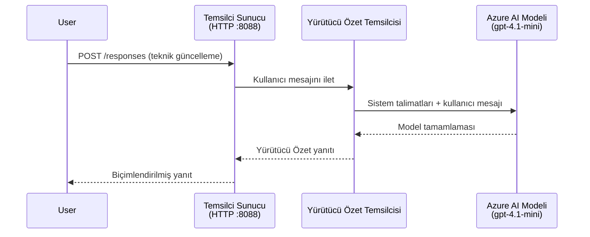
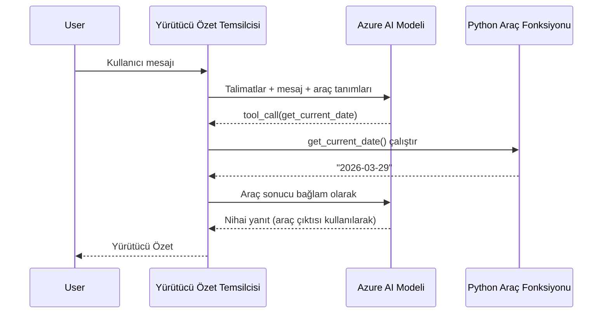

# Module 4 - Talimatları, Ortamı Yapılandırma ve Bağımlılıkları Yükleme

Bu modülde, Modül 3'ten otomatik olarak oluşturulan ajan dosyalarını özelleştirirsiniz. Burada, genel iskeleti **sizin** ajanınıza dönüştürürsünüz - talimatları yazarak, ortam değişkenlerini ayarlayarak, isteğe bağlı olarak araçlar ekleyerek ve bağımlılıkları yükleyerek.

> **Hatırlatma:** Foundry eklentisi proje dosyalarınızı otomatik olarak oluşturdu. Şimdi bunları değiştireceksiniz. Özelleştirilmiş tam bir çalışan ajan örneği için [`agent/`](../../../../../workshop/lab01-single-agent/agent) klasörüne bakın.

---

## Bileşenler nasıl bir araya gelir

### İstek yaşam döngüsü (tek ajan)


> **Araçlarla:** Ajanın kayıtlı araçları varsa, model doğrudan tamamlama yerine bir araç çağrısı döndürebilir. Çerçeve aracı yerel olarak çalıştırır, sonucu modele geri besler ve model ardından nihai yanıtı oluşturur.


---

## Adım 1: Ortam değişkenlerini yapılandırma

İskelet, yer tutucu değerlerle bir `.env` dosyası oluşturdu. Bu değerleri Modül 2'den gerçek değerlerle doldurmanız gerekiyor.

1. İskeletle oluşturulmuş projenizde, **`.env`** dosyasını açın (proje kökünde bulunur).
2. Yer tutucu değerleri gerçek Foundry proje bilgilerinizle değiştirin:

   ```env
   PROJECT_ENDPOINT=https://<your-account>.services.ai.azure.com/api/projects/<your-project>
   MODEL_DEPLOYMENT_NAME=gpt-4.1-mini
   ```

3. Dosyayı kaydedin.

### Bu değerler nereden bulunur

| Değer | Nasıl bulunur |
|-------|---------------|
| **Proje uç noktası** | VS Code'da **Microsoft Foundry** kenar çubuğunu açın → projenize tıklayın → uç nokta URL'si detay görünümünde gösterilir. `https://<account-name>.services.ai.azure.com/api/projects/<project-name>` şeklindedir. |
| **Model dağıtım adı** | Foundry kenar çubuğunda projenizi genişletin → **Models + endpoints** altında bakın → dağıtılmış modelin yanında adı (örneğin, `gpt-4.1-mini`) listelenmiştir. |

> **Güvenlik:** `.env` dosyasını sürüm kontrolüne asla eklemeyin. Varsayılan olarak `.gitignore` dosyasına zaten eklenmiştir. Eğer eklenmemişse, şunu ekleyin:
> ```
> .env
> ```

### Ortam değişkenleri nasıl akar

Eşleme zinciri: `.env` → `main.py` ( `os.getenv` ile okur) → `agent.yaml` (dağıtım zamanında konteyner ortam değişkenlerine eşler).

`main.py` içinde, iskelet bu değerleri şöyle okur:

```python
PROJECT_ENDPOINT = os.getenv("AZURE_AI_PROJECT_ENDPOINT") or os.getenv("PROJECT_ENDPOINT")
MODEL_DEPLOYMENT_NAME = os.getenv("AZURE_AI_MODEL_DEPLOYMENT_NAME", os.getenv("MODEL_DEPLOYMENT_NAME", "gpt-4.1-mini"))
```

Hem `AZURE_AI_PROJECT_ENDPOINT` hem de `PROJECT_ENDPOINT` kabul edilir (`agent.yaml`, `AZURE_AI_*` ön ekini kullanır).

---

## Adım 2: Ajan talimatlarını yazın

Bu en önemli özelleştirme adımıdır. Talimatlar, ajanınızın kişiliğini, davranışını, çıktı formatını ve güvenlik kısıtlamalarını tanımlar.

1. Projenizde `main.py` dosyasını açın.
2. Talimatlar dizesini bulun (iskelet, varsayılan/genel bir tane içerir).
3. Bunu detaylı, yapılandırılmış talimatlarla değiştirin.

### İyi talimatlar neleri içerir

| Bileşen | Amaç | Örnek |
|---------|-------|-------|
| **Rol** | Ajanın ne olduğu ve ne yaptığı | "Yönetici özeti ajanısınız" |
| **Hedef kitle** | Yanıtların kimler için olduğu | "Sınırlı teknik bilgisi olan üst düzey yöneticiler" |
| **Girdi tanımı** | Hangi tür istemleri ele aldığı | "Teknik olay raporları, operasyonel güncellemeler" |
| **Çıktı formatı** | Yanıtların tam yapısı | "Yönetici Özeti: - Ne oldu: ... - İş etkisi: ... - Sonraki adım: ..." |
| **Kurallar** | Kısıtlamalar ve reddetme koşulları | "Verilenin dışına bilgi eklemeyin" |
| **Güvenlik** | Kötüye kullanımı ve halüsinasyonu önler | "Girdi belirsizse, açıklama isteyin" |
| **Örnekler** | Davranışı yönlendiren giriş/çıkış çiftleri | 2-3 farklı girdili örnekler ekleyin |

### Örnek: Yönetici Özeti Ajan talimatları

Atölye çalışmasında kullanılan talimatlar [`agent/main.py`](../../../../../workshop/lab01-single-agent/agent/main.py) dosyasında şunlardır:

```python
AGENT_INSTRUCTIONS = """You are an "Explain Like I'm an Executive" agent.

Purpose:
Your job is to translate complex technical or operational information into
clear, concise, and outcome-focused summaries that can be easily understood
by non-technical executives.

Audience:
Senior leaders with limited technical background who care about impact,
risk, and what happens next.

What you must do:
- Rephrase the input so it is understandable to a non-technical audience
- Prioritize clarity, brevity, and outcomes over technical accuracy
- Remove technical jargon, logs, metrics, stack traces, and deep root-cause details
- Translate technical causes into simple cause-and-effect statements
- Explicitly call out business impact
- Always include a clear next step or action
- Maintain a neutral, factual, and calm executive tone
- Do NOT add new facts or speculate beyond the input

Standard Output Structure (always use this wording):

Executive Summary:
- What happened: <plain-language description>
- Business impact: <clear, non-technical impact>
- Next step: <clear action or mitigation>

Rules:
- Keep responses under 100 words
- Do NOT add facts beyond the input
- If input is unclear, ask for clarification
"""
```

4. `main.py` içindeki mevcut talimatlar dizesini özel talimatlarınızla değiştirin.
5. Dosyayı kaydedin.

---

## Adım 3: (İsteğe bağlı) Özel araçlar ekleyin

Barındırılan ajanlar, [tools](https://learn.microsoft.com/azure/foundry/agents/concepts/tool-catalog) olarak **yerel Python fonksiyonlarını** çalıştırabilir. Bu, sadece istem bazlı ajanlara göre kod tabanlı barındırılan ajanların önemli bir avantajıdır - ajanın rastgele sunucu tarafı mantığı çalıştırabilir.

### 3.1 Bir araç fonksiyonu tanımlayın

`main.py` dosyasına bir araç fonksiyonu ekleyin:

```python
from agent_framework import tool

@tool
def get_current_date() -> str:
    """Returns the current date in YYYY-MM-DD format."""
    from datetime import date
    return str(date.today())
```

`@tool` dekoratörü standart Python fonksiyonunu ajan aracı haline getirir. Docstring, modelin gördüğü araç açıklaması olur.

### 3.2 Aracı ajan ile kaydedin

`.as_agent()` bağlam yöneticisini kullanarak ajan oluştururken, aracı `tools` parametresinde iletin:

```python
async with AzureAIAgentClient(
    project_endpoint=PROJECT_ENDPOINT,
    model_deployment_name=MODEL_DEPLOYMENT_NAME,
    credential=credential,
).as_agent(
    name="my-agent",
    instructions=AGENT_INSTRUCTIONS,
    tools=[get_current_date],
) as agent:
    server = from_agent_framework(agent)
    await server.run_async()
```

### 3.3 Araç çağrıları nasıl çalışır

1. Kullanıcı bir istem gönderir.
2. Model, aracın gerekip gerekmediğine karar verir (istem, talimatlar ve araç açıklamalarına göre).
3. Araç gerekli ise, çerçeve Python fonksiyonunuzu yerel olarak (konteyner içinde) çağırır.
4. Aracın dönüş değeri modele bağlam olarak gönderilir.
5. Model nihai yanıtı oluşturur.

> **Araçlar sunucu tarafında çalıştırılır** - konteyner içinde çalışır, kullanıcının tarayıcısında veya modelde değil. Bu, veritabanlarına, API'lere, dosya sistemlerine veya herhangi bir Python kitaplığına erişebileceğiniz anlamına gelir.

---

## Adım 4: Sanal ortam oluşturun ve etkinleştirin

Bağımlılıkları yüklemeden önce izole edilmiş bir Python ortamı oluşturun.

### 4.1 Sanal ortamı oluşturun

VS Code'da terminal açın (`` Ctrl+` ``) ve şunu çalıştırın:

```powershell
python -m venv .venv
```

Bu, proje dizinize `.venv` klasörü oluşturur.

### 4.2 Sanal ortamı etkinleştirin

**PowerShell (Windows):**

```powershell
.\.venv\Scripts\Activate.ps1
```

**Komut İstemi (Windows):**

```cmd
.venv\Scripts\activate.bat
```

**macOS/Linux (Bash):**

```bash
source .venv/bin/activate
```

Terminal isteminin başında `(.venv)` görünmelidir, bu sanal ortamın etkin olduğu anlamına gelir.

### 4.3 Bağımlılıkları yükleyin

Sanal ortam etkinken, gerekli paketleri yükleyin:

```powershell
pip install -r requirements.txt
```

Aşağıdakileri yükler:

| Paket | Amaç |
|-------|-------|
| `agent-framework-azure-ai==1.0.0rc3` | [Microsoft Agent Framework](https://learn.microsoft.com/agent-framework/overview/) için Azure AI entegrasyonu |
| `agent-framework-core==1.0.0rc3` | Ajanlar oluşturmak için çekirdek çalışma zamanı ( `python-dotenv` içerir) |
| `azure-ai-agentserver-agentframework==1.0.0b16` | [Foundry Agent Service](https://learn.microsoft.com/azure/foundry/agents/overview) için barındırılan ajan sunucu çalışma zamanı |
| `azure-ai-agentserver-core==1.0.0b16` | Temel ajan sunucusu soyutlamaları |
| `debugpy` | Python hata ayıklama (VS Code'da F5 hata ayıklama etkinleştirir) |
| `agent-dev-cli` | Ajanlar için yerel geliştirme CLI'sı |

### 4.4 Kurulumu doğrulayın

```powershell
pip list | Select-String "agent-framework|agentserver"
```

Beklenen çıktı:
```
agent-framework-azure-ai   1.0.0rc3
agent-framework-core       1.0.0rc3
azure-ai-agentserver-agentframework 1.0.0b16
azure-ai-agentserver-core  1.0.0b16
```

---

## Adım 5: Kimlik doğrulamayı doğrulayın

Ajan, bu sırayla çeşitli kimlik doğrulama yöntemlerini deneyen [`DefaultAzureCredential`](https://learn.microsoft.com/azure/developer/python/sdk/authentication/credential-chains#defaultazurecredential-overview) kullanır:

1. **Ortam değişkenleri** - `AZURE_CLIENT_ID`, `AZURE_TENANT_ID`, `AZURE_CLIENT_SECRET` (servis principal)
2. **Azure CLI** - `az login` oturumunuzu alır
3. **VS Code** - VS Code'a giriş yaptığınız hesapla kullanır
4. **Yönetilen Kimlik** - Azure'da (dağıtım zamanında) çalışırken kullanılır

### 5.1 Yerel geliştirme için doğrulama

Bunlardan en az biri çalışmalıdır:

**Seçenek A: Azure CLI (önerilir)**

```powershell
az account show --query "{name:name, id:id}" --output table
```

Beklenen: Abonelik adınız ve kimliğiniz gösterilir.

**Seçenek B: VS Code ile giriş**

1. VS Code'da sol altta **Hesaplar** simgesine bakın.
2. Hesap adınızı görüyorsanız, kimlik doğrulama yapılmıştır.
3. Görmüyorsanız, simgeye tıklayın → **Microsoft Foundry kullanmak için giriş yapın**.

**Seçenek C: Servis principal (CI/CD için)**

```powershell
$env:AZURE_TENANT_ID = "<your-tenant-id>"
$env:AZURE_CLIENT_ID = "<your-client-id>"
$env:AZURE_CLIENT_SECRET = "<your-client-secret>"
```

### 5.2 Yaygın kimlik doğrulama sorunu

Birden fazla Azure hesabıyla giriş yaptıysanız, doğru aboneliğin seçili olduğundan emin olun:

```powershell
az account set --subscription "<your-subscription-id>"
```

---

### Kontrol Listesi

- [ ] `.env` dosyasında geçerli `PROJECT_ENDPOINT` ve `MODEL_DEPLOYMENT_NAME` var (yer tutucu değil)
- [ ] Ajan talimatları `main.py` içinde özelleştirildi - rol, hedef kitle, çıktı formatı, kurallar ve güvenlik kısıtlamalarını tanımlar
- [ ] (İsteğe bağlı) Özel araçlar tanımlandı ve kaydedildi
- [ ] Sanal ortam oluşturuldu ve etkinleştirildi (terminal isteminde `(.venv)` görünüyor)
- [ ] `pip install -r requirements.txt` hatasız tamamlandı
- [ ] `pip list | Select-String "azure-ai-agentserver"` paketin yüklendiğini gösteriyor
- [ ] Kimlik doğrulama geçerli - `az account show` aboneliğinizi döndürür YA DA VS Code ile giriş yapılmıştır

---

**Önceki:** [03 - Barındırılan Ajan Oluştur](03-create-hosted-agent.md) · **Sonraki:** [05 - Yerel Test →](05-test-locally.md)

---

<!-- CO-OP TRANSLATOR DISCLAIMER START -->
**Feragatname**:  
Bu belge, AI çeviri servisi [Co-op Translator](https://github.com/Azure/co-op-translator) kullanılarak çevrilmiştir. Doğruluk için çaba sarf etsek de, otomatik çevirilerin hata veya yanlışlık içerebileceğini lütfen unutmayın. Orijinal belge, kendi dilinde yetkili kaynak olarak kabul edilmelidir. Kritik bilgiler için profesyonel insan çevirisi önerilir. Bu çevirinin kullanımı sonucunda ortaya çıkabilecek yanlış anlamalar veya yanlış yorumlamalardan sorumlu değiliz.
<!-- CO-OP TRANSLATOR DISCLAIMER END -->