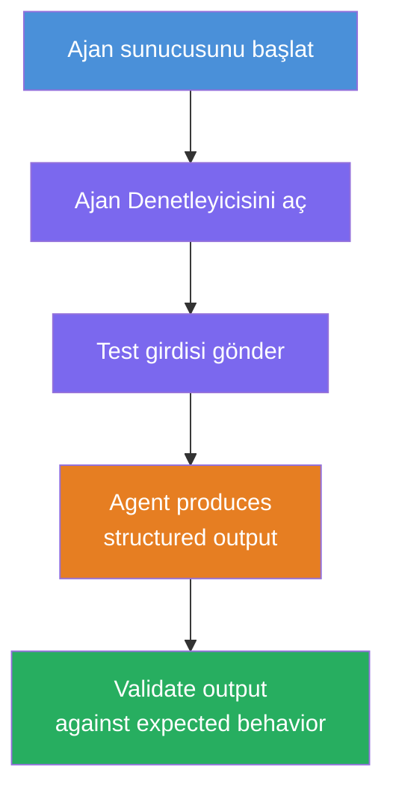
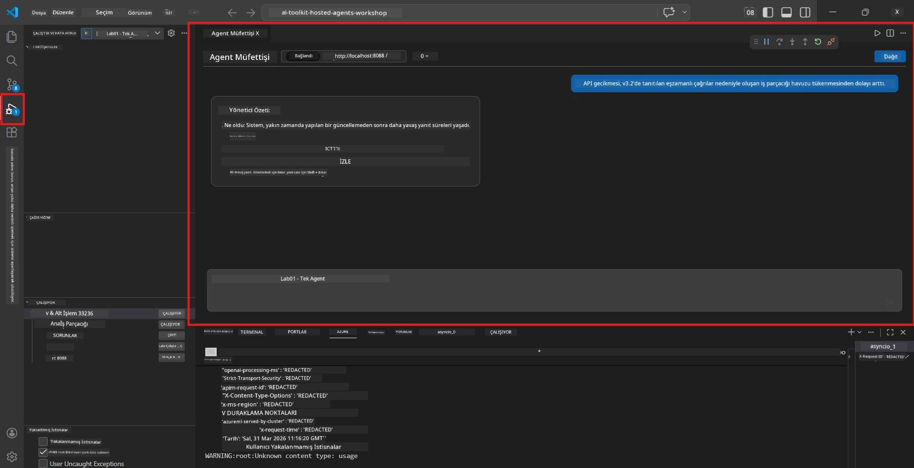
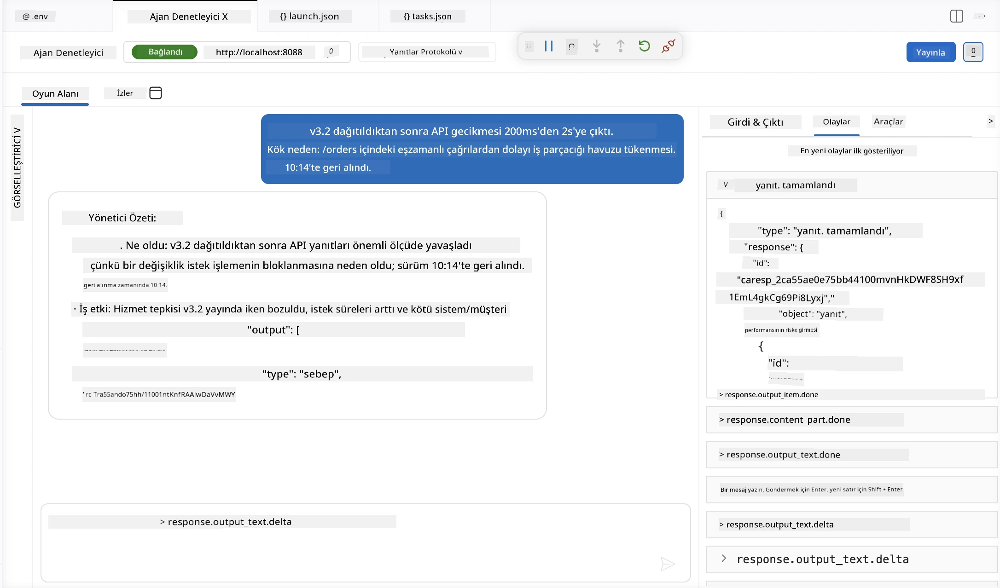

# Modül 4 - Yerel Test

⏱️ ~10 dk

Bu modülde, ajanınızı yerel olarak çalıştırır ve **mutlu yol fonksiyonel testleriyle** doğru çalıştığını doğrularsınız. Ajanın yapılandırılmış ve doğru yanıtlar ürettiğini onaylamak için Agent Inspector (görsel UI) veya doğrudan HTTP çağrıları kullanacaksınız.

### Yerel test akışı



---

## Seçenek 1: F5'e basın - Agent Inspector ile Hata Ayıklama (önerilen)

### Hata ayıklamayı başlatın

1. **executive-summary-agent/** klasörünü doğrudan VS Code'da açın (`Dosya → Klasör Aç`).
2. **Çalıştır ve Hata Ayıkla** panelini açın (`Ctrl+Shift+D`).
3. Açılır menüden **Debug Local Agent Server** seçeneğini seçin.
4. **F5** tuşuna basın (veya ▶ Hata Ayıklamayı Başlat'a tıklayın).

> ⚠️ **Önemli: Python Yorumlayıcınızı Seçin**
> "ModuleNotFoundError" alırsanız veya hata ayıklayıcı başlatılamazsa, VS Code'un sanal ortamınızı kullanmasını sağlamanız gerekir:
> 1. `Ctrl+Shift+P` basın ve **Python: Select Interpreter** yazın.
> 2. Projenizin `.venv` klasöründeki yorumlayıcıyı seçin (örn. Windows için `.\.venv\Scripts\python.exe`).
> 3. Hata ayıklama oturumunu yeniden başlatın.
> Hatalar devam ederse, `tasks.json` dosyanızı manuel olarak güncelleyin:
> 1. `.vscode/tasks.json` dosyasına gidin
> 2. `Run Agent/Workflow HTTP Server` adlı komutu bulun
> 3. Komut değerini şu şekilde güncelleyin: `"value": "${workspaceFolder}/.venv/bin/python",`

### Ne olur

1. HTTP sunucusu `http://localhost:8088/responses` adresinde başlar.
2. **Agent Inspector** paneli otomatik olarak açılır - test için görsel bir sohbet arayüzü.
3. `main.py` içinde kesme noktaları etkinleştirilir.

Terminal'i izleyin:
```
Starting executive summary hosted agent
Executive agent server running on http://localhost:8088
```

> **Agent Inspector açılmazsa:** `Ctrl+Shift+P` → **Foundry Toolkit: Open Agent Inspector** komutunu çalıştırın.



> *Ekran görüntüsü, önceki bir uzantı sürümünden eski 'AI TOOLKIT' markasını gösterebilir.*

---

## Seçenek 2: Terminal üzerinden test etme (alternatif)

Bir terminalde ajanı başlatın, diğerinden istek gönderin:

```bash
# Terminal 1: Ajanı başlat
cd executive-summary-agent/
source .venv/bin/activate
python main.py
```

```bash
# Terminal 2: Test gönder (curl)
curl -sS -X POST http://localhost:8088/responses \
  -H "Content-Type: application/json" \
  -d '{"input": "The API latency increased due to thread pool exhaustion caused by sync calls in v3.2.", "stream": false}'
```

---

## Senaryo testleri: Mutlu yol fonksiyonel doğrulama

Aşağıdaki **üç** senaryonun tamamını çalıştırın. Bunlar, ajanın gerçekçi girdiler için doğru, yapılandırılmış çıktı ürettiğini doğrular.



### Senaryo 1: BT Olayı - API gecikme artışı

**Girdi:**
```
The API latency increased from 200ms to 2s after deploying v3.2.
Root cause: thread pool starvation from synchronous calls in /orders.
Rolled back at 10:14.
```

**Beklenen davranış:**
- ✅ "Executive Summary" yapısını takip eder (Ne oldu / İş etkisi / Sonraki adım)
- ✅ Teknik terim içermez (örneğin "thread pool", "/orders", "v3.2" yok)
- ✅ İş etkisini açıkça belirtir (örneğin kullanıcılar gecikme yaşadı)
- ✅ Bir sonraki adımı içerir (örneğin düzeltme uygulandı, izleme aktif)

---

### Senaryo 2: Veri Boru Hattı - ETL hatası

**Girdi:**
```
The nightly ETL job failed because the upstream schema changed. APAC dashboards show missing data.
```

**Beklenen davranış:**
- ✅ Veri yenileme hatasını sade bir dille özetler
- ✅ APAC gösterge panosu etkisini belirtir
- ✅ Bir çözüm sonraki adım içerir
- ✅ "ETL", "şema" veya diğer teknik terimleri içermez

---

### Senaryo 3: Güvenlik - Açığa çıkan kimlik bilgisi

**Girdi:**
```
Static analysis flagged a hardcoded secret in the repository.
The secret may have been exposed in commit history.
```

**Beklenen davranış:**
- ✅ Yönetici dostu bir dille kimlik bilgisi/güvenlik sorununu açıklar
- ✅ Potansiyel riski belirtir (yetkisiz erişim)
- ✅ Çözüm eylemini belirtir (kimlik bilgisi rotasyonu, denetim)
- ✅ "statik analiz", "commit geçmişi" veya "hardcoded" gibi terimler içermez

---

## Doğrulama Kriterleri

Her senaryo için kontrol edin:

| # | Kriter | Geçme koşulu |
|---|----------|---------------|
| 1 | **Yapı** | Yanıt "Executive Summary" formatını ve üç maddeyi içerir |
| 2 | **Sade dil** | Bir yöneticinin anlayamayacağı teknik jargon yoktur |
| 3 | **Doğruluk** | Özet girdiyle tutarlıdır - uydurma detay yoktur |
| 4 | **Kısalık** | Yanıt 100 kelimenin altındadır |
| 5 | **Sonraki adım** | Açık bir eylem veya azaltma belirtilir |

---

## Hata ayıklama ipuçları

| Sorun | Çözüm |
|-------|-----|
| Ajan başlamıyor | `.env` değerlerini kontrol edin, venv aktif mi doğrulayın, `pip install -r requirements.txt` çalıştırın |
| Boş veya genel yanıt | `main.py` içindeki talimatları gözden geçirin - çıktı formatının belirtildiğinden emin olun |
| Yanıt jargon içeriyor | Talimatlarda "teknik terimleri kaldır" kurallarını güçlendirin |
| Agent Inspector açılmıyor | `Ctrl+Shift+P` → **Foundry Toolkit: Open Agent Inspector** |
| Model hataları Terminal'de | `AZURE_AI_MODEL_DEPLOYMENT_NAME` değerinin tam eşleştiğini (büyük-küçük harfe duyarlı) kontrol edin |

---

### ✅ Kontrol Noktası

- [ ] Ajan yerelde hatasız başladı
- [ ] Agent Inspector açıldı ve sohbet arayüzü gösterdi (eğer F5 kullanılıyorsa)
- [ ] **Senaryo 1** (BT olayı) - yapılandırılmış Executive Summary, jargon yok
- [ ] **Senaryo 2** (veri boru hattı) - iş etkisiyle ilgili özet
- [ ] **Senaryo 3** (güvenlik uyarısı) - uygun risk iletişimi
- [ ] Tüm yanıtlar tanımlanan çıktı yapısını takip ediyor

> **Yanıtlarınızı kaydedin** (kopyalayın veya ekran görüntüsü alın) - bunları Modül 06'da bulut sonuçlarıyla karşılaştıracaksınız.

---

**Önceki:** [03 - Yapılandır ve Kodla](03-configure-and-code.md) · **Sonraki:** [05 - Foundry'ye Dağıt →](05-deploy-to-foundry.md)

---

<!-- CO-OP TRANSLATOR DISCLAIMER START -->
**Feragatname**:
Bu belge, AI çeviri hizmeti [Co-op Translator](https://github.com/Azure/co-op-translator) kullanılarak çevrilmiştir. Doğruluk için çaba sarf etsek de, otomatik çevirilerin hata veya yanlışlık içerebileceğini lütfen unutmayınız. Orijinal belge, kendi dilinde yetkili kaynak olarak kabul edilmelidir. Kritik bilgiler için profesyonel insan çevirisi önerilir. Bu çevirinin kullanımı sonucu ortaya çıkabilecek yanlış anlamalardan veya yanlış yorumlamalardan sorumlu değiliz.
<!-- CO-OP TRANSLATOR DISCLAIMER END -->