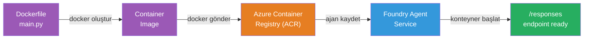
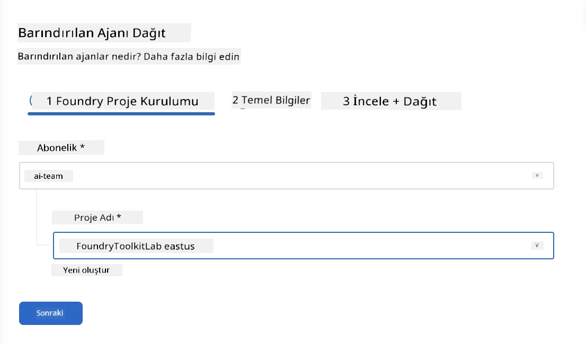
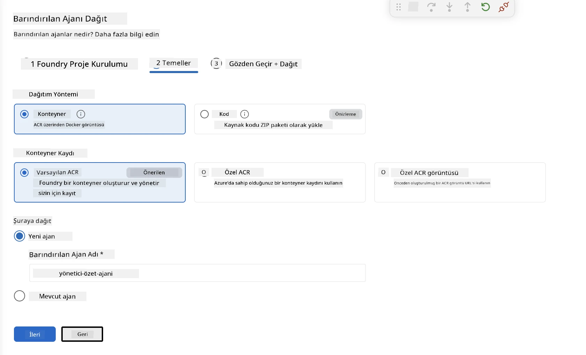
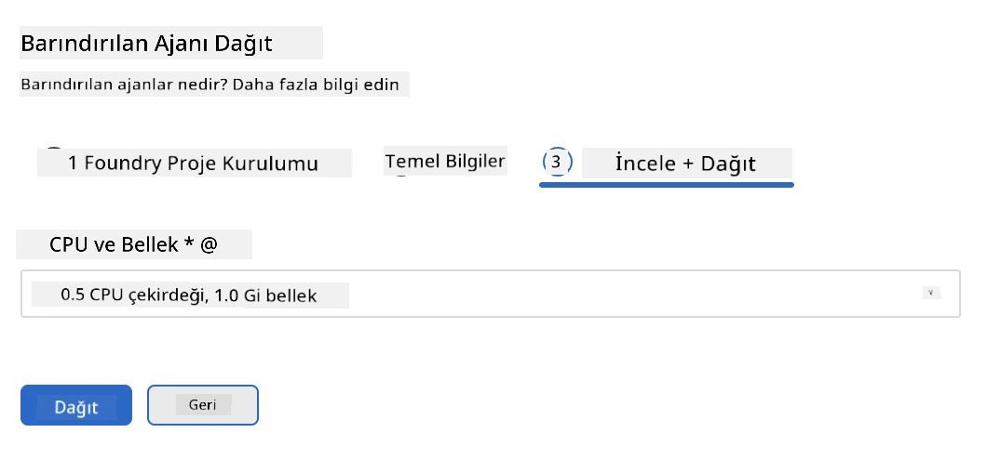
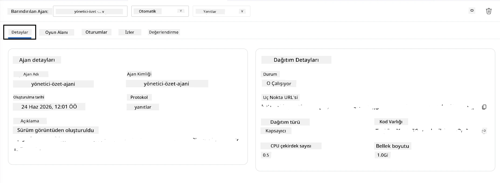

# Modül 5 - Foundry Agent Hizmetine Dağıtım

⏱️ ~10 dakika

> ⚠️ **Yol B kullanıcıları:** Bu modül bir Foundry aboneliği gerektirir. Foundry Local kullanıyorsanız, [Modül 07 - Özet](07-summary.md) kısmına geçin. Yerel geliştirme iş akışını başarıyla tamamladınız!

Bu modülde, yerel olarak test ettiğiniz ajanı Microsoft Foundry'e **Barındırılan Ajan** olarak dağıtırsınız. Dağıtım, bir konteyner görüntüsü oluşturur, bunu Azure Container Registry'ye gönderir ve ajanı Foundry'nin yönetilen altyapısında başlatır.

### Dağıtım hattı

---

## Önkoşullar kontrolü

Dağıtımdan önce şunları doğrulayın:

- [ ] Ajan, [Modül 04](04-test-locally.md)'ten 3 yerel senaryonun tamamını geçiyor
- [ ] Proje düzeyinde **Azure AI Kullanıcısı** rolünüz var ([Modül 01, RBAC Ataması](01-setup.md#deploy-a-model--assign-rbac))
- [ ] VS Code'da Azure'a giriş yapmışsınız (Hesap simgesi isminizi gösteriyor)

---

## Adım 1: Dağıtımı başlat

### Seçenek A: Agent Inspector'dan dağıtım (önerilen)

Agent Inspector açık ise (testten):
1. Sağ üst köşedeki **Deploy** düğmesine tıklayın (bulut simgesi ↑).

### Seçenek B: Komut Paletinden dağıtım

1. `Ctrl+Shift+P` tuşlarına basın → **Foundry Toolkit: Deploy Hosted Agent**.

---

## Adım 2: Dağıtımı yapılandır

Sihirbaz sizden şunları ister:

| İstek      | Seçim                      |
|------------|----------------------------|
| **Abonelik** | Azure Aboneliğiniz          |
| **Hedef proje** | Foundry projeniz (örn. `workshop-agents`) |

Ajanınızı yapılandırmak için **ileri**ye tıklayın.

| İstek           | Seçim                                                    |
|-----------------|----------------------------------------------------------|
| **Dağıtım Yöntemi** | Konteyner                                               |
| **Konteyner kaydı** | **Varsayılan ACR** (Microsoft Foundry sizin için yaratır ve yönetir) |
| **Dağıtım yeri**  | Yeni Ajan (adı, `executive-summary-agent`)               |

Ajanınızı gözden geçirmek ve dağıtmak için **ileri**ye tıklayın.

| İstek            | Seçim                               |
|------------------|------------------------------------|
| **CPU ve bellek** | **0.25 CPU çekirdeği, 0.5 Gi bellek** (workshop için yeterli) |

---

## Adım 3: Dağıt ve izle

1. **Deploy** düğmesine tıklayın.
2. **Çıktı** panelini izleyin (açılır listeden **Microsoft Foundry** seçin).
3. Dağıtım şu aşamalardan geçer:
   - **Docker build** - Dockerfile'dan konteyner oluşturur
   - **Docker push** - görüntüyü ACR'ye gönderir (ilk dağıtımda 1–3 dak)
   - **Agent registration** - Foundry'de barındırılan ajan oluşturur
   - **Container start** - sistem tarafından yönetilen kimlik ile başlatır

4. Tamamlandığında, bir bildirim görünür:
   > **my-agent başarıyla dağıtıldı.** `Günlükleri görüntüle` `Ajanı çalıştır`

5. Agent Playground'u açmak için **Run agent**'a tıklayın.

### Dağıtım durumu değerleri

| Durum      | Anlamı                   |
|------------|--------------------------|
| **Running** | Konteyner hazır, ajan cevap veriyor |
| **Pending** | Konteyner başlatılıyor - 30–60 saniye bekleyin |
| **Failed**  | Günlüklere bakın (aşağıdaki sorun giderme bölümüne bakınız) |

---

## Yaygın dağıtım hataları

| Hata                 | Temel neden                                     | Çözüm                                              |
|----------------------|------------------------------------------------|----------------------------------------------------|
| `agents/write` izni reddedildi | Proje düzeyinde eksik **Azure AI Kullanıcısı** rolü | [Modül 01, RBAC Ataması](01-setup.md#deploy-a-model--assign-rbac) |
| Docker çalışmıyor     | Docker Desktop başlatılmadı                      | Docker Desktop'u başlatın → `docker info` doğrulayın  |
| ACR yetkilendirmesi   | Yönetilen kimlik görüntüyü çekemiyor             | [Modül 08 - Sorun Giderme](08-troubleshooting.md)'ye bakın |

---

### ✅ Kontrol noktası

- [ ] Dağıtım hatasız tamamlandı
- [ ] Ajan, Foundry kenar çubuğunda **Barındırılan Ajanlar (Önizleme)** altında görünüyor
- [ ] Konteyner durumu **Running** gösteriyor
- [ ] Agent Playground sekmesi açıldı, ajan detayları ve uç nokta URL'si gösteriliyor

---

**Önceki:** [04 - Yerelde Test Et](04-test-locally.md) · **Sonraki:** [06 - Playground'da Doğrula →](06-verify-in-playground.md)

---

<!-- CO-OP TRANSLATOR DISCLAIMER START -->
**Feragatname**:
Bu belge, AI çeviri hizmeti [Co-op Translator](https://github.com/Azure/co-op-translator) kullanılarak çevrilmiştir. Doğruluk için çaba sarf etsek de, otomatik çevirilerin hata veya yanlışlık içerebileceğini lütfen unutmayınız. Orijinal belge, kendi dilinde yetkili kaynak olarak kabul edilmelidir. Kritik bilgiler için profesyonel insan çevirisi önerilir. Bu çevirinin kullanımı sonucu ortaya çıkabilecek yanlış anlamalardan veya yanlış yorumlamalardan sorumlu değiliz.
<!-- CO-OP TRANSLATOR DISCLAIMER END -->