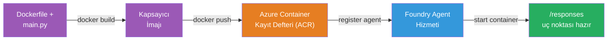
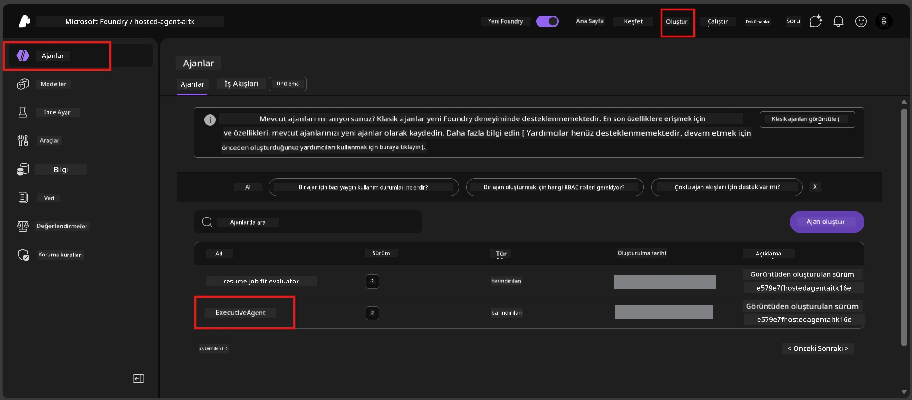

# Modül 6 - Foundry Agent Servisine Dağıtım

Bu modülde, yerel olarak test ettiğiniz agent'ı Microsoft Foundry’a bir [**Barındırılan Agent**](https://learn.microsoft.com/azure/foundry/agents/concepts/hosted-agents) olarak dağıtırsınız. Dağıtım süreci, projenizden bir Docker konteyner imajı oluşturur, bunu [Azure Container Registry (ACR)](https://learn.microsoft.com/azure/container-registry/container-registry-intro)’ye gönderir ve [Foundry Agent Servisi](https://learn.microsoft.com/azure/foundry/agents/overview) içinde barındırılan bir agent sürümü oluşturur.

### Dağıtım boru hattı


---

## Önkoşullar kontrolü

Dağıtıma başlamadan önce aşağıdaki her öğeyi doğrulayın. Bunların atlanması, dağıtım hatalarının en yaygın nedenidir.

1. **Agent yerel duman testlerinden geçti:**
   - [Modül 5](05-test-locally.md) içindeki 4 testi tamamladınız ve agent doğru yanıt verdi.

2. **[Azure AI User](https://learn.microsoft.com/azure/foundry/concepts/rbac-foundry#built-in-roles) rolünüz var:**
   - Bu, [Modül 2, Adım 3](02-create-foundry-project.md)’te atandı. Emin değilseniz şimdi doğrulayın:
   - Azure Portal → Foundry **proje** kaynağınız → **Erişim denetimi (IAM)** → **Rol atamaları** sekmesi → adınızı arayın → **Azure AI User** listeleniyorsa onaylayın.

3. **VS Code’da Azure’a giriş yaptınız:**
   - VS Code’un sol alt köşesindeki Hesaplar simgesine bakın. Hesap adınız görünmelidir.

4. **(İsteğe bağlı) Docker Desktop çalışıyor:**
   - Docker, yalnızca Foundry uzantısı sizden yerel derleme istiyorsa gereklidir. Çoğu durumda, uzantı dağıtım sırasında konteyner derlemelerini otomatik olarak yönetir.
   - Docker kuruluysa, çalıştığından emin olun: `docker info`

---

## Adım 1: Dağıtımı başlat

Dağıtmanın iki yolu vardır - her ikisi de aynı sonuca ulaşır.

### Seçenek A: Agent Inspector’dan dağıt (önerilen)

Agent’ı hata ayıklayıcıyla (F5) çalıştırıyor ve Agent Inspector açıksa:

1. Agent Inspector panelinin **sağ üst köşesine** bakın.
2. **Deploy** butonuna tıklayın (yukarı oklu bulut ikonu ↑).
3. Dağıtım sihirbazı açılır.

### Seçenek B: Komut Paletinden dağıt

1. `Ctrl+Shift+P` tuşlarına basarak **Komut Paletini** açın.
2. Yazın: **Microsoft Foundry: Deploy Hosted Agent** ve seçin.
3. Dağıtım sihirbazı açılır.

---

## Adım 2: Dağıtımı yapılandır

Dağıtım sihirbazı sizi yapılandırmada yönlendirir. Her istemi doldurun:

### 2.1 Hedef projeyi seçin

1. Bir açılır menü Foundry projelerinizi gösterir.
2. Modül 2’de oluşturduğunuz projeyi seçin (örneğin, `workshop-agents`).

### 2.2 Konteyner agent dosyasını seçin

1. Agent giriş noktası seçmeniz istenecek.
2. **`main.py`** (Python) dosyasını seçin - sihirbaz bu dosyayı agent projenizi tanımlamak için kullanır.

### 2.3 Kaynakları yapılandırın

| Ayar     | Önerilen değer | Notlar                               |
|----------|----------------|------------------------------------|
| **CPU**  | `0.25`         | Varsayılan, workshop için yeterli. Üretim iş yükleri için artırın |
| **Bellek** | `0.5Gi`        | Varsayılan, workshop için yeterli.  |

Bunlar `agent.yaml` içindeki değerlerle eşleşir. Varsayılanları kabul edebilirsiniz.

---

## Adım 3: Onayla ve dağıt

1. Sihirbaz şu bilgileri içeren dağıtım özetini gösterir:
   - Hedef proje adı
   - Agent adı (`agent.yaml`’den)
   - Konteyner dosyası ve kaynaklar
2. Özeti gözden geçirin ve **Onayla ve Dağıt** (veya sadece **Dağıt**) butonuna tıklayın.
3. İlerlemeyi VS Code’da izleyin.

### Dağıtım sırasında neler olur (adım adım)

Dağıtım çok adımlı bir süreçtir. Takip etmek için VS Code’daki **Çıktı** panelini açın (açılır listeden "Microsoft Foundry" seçin):

1. **Docker derleme** - VS Code, `Dockerfile`’ınızdan bir Docker konteyner imajı oluşturur. Docker katman mesajlarını görürsünüz:
   ```
   Step 1/6 : FROM python:<version>-slim
   Step 2/6 : WORKDIR /app
   ...
   Successfully built abc123def456
   ```

2. **Docker gönderme** - İmaj, Foundry projenize bağlı olan **Azure Container Registry (ACR)**’ye gönderilir. İlk dağıtımda bu 1-3 dakika sürebilir (temel imaj >100MB).

3. **Agent kaydı** - Foundry Agent Servisi yeni bir barındırılan agent (veya mevcutsa yeni bir sürüm) oluşturur. `agent.yaml`’deki agent meta verileri kullanılır.

4. **Konteyner başlatma** - Konteyner Foundry’nin yönetilen altyapısında başlatılır. Platform bir [sistem yönetimli kimlik](https://learn.microsoft.com/azure/foundry/agents/concepts/agent-identity) atar ve `/responses` uç noktasını açar.

> **İlk dağıtım daha yavaştır** (Docker tüm katmanları göndermelidir). Sonraki dağıtımlar daha hızlıdır çünkü Docker değişmeyen katmanları önbelleğe alır.

---

## Adım 4: Dağıtım durumunu doğrula

Dağıtım komutu tamamlandıktan sonra:

1. Etkinlik Çubuğundaki Foundry simgesine tıklayarak **Microsoft Foundry** yan çubuğunu açın.
2. Projeniz altında **Hosted Agents (Önizleme)** bölümünü genişletin.
3. Agent adınızı görmelisiniz (örneğin `ExecutiveAgent` veya `agent.yaml`’den adı).
4. **Agent adına tıklayın** ve genişletin.
5. Bir veya daha fazla **sürüm** (örneğin `v1`) göreceksiniz.
6. Sürüm üzerine tıklayarak **Konteyner Detayları** nı görüntüleyin.
7. **Durum** alanını kontrol edin:

   | Durum      | Anlamı                                  |
   |------------|----------------------------------------|
   | **Started** veya **Running** | Konteyner çalışıyor ve agent hazır   |
   | **Pending** | Konteyner başlatılıyor (30-60 saniye bekleyin) |
   | **Failed**  | Konteyner başlatılamadı (logları kontrol edin - aşağıdaki sorun giderme bölümüne bakın) |



> **Eğer 2 dakikadan fazla "Pending" görüyorsanız:** Konteyner temel imajı çekiyor olabilir. Biraz daha bekleyin. Bekleme devam ederse konteyner loglarını kontrol edin.

---

## Yaygın dağıtım hataları ve çözümleri

### Hata 1: İzin reddedildi - `agents/write`

```
Error: lacks the required data action 
Microsoft.CognitiveServices/accounts/AIServices/agents/write 
to perform POST /api/projects/{projectName}/assistants operation.
```

**Temel neden:** `Azure AI User` rolünüz **proje** düzeyinde değil.

**Adım adım çözüm:**

1. [https://portal.azure.com](https://portal.azure.com) adresini açın.
2. Arama çubuğuna Foundry **proje** adınızı yazın ve tıklayın.
   - **Önemli:** Ebeveyn hesap/hub kaynağı değil, **proje** kaynağına gidin (tür: "Microsoft Foundry project").
3. Sol menüden **Erişim denetimi (IAM)** üzerine tıklayın.
4. **+ Ekle** → **Rol ataması ekle**.
5. **Rol** sekmesinde [**Azure AI User**](https://learn.microsoft.com/azure/foundry/concepts/rbac-foundry#built-in-roles) aratın ve seçin. **İleri** ye tıklayın.
6. **Üyeler** sekmesinde **Kullanıcı, grup veya hizmet sorumlusu** seçin.
7. **+ Üye seç** tıklayın, adınızı/e-posta adresinizi arayın, kendinizi seçin ve **Seç**.
8. **İncele + ata**’ya tıklayın, sonra tekrar **İncele + ata**.
9. Rol atamasının yayılması için 1-2 dakika bekleyin.
10. Adım 1’den itibaren **dağıtımı tekrar deneyin**.

> Rolün mutlaka **proje** kapsamında olması gerekir, sadece hesap kapsamı yeterli değildir. Bu dağıtım hatalarının en yaygın nedenidir.

### Hata 2: Docker çalışmıyor

```
Error: Docker build failed / Cannot connect to Docker daemon
```

**Çözüm:**
1. Docker Desktop’u başlatın (Başlat menüsünden veya sistem tepsisi ikonundan bulun).
2. "Docker Desktop çalışıyor" mesajını görünceye kadar bekleyin (30-60 saniye).
3. Terminalde: `docker info` komutunu kullanarak çalıştığını doğrulayın.
4. **Windows’a özel:** Docker Desktop ayarlarında **Genel** bölümünden **WSL 2 tabanlı motoru kullan** seçeneğinin aktif olduğundan emin olun.
5. Dağıtımı tekrar deneyin.

### Hata 3: ACR yetkilendirme - `AcrPullUnauthorized`

```
Error: AcrPullUnauthorized
```

**Temel neden:** Foundry projesinin yönetilen kimliği konteyner kayıt defterine çekme yetkisine sahip değil.

**Çözüm:**
1. Azure Portal’da **[Container Registry](https://learn.microsoft.com/azure/container-registry/container-registry-intro)** kaydınıza gidin (aynı kaynak grubunda bulunur).
2. **Erişim denetimi (IAM)** → **Ekle** → **Rol ataması ekle**.
3. **[AcrPull](https://learn.microsoft.com/azure/container-registry/container-registry-roles)** rolünü seçin.
4. Üyeler bölümünde **Yönetilen kimlik** seçin → Foundry projesinin yönetilen kimliğini bulun.
5. **İncele + ata**.

> Bu genellikle Foundry uzantısı tarafından otomatik yapılandırılır. Bu hatayı görüyorsanız otomatik yapılandırmada sorun olmuş olabilir.

### Hata 4: Konteyner platform uyumsuzluğu (Apple Silicon)

Apple Silicon Mac (M1/M2/M3) kullanıyorsanız, konteynerin `linux/amd64` için oluşturulması gerekir:

```bash
docker build --platform linux/amd64 -t myagent:v1 .
```

> Foundry uzantısı çoğu kullanıcı için bunu otomatik olarak halleder.

---

### Kontrol listesi

- [ ] Dağıtım komutu VS Code’da hata vermeden tamamlandı
- [ ] Agent, Foundry yan çubuğundaki **Hosted Agents (Önizleme)** altında görünüyor
- [ ] Agent’a tıkladınız → bir sürüm seçtiniz → **Konteyner Detayları**nı gördünüz
- [ ] Konteyner durumu **Started** veya **Running** olarak gösteriliyor
- [ ] (Hata olduysa) Hatanın ne olduğunu belirlediniz, çözümü uyguladınız ve yeniden dağıttınız

---

**Önceki:** [05 - Yerelde Test Et](05-test-locally.md) · **Sonraki:** [07 - Oyun Alanında Doğrula →](07-verify-in-playground.md)

---

<!-- CO-OP TRANSLATOR DISCLAIMER START -->
**Feragatname**:  
Bu belge, AI çeviri servisi [Co-op Translator](https://github.com/Azure/co-op-translator) kullanılarak çevrilmiştir. Doğruluk için çaba göstersek de, otomatik çevirilerin hata veya yanlışlık içerebileceğini lütfen unutmayınız. Orijinal belge, kendi dilinde yetkili kaynak olarak kabul edilmelidir. Kritik bilgiler için profesyonel insan çevirisi önerilir. Bu çevirinin kullanımı sonucu ortaya çıkabilecek herhangi bir yanlış anlama veya yorumdan sorumlu değiliz.
<!-- CO-OP TRANSLATOR DISCLAIMER END -->