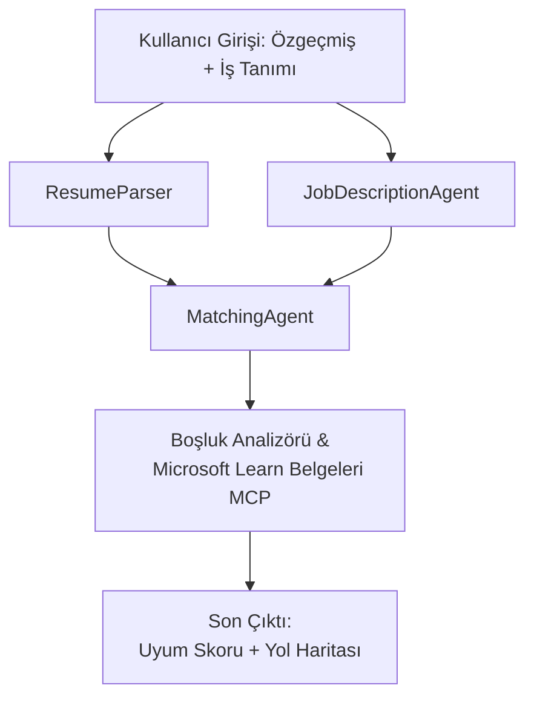

# PersonalCareerCopilot - Özgeçmiş → İş Uygunluk Değerlendiricisi

Bir özgeçmişin bir iş tanımıyla ne kadar iyi eşleştiğini değerlendiren, ardından boşlukları kapatmak için kişiselleştirilmiş bir öğrenme yol haritası oluşturan çok ajanlı bir iş akışı.

---

## Ajanlar

| Ajan | Rol | Araçlar |
|-------|------|-------|
| **ResumeParser** | Özgeçmiş metninden yapılandırılmış beceri, deneyim, sertifikaları çıkarır | - |
| **JobDescriptionAgent** | Bir iş tanımından gereken/tercih edilen beceri, deneyim, sertifikaları çıkarır | - |
| **MatchingAgent** | Profil ile gereksinimleri karşılaştırır → uyum puanı (0-100) + eşleşen/kayıp beceriler | - |
| **GapAnalyzer** | Microsoft Learn kaynakları ile kişiselleştirilmiş öğrenme yol haritası oluşturur | `search_microsoft_learn_for_plan` (MCP) |

## İş Akışı


---

## Hızlı başlangıç

### 1. Ortamı kurun

```powershell
cd workshop\lab02-multi-agent\PersonalCareerCopilot
python -m venv .venv
.\.venv\Scripts\Activate.ps1          # Windows PowerShell
# source .venv/bin/activate            # macOS / Linux
pip install -r requirements.txt
```

### 2. Kimlik bilgilerini yapılandırın

Örnek env dosyasını kopyalayın ve Foundry proje bilgilerinizi doldurun:

```powershell
cp .env.example .env
```

`.env` dosyasını düzenleyin:

```env
PROJECT_ENDPOINT=https://<your-account>.services.ai.azure.com/api/projects/<your-project>
MODEL_DEPLOYMENT_NAME=gpt-4.1-mini
```

| Değer | Nerede bulunur |
|-------|-----------------|
| `PROJECT_ENDPOINT` | VS Code'da Microsoft Foundry kenar çubuğu → projenize sağ tıklayın → **Copy Project Endpoint** |
| `MODEL_DEPLOYMENT_NAME` | Foundry kenar çubuğu → projeyi genişletin → **Models + endpoints** → dağıtım adı |

### 3. Yerel olarak çalıştırın

```powershell
python -m debugpy --listen 127.0.0.1:5679 -m agentdev run main.py --verbose --port 8088
```

Ya da VS Code görevini kullanın: `Ctrl+Shift+P` → **Tasks: Run Task** → **Run Lab02 HTTP Server**.

### 4. Agent Inspector ile test edin

Agent Inspector'ı açın: `Ctrl+Shift+P` → **Foundry Toolkit: Open Agent Inspector**.

Bu test istemini yapıştırın:

```
Resume:
Jane Doe
Senior Software Engineer with 5 years of experience in Python, Django, and AWS.
Built microservices handling 10K+ requests/second. Led a team of 4 developers.
Certifications: AWS Solutions Architect Associate.
Education: B.S. Computer Science, State University.

Job Description:
Senior Cloud Engineer at Contoso Ltd.
Required: Python, Azure, Kubernetes, Terraform, CI/CD pipelines.
Preferred: Go, monitoring (Prometheus/Grafana), cost optimization.
Experience: 5+ years in cloud infrastructure.
Certifications: Azure Solutions Architect Expert preferred.
```

**Beklenen:** Bir uyum puanı (0-100), eşleşen/kayıp beceriler ve Microsoft Learn URL'leri ile kişiselleştirilmiş öğrenme yol haritası.

### 5. Foundry'ye dağıtın

`Ctrl+Shift+P` → **Microsoft Foundry: Deploy Hosted Agent** → projenizi seçin → onaylayın.

---

## Proje yapısı

```
PersonalCareerCopilot/
├── .env.example        ← Template for environment variables
├── .env                ← Your credentials (git-ignored)
├── agent.yaml          ← Hosted agent definition (name, resources, env vars)
├── Dockerfile          ← Container image for Foundry deployment
├── main.py             ← 4-agent workflow (instructions, MCP tool, WorkflowBuilder)
└── requirements.txt    ← Python dependencies
```

## Önemli dosyalar

### `agent.yaml`

Foundry Agent Servisi için barındırılan ajanı tanımlar:
- `kind: hosted` - yönetilen bir konteyner olarak çalışır
- `protocols: [responses v1]` - `/responses` HTTP uç noktasını açar
- `environment_variables` - `PROJECT_ENDPOINT` ve `MODEL_DEPLOYMENT_NAME` deploy zamanında enjekte edilir

### `main.py`

İçerir:
- **Ajan talimatları** - her ajan için dört `*_INSTRUCTIONS` sabiti
- **MCP aracı** - `search_microsoft_learn_for_plan()` Streamable HTTP üzerinden `https://learn.microsoft.com/api/mcp` çağrısı yapar
- **Ajan oluşturma** - `create_agents()` konteks yöneticisi `AzureAIAgentClient.as_agent()` kullanarak
- **İş akışı grafiği** - `create_workflow()` `WorkflowBuilder` kullanarak ajanları fan-out/fan-in/ardışık desenlerle bağlar
- **Sunucu başlatma** - `from_agent_framework(agent).run_async()` port 8088'de

### `requirements.txt`

| Paket | Versiyon | Amaç |
|---------|---------|---------|
| `agent-framework-azure-ai` | `1.0.0rc3` | Microsoft Agent Framework için Azure AI entegrasyonu |
| `agent-framework-core` | `1.0.0rc3` | Çekirdek çalışma zamanı (WorkflowBuilder dahil) |
| `azure-ai-agentserver-agentframework` | `1.0.0b16` | Barındırılan ajan sunucu çalışma zamanı |
| `azure-ai-agentserver-core` | `1.0.0b16` | Temel ajan sunucu soyutlamaları |
| `debugpy` | en son | Python hata ayıklama (VS Code'da F5) |
| `agent-dev-cli` | `--pre` | Yerel geliştirici CLI + Agent Inspector arka ucu |

---

## Sorun Giderme

| Sorun | Çözüm |
|-------|-----|
| `RuntimeError: Missing required environment variable(s)` | `.env` dosyası oluşturun ve `PROJECT_ENDPOINT` ile `MODEL_DEPLOYMENT_NAME` ekleyin |
| `ModuleNotFoundError: No module named 'agent_framework'` | Sanal ortamı aktive edin ve `pip install -r requirements.txt` çalıştırın |
| Çıktıda Microsoft Learn URL'leri yok | `https://learn.microsoft.com/api/mcp` adresine internet bağlantısını kontrol edin |
| Yalnızca 1 boşluk kartı (kısaltılmış) | `GAP_ANALYZER_INSTRUCTIONS` içinde `CRITICAL:` bloğunun olduğundan emin olun |
| 8088 numaralı port kullanımda | Diğer sunucuları durdurun: `netstat -ano \| findstr :8088` |

Detaylı sorun giderme için bkz: [Modül 8 - Sorun Giderme](../docs/08-troubleshooting.md).

---

**Tam rehber:** [Lab 02 Dokümanları](../docs/README.md) · **Geriye dön:** [Lab 02 README](../README.md) · [Çalıştay Ana Sayfa](../../../README.md)

---

<!-- CO-OP TRANSLATOR DISCLAIMER START -->
**Feragatname**:  
Bu belge, AI çeviri hizmeti [Co-op Translator](https://github.com/Azure/co-op-translator) kullanılarak çevrilmiştir. Doğruluk için çaba sarf etsek de, otomatik çevirilerin hatalar veya yanlışlıklar içerebileceğini lütfen unutmayın. Orijinal belge, kendi dilinde yetkili kaynak olarak kabul edilmelidir. Kritik bilgiler için profesyonel insan çevirisi önerilir. Bu çevirinin kullanımı sonucunda oluşabilecek herhangi bir yanlış anlama veya yanlış yorumdan sorumlu değiliz.
<!-- CO-OP TRANSLATOR DISCLAIMER END -->