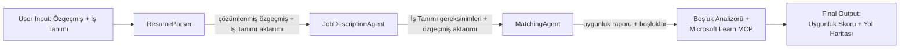

# PersonalCareerCopilot - Özgeçmiş → İş Uygunluğu Değerlendiricisi

Bir iş akışı öncelikli çoklu ajan uygulaması, bir özgeçmişin iş tanımıyla ne kadar iyi eşleştiğini değerlendirir ve ardından boşlukları kapatmak için kişiselleştirilmiş bir öğrenme yol haritası oluşturur.

---

## Ajanlar

| Ajan | Rol | Araçlar |
|-------|------|-------|
| **ResumeParser** | Özgeçmiş metninden yapılandırılmış beceriler, deneyim, sertifikalar çıkarır | - |
| **JobDescriptionAgent** | Bir iş tanımından gerekli/tercih edilen beceriler, deneyim, sertifikalar çıkarır | - |
| **MatchingAgent** | Profil ile gereksinimleri karşılaştırır → uygunluk puanı (0-100) + eşleşen/kayıp beceriler | - |
| **GapAnalyzer** | Microsoft Learn kaynakları ile kişiselleştirilmiş öğrenme yol haritası oluşturur | `search_microsoft_learn_for_plan` (MCP) |

## İş Akışı


```mermaid
flowchart LR
    UserInput["User Input: Özgeçmiş + İş Tanımı"] --> ResumeParser
    ResumeParser -- "çözümlenmiş özgeçmiş + İş Tanımı aktarımı" --> JobDescriptionAgent
    JobDescriptionAgent -- "İş Tanımı gereksinimleri + özgeçmiş aktarımı" --> MatchingAgent
    MatchingAgent -- "uygunluk raporu + boşluklar" --> GapAnalyzerMCP["Boşluk Analizörü +\nMicrosoft Learn MCP"]
    GapAnalyzerMCP --> FinalOutput["Final Output:\nUygunluk Skoru + Yol Haritası"]
```

---

## Hızlı başlangıç

### 1. Ortamı kur

Bu klasör, iş akışı tabanlı Lab 02 iskeletinin referans uygulamasıdır. `main.py` mevcut istem bloklarını ve `WorkflowBuilder`'ı kullanarak dört ajanı birbirine bağlar.

```powershell
cd workshop\lab02-multi-agent\PersonalCareerCopilot
python -m venv .venv
.\.venv\Scripts\Activate.ps1          # Windows PowerShell
# source .venv/bin/activate            # macOS / Linux
pip install -r requirements.txt
```

### 2. Kimlik bilgilerini yapılandır

Bu klasörde `.env` dosyası oluşturun:

```powershell
copy .env .env.bak 2>$null; echo $null > .env
```

`.env` dosyasını düzenleyin:

```env
FOUNDRY_PROJECT_ENDPOINT=https://<your-account>.services.ai.azure.com/api/projects/<your-project>
AZURE_AI_MODEL_DEPLOYMENT_NAME=gpt-4.1-mini
```

| Değer | Nereden bulunur |
|-------|------------------|
| `FOUNDRY_PROJECT_ENDPOINT` | Foundry Toolkit kenar çubuğu → projenize sağ tıklayın → **Proje Uç Noktasını Kopyala** |
| `AZURE_AI_MODEL_DEPLOYMENT_NAME` | Foundry kenar çubuğu → projeyi genişletin → **Modeller + uç noktalar** → dağıtım adı |

### 3. Yerel olarak çalıştır

```powershell
python -m debugpy --listen 127.0.0.1:5679 main.py --port 8088
```

Ya da VS Code görevini kullanın: `Ctrl+Shift+P` → **Görevler: Görev Çalıştır** → **Agent HTTP Sunucusunu Çalıştır**.

F5 hata ayıklaması için **Yerel Agent HTTP Sunucusunu Hata Ayıkla** kullanın.

### 4. Agent Inspector ile test et

Agent Inspector'u açın: `Ctrl+Shift+P` → **Foundry Toolkit: Agent Inspector'u Aç**.

Bu test istemini yapıştırın:

```
Resume:
Jane Doe
Senior Software Engineer with 5 years of experience in Python, Django, and AWS.
Built microservices handling 10K+ requests/second. Led a team of 4 developers.
Certifications: AWS Solutions Architect Associate.
Education: B.S. Computer Science, State University.

Job Description:
Senior Cloud Engineer at Contoso Ltd.
Required: Python, Azure, Kubernetes, Terraform, CI/CD pipelines.
Preferred: Go, monitoring (Prometheus/Grafana), cost optimization.
Experience: 5+ years in cloud infrastructure.
Certifications: Azure Solutions Architect Expert preferred.
```

**Beklenen:** Bir uygunluk puanı (0-100), eşleşen/kayıp beceriler ve Microsoft Learn URL'leri ile kişiselleştirilmiş bir öğrenme yol haritası.

### 5. Foundry'e dağıt

`Ctrl+Shift+P` → **Foundry Toolkit: Barındırılan Ajanı Dağıt** → projenizi seçin → onaylayın.

---

## Proje yapısı

```
PersonalCareerCopilot/
├── .env                ← Your credentials (git-ignored)
├── agent.yaml          ← Hosted agent definition (name, resources, env vars)
├── Dockerfile          ← Container image for Foundry deployment
├── main.py             ← 4-agent workflow (instructions, MCP tool, WorkflowBuilder)
└── requirements.txt    ← Python dependencies
```

## Temel dosyalar

### `agent.yaml`

Foundry Agent Service için barındırılan ajanı tanımlar:
- `kind: hosted` - yönetilen konteyner olarak çalışır
- `protocols` - `version: 1.0.0` ile `responses` protokolü, `/responses` HTTP uç noktasını açar
- `environment_variables` - `AZURE_AI_MODEL_DEPLOYMENT_NAME` burada tanımlanır; `FOUNDRY_PROJECT_ENDPOINT` dağıtım sırasında otomatik olarak enjekte edilir

### `main.py`

İçerir:
- **Ajan talimatları** - her ajan için dörder `*_INSTRUCTIONS` sabitleri
- **MCP aracı** - `search_microsoft_learn_for_plan()` çağrısı `https://learn.microsoft.com/api/mcp` adresine Streamable HTTP üzerinden yapar
- **Ajan oluşturma** - bir `FoundryChatClient` paylaşan dörder `Agent()` + `AgentExecutor()` örneği
- **İş akışı grafiği** - Ajanları ardışık bir boru hattı olarak bağlayan `WorkflowBuilder`: ResumeParser → JD Agent → MatchingAgent → GapAnalyzer
- **Sunucu başlatma** - `ResponsesHostServer` 8088 portunda çalışır

### `requirements.txt`

| Paket | Amaç |
|---------|----------|
| `agent-framework-foundry` | Çekirdek çalışma zamanı: `Agent`, `AgentExecutor`, `WorkflowBuilder`, `@tool`, `FoundryChatClient` |
| `agent-framework-foundry-hosting` | `ResponsesHostServer` + Foundry barındırma entegrasyonu |
| `mcp<2,>=1.24.0` | GapAnalyzer için MCP istemcisi (`streamable_http_client`) |
| `debugpy` | Python hata ayıklama (VS Code’da F5) |

---

## Sorun Giderme

| Sorun | Çözüm |
|-------|-----|
| `KeyError: 'FOUNDRY_PROJECT_ENDPOINT'` veya `KeyError: 'AZURE_AI_MODEL_DEPLOYMENT_NAME'` | Hem `FOUNDRY_PROJECT_ENDPOINT` hem de `AZURE_AI_MODEL_DEPLOYMENT_NAME` ayarlı `.env` dosyası oluşturun |
| `ModuleNotFoundError: No module named 'agent_framework'` | Sanal ortamı etkinleştirip `pip install -r requirements.txt` komutunu çalıştırın |
| Çıktıda Microsoft Learn URL'leri yok | `https://learn.microsoft.com/api/mcp` internet bağlantısını kontrol edin |
| Sadece 1 boşluk kartı (kısaltılmış) | `GAP_ANALYZER_INSTRUCTIONS` içinde `CRITICAL:` bloğunun olduğundan emin olun |
| 8088 Portu kullanımda | Diğer sunucuları durdurun: `netstat -ano \| findstr :8088` |

Ayrıntılı sorun giderme için bkz. [Modül 8 - Sorun Giderme](../docs/08-troubleshooting.md).

---

**Tam yürütme:** [Lab 02 Docs](../docs/README.md) · **Geri dön:** [Lab 02 README](../README.md) · [Atölye Ana Sayfası](../../../README.md)

---

<!-- CO-OP TRANSLATOR DISCLAIMER START -->
**Feragatname**:
Bu belge, AI çeviri hizmeti [Co-op Translator](https://github.com/Azure/co-op-translator) kullanılarak çevrilmiştir. Doğruluk için çaba sarf etsek de, otomatik çevirilerin hata veya yanlışlık içerebileceğini lütfen unutmayınız. Orijinal belge, kendi dilinde yetkili kaynak olarak kabul edilmelidir. Kritik bilgiler için profesyonel insan çevirisi önerilir. Bu çevirinin kullanımı sonucu ortaya çıkabilecek yanlış anlamalardan veya yanlış yorumlamalardan sorumlu değiliz.
<!-- CO-OP TRANSLATOR DISCLAIMER END -->