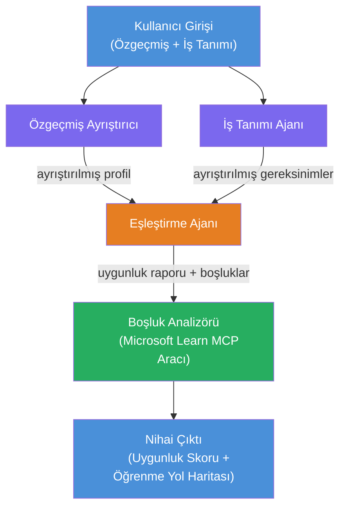

# Lab 02 - Çoklu Ajan İş Akışı: Özgeçmiş → İş Uygunluğu Değerlendiricisi

---

## Ne inşa edeceksiniz

Bir **Özgeçmiş → İş Uygunluğu Değerlendiricisi** - dört uzmanlaşmış ajanın bir adayın özgeçmişinin iş tanımıyla ne kadar uyumlu olduğunu değerlendirmek için iş birliği yaptığı ve ardından boşlukları kapatmak için kişiselleştirilmiş bir öğrenme yol haritası oluşturduğu çoklu ajan iş akışı.

### Ajanlar

| Ajan | Rolü |
|-------|------|
| **Özgeçmiş Ayrıştırıcı** | Özgeçmiş metninden yapılandırılmış beceriler, deneyim, sertifikalar çıkarır |
| **İş Tanımı Ajanı** | Bir iş tanımından gereken/tercih edilen beceriler, deneyim, sertifikalar çıkarır |
| **Eşleştirme Ajanı** | Profil ile gereksinimleri karşılaştırır → uygunluk skoru (0-100) + eşleşen/kayıp beceriler |
| **Boşluk Analizcisi** | Kaynaklar, zaman çizelgeleri ve hızlı kazanım projeleri ile kişiselleştirilmiş öğrenme yol haritası oluşturur |

### Demo akışı

Bir **özgeçmiş + iş tanımı** yükleyin → bir **uygunluk skoru + eksik beceriler** alın → bir **kişiselleştirilmiş öğrenme yol haritası** edinin.

### İş akışı mimarisi

> Mor = paralel ajanlar | Turuncu = toplama noktası | Yeşil = araçlara sahip son ajan. Detaylı diyagramlar ve veri akışı için [Modül 1 - Mimarinin Anlaşılması](docs/01-understand-multi-agent.md) ve [Modül 4 - Orkestrasyon Desenleri](docs/04-orchestration-patterns.md) bakınız.

### Kapsanan konular

- **WorkflowBuilder** kullanarak çoklu ajan iş akışı oluşturma
- Ajan rolleri ve orkestrasyon akışının tanımlanması (paralel + sıralı)
- Ajanlar arası iletişim desenleri
- Ajan Denetleyici ile yerel test
- Çoklu ajan iş akışlarını Foundry Agent Service'e dağıtma

---

## Önkoşullar

Önce Lab 01'i tamamlayın:

- [Lab 01 - Tek Ajan](../lab01-single-agent/README.md)

---

## Başlarken

Tam kurulum talimatları, kod incelemesi ve test komutları için:

- [Lab 2 Belgeleri - Önkoşullar](docs/00-prerequisites.md)
- [Lab 2 Belgeleri - Tam Öğrenme Yolu](docs/README.md)
- [PersonalCareerCopilot çalışma rehberi](PersonalCareerCopilot/README.md)

## Orkestrasyon desenleri (ajanik alternatifler)

Lab 2, varsayılan **paralel → toplayıcı → planlayıcı** akışını içerir ve belgelerde ayrıca daha kuvvetli ajanik davranış göstermek için alternatif desenler açıklanır:

- **Ağırlıklı fikir birliği ile fan-out/fan-in**
- **Son yol haritası öncesi değerlendirici/eleştirmen geçişi**
- **Koşullu yönlendirici** (uygunluk skoru ve eksik becerilere bağlı yol seçimi)

Bkz. [docs/04-orchestration-patterns.md](docs/04-orchestration-patterns.md).

---

**Önceki:** [Lab 01 - Tek Ajan](../lab01-single-agent/README.md) · **Geriye dön:** [Atölye Ana Sayfa](../../README.md)

---

<!-- CO-OP TRANSLATOR DISCLAIMER START -->
**Feragatname**:  
Bu belge, AI çeviri hizmeti [Co-op Translator](https://github.com/Azure/co-op-translator) kullanılarak çevrilmiştir. Doğruluk için çaba sarf etsek de, otomatik çevirilerin hatalar veya yanlışlıklar içerebileceğini lütfen unutmayınız. Orijinal belge, kendi orijinal dilinde yetkili kaynak olarak kabul edilmelidir. Kritik bilgiler için profesyonel insan çevirisi önerilir. Bu çevirinin kullanımı sonucunda oluşabilecek herhangi bir yanlış anlama veya yanlış yorumdan sorumlu değiliz.
<!-- CO-OP TRANSLATOR DISCLAIMER END -->