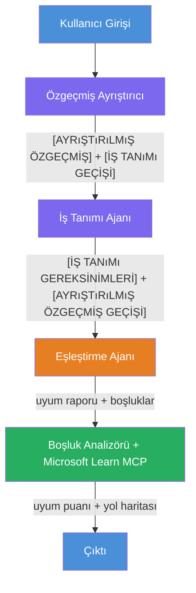

# Laboratuvar 02 - Çoklu Ajan İş Akışı: Özgeçmiş → İş Uygunluğu Değerlendirici

## Genel Bakış

Bu uygulamalı laboratuvarda, VS Code'da Foundry Toolkit kullanarak **iş akışı öncelikli çoklu ajan uygulaması** oluşturacak ve Microsoft Foundry Agent Service'e dağıtacaksınız.

**Oluşturacağınız şey:** bir Özgeçmiş → İş Uygunluğu Değerlendirici; bu araç özgeçmişi ve iş tanımını analiz eder, uyumu puanlar ve Microsoft Learn kaynaklarını kullanarak kişiselleştirilmiş bir öğrenme yol haritası üretir.

---

## Mimari

```mermaid
flowchart TD
    A["Kullanıcı Girişi"] --> B["Özgeçmiş Ayrıştırıcı"]
    B -->|"[AYRıŞTıRıLMıŞ ÖZGEÇMİŞ] + [İŞ TANıMı GEÇİŞİ]"| C["İş Tanımı Ajanı"]
    C -->|"[İŞ TANıMı GEREKSİNİMLERİ] + [AYRıŞTıRıLMıŞ ÖZGEÇMİŞ GEÇİŞİ]"| D["Eşleştirme Ajanı"]
    D -->|uyum raporu + boşluklar| E["Boşluk Analizörü + Microsoft Learn MCP"]
    E -->|uyum puanı + yol haritası| F["Çıktı"]

    style A fill:#4A90D9,color:#fff
    style B fill:#7B68EE,color:#fff
    style C fill:#7B68EE,color:#fff
    style D fill:#E67E22,color:#fff
    style E fill:#27AE60,color:#fff
    style F fill:#4A90D9,color:#fff
```

**Nasıl çalışır:**
1. Kullanıcı bir özgeçmiş ve iş tanımı yapıştırır.
2. **ResumeParser** özgeçmişi çözümler ve iş tanımını kelimesi kelimesine `[İŞ TANIMI GEÇİŞİ]` bölümüne kopyalar.
3. **JD Agent** geçişten yapısal gereksinimleri çıkarır, ardından `[ÇÖZÜMLENMİŞ ÖZGEÇMİŞ]`i `[ÇÖZÜMLENMİŞ ÖZGEÇMİŞ GEÇİŞİ]` olarak iletir.
4. **MatchingAgent** `[ÇÖZÜMLENMİŞ ÖZGEÇMİŞ GEÇİŞİ]` ile `[İŞ TANIMI GEREKSİNİMLERİ]`ni karşılaştırır ve uygunluk puanı üretir.
5. **GapAnalyzer** boşlukları pratik bir yol haritasına çevirir ve MCP aracılığıyla gerçek Microsoft Learn bağlantılarını çeker.

---

## Gereksinimler

Öncelikle Laboratuvar 01'i tamamlayın:

- [Laboratuvar 01 - Tek Ajan](../lab01-single-agent/README.md)

---

## Bölüm 1: Modülleri belirtilen sırayla okuyun

Tam öğrenme yolunu şu adreste görüntüleyin:

- [Laboratuvar 2 Belgeleri - Gereksinimler](docs/00-prerequisites.md)
- [Laboratuvar 2 Belgeleri - Tam Öğrenme Yolu](docs/README.md)
- [PersonalCareerCopilot çalışma kılavuzu](PersonalCareerCopilot/README.md)

---

## Bölüm 2: İş akışını oluşturun ve test edin

1. Foundry Toolkit sihirbazını kullanarak iş akışı tabanlı projeyi oluşturun.
2. `PersonalCareerCopilot/main.py` içindeki prompt bloklarını ve iş akışı grafiğini çalışma alanınıza kopyalayın.
3. Agent Inspector ile yerel olarak çalıştırın ve tüm dört ajan ile MCP aracını doğrulayın.
4. Yerel testler başarılı olursa barındırılan ajanı Foundry'e dağıtın.

---

## Orkestrasyon desenleri

Laboratuvar 02, varsayılan **fan-out → fan-in → sıralı** akışını içerir ve belgeler ayrıca denemeler için alternatif orkestrasyon desenlerini açıklar.

- **Ağırlıklı uzlaşmalı Fan-out/Fan-in**
- **Son yol haritası öncesi İnceleme/eleştiri geçişi**
- Uygunluk puanı ve eksik becerilere dayalı **Koşullu yönlendirici**

[docs/04-orchestration-patterns.md](docs/04-orchestration-patterns.md) adresine bakın.

---

**Önceki:** [Laboratuvar 01 - Tek Ajan](../lab01-single-agent/README.md) · **Geriye Dön:** [Atölye Anasayfası](../../README.md)

---

<!-- CO-OP TRANSLATOR DISCLAIMER START -->
**Feragatname**:
Bu belge, AI çeviri hizmeti [Co-op Translator](https://github.com/Azure/co-op-translator) kullanılarak çevrilmiştir. Doğruluk için çaba sarf etsek de, otomatik çevirilerin hata veya yanlışlık içerebileceğini lütfen unutmayınız. Orijinal belge, kendi dilinde yetkili kaynak olarak kabul edilmelidir. Kritik bilgiler için profesyonel insan çevirisi önerilir. Bu çevirinin kullanımı sonucu ortaya çıkabilecek yanlış anlamalardan veya yanlış yorumlamalardan sorumlu değiliz.
<!-- CO-OP TRANSLATOR DISCLAIMER END -->