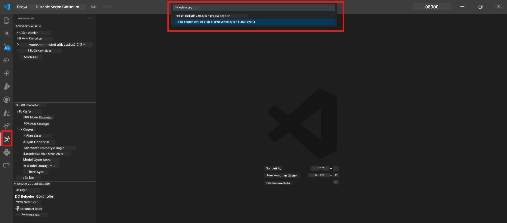

# Modül 0 - Ön Gereksinimler

Lab 02'ye başlamadan önce, aşağıdakilerin tamamlandığından emin olun. Bu laboratuvar doğrudan Lab 01 üzerine kuruludur - onu atlamayın.

---

## 1. Lab 01'i Tamamlayın

Lab 02, zaten aşağıdakilerin yapılmış olduğunu varsayar:

- [x] [Lab 01 - Tekli Ajan](../../lab01-single-agent/README.md) 8 modülünün tamamını tamamladınız
- [x] Tek bir ajanı Foundry Ajan Servisine başarıyla dağıttınız
- [x] Ajanın hem yerel Ajan Denetleyicisinde hem de Foundry Playground'da çalıştığını doğruladınız

Henüz Lab 01'i tamamlamadıysanız, geri dönüp tamamlayın: [Lab 01 Belgeleri](../../lab01-single-agent/docs/00-prerequisites.md)

---

## 2. Mevcut Kurulumu Doğrulayın

Lab 01'den tüm araçlar hâlâ yüklü ve çalışıyor olmalıdır. Bu hızlı kontrolleri yapın:

### 2.1 Azure CLI

```powershell
az account show --query "{name:name, id:id}" --output table
```

Beklenen: Abonelik adınızı ve kimliğinizi gösterir. Bu başarısız olursa, [`az login`](https://learn.microsoft.com/cli/azure/authenticate-azure-cli-interactively) komutunu çalıştırın.

### 2.2 VS Code uzantıları

1. `Ctrl+Shift+P` tuşlarına basın → **"Microsoft Foundry"** yazın → komutları gördüğünüzden emin olun (örneğin, `Microsoft Foundry: Yeni Barındırılan Ajan Oluştur`).
2. `Ctrl+Shift+P` tuşlarına basın → **"Foundry Toolkit"** yazın → komutları gördüğünüzden emin olun (örneğin, `Foundry Toolkit: Ajan Denetleyicisini Aç`).

### 2.3 Foundry proje ve modeli

1. VS Code Etkinlik Çubuğundaki **Microsoft Foundry** simgesine tıklayın.
2. Projenizin listelendiğini doğrulayın (örneğin, `workshop-agents`).
3. Projeyi genişletin → dağıtılmış bir modelin mevcut olduğunu doğrulayın (örneğin, `gpt-4.1-mini`) ve durumu **Başarılı** olsun.

> **Model dağıtımınız süresi dolduysa:** Bazı ücretsiz katman dağıtımları otomatik olarak süresi dolar. [Model Kataloğu](https://learn.microsoft.com/azure/foundry/foundry-models/concepts/models-sold-directly-by-azure) üzerinden yeniden dağıtım yapın (`Ctrl+Shift+P` → **Microsoft Foundry: Model Kataloğunu Aç**).



### 2.4 RBAC rolleri

Foundry projenizde **Azure AI Kullanıcısı** rolüne sahip olduğunuzu doğrulayın:

1. [Azure Portal](https://portal.azure.com) → Foundry **proje** kaynağınız → **Erişim kontrolü (IAM)** → **[Rol atamaları](https://learn.microsoft.com/azure/foundry/concepts/rbac-foundry)** sekmesi.
2. Adınızı arayın → **[Azure AI Kullanıcısı](https://aka.ms/foundry-ext-project-role)** rolünün listelendiğini doğrulayın.

---

## 3. Çoklu Ajan Kavramlarını Anlayın (Lab 02 için yeni)

Lab 02, Lab 01'de ele alınmayan kavramları tanıtır. Devam etmeden önce bunları okuyun:

### 3.1 Çoklu ajan iş akışı nedir?

Bir ajanın her şeyi yapması yerine, **çoklu ajan iş akışı** işi birden fazla özel ajana böler. Her ajanın şunlar vardır:

- Kendi **talimatları** (sistem istemi)
- Kendi **rolü** (sorumlu olduğu şey)
- İsteğe bağlı **araçları** (çağırabileceği fonksiyonlar)

Ajanlar, aralarındaki veri akışını tanımlayan bir **orkestrasyon grafiği** aracılığıyla iletişim kurar.

### 3.2 WorkflowBuilder

`agent_framework` içindeki [`WorkflowBuilder`](https://learn.microsoft.com/agent-framework/workflows/agents-in-workflows) sınıfı, ajanları birbirine bağlayan SDK bileşenidir:

```python
from agent_framework import WorkflowBuilder

workflow = (
    WorkflowBuilder(
        name="MyWorkflow",
        start_executor=agent_a,
        output_executors=[agent_d],
    )
    .add_edge(agent_a, agent_b)
    .add_edge(agent_a, agent_c)
    .add_edge(agent_b, agent_d)
    .add_edge(agent_c, agent_d)
    .build()
)
```

- **`start_executor`** - Kullanıcı girdisini alan ilk ajan
- **`output_executors`** - Çıktısı son yanıt olan ajanın veya ajanların
- **`add_edge(source, target)`** - `target`ın `source`un çıktısını aldığı tanımı yapar

### 3.3 MCP (Model Context Protocol) araçları

Lab 02, öğrenme kaynaklarını almak için Microsoft Learn API'sini çağıran bir **MCP aracı** kullanır. [MCP (Model Context Protocol)](https://modelcontextprotocol.io/introduction), AI modellerini harici veri kaynakları ve araçlara bağlamak için standartlaştırılmış bir protokoldür.

| Terim | Tanım |
|-------|--------|
| **MCP sunucusu** | [MCP protokolü](https://learn.microsoft.com/azure/foundry/agents/how-to/tools/model-context-protocol) üzerinden araçlar/kaynaklar sunan bir hizmet |
| **MCP istemcisi** | MCP sunucusuna bağlanıp onun araçlarını çağıran ajan kodunuz |
| **[Akışabilir HTTP](https://learn.microsoft.com/agent-framework/agents/tools/hosted-mcp-tools)** | MCP sunucusuyla iletişim için kullanılan taşıma yöntemi |

### 3.4 Lab 02'nin Lab 01'den farkı nedir

| Özellik | Lab 01 (Tekli Ajan) | Lab 02 (Çoklu Ajan) |
|---------|---------------------|--------------------|
| Ajanlar | 1 | 4 (özelleşmiş roller) |
| Orkestrasyon | Yok | WorkflowBuilder (paralel + sıralı) |
| Araçlar | İsteğe bağlı `@tool` fonksiyonu | MCP aracı (harici API çağrısı) |
| Karmaşıklık | Basit istem → yanıt | Özgeçmiş + İş Tanımı → uyum puanı → yol haritası |
| Bağlam akışı | Doğrudan | Ajanlar arasında devrediş |

---

## 4. Lab 02 için Atölye Depo Yapısı

Lab 02 dosyalarının nerede olduğunu bildiğinizden emin olun:

```
workshop/
└── lab02-multi-agent/
    ├── README.md                       ← Lab overview
    ├── docs/                           ← You are here
    │   ├── README.md                   ← Learning path index
    │   ├── 00-prerequisites.md         ← This file
    │   ├── 01-understand-multi-agent.md
    │   ├── ...
    │   └── 08-troubleshooting.md
    └── PersonalCareerCopilot/          ← The agent project
        ├── agent.yaml                  ← Agent definition
        ├── main.py                     ← 4-agent workflow code
        ├── Dockerfile                  ← Container configuration
        └── requirements.txt            ← Python dependencies
```

---

### Kontrol Noktası

- [ ] Lab 01 tamamen tamamlandı (tüm 8 modül, ajan dağıtıldı ve doğrulandı)
- [ ] `az account show` aboneliğinizi döndürüyor
- [ ] Microsoft Foundry ve Foundry Toolkit uzantıları yüklü ve yanıt veriyor
- [ ] Foundry projesinde dağıtılmış bir model var (örneğin, `gpt-4.1-mini`)
- [ ] Projede **Azure AI Kullanıcısı** rolüne sahipsiniz
- [ ] Yukarıdaki çoklu ajan kavramları bölümünü okudunuz ve WorkflowBuilder, MCP ve ajan orkestrasyonunu anlıyorsunuz

---

**Sonraki:** [01 - Çoklu Ajan Mimarisi Anlamak →](01-understand-multi-agent.md)

---

<!-- CO-OP TRANSLATOR DISCLAIMER START -->
**Feragatname**:  
Bu belge, AI çeviri servisi [Co-op Translator](https://github.com/Azure/co-op-translator) kullanılarak çevrilmiştir. Doğruluk için çaba göstersek de, otomatik çevirilerin hatalar veya yanlışlıklar içerebileceğini lütfen unutmayın. Orijinal belge, kendi dilinde yetkili kaynak olarak kabul edilmelidir. Kritik bilgiler için profesyonel insan çevirisi önerilir. Bu çevirinin kullanımı sonucu oluşabilecek herhangi bir yanlış anlama veya hatalı yorumlamadan sorumlu değiliz.
<!-- CO-OP TRANSLATOR DISCLAIMER END -->