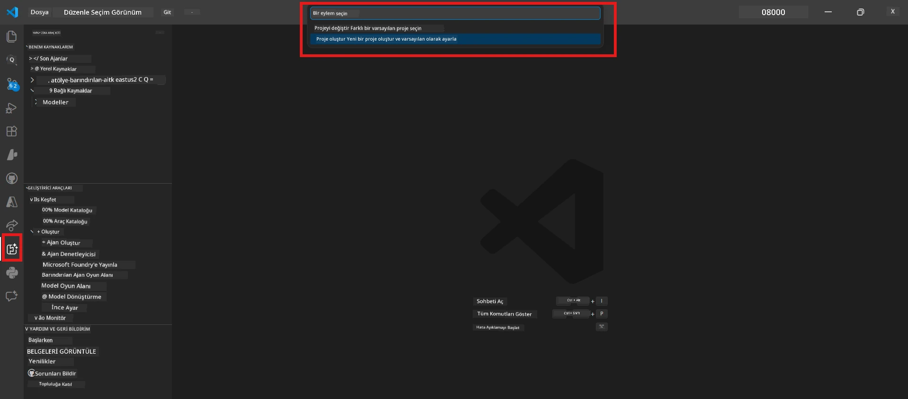

# Modül 0 - Giriş

⏱️ ~10 dakika

> [!WARNING]
> **Önizleme ve Sınırlamalar:** [Barındırılan Ajanlar](https://learn.microsoft.com/azure/foundry/agents/concepts/hosted-agents) şu anda **genel önizleme** aşamasındadır - üretim iş yükleri için önerilmez. Bu atölye çalışmasında gösterilen bazı özellikler, hizmet GA aşamasına ilerledikçe değişebilir.

## Ne inşa edeceksiniz

Bu laboratuvarda, Laboratuvar 01'den tek ajan becerilerini genişleterek **çoklu ajan iş akışı** - Özgeçmiş → İş Uygunluk Değerlendiricisi oluşturacaksınız.

Bir **özgeçmiş** ve bir **iş tanımı** yapıştırırsınız. Dört özel ajan girdiyi sırasıyla işler, ardından şunları döndürür:
- Bir uyum puanı (0–100 puanlama dökümü ile)
- Bir beceri ve sertifika boşluğu listesi
- Her boşluk için gerçek Microsoft Learn bağlantıları içeren kişiselleştirilmiş bir öğrenme yol haritası

**İş akışı şunları kullanır:**
- **Microsoft Agent Framework** - `WorkflowBuilder` ile sıralı boru hattı düzenlemesi
- **Foundry Toolkit for VS Code** - iskelet oluşturma, yerel test, dağıtım
- **Bir yapay zeka modeli** (örneğin, `gpt-4.1-mini`) - dört ajan tarafından kullanılır
- **Microsoft Learn MCP sunucusu** - her beceri boşluğu için gerçek öğrenme kaynağı bağlantıları sağlar

---

## Yolunuzu seçin

> ⚠️ **Laboratuvar 01'de kullandığınız aynı yol ile devam edin.**

<details open>
<summary><strong>🅰️ Yol A - Azure bulut (Azure aboneliği gerektirir)</strong></summary>

| | Detaylar |
|---|---|
| **Kimler için?** | Azure aboneliği kullanarak Laboratuvar 01'i tamamladınız |
| **Model** | Foundry üzerinden Azure OpenAI (örneğin `gpt-4.1-mini`) |
| **Kapsanan modüller** | Tüm modüller (00–09) |
| **Buluta dağıtım?** | ✅ Evet - tam uçtan uca dağıtım |

</details>

<details open>
<summary><strong>🅱️ Yol B - Foundry Yerel (Azure aboneliği gerekli değil)</strong></summary>

| | Detaylar |
|---|---|
| **Kimler için?** | Foundry Yerel kullanarak Laboratuvar 01'i tamamladınız |
| **Model** | Foundry Yerel (ücretsiz, makinenizde çalışır) |
| **Kapsanan modüller** | Modüller 00–05 (06–07 atlanır - dağıtım & bulut doğrulama) |
| **Buluta dağıtım?** | ❌ Hayır - sadece Agent Inspector ile yerel test |

</details>

---

## Laboratuvar 01 kontrolü

Laboratuvar 02, doğrudan Laboratuvar 01 üzerine inşa edilir. Buraya başlamadan önce Laboratuvar 01'i tamamlayın.

Henüz Laboratuvar 01'i yapmadınız mı? Buradan başlayın: [Lab 01 - Giriş](../../lab01-single-agent/docs/00-prerequisites.md)

<details open>
<summary><strong>🅰️ Yol A - Azure bulut</strong></summary>

```powershell
az account show --query "{name:name, id:id}" --output table
```

Eğer başarısız olursa, `az login` komutunu çalıştırın. Ardından VS Code'da kontrol edin:

1. `Ctrl+Shift+P` → **Foundry Toolkit** yazın → komutların göründüğünü onaylayın.
2. **Foundry Toolkit** simgesine tıklayın → projeniz ve dağıtılan model **Başarılı** olarak görünür.



> **RBAC:** Laboratuvar 01'de **Foundry Kullanıcısı** rolünü atadınız. Yeniden atamanız gerekirse, bkz: [Laboratuvar 01, Modül 1](../../lab01-single-agent/docs/01-setup.md#deploy-a-model--assign-rbac). Rol önceden **Azure AI Kullanıcısı** olarak adlandırılıyordu - aynı izinler.

</details>

<details open>
<summary><strong>🅱️ Yol B - Foundry Yerel</strong></summary>

```powershell
Invoke-WebRequest -Uri "http://localhost:5273/v1/health" -UseBasicParsing | Select-Object StatusCode
```

Beklenen: `StatusCode: 200`. Değilse, Foundry Toolkit kenar çubuğundan Foundry Yerel'i yeniden başlatın.

> Tüm çıkarımlar makinenizde yapılır. Tek dışa giden çağrı MCP aracının `https://learn.microsoft.com/api/mcp` adresine yaptığı çağrıdır.

</details>

---

## Laboratuvar 02'de yenilikler

| | Laboratuvar 01 | Laboratuvar 02 |
|--|--------|--------|
| Ajanlar | 1 | 4 (WorkflowBuilder ile zincirlenmiş) |
| Iskelet şablonu | Temel - Agent Framework | İş Akışları - Agent Framework |
| Yeni paket | - | `mcp` |
| Düzenleme | Tek konuşmalı ajan | Sıralı boru hattı (WorkflowBuilder) |
| Yeni araç | - | `search_microsoft_learn_for_plan` (MCP) |

---

**Sonraki:** [01 - Mimariyi Anlamak →](01-understand-multi-agent.md)

---

<!-- CO-OP TRANSLATOR DISCLAIMER START -->
**Feragatname**:
Bu belge, AI çeviri hizmeti [Co-op Translator](https://github.com/Azure/co-op-translator) kullanılarak çevrilmiştir. Doğruluk için çaba sarf etsek de, otomatik çevirilerin hata veya yanlışlık içerebileceğini lütfen unutmayınız. Orijinal belge, kendi dilinde yetkili kaynak olarak kabul edilmelidir. Kritik bilgiler için profesyonel insan çevirisi önerilir. Bu çevirinin kullanımı sonucu ortaya çıkabilecek yanlış anlamalardan veya yanlış yorumlamalardan sorumlu değiliz.
<!-- CO-OP TRANSLATOR DISCLAIMER END -->