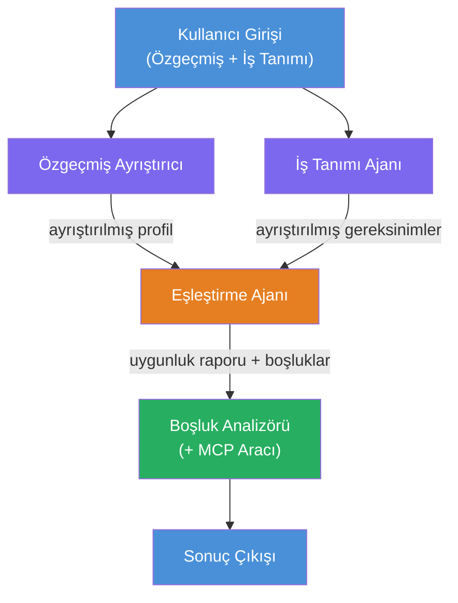
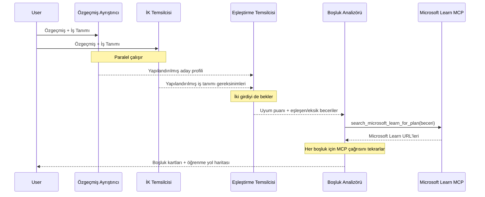
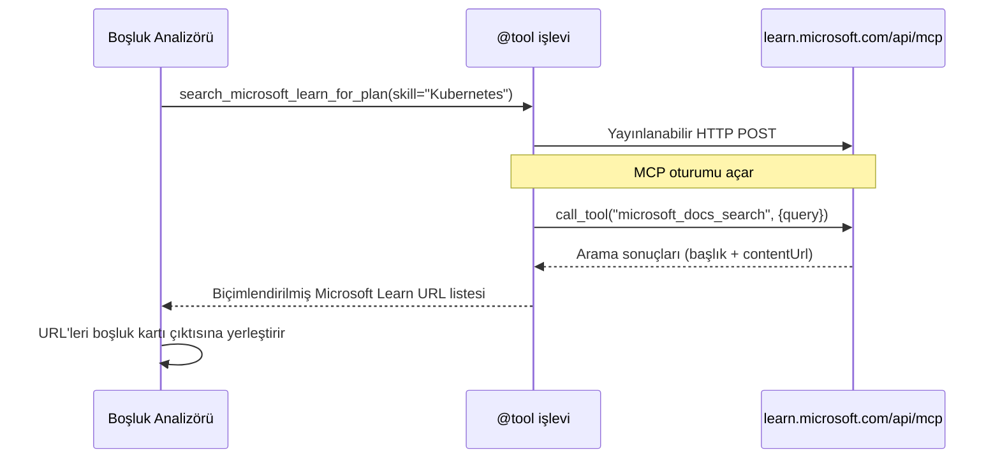

# Modül 1 - Çoklu Ajan Mimarisi Anlama

Bu modülde, herhangi bir kod yazmadan önce Özgeçmiş → İş Uygunluğu Değerlendiricisi mimarisini öğrenirsiniz. Orkestrasyon grafiğini, ajan rollerini ve veri akışını anlamak, [çoklu ajan iş akışlarının](https://learn.microsoft.com/azure/architecture/ai-ml/idea/multiple-agent-workflow-automation) hata ayıklaması ve genişletilmesi için kritiktir.

---

## Çözdüğü problem

Bir özgeçmişi iş tanımıyla eşleştirmek birden çok ayrı beceri gerektirir:

1. **Ayrıştırma** - Yapısal olmayan metinden (özgeçmiş) yapısal veri çıkarımı
2. **Analiz** - İş tanımından gereksinimlerin çıkarımı
3. **Karşılaştırma** - İkisi arasındaki uyumu puanlama
4. **Planlama** - Boşlukları kapatmak için öğrenme yol haritası oluşturma

Tek bir ajanın tüm dört görevi bir komutta yapması genellikle:
- Eksik çıkarım (puanlamaya geçmek için ayrıştırmayı aceleyle yapar)
- Yüzeysel puanlama (kanıta dayalı ayrıntı yok)
- Genel yol haritaları (belirli boşluklara özgü değil)

Bunu **dört uzmanlaşmış ajana** bölerek, her biri kendine özel talimatlarla kendi görevine odaklanır ve her aşamada daha yüksek kaliteli çıktı üretir.

---

## Dört ajan

Her ajan, `AzureAIAgentClient.as_agent()` ile oluşturulan tam bir [Microsoft Foundry](https://learn.microsoft.com/azure/foundry/agents/concepts/hosted-agents) ajanıdır. Aynı model dağıtımını paylaşırlar ancak farklı talimatlara ve (isteğe bağlı olarak) farklı araçlara sahiptirler.

| # | Ajan Adı | Rol | Girdi | Çıktı |
|---|-----------|------|-------|--------|
| 1 | **ResumeParser** | Özgeçmiş metninden yapısal profili çıkarır | Ham özgeçmiş metni (kullanıcıdan) | Aday Profili, Teknik Yetenekler, Sosyal Yetenekler, Sertifikalar, Alan Deneyimi, Başarılar |
| 2 | **JobDescriptionAgent** | İş tanımından yapısal gereksinimleri çıkarır | Ham iş tanımı metni (kullanıcıdan, ResumeParser üzerinden yönlendirilir) | Rol Genel Bakış, Gerekli Yetenekler, Tercih Edilen Yetenekler, Deneyim, Sertifikalar, Eğitim, Sorumluluklar |
| 3 | **MatchingAgent** | Kanıta dayalı uygunluk puanı hesaplar | ResumeParser + JobDescriptionAgent çıktıları | Uygunluk Skoru (0-100 arası detaylı), Eşleşen Yetenekler, Eksik Yetenekler, Boşluklar |
| 4 | **GapAnalyzer** | Kişiselleştirilmiş öğrenme yol haritası oluşturur | MatchingAgent çıktısı | Yetenek başına boşluk kartları, Öğrenme Sırası, Zaman Çizelgesi, Microsoft Learn kaynakları |

---

## Orkestrasyon grafiği

İş akışı **paralel fan-out** ardından **ardışık birleştirme** kullanır:


> **Haftalar:** Mor = paralel ajanlar, Turuncu = birleştirme noktası, Yeşil = araçlara sahip son ajan

### Veri akışı nasıl işler


1. **Kullanıcı gönderir** bir özgeçmiş ve iş tanımı içeren mesajı.
2. **ResumeParser** tam kullanıcı girdisini alır ve yapısal aday profilini çıkarır.
3. **JobDescriptionAgent** girdiyi paralel alır ve yapısal gereksinimleri çıkarır.
4. **MatchingAgent** hem ResumeParser hem de JobDescriptionAgent çıktısını alır (çalıştırmadan önce ikisinin de tamamlanmasını bekler).
5. **GapAnalyzer** MatchingAgent çıktısını alır ve her boşluk için gerçek öğrenme kaynaklarını almak üzere **Microsoft Learn MCP aracını** çağırır.
6. **Nihai çıktı**, uyum puanı, boşluk kartları ve tam öğrenme yol haritasını içeren GapAnalyzer yanıtıdır.

### Neden paralel fan-out önemlidir

ResumeParser ve JobDescriptionAgent **paralel** çalışır çünkü birbirine bağımlı değildir. Bu:
- Toplam gecikmeyi azaltır (ardışık değil aynı anda çalışır)
- Doğal bir ayrım sağlar (özgeçmiş ayrıştırma ve iş tanımı ayrıştırma bağımsızdır)
- Yaygın bir çoklu ajan modeli gösterir: **fan-out → birleştir → işlem yap**

---

## WorkflowBuilder kodda

Yukarıdaki grafik, `main.py` içindeki [`WorkflowBuilder`](https://learn.microsoft.com/agent-framework/workflows/agents-in-workflows) API çağrılarına şöyle eşlenir:

```python
from agent_framework import WorkflowBuilder

workflow = (
    WorkflowBuilder(
        name="ResumeJobFitEvaluator",
        start_executor=resume_parser,       # Kullanıcı girdisini alan ilk ajan
        output_executors=[gap_analyzer],     # Çıktısı döndürülen son ajan
    )
    .add_edge(resume_parser, jd_agent)      # Özgeçmiş Ayrıştırıcı → İş Tanımı Ajanı
    .add_edge(resume_parser, matching_agent) # Özgeçmiş Ayrıştırıcı → Eşleştirme Ajanı
    .add_edge(jd_agent, matching_agent)      # İş Tanımı Ajanı → Eşleştirme Ajanı
    .add_edge(matching_agent, gap_analyzer)  # Eşleştirme Ajanı → Boşluk Analizörü
    .build()
)
```

**Kenarların anlamı:**

| Kenar | Anlamı |
|------|--------------|
| `resume_parser → jd_agent` | JD Agent, ResumeParser'ın çıktısını alır |
| `resume_parser → matching_agent` | MatchingAgent, ResumeParser çıktısını alır |
| `jd_agent → matching_agent` | MatchingAgent ayrıca JD Agent çıktısını da alır (ikisini bekler) |
| `matching_agent → gap_analyzer` | GapAnalyzer, MatchingAgent çıktısını alır |

`matching_agent`'in **iki gelen kenarı** (`resume_parser` ve `jd_agent`) olduğu için, çerçeve ikisinin tamamlanmasını bekleyip ardından Matching Agent'i çalıştırır.

---

## MCP aracı

GapAnalyzer ajanının bir aracı vardır: `search_microsoft_learn_for_plan`. Bu, Microsoft Learn API'yi çağıran bir **[MCP aracı](https://learn.microsoft.com/agent-framework/agents/tools/hosted-mcp-tools)**dır ve seçilmiş öğrenme kaynaklarını getirir.

### Nasıl çalışır

```python
@tool
async def search_microsoft_learn_for_plan(
    skill: str, role: str = "", max_results: int = 5
) -> str:
    """Search Microsoft Learn MCP and return curated official links."""
    # Streamable HTTP üzerinden https://learn.microsoft.com/api/mcp adresine bağlanır
    # MCP sunucusunda 'microsoft_docs_search' aracını çağırır
    # Microsoft Learn URL'lerinin biçimlendirilmiş listesini döner
```

### MCP çağrı akışı


1. GapAnalyzer bir yetenek için öğrenme kaynağı gerektiğine karar verir (örneğin, "Kubernetes")
2. Çerçeve `search_microsoft_learn_for_plan(skill="Kubernetes")` çağrısını yapar
3. Fonksiyon, `https://learn.microsoft.com/api/mcp` adresine bir [Streamable HTTP](https://learn.microsoft.com/agent-framework/agents/tools/hosted-mcp-tools) bağlantısı açar
4. MCP sunucusundaki [MCP aracı](https://learn.microsoft.com/azure/foundry/agents/how-to/tools/model-context-protocol) `microsoft_docs_search` aracını çağırır
5. MCP sunucusu arama sonuçlarını döner (başlık + URL)
6. Fonksiyon sonuçları formatlar ve string olarak döner
7. GapAnalyzer dönen URL'leri boşluk kartlarında kullanır

### Beklenen MCP günlükleri

Araç çalıştığında şu tür günlük girdilerini görürsünüz:

```
GET https://learn.microsoft.com/api/mcp → 405 (Method Not Allowed)
POST https://learn.microsoft.com/api/mcp → 200
DELETE https://learn.microsoft.com/api/mcp → 405 (Method Not Allowed)
```

**Bunlar normaldir.** MCP istemcisi başlatma sırasında GET ve DELETE sorguları yapar - 405 dönmesi beklenen davranıştır. Asıl araç çağrısı POST yapar ve 200 döner. Sadece POST çağrıları başarısız olursa endişelenin.

---

## Ajan oluşturma deseni

Her ajan, **[`AzureAIAgentClient.as_agent()`](https://learn.microsoft.com/python/api/overview/azure/ai-agents-readme) asenkron bağlam yöneticisi** kullanılarak oluşturulur. Bu, ajanların otomatik temizliği için Foundry SDK desenidir:

```python
async with (
    get_credential() as credential,
    AzureAIAgentClient(
        project_endpoint=PROJECT_ENDPOINT,
        model_deployment_name=MODEL_DEPLOYMENT_NAME,
        credential=credential,
    ).as_agent(
        name="ResumeParser",
        instructions=RESUME_PARSER_INSTRUCTIONS,
    ) as resume_parser,
    # ... her ajan için tekrarla ...
):
    # Burada 4 ajanın tamamı mevcut
    workflow = create_workflow(resume_parser, jd_agent, matching_agent, gap_analyzer)
```

**Ana noktalar:**
- Her ajana kendi `AzureAIAgentClient` örneği verilir (SDK, ajan adının istemciye özel olmasını ister)
- Tüm ajanlar aynı `credential`, `PROJECT_ENDPOINT` ve `MODEL_DEPLOYMENT_NAME`'i paylaşır
- `async with` bloğu sunucu kapanırken tüm ajanların temizlenmesini garanti eder
- GapAnalyzer ayrıca `tools=[search_microsoft_learn_for_plan]` alır

---

## Sunucu başlatma

Ajanlar oluşturulup iş akışı kurulduktan sonra, sunucu başlatılır:

```python
from azure.ai.agentserver.agentframework import from_agent_framework

agent = create_workflow(resume_parser, jd_agent, matching_agent, gap_analyzer)
await from_agent_framework(agent).run_async()
```

`from_agent_framework()` iş akışını HTTP sunucusu olarak sarar ve `/responses` uç noktasını 8088 portunda açar. Bu Lab 01 ile aynı modeldir, ancak "ajan" artık tüm [iş akışı grafiğidir](https://learn.microsoft.com/agent-framework/workflows/as-agents).

---

### Kontrol listesi

- [ ] 4 ajan mimarisini ve her ajanın görevini anlıyorsunuz
- [ ] Veri akışını takip edebiliyorsunuz: Kullanıcı → ResumeParser → (paralel) JD Agent + MatchingAgent → GapAnalyzer → Çıktı
- [ ] MatchingAgent neden hem ResumeParser hem de JD Agent'i bekliyor anlıyorsunuz (iki gelen kenar var)
- [ ] MCP aracını anlıyorsunuz: ne yaptığı, nasıl çağrıldığı ve GET 405 günlüklerinin normal olduğunu
- [ ] `AzureAIAgentClient.as_agent()` desenini ve her ajanın neden kendi istemci örneğine sahip olduğunu anlıyorsunuz
- [ ] `WorkflowBuilder` kodunu okuyup görsel grafikle eşleştirebiliyorsunuz

---

**Önceki:** [00 - Ön Koşullar](00-prerequisites.md) · **Sonraki:** [02 - Çoklu Ajan Projesini Hazırlama →](02-scaffold-multi-agent.md)

---

<!-- CO-OP TRANSLATOR DISCLAIMER START -->
**Feragatname**:  
Bu belge, AI çeviri hizmeti [Co-op Translator](https://github.com/Azure/co-op-translator) kullanılarak çevrilmiştir. Doğruluk için çaba göstersek de, otomatik çevirilerin hatalar veya yanlışlıklar içerebileceğini lütfen unutmayın. Orijinal belge, kendi dilinde yetkili kaynak olarak kabul edilmelidir. Kritik bilgiler için profesyonel insan çevirisi önerilir. Bu çevirinin kullanımıyla ortaya çıkabilecek herhangi bir yanlış anlama veya yorumlama için sorumluluk kabul edilmemektedir.
<!-- CO-OP TRANSLATOR DISCLAIMER END -->