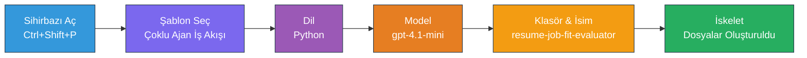
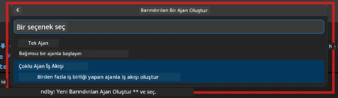

# Modül 2 - Çoklu Ajan Projesini İskeletlendirme

Bu modülde, [Microsoft Foundry uzantısını](https://marketplace.visualstudio.com/items?itemName=TeamsDevApp.vscode-ai-foundry) kullanarak **çoklu ajan iş akışı projesi oluşturursunuz**. Uzantı, tüm proje yapısını - `agent.yaml`, `main.py`, `Dockerfile`, `requirements.txt`, `.env` ve hata ayıklama yapılandırmasını - oluşturur. Daha sonra bu dosyaları Modül 3 ve 4'te özelleştirirsiniz.

> **Not:** Bu laboratuvarda `PersonalCareerCopilot/` klasörü, özelleştirilmiş çoklu ajan projesinin tam ve çalışan bir örneğidir. Ya sıfırdan bir proje oluşturabilir (öğrenmek için tavsiye edilir) ya da mevcut kodu doğrudan inceleyebilirsiniz.

---

## Adım 1: Barındırılan Ajan Oluşturma sihirbazını açın


1. `Ctrl+Shift+P` tuşlarına basarak **Komut Paletini** açın.
2. Yazın: **Microsoft Foundry: Create a New Hosted Agent** ve seçin.
3. Barındırılan ajan oluşturma sihirbazı açılır.

> **Alternatif:** Aktivite Çubuğunda **Microsoft Foundry** simgesine tıklayın → **Agents** yanındaki **+** simgesine tıklayın → **Create New Hosted Agent**.

---

## Adım 2: Çoklu Ajan İş Akışı şablonunu seçin

Sihirbaz, bir şablon seçmenizi ister:

| Şablon | Açıklama | Ne zaman kullanılır |
|--------|----------|---------------------|
| Tek Ajan | Talimatlar ve isteğe bağlı araçlara sahip tek bir ajan | Lab 01 |
| **Çoklu Ajan İş Akışı** | İşbirliği yapan birden çok ajan, WorkflowBuilder ile | **Bu laboratuvar (Lab 02)** |

1. **Çoklu Ajan İş Akışı** seçin.
2. **İleri**'ye tıklayın.



---

## Adım 3: Programlama dilini seçin

1. **Python** seçin.
2. **İleri**'ye tıklayın.

---

## Adım 4: Modelinizi seçin

1. Sihirbaz, Foundry projenizde dağıtılmış modelleri gösterir.
2. Lab 01'de kullandığınız aynı modeli seçin (örneğin, **gpt-4.1-mini**).
3. **İleri**'ye tıklayın.

> **İpucu:** [`gpt-4.1-mini`](https://learn.microsoft.com/azure/foundry/foundry-models/concepts/models-sold-directly-by-azure#gpt-41-series) geliştirme için önerilir - hızlıdır, ucuzdur ve çoklu ajan iş akışlarını iyi yönetir. Daha kaliteli çıktı istiyorsanız üretim için `gpt-4.1` versiyonuna geçiş yapabilirsiniz.

---

## Adım 5: Klasör konumu ve ajan adını seçin

1. Bir dosya diyalogu açılır. Hedef klasörü seçin:
   - Atölye deposunu takip ediyorsanız: `workshop/lab02-multi-agent/` klasörüne gidin ve yeni bir alt klasör oluşturun
   - Sıfırdan başlıyorsanız: herhangi bir klasör seçin
2. Barındırılan ajan için bir **isim** girin (örneğin, `resume-job-fit-evaluator`).
3. **Oluştur**'a tıklayın.

---

## Adım 6: İskeletlendirme tamamlanana kadar bekleyin

1. VS Code yeni bir pencere açar (veya mevcut pencere güncellenir) ve iskeletlendirilmiş proje görünür.
2. Aşağıdaki dosya yapısını görmelisiniz:

```
resume-job-fit-evaluator/
├── .env                ← Environment variables (placeholders)
├── .vscode/
│   └── launch.json     ← Debug configuration
├── agent.yaml          ← Agent definition (kind: hosted)
├── Dockerfile          ← Container configuration
├── main.py             ← Multi-agent workflow code (scaffold)
└── requirements.txt    ← Python dependencies
```

> **Atölye notu:** Atölye deposunda `.vscode/` klasörü **çalışma alanı kökünde** olup paylaşılan `launch.json` ve `tasks.json` içerir. Hem Lab 01 hem Lab 02 için hata ayıklama yapılandırmaları dahil edilmiştir. F5 tuşuna basınca açılan listeden **"Lab02 - Multi-Agent"** seçin.

---

## Adım 7: İskeletlenen dosyaları anlayın (çoklu ajan özellikleri)

Çoklu ajan iskeleti, tek ajan iskeletinden birkaç temel yönden farklıdır:

### 7.1 `agent.yaml` - Ajan tanımı

```yaml
kind: hosted
name: resume-job-fit-evaluator
description: >
  A multi-agent workflow that evaluates resume-to-job fit.
metadata:
  authors:
    - Microsoft
  tags:
    - Multi-Agent Workflow
    - Resume Evaluator
protocols:
  - protocol: responses
    version: v1
environment_variables:
  - name: PROJECT_ENDPOINT
    value: ${PROJECT_ENDPOINT}
  - name: MODEL_DEPLOYMENT_NAME
    value: ${MODEL_DEPLOYMENT_NAME}
```

**Lab 01’den önemli fark:** `environment_variables` bölümü, MCP uç noktaları veya diğer araç konfigürasyonları için ek değişkenler içerebilir. `name` ve `description` çoklu ajan kullanım durumunu yansıtır.

### 7.2 `main.py` - Çoklu ajan iş akışı kodu

İskelet şunları içerir:
- **Birden çok ajan için talimat dizeleri** (her ajan için bir sabit)
- **Birden çok [`AzureAIAgentClient.as_agent()`](https://learn.microsoft.com/python/api/overview/azure/ai-agents-readme) bağlam yöneticisi** (her ajan için bir tane)
- **Ajansları birbirine bağlamak için [`WorkflowBuilder`](https://learn.microsoft.com/agent-framework/workflows/agents-in-workflows)**
- İş akışını HTTP uç noktası olarak sunmak için **`from_agent_framework()`**

```python
from agent_framework import WorkflowBuilder, tool
from agent_framework.azure import AzureAIAgentClient
from azure.ai.agentserver.agentframework import from_agent_framework
```

Lab 01’e kıyasla eklenen [`WorkflowBuilder`](https://learn.microsoft.com/agent-framework/workflows/agents-in-workflows) ithalatı yenidir.

### 7.3 `requirements.txt` - Ek bağımlılıklar

Çoklu ajan projesi, Lab 01’de kullanılan temel paketlerin yanı sıra MCP ile ilgili paketleri de içerir:

```
agent-framework-azure-ai==1.0.0rc3
agent-framework-core==1.0.0rc3
azure-ai-agentserver-agentframework==1.0.0b16
azure-ai-agentserver-core==1.0.0b16
debugpy
agent-dev-cli --pre
```

> **Önemli sürüm notu:** `agent-dev-cli` paketinin en son önizleme sürümünü yüklemek için `requirements.txt` içinde `--pre` bayrağı gereklidir. Bu, `agent-framework-core==1.0.0rc3` ile Agent Inspector uyumluluğu için zorunludur. Sürüm detayları için [Modül 8 - Sorun Giderme](08-troubleshooting.md) bölümüne bakın.

| Paket | Sürüm | Amaç |
|---------|---------|---------|
| [`agent-framework-azure-ai`](https://learn.microsoft.com/agent-framework/overview/) | `1.0.0rc3` | [Microsoft Agent Framework](https://github.com/microsoft/agent-framework) için Azure AI entegrasyonu |
| [`agent-framework-core`](https://learn.microsoft.com/agent-framework/overview/) | `1.0.0rc3` | Çekirdek çalışma zamanı (WorkflowBuilder dahil) |
| `azure-ai-agentserver-agentframework` | `1.0.0b16` | Barındırılan ajan sunucusu çalışma zamanı |
| `azure-ai-agentserver-core` | `1.0.0b16` | Temel ajan sunucu soyutlamaları |
| `debugpy` | en son | Python hata ayıklama (VS Code'da F5) |
| `agent-dev-cli` | `--pre` | Yerel geliştirme CLI + Agent Inspector arka uç |

### 7.4 `Dockerfile` - Lab 01 ile aynı

Dockerfile, Lab 01 ile aynıdır - dosyaları kopyalar, `requirements.txt` içinden bağımlılıkları kurar, 8088 portunu açar ve `python main.py` çalıştırır.

```dockerfile
FROM python:3.14-slim
WORKDIR /app
COPY ./ .
RUN pip install --upgrade pip && \
    if [ -f requirements.txt ]; then \
        pip install -r requirements.txt; \
    else \
      echo "No requirements.txt found" >&2; exit 1; \
    fi
EXPOSE 8088
CMD ["python", "main.py"]
```

---

### Kontrol Noktası

- [ ] İskelet oluşturma sihirbazı tamamlandı → yeni proje yapısı görünür durumdadır
- [ ] Tüm dosyalar gözüküyor: `agent.yaml`, `main.py`, `Dockerfile`, `requirements.txt`, `.env`
- [ ] `main.py` içinde `WorkflowBuilder` ithali bulunuyor (çoklu ajan şablonunun seçildiğini doğrular)
- [ ] `requirements.txt` içinde hem `agent-framework-core` hem de `agent-framework-azure-ai` var
- [ ] Çoklu ajan iskeletinin tek ajan iskeletinden farkını anladınız (birden çok ajan, WorkflowBuilder, MCP araçları)

---

**Önceki:** [01 - Çoklu Ajan Mimarisi Anlama](01-understand-multi-agent.md) · **Sonraki:** [03 - Ajanlar ve Ortamı Yapılandırma →](03-configure-agents.md)

---

<!-- CO-OP TRANSLATOR DISCLAIMER START -->
**Feragatname**:  
Bu belge, AI çeviri hizmeti [Co-op Translator](https://github.com/Azure/co-op-translator) kullanılarak çevrilmiştir. Doğruluk için çaba gösterilse de, otomatik çevirilerin hatalar veya yanlışlıklar içerebileceğini lütfen unutmayın. Orijinal belge, kendi dilinde yetkili kaynak olarak kabul edilmelidir. Kritik bilgiler için profesyonel insan çevirisi önerilir. Bu çevirinin kullanılması sonucu ortaya çıkabilecek yanlış anlamalar veya yanlış yorumlamalar için sorumluluk kabul edilmemektedir.
<!-- CO-OP TRANSLATOR DISCLAIMER END -->