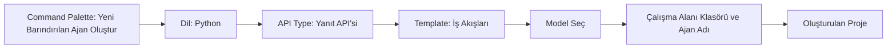
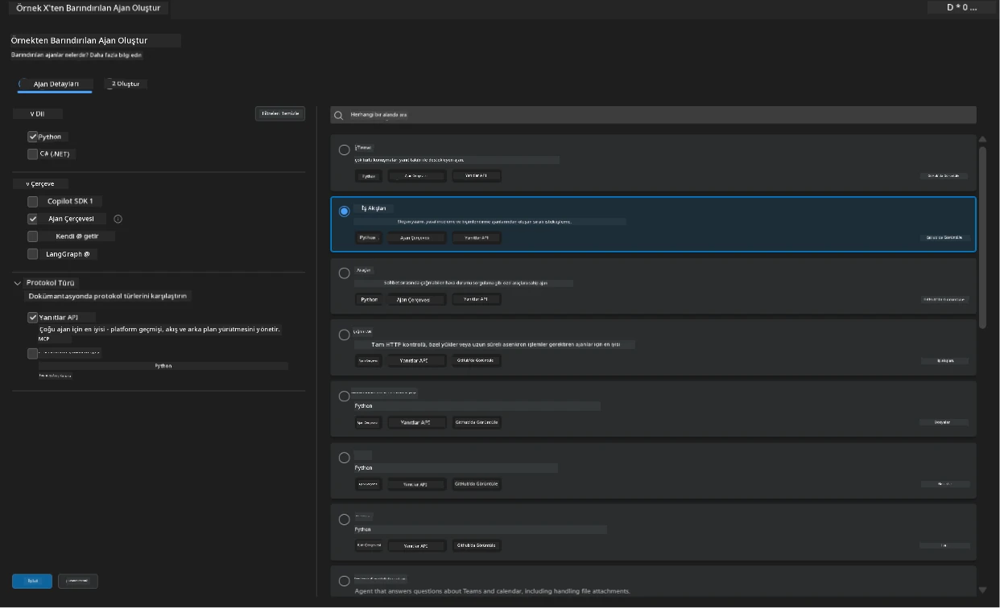
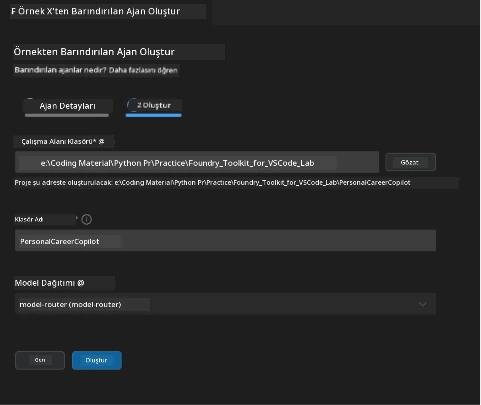

# Modül 2 - Çok Ajanlı Projenin İskeletini Kurma

⏱️ ~5 dakika

Bu modülde, [Foundry Toolkit for VS Code](https://aka.ms/foundrytk) kullanarak **çok ajanlı bir projenin iskeletini kurarsınız**. Sihirbaz, `agent.yaml`, `main.py`, `Dockerfile`, `requirements.txt`, `.env` ve VS Code hata ayıklama yapılandırmasını oluşturur - böylece Modül 3'te 4-ajandan oluşan iş akışını kurmaya odaklanabilirsiniz.

> **Ana kavram:** İskelet, tek bir ajan içeren çalışan bir taslak yapıdır. Yer tutucu mantığı, Modül 3'te `WorkflowBuilder` grafiği ile değiştirirsiniz. Standart kodu sıfırdan yazmazsınız.

> **Referans uygulama:** [`PersonalCareerCopilot/`](../../../../../workshop/lab02-multi-agent/PersonalCareerCopilot) tam çalışan bir örnektir. İlerlerken kendi çalışmanızla karşılaştırmak için kullanabilirsiniz.

### İskelet Sihirbazı Akışı


```mermaid
flowchart LR
    A[Command Palette: Yeni Barındırılan Ajan Oluştur] --> B[Dil: Python]
    B --> C[API Type: Yanıt API'si]
    C --> D[Template: İş Akışları]
    D --> E[Model Seç]
    E --> F[Çalışma Alanı Klasörü ve Ajan Adı]
    F --> G[Oluşturulan Proje]
```

---

## Adım 1: Create Hosted Agent sihirbazını açın

1. **Komut Paleti**'ni açmak için `Ctrl+Shift+P` tuşlarına basın.
2. Yazın: **Foundry Toolkit: Create a New Hosted Agent** ve seçin.
3. Sihirbaz, **Agent Details** sekmesinde açılır.

> **Alternatif:** Aktivite Çubuğunda **Foundry Toolkit** simgesine tıklayın → **Hosted Agents** yanındaki **+** simgesine tıklayın → **Create New Hosted Agent**.

---

## Adım 2: Ayarları seçin



1. Sol menü/ayarlar bölümünde aşağıdakileri seçin:

| Menü | Seçim | Notlar |
|--------|-----------|-------|
| **Dil** | Python | C# (.NET) da destekleniyor |
| **Çerçeve (Framework)** | Agent Framework | `Agent`, `AgentExecutor`, `WorkflowBuilder` sağlar |
| **API tipi** | Response API | `POST /responses` - platform tarafından yönetilen geçmiş, akış desteği |
| **Şablon** | **Workflows** | İstekleri sırayla birden fazla ajan üzerinden işler |

2. Seçiminizi yaptıktan sonra **Next** tuşuna basın



3. Sonraki pencerede aşağıdakileri seçin:

| Menü | Seçim | Notlar |
|--------|-----------|-------|
| **Çalışma alanı klasörü** | Hedef klasöre göz atın | Örnek: bu depoda `workshop/lab02-multi-agent/` |
| **Ajan adı** | `PersonalCareerCopilot` | Bu, proje dizini adı olur |
| **Model Dağıtımı** | Dağıttığınız modeli seçin | Örnek: Lab 01'den `gpt-4.1-mini` |

4. Projeyi iskeletlemek için **Create** tuşuna basın. VS Code dosyaları oluşturur ve klasörü açar.

> **İpucu:** [`gpt-4.1-mini`](https://learn.microsoft.com/azure/foundry/foundry-models/concepts/models-sold-directly-by-azure#gpt-41-series) çok ajanlı geliştirme için hız ve kaliteyi iyi dengeler.

---

## Adım 3: Oluşturulan projeyi inceleyin

İskelet oluşturduktan sonra, Gezginde (`Ctrl+Shift+E`) şu dosyaları gördüğünüzü doğrulayın:

```
📂 <your-agent-name>/
├── .azdignore          ← Files excluded from Azure Developer CLI deployments
├── .dockerignore       ← Files excluded from Docker builds
├── .env                ← Environment variables (placeholders - fill in Module 3)
├── .vscode/
│   ├── launch.json     ← Debug config (F5 → run + Agent Inspector)
│   └── tasks.json      ← VS Code task definitions
├── agent.yaml          ← Agent definition (kind: hosted, protocol: responses)
├── Dockerfile          ← Container config for deployment
├── main.py             ← Stub agent entry point (replace with WorkflowBuilder in Module 3)
└── requirements.txt    ← Python dependencies
```

> **Önemli:** Bu iskeletlenen klasörü doğrudan VS Code'da açın ki `.vscode/launch.json` ve `tasks.json` F5 hata ayıklama için doğru şekilde uygulansın.

### Önemli dosyalar açıklandı

| Dosya | Amaç |
|------|---------|
| `agent.yaml` | `kind: hosted` beyan eder, ortam değişkenlerini eşler, `/responses` protokolünü tanımlar |
| `main.py` | Taslak: tek bir `FoundryChatClient` → `Agent` → `ResponsesHostServer`. Modül 3'te 4 ajan + `WorkflowBuilder` ile değiştirilir |
| `Dockerfile` | `python:3.12-slim`, `requirements.txt` yükler, 8088 portunu açar, `python main.py` çalıştırır |
| `requirements.txt` | `agent-framework-foundry`, `agent-framework-foundry-hosting`, `mcp<2,>=1.24.0`, `debugpy` |

> **Referans:** Tam içerik için [`PersonalCareerCopilot/agent.yaml`](../../../../../workshop/lab02-multi-agent/PersonalCareerCopilot/agent.yaml) ve [`PersonalCareerCopilot/requirements.txt`](../../../../../workshop/lab02-multi-agent/PersonalCareerCopilot/requirements.txt) dosyalarına bakın.

---

### ✅ Kontrol Noktası

- [ ] İskelet sihirbazı tamamlandı - yeni proje klasörü Gezginde görünüyor
- [ ] Tüm beklenen dosyalar mevcut: `agent.yaml`, `main.py`, `Dockerfile`, `requirements.txt`, `.env`
- [ ] `agent.yaml` `kind: hosted` ve `protocol: responses` gösteriyor
- [ ] `main.py` `Agent`, `FoundryChatClient`, `ResponsesHostServer` ithal ediyor
- [ ] İskeletlenen klasör VS Code çalışma alanı kökü olarak açık
- [ ] `main.py`'nin bir taslak olduğunu anlıyorsunuz - `WorkflowBuilder` Modül 3'te ekleniyor

---

**Önceki:** [01 - Çok Ajanlı Mimarini Anlama](01-understand-multi-agent.md) · **Sonraki:** [03 - Ajanları & Ortamı Yapılandırma →](03-configure-agents.md)

---

<!-- CO-OP TRANSLATOR DISCLAIMER START -->
**Feragatname**:
Bu belge, AI çeviri hizmeti [Co-op Translator](https://github.com/Azure/co-op-translator) kullanılarak çevrilmiştir. Doğruluk için çaba sarf etsek de, otomatik çevirilerin hata veya yanlışlık içerebileceğini lütfen unutmayınız. Orijinal belge, kendi dilinde yetkili kaynak olarak kabul edilmelidir. Kritik bilgiler için profesyonel insan çevirisi önerilir. Bu çevirinin kullanımı sonucu ortaya çıkabilecek yanlış anlamalardan veya yanlış yorumlamalardan sorumlu değiliz.
<!-- CO-OP TRANSLATOR DISCLAIMER END -->