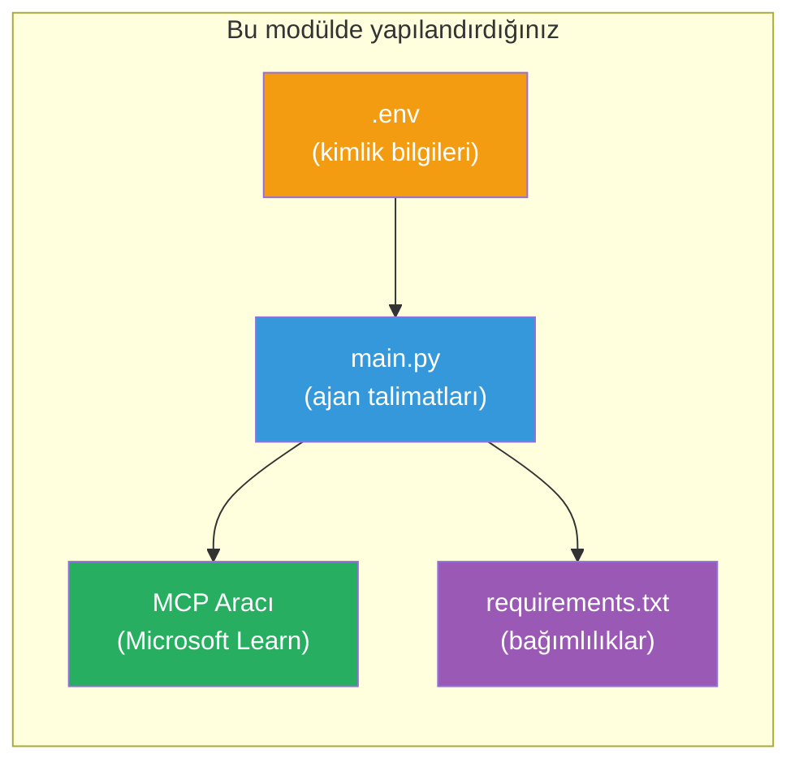

# Modül 3 - Ajanları, MCP Aracını ve Ortamı Yapılandırma

Bu modülde, iskelelenmiş çok ajanlı projeyi özelleştireceksiniz. Dört ajanın tümü için talimatlar yazacak, Microsoft Learn için MCP aracını kuracak, ortam değişkenlerini yapılandıracak ve bağımlılıkları yükleyeceksiniz.


> **Referans:** Tam çalışan kod, [`PersonalCareerCopilot/main.py`](../../../../../workshop/lab02-multi-agent/PersonalCareerCopilot/main.py) dosyasında bulunmaktadır. Kendi projenizi oluştururken bunu referans olarak kullanabilirsiniz.

---

## Adım 1: Ortam değişkenlerini yapılandırma

1. Proje kök dizininizdeki **`.env`** dosyasını açın.
2. Foundry proje detaylarınızı doldurun:

   ```env
   PROJECT_ENDPOINT=https://<your-account>.services.ai.azure.com/api/projects/<your-project>
   MODEL_DEPLOYMENT_NAME=gpt-4.1-mini
   ```

3. Dosyayı kaydedin.

### Bu değerler nereden bulunur

| Değer | Nasıl bulunur |
|-------|---------------|
| **Proje uç noktası** | Microsoft Foundry yan çubuğu → projenize tıklayın → detay görünümündeki uç nokta URL'si |
| **Model dağıtım adı** | Foundry yan çubuğu → projeyi genişletin → **Modeller + uç noktalar** → dağıtılmış modelin yanındaki isim |

> **Güvenlik:** `.env` dosyasını sürüm kontrolüne asla dahil etmeyin. Eğer henüz eklenmemişse `.gitignore` dosyasına ekleyin.

### Ortam değişkeni eşlemesi

Çok ajanlı `main.py`, hem standart hem de atölye özelindeki ortam değişkeni isimlerini okur:

```python
PROJECT_ENDPOINT = os.getenv("AZURE_AI_PROJECT_ENDPOINT") or os.getenv("PROJECT_ENDPOINT")
MODEL_DEPLOYMENT_NAME = os.getenv(
    "AZURE_AI_MODEL_DEPLOYMENT_NAME",
    os.getenv("MODEL_DEPLOYMENT_NAME", "gpt-4.1-mini"),
)
MICROSOFT_LEARN_MCP_ENDPOINT = os.getenv(
    "MICROSOFT_LEARN_MCP_ENDPOINT", "https://learn.microsoft.com/api/mcp"
)
```

MCP uç noktası anlamlı bir varsayılan değere sahiptir - `.env` içinde belirtmek zorunda değilsiniz, yalnızca üzerine yazmak isterseniz.

---

## Adım 2: Ajan talimatlarını yazma

Bu en kritik adımdır. Her ajanın rolünü, çıktı biçimini ve kurallarını tanımlayan dikkatle hazırlanmış talimatlara ihtiyacı vardır. `main.py` dosyasını açın ve talimat sabitlerini oluşturun (ya da değiştirin).

### 2.1 Özgeçmiş Ayrıştırıcı Ajan

```python
RESUME_PARSER_INSTRUCTIONS = """\
You are the Resume Parser.
Extract resume text into a compact, structured profile for downstream matching.

Output exactly these sections:
1) Candidate Profile
2) Technical Skills (grouped categories)
3) Soft Skills
4) Certifications & Awards
5) Domain Experience
6) Notable Achievements

Rules:
- Use only explicit or strongly implied evidence.
- Do not invent skills, titles, or experience.
- Keep concise bullets; no long paragraphs.
- If input is not a resume, return a short warning and request resume text.
"""
```

**Neden bu bölümler?** MatchingAgent, puanlama yapmak için yapılandırılmış verilere ihtiyaç duyar. Tutarlı bölümler, ajanlar arası iş aktarımını güvenilir kılar.

### 2.2 İş Tanımı Ajanı

```python
JOB_DESCRIPTION_INSTRUCTIONS = """\
You are the Job Description Analyst.
Extract a structured requirement profile from a JD.

Output exactly these sections:
1) Role Overview
2) Required Skills
3) Preferred Skills
4) Experience Required
5) Certifications Required
6) Education
7) Domain / Industry
8) Key Responsibilities

Rules:
- Keep required vs preferred clearly separated.
- Only use what the JD states; do not invent hidden requirements.
- Flag vague requirements briefly.
- If input is not a JD, return a short warning and request JD text.
"""
```

**Neden zorunlu ve tercih edilen ayrı?** MatchingAgent, her biri için farklı ağırlıklar kullanır (Zorunlu Beceriler = 40 puan, Tercih Edilen Beceriler = 10 puan).

### 2.3 Eşleştirme Ajanı

```python
MATCHING_AGENT_INSTRUCTIONS = """\
You are the Matching Agent.
Compare parsed resume output vs JD output and produce an evidence-based fit report.

Scoring (100 total):
- Required Skills 40
- Experience 25
- Certifications 15
- Preferred Skills 10
- Domain Alignment 10

Output exactly these sections:
1) Fit Score (with breakdown math)
2) Matched Skills
3) Missing Skills
4) Partially Matched
5) Experience Alignment
6) Certification Gaps
7) Overall Assessment

Rules:
- Be objective and evidence-only.
- Keep partial vs missing separate.
- Keep Missing Skills precise; it feeds roadmap planning.
"""
```

**Neden açık puanlama?** Yeniden üretilebilir puanlama, çalıştırmaların karşılaştırılmasını ve sorunların ayıklanmasını sağlar. 100 puanlık ölçek, son kullanıcılar için kolay anlaşılırdır.

### 2.4 Boşluk Analizörü Ajanı

```python
GAP_ANALYZER_INSTRUCTIONS = """\
You are the Gap Analyzer and Roadmap Planner.
Create a practical upskilling plan from the matching report.

Microsoft Learn MCP usage (required):
- For EVERY High and Medium priority gap, call tool `search_microsoft_learn_for_plan`.
- Use returned Learn links in Suggested Resources.
- Prefer Microsoft Learn for free resources.

CRITICAL: You MUST produce a SEPARATE detailed gap card for EVERY skill listed in
the Missing Skills and Certification Gaps sections of the matching report. Do NOT
skip or combine gaps. Do NOT summarize multiple gaps into one card.

Output format:
1) Personalized Learning Roadmap for [Role Title]
2) One DETAILED card per gap (produce ALL cards, not just the first):
   - Skill
   - Priority (High/Medium/Low)
   - Current Level
   - Target Level
   - Suggested Resources (include Learn URL from tool results)
   - Estimated Time
   - Quick Win Project
3) Recommended Learning Order (numbered list)
4) Timeline Summary (week-by-week)
5) Motivational Note

Rules:
- Produce every gap card before writing the summary sections.
- Keep it specific, realistic, and actionable.
- Tailor to candidate's existing stack.
- If fit >= 80, focus on polish/interview readiness.
- If fit < 40, be honest and provide a staged path.
"""
```

**Neden "KRİTİK" vurgusu?** TÜM boşluk kartlarını üretmesi açıkça belirtilmezse, model genellikle sadece 1-2 kart üretir ve kalanları özetler. "KRİTİK" bloğu bu kesintiyi önler.

---

## Adım 3: MCP aracını tanımlama

GapAnalyzer, [Microsoft Learn MCP sunucusunu](https://learn.microsoft.com/azure/foundry/agents/how-to/tools/model-context-protocol) çağıran bir araç kullanır. Bunu `main.py` içine ekleyin:

```python
import json
from agent_framework import tool
from mcp.client.session import ClientSession
from mcp.client.streamable_http import streamable_http_client

@tool
async def search_microsoft_learn_for_plan(
    skill: str, role: str = "", max_results: int = 5
) -> str:
    """Search Microsoft Learn MCP and return curated official links for roadmap planning."""
    query = " ".join(part for part in [skill, role, "learning path module"] if part).strip()
    query = query or "job skills learning path"

    try:
        async with streamable_http_client(MICROSOFT_LEARN_MCP_ENDPOINT) as (
            read_stream, write_stream, _,
        ):
            async with ClientSession(read_stream, write_stream) as session:
                await session.initialize()
                result = await session.call_tool(
                    "microsoft_docs_search", {"query": query}
                )

        if not result.content:
            return (
                "No results returned from Microsoft Learn MCP. "
                "Fallback: https://learn.microsoft.com/training/support/catalog-api"
            )

        payload_text = getattr(result.content[0], "text", "")
        data = json.loads(payload_text) if payload_text else {}
        items = data.get("results", [])[:max(1, min(max_results, 10))]

        if not items:
            return f"No direct Microsoft Learn results found for '{skill}'."

        lines = [f"Microsoft Learn resources for '{skill}':"]
        for i, item in enumerate(items, start=1):
            title = item.get("title") or item.get("url") or "Microsoft Learn Resource"
            url = item.get("url") or item.get("link") or ""
            lines.append(f"{i}. {title} - {url}".rstrip(" -"))
        return "\n".join(lines)
    except Exception as ex:
        return (
            f"Microsoft Learn MCP lookup unavailable. Reason: {ex}. "
            "Fallbacks: https://learn.microsoft.com/api/mcp"
        )
```

### Araç nasıl çalışır

| Adım | Ne olur |
|------|---------|
| 1 | GapAnalyzer, bir yetenek için kaynak gerektiğine karar verir (örneğin, "Kubernetes") |
| 2 | Çerçeve `search_microsoft_learn_for_plan(skill="Kubernetes")` fonksiyonunu çağırır |
| 3 | Fonksiyon, `https://learn.microsoft.com/api/mcp` adresine [Streamable HTTP](https://learn.microsoft.com/agent-framework/agents/tools/hosted-mcp-tools) bağlantısı açar |
| 4 | [MCP sunucusunda](https://learn.microsoft.com/azure/foundry/agents/how-to/tools/model-context-protocol) `microsoft_docs_search` çağrılır |
| 5 | MCP sunucusu arama sonuçlarını (başlık + URL) döner |
| 6 | Fonksiyon sonuçları numaralandırılmış liste olarak biçimlendirir |
| 7 | GapAnalyzer, URL'leri boşluk kartına entegre eder |

### MCP bağımlılıkları

MCP istemci kitaplıkları, dolaylı olarak [`agent-framework-core`](https://learn.microsoft.com/agent-framework/overview/) üzerinden dahil edilir. Bunları `requirements.txt` dosyasına ayrıca eklemeniz **gerekmez**. İçe aktarma hatası alırsanız, doğrulayın:

```powershell
pip list | Select-String "mcp"
```

Beklenen: `mcp` paketi yüklü olmalıdır (sürüm 1.x veya daha yenisi).

---

## Adım 4: Ajanları ve iş akışını bağlama

### 4.1 Bağlam yöneticileri ile ajanlar oluşturma

```python
from contextlib import asynccontextmanager

@asynccontextmanager
async def create_agents():
    async with (
        get_credential() as credential,
        AzureAIAgentClient(
            project_endpoint=PROJECT_ENDPOINT,
            model_deployment_name=MODEL_DEPLOYMENT_NAME,
            credential=credential,
        ).as_agent(
            name="ResumeParser",
            instructions=RESUME_PARSER_INSTRUCTIONS,
        ) as resume_parser,
        AzureAIAgentClient(
            project_endpoint=PROJECT_ENDPOINT,
            model_deployment_name=MODEL_DEPLOYMENT_NAME,
            credential=credential,
        ).as_agent(
            name="JobDescriptionAgent",
            instructions=JOB_DESCRIPTION_INSTRUCTIONS,
        ) as jd_agent,
        AzureAIAgentClient(
            project_endpoint=PROJECT_ENDPOINT,
            model_deployment_name=MODEL_DEPLOYMENT_NAME,
            credential=credential,
        ).as_agent(
            name="MatchingAgent",
            instructions=MATCHING_AGENT_INSTRUCTIONS,
        ) as matching_agent,
        AzureAIAgentClient(
            project_endpoint=PROJECT_ENDPOINT,
            model_deployment_name=MODEL_DEPLOYMENT_NAME,
            credential=credential,
        ).as_agent(
            name="GapAnalyzer",
            instructions=GAP_ANALYZER_INSTRUCTIONS,
            tools=[search_microsoft_learn_for_plan],
        ) as gap_analyzer,
    ):
        yield resume_parser, jd_agent, matching_agent, gap_analyzer
```

**Önemli noktalar:**
- Her ajanın **kendi** `AzureAIAgentClient` örneği vardır
- Sadece GapAnalyzer `tools=[search_microsoft_learn_for_plan]` alır
- `get_credential()` Azure’da [`ManagedIdentityCredential`](https://learn.microsoft.com/python/api/overview/azure/identity-readme#managed-identity-support), yerelde [`DefaultAzureCredential`](https://learn.microsoft.com/azure/developer/python/sdk/authentication/credential-chains#defaultazurecredential-overview) döner

### 4.2 İş akışı grafiğini oluşturma

```python
def create_workflow(resume_parser, jd_agent, matching_agent, gap_analyzer):
    workflow = (
        WorkflowBuilder(
            name="ResumeJobFitEvaluator",
            start_executor=resume_parser,
            output_executors=[gap_analyzer],
        )
        .add_edge(resume_parser, jd_agent)
        .add_edge(resume_parser, matching_agent)
        .add_edge(jd_agent, matching_agent)
        .add_edge(matching_agent, gap_analyzer)
        .build()
    )
    return workflow.as_agent()
```

> `.as_agent()` desenini anlamak için [Workflows as Agents](https://learn.microsoft.com/agent-framework/workflows/as-agents) bölümüne bakın.

### 4.3 Sunucuyu başlatma

```python
async def main() -> None:
    validate_configuration()
    async with create_agents() as (resume_parser, jd_agent, matching_agent, gap_analyzer):
        agent = create_workflow(resume_parser, jd_agent, matching_agent, gap_analyzer)
        from azure.ai.agentserver.agentframework import from_agent_framework
        await from_agent_framework(agent).run_async()

if __name__ == "__main__":
    asyncio.run(main())
```

---

## Adım 5: Sanal ortam oluşturma ve aktive etme

### 5.1 Ortamı oluşturma

```powershell
cd workshop\lab02-multi-agent\PersonalCareerCopilot
python -m venv .venv
```

### 5.2 Aktive etme

**PowerShell (Windows):**
```powershell
.\.venv\Scripts\Activate.ps1
```

**macOS/Linux:**
```bash
source .venv/bin/activate
```

### 5.3 Bağımlılıkları yükleme

```powershell
pip install -r requirements.txt
```

> **Not:** `requirements.txt` içindeki `agent-dev-cli --pre` satırı, en son önizleme sürümünün kurulmasını sağlar. Bu, `agent-framework-core==1.0.0rc3` ile uyumluluk için gereklidir.

### 5.4 Kurulumu doğrulama

```powershell
pip list | Select-String "agent-framework|agentserver|agent-dev"
```

Beklenen çıktı:
```
agent-dev-cli                  0.0.1b260316
agent-framework-azure-ai       1.0.0rc3
agent-framework-core            1.0.0rc3
azure-ai-agentserver-agentframework 1.0.0b16
azure-ai-agentserver-core      1.0.0b16
```

> **Eğer `agent-dev-cli` eski bir sürüm gösteriyorsa** (örneğin, `0.0.1b260119`), Agent Inspector 403/404 hataları verecektir. Güncelleyin: `pip install agent-dev-cli --pre --upgrade`

---

## Adım 6: Kimlik doğrulamayı doğrulama

Lab 01’den aynı kimlik doğrulama kontrolünü çalıştırın:

```powershell
az account show --query "{name:name, id:id}" --output table
```

Eğer başarısız olursa, [`az login`](https://learn.microsoft.com/cli/azure/authenticate-azure-cli-interactively) komutunu çalıştırın.

Çok ajanlı iş akışlarında, tüm dört ajan aynı kimlik bilgisini paylaşır. Birisi için kimlik doğrulama çalışıyorsa, tümü için çalışır.

---

### Kontrol noktası

- [ ] `.env` dosyasında geçerli `PROJECT_ENDPOINT` ve `MODEL_DEPLOYMENT_NAME` değerleri var
- [ ] 4 ajan için tüm talimat sabitleri `main.py` içinde tanımlı (ResumeParser, JD Agent, MatchingAgent, GapAnalyzer)
- [ ] `search_microsoft_learn_for_plan` MCP aracı tanımlı ve GapAnalyzer ile kayıtlı
- [ ] `create_agents()` her ajan için ayrı `AzureAIAgentClient` örnekleri oluşturur
- [ ] `create_workflow()` doğru grafiği `WorkflowBuilder` ile oluşturur
- [ ] Sanal ortam oluşturulmuş ve aktif (görünür: `(.venv)`)
- [ ] `pip install -r requirements.txt` hatasız tamamlandı
- [ ] `pip list` beklenen paketlerin doğru sürümlerini (rc3 / b16) gösteriyor
- [ ] `az account show` aboneliğinizi döndürdü

---

**Önceki:** [02 - Çok Ajanlı Proje İskeleme](02-scaffold-multi-agent.md) · **Sonraki:** [04 - Orkestrasyon Modelleri →](04-orchestration-patterns.md)

---

<!-- CO-OP TRANSLATOR DISCLAIMER START -->
**Feragat**:  
Bu belge, AI çeviri servisi [Co-op Translator](https://github.com/Azure/co-op-translator) kullanılarak çevrilmiştir. Doğruluk için çaba göstersek de, otomatik çevirilerin hatalar veya yanlışlıklar içerebileceğini lütfen unutmayın. Orijinal belge, kendi ana dilinde yetkili kaynak olarak kabul edilmelidir. Kritik bilgiler için profesyonel insan çevirisi önerilir. Bu çevirinin kullanımı sonucu ortaya çıkabilecek yanlış anlamalar veya yorum hatalarından sorumlu tutulmayız.
<!-- CO-OP TRANSLATOR DISCLAIMER END -->