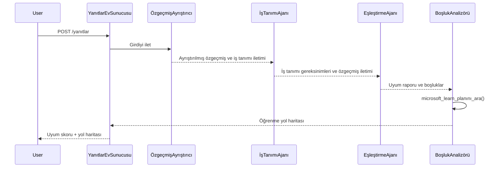

# Modül 3 - Talimatları Yapılandırma, Ortam & Bağımlılıkları Kurma

⏱️ ~15 dakika

Bu modülde, iskelet halindeki taslağı, ortam değişkenlerini ayarlayarak, ajan talimatları yazarak, MCP aracını ekleyerek, iş akışı grafiğini bağlayarak ve bağımlılıkları kurarak **kendi** çok ajanlı iş akışınıza dönüştürürsünüz.

> **Referans:** Tam çalışan kod [`PersonalCareerCopilot/main.py`](../../../../../workshop/lab02-multi-agent/PersonalCareerCopilot/main.py) içinde. Kendi iş akışı grafiğinizi ve prompt bloklarınızı oluştururken referans olarak kullanın.

---

## Dört ajanın birlikte nasıl çalıştığı


```mermaid
sequenceDiagram
    participant User
    participant Server as YanıtlarEvSunucusu
    participant RP as ÖzgeçmişAyrıştırıcı
    participant JD as İşTanımıAjanı
    participant MA as EşleştirmeAjanı
    participant GA as BoşlukAnalizörü

    User->>Server: POST /yanıtlar
    Server->>RP: Girdiyi ilet
    RP-->>JD: Ayrıştırılmış özgeçmiş ve iş tanımı iletimi
    JD-->>MA: İş tanımı gereksinimleri ve özgeçmiş iletimi
    MA-->>GA: Uyum raporu ve boşluklar
    GA->>GA: microsoft_learn_planını_ara()
    GA-->>Server: Öğrenme yol haritası
    Server-->>User: Uyum skoru + yol haritası
```

---

## Adım 1: Ortam değişkenlerini yapılandırın

1. Proje kök dizininizdeki **`.env`** dosyasını açın (iskelet sihirbazı tarafından oluşturulur).
2. Yer tutucuları Lab 01'den gerçek değerlerinizle değiştirin.

<details open>
<summary><strong>🅰️ Yol A - Foundry aboneliği</strong></summary>

```env
FOUNDRY_PROJECT_ENDPOINT=https://<your-account>.services.ai.azure.com/api/projects/<your-project>
AZURE_AI_MODEL_DEPLOYMENT_NAME=gpt-4.1-mini
```

> **Değerler nereden bulunur:** Bkz. [Lab 01, Modül 1](../../lab01-single-agent/docs/01-setup.md#deploy-a-model--assign-rbac).

</details>

<details open>
<summary><strong>🅱️ Yol B - Foundry Yerel</strong></summary>

```env
FOUNDRY_PROJECT_ENDPOINT=http://localhost:5273/v1
AZURE_AI_MODEL_DEPLOYMENT_NAME=phi-4-mini
```

> Tüm çıkarım makinenizde çalışır - hiçbir veri cihazınızdan çıkmaz. Kesin model takma adını doğrulamak için `foundry model list` komutunu çalıştırın. Tek giden istek MCP aracının `https://learn.microsoft.com/api/mcp` çağrısıdır.

> **Değerler nereden bulunur:** Bkz. [Lab 01, Modül 1 - yerel yol](../../lab01-single-agent/docs/01-setup.md#step-2-set-up-based-on-your-access).

</details>

> **Güvenlik:** `.env` dosyasını sürüm kontrolüne asla göndermeyin. Zaten `.gitignore` içinde olmalıdır.

---

## Adım 2: Ajan talimatlarını yazın

Talimatlar, her ajanın rolünü, çıktı formatını ve kurallarını tanımlar. `main.py` dosyasını açın ve dört talimat sabitini tanımlayın (veya değiştirin) - tam metinler [`PersonalCareerCopilot/main.py`](../../../../../workshop/lab02-multi-agent/PersonalCareerCopilot/main.py) dosyasında.

### 2.1 `RESUME_PARSER_INSTRUCTIONS`
Özgeçmişi yapılandırılmış bir aday profiline ayırır **ve** iş tanımını kelimesi kelimesine `[JOB DESCRIPTION PASS-THROUGH]` alanına kopyalar. Her iki etiketli bölüm de çıktı içinde görünmelidir.

> **Neden geçiş yapılıyor?** `context_mode="last_agent"` ile ResumeParser, özgün kullanıcı mesajını gören **tek** ajandır. İş tanımını ileri kopyalamazsa, sonraki ajanlar asla görmez.

### 2.2 `JOB_DESCRIPTION_INSTRUCTIONS`
ResumeParser çıktısından `[PARSED RESUME]` ve `[JOB DESCRIPTION PASS-THROUGH]` alanlarını okur. `[JD REQUIREMENTS]` (yapılandırılmış gereksinimler) ve `[PARSED RESUME PASS-THROUGH]` (MatchingAgent için kelimesi kelimesine özgeçmiş kopyası) çıktısını üretir.

### 2.3 `MATCHING_AGENT_INSTRUCTIONS`
`[JD REQUIREMENTS]` ve `[PARSED RESUME PASS-THROUGH]` alanlarını okur. Kırılım matematiği, eşleşen beceriler, eksik beceriler ve deneyim uyumunu içeren puanlı uyum raporu (0–100) üretir.

### 2.4 `GAP_ANALYZER_INSTRUCTIONS`
Uyum raporunu okur. **Her** eksik beceri için Microsoft Learn kaynaklarını getirmek amacıyla `search_microsoft_learn_for_plan` fonksiyonunu çağırır. Her beceri için ayrıntılı bir boşluk kartı ve hafta hafta öğrenme yol haritası üretir.

---

## Adım 3: MCP aracını ekleyin

GapAnalyzer, her beceri boşluğu için gerçek öğrenme kaynaklarını almak amacıyla [Microsoft Learn MCP sunucusunu](https://learn.microsoft.com/azure/foundry/agents/how-to/tools/model-context-protocol) çağırır. Tam `search_microsoft_learn_for_plan` fonksiyonu [`PersonalCareerCopilot/main.py`](../../../../../workshop/lab02-multi-agent/PersonalCareerCopilot/main.py) dosyasında.

Ajan oluştururken aracı GapAnalyzer'a kaydedin:

```python
gap_analyzer = Agent(
    client=client,
    instructions=GAP_ANALYZER_INSTRUCTIONS,
    name="GapAnalyzer",
    tools=[search_microsoft_learn_for_plan],
)
```

> Tam `WorkflowBuilder` grafiği `FoundryChatClient`, `AgentExecutor` ve tüm `add_edge()` çağrıları ile [`PersonalCareerCopilot/main.py`](../../../../../workshop/lab02-multi-agent/PersonalCareerCopilot/main.py) içinde bulunabilir.

---

## Adım 4: Sanal ortamı oluşturun & bağımlılıkları kurun

> ⚠️ **Bu adımı atlamayın.** Bağımlılıklar kurulmadan F5 hata ayıklama başarısız olur.

### 4.1 Sanal ortamı oluşturun

```powershell
python -m venv .venv
```

### 4.2 Aktif edin

| İşletim Sistemi | Komut |
|----|---------|
| **Windows (PowerShell)** | `.\.venv\Scripts\Activate.ps1` |
| **Windows (CMD)** | `.venv\Scripts\activate.bat` |
| **macOS / Linux** | `source .venv/bin/activate` |

Terminal isteminizde `(.venv)` görmelisiniz.

### 4.3 Bağımlılıkları kurun

```powershell
pip install -r requirements.txt
```

### 4.4 Doğrulayın

```powershell
pip list | Select-String "agent-framework|mcp|debugpy"
```

Beklenen: `agent-framework-foundry`, `agent-framework-foundry-hosting`, `mcp` ve `debugpy` listelenmiş olmalı.

---

## Adım 5: Kimlik doğrulamayı doğrulayın

<details open>
<summary><strong>🅰️ Yol A - Azure kimlik bilgisi</strong></summary>

```powershell
az account show --query "{name:name, id:id}" --output table
```

Eğer bu başarısız olursa, [`az login`](https://learn.microsoft.com/cli/azure/authenticate-azure-cli-interactively) komutunu çalıştırın.

Dört ajanın tamamı bir `FoundryChatClient` ve bir `DefaultAzureCredential` paylaşır. Kimlik doğrulama biri için çalışıyorsa, hepsi için çalışır.

</details>

<details open>
<summary><strong>🅱️ Yol B - Foundry Yerel</strong></summary>

Yerel test için kimlik doğrulama gerekli değildir.

</details>

---

### ✅ Kontrol noktası

> Modül 04'e geçmeden önce: **(1)** Terminal isteminizde `(.venv)` görünmeli VE **(2)** `pip install -r requirements.txt` başarıyla tamamlanmalı.

- [ ] `.env` dosyasının geçerli bir uç noktası ve model dağıtım adı var (yer tutucu değil)
- [ ] `main.py` içinde dört ajan talimat sabiti tanımlandı (ResumeParser, JD Agent, MatchingAgent, GapAnalyzer)
- [ ] `search_microsoft_learn_for_plan` MCP aracı tanımlandı ve GapAnalyzer'a kaydedildi
- [ ] `FoundryChatClient` + 4 `Agent` + 4 `AgentExecutor` nesnesi `main()` içinde oluşturuldu
- [ ] `WorkflowBuilder` doğru sıralı grafiği tüm 3 `add_edge()` çağrıları ile oluşturuyor
- [ ] Sanal ortam oluşturuldu ve aktifleştirildi (`(.venv)` istemde görünür)
- [ ] `pip install -r requirements.txt` hatasız tamamlandı
- [ ] **Yol A:** `az account show` başarılı OLDU veya VS Code Hesaplar simgesi oturum açan hesabı gösteriyor

---

**Önceki:** [02 - Çok Ajanlı Projeyi İskele oluşturma](02-scaffold-multi-agent.md) · **Sonraki:** [04 - Orkestrasyon Kalıpları →](04-orchestration-patterns.md)

---

<!-- CO-OP TRANSLATOR DISCLAIMER START -->
**Feragatname**:
Bu belge, AI çeviri hizmeti [Co-op Translator](https://github.com/Azure/co-op-translator) kullanılarak çevrilmiştir. Doğruluk için çaba sarf etsek de, otomatik çevirilerin hata veya yanlışlık içerebileceğini lütfen unutmayınız. Orijinal belge, kendi dilinde yetkili kaynak olarak kabul edilmelidir. Kritik bilgiler için profesyonel insan çevirisi önerilir. Bu çevirinin kullanımı sonucu ortaya çıkabilecek yanlış anlamalardan veya yanlış yorumlamalardan sorumlu değiliz.
<!-- CO-OP TRANSLATOR DISCLAIMER END -->