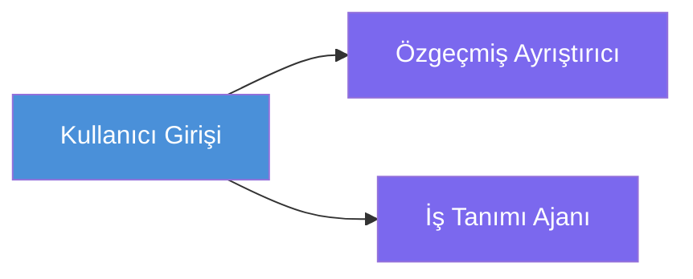
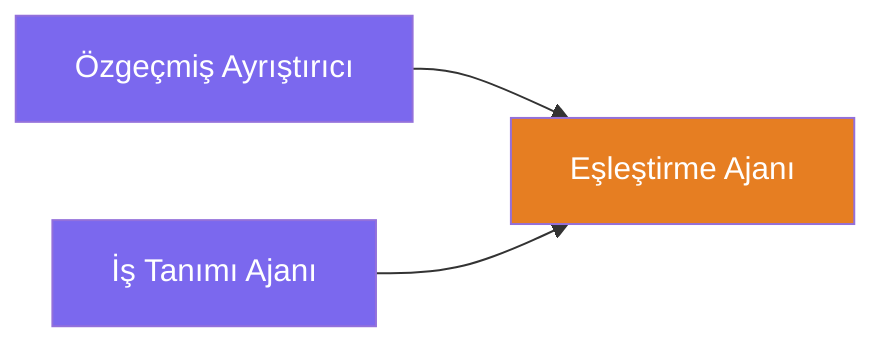
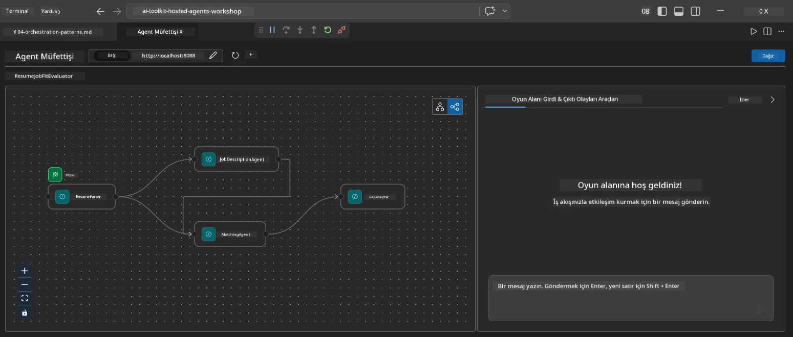
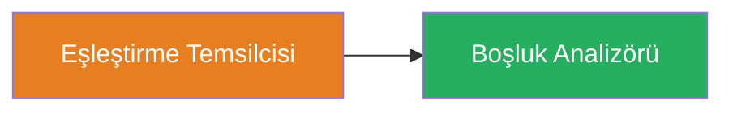
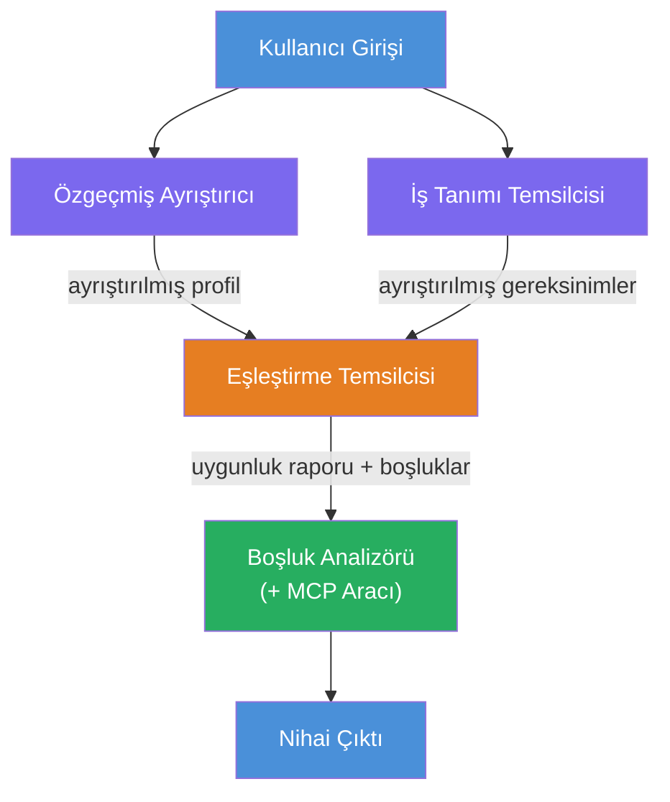
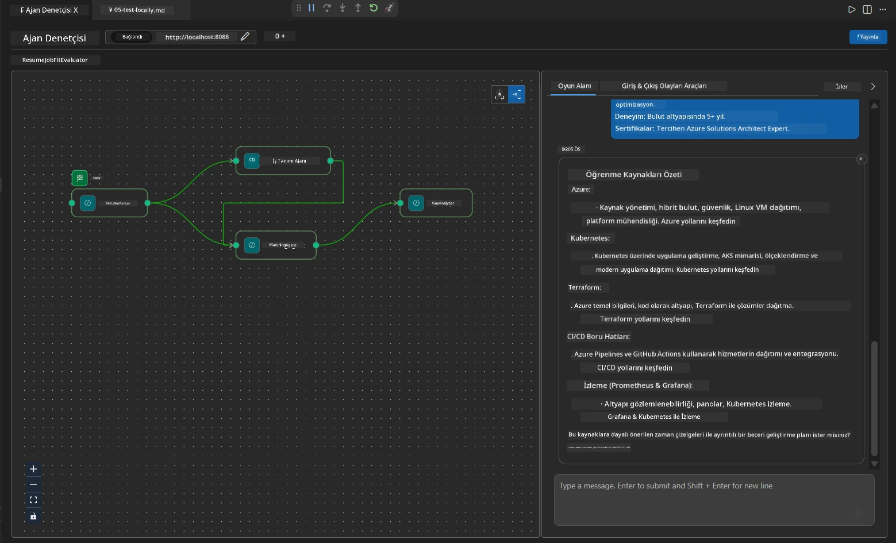

# Modül 4 - Orkestrasyon Desenleri

Bu modülde, Resume Job Fit Evaluator'da kullanılan orkestrasyon desenlerini keşfedecek ve iş akışı grafiklerini nasıl okuyup, değiştireceğinizi ve genişleteceğinizi öğreneceksiniz. Bu desenleri anlamak, veri akışı sorunlarını giderirken ve kendi [çoklu ajan iş akışlarınızı](https://learn.microsoft.com/agent-framework/workflows/) oluştururken esastır.

---

## Desen 1: Fan-out (paralel ayrım)

İş akışındaki ilk desen **fan-out** - tek bir girdi aynı anda birden fazla ajana gönderilir.


Kodda, bu `resume_parser`'ın `start_executor` olması nedeniyle olur - kullanıcı mesajını ilk o alır. Sonra, hem `jd_agent` hem de `matching_agent`'in `resume_parser`'dan gelen kenarlara sahip olması nedeniyle, çerçeve `resume_parser`'ın çıktısını her iki ajana yönlendirir:

```python
.add_edge(resume_parser, jd_agent)         # ResumeParser çıktısı → JD Agent
.add_edge(resume_parser, matching_agent)   # ResumeParser çıktısı → MatchingAgent
```

**Neden bu çalışır:** ResumeParser ve JD Agent aynı girdinin farklı yönlerini işler. Bunları paralel çalıştırmak, ardışık çalıştırmaya göre toplam gecikmeyi azaltır.

### Fan-out ne zaman kullanılır

| Kullanım durumu | Örnek |
|----------|---------|
| Bağımsız alt görevler | Özgeçmiş ayrıştırma vs. JD ayrıştırma |
| Yedekleme / oylama | İki ajan aynı veriyi analiz eder, üçüncüsü en iyi cevabı seçer |
| Çok formatlı çıktı | Bir ajan metin, diğeri yapılandırılmış JSON üretir |

---

## Desen 2: Fan-in (birleştirme)

İkinci desen **fan-in** - birden fazla ajan çıktısı toplanır ve tek bir sonraki ajana gönderilir.


Kodda:

```python
.add_edge(resume_parser, matching_agent)   # ResumeParser çıktısı → MatchingAgent
.add_edge(jd_agent, matching_agent)        # JD Agent çıktısı → MatchingAgent
```

**Ana davranış:** Bir ajanın **iki veya daha fazla gelen kenarı** olduğunda, çerçeve, aşağıdaki ajanı çalıştırmadan önce **tüm** yukarıdaki ajanların tamamlanmasını otomatik olarak bekler. MatchingAgent, yalnızca ResumeParser ve JD Agent tamamlandıktan sonra başlar.

### MatchingAgent’in aldığı şey

Çerçeve, tüm yukarıdaki ajanların çıktısını birleştirir. MatchingAgent'in girdisi şöyle görünür:

```
[ResumeParser output]
---
Candidate Profile:
  Name: Jane Doe
  Technical Skills: Python, Azure, Kubernetes, ...
  ...

[JobDescriptionAgent output]
---
Role Overview: Senior Cloud Engineer
Required Skills: Python, Azure, Terraform, ...
...
```

> **Not:** Tam birleştirme formatı çerçeve sürümüne bağlıdır. Ajan yönergeleri, hem yapılandırılmış hem de yapılandırılmamış yukarıdaki çıktıyı işleyebilecek şekilde yazılmalıdır.



---

## Desen 3: Ardışık zincir

Üçüncü desen **ardışık zincirleme** - bir ajanın çıktısı doğrudan sonraki ajana beslenir.


Kodda:

```python
.add_edge(matching_agent, gap_analyzer)    # MatchingAgent çıktısı → GapAnalyzer
```

Bu en basit desendir. GapAnalyzer, MatchingAgent'in uygunluk skorunu, eşleşen / eksik yetkinlikleri ve boşlukları alır. Daha sonra her boşluk için Microsoft Learn kaynaklarını getirmek üzere [MCP aracını](https://learn.microsoft.com/azure/foundry/agents/how-to/tools/model-context-protocol) çağırır.

---

## Tam grafik

Üç deseni birleştirmek tam iş akışını üretir:


### Çalıştırma zaman çizelgesi

```mermaid
gantt
    title Ajan Yürütme Zaman Çizelgesi
    dateFormat X
    axisFormat %s

    section Paralel
    Özgeçmiş Ayrıştırıcı       :rp, 0, 3
    İş Tanımı Ajanı            :jd, 0, 2

    section Sekansiyel
    Eşleştirme Ajanı      :ma, 3, 5
    Boşluk Analizcisi        :ga, 5, 9
```


> Toplam gerçek zaman yaklaşık olarak `max(ResumeParser, JD Agent) + MatchingAgent + GapAnalyzer`'dır. GapAnalyzer tipik olarak en yavaştır çünkü birden çok MCP aracı çağrısı yapar (her boşluk için bir).

---

## WorkflowBuilder kodunu okuma

İşte `main.py` içindeki tam `create_workflow()` fonksiyonu, açıklamalı:

```python
def create_workflow(resume_parser, jd_agent, matching_agent, gap_analyzer):
    workflow = (
        WorkflowBuilder(
            name="ResumeJobFitEvaluator",

            # Kullanıcı girdisini alan ilk ajan
            start_executor=resume_parser,

            # Çıktısı nihai yanıt olan ajan(lar)
            output_executors=[gap_analyzer],
        )
        # Yayılma: ResumeParser çıktısı hem JD Agent'a hem de MatchingAgent'a gider
        .add_edge(resume_parser, jd_agent)
        .add_edge(resume_parser, matching_agent)

        # Birleşme: MatchingAgent hem ResumeParser hem de JD Agent'ı bekler
        .add_edge(jd_agent, matching_agent)

        # Sıralı: MatchingAgent çıktısı GapAnalyzer'a beslenir
        .add_edge(matching_agent, gap_analyzer)

        .build()
    )
    return workflow.as_agent()
```

### Kenar özet tablosu

| # | Kenar | Desen | Etki |
|---|------|---------|--------|
| 1 | `resume_parser → jd_agent` | Fan-out | JD Agent, ResumeParser'ın çıktısını (artı orijinal kullanıcı girdi) alır |
| 2 | `resume_parser → matching_agent` | Fan-out | MatchingAgent, ResumeParser'ın çıktısını alır |
| 3 | `jd_agent → matching_agent` | Fan-in | MatchingAgent ayrıca JD Agent'ın çıktısını da alır (ikisini bekler) |
| 4 | `matching_agent → gap_analyzer` | Ardışık | GapAnalyzer uygunluk raporu + boşluk listesini alır |

---

## Grafiği değiştirme

### Yeni bir ajan eklemek

Beşinci bir ajan eklemek için (örneğin, boşluk analizine bağlı olarak mülakat soruları oluşturan **InterviewPrepAgent**):

```python
# 1. Talimatları tanımla
INTERVIEW_PREP_INSTRUCTIONS = """\
You are the Interview Prep Agent.
Given a gap analysis and fit report, generate 10 targeted interview questions
the candidate should prepare for.
"""

# 2. Ajanı oluştur (async with bloğu içinde)
AzureAIAgentClient(
    project_endpoint=PROJECT_ENDPOINT,
    model_deployment_name=MODEL_DEPLOYMENT_NAME,
    credential=credential,
).as_agent(
    name="InterviewPrepAgent",
    instructions=INTERVIEW_PREP_INSTRUCTIONS,
) as interview_prep,

# 3. create_workflow() içinde kenarları ekle
.add_edge(matching_agent, interview_prep)   # fit raporu alır
.add_edge(gap_analyzer, interview_prep)     # ayrıca gap kartlarını alır

# 4. output_executors'u güncelle
output_executors=[interview_prep],  # şimdi nihai ajan
```

### Çalıştırma sırasını değiştirme

JD Agent'ın **ResumeParser'dan sonra** (paralel yerine ardışık olarak) çalışmasını sağlamak için:

```python
# Kaldır: .add_edge(resume_parser, jd_agent)  ← zaten mevcut, olduğu gibi bırakın
# jd_agent'in kullanıcı girdisini doğrudan almasını ENGELLEYEREK örtük paralelliği kaldırın
# start_executor önce resume_parser'a gönderir ve jd_agent sadece
# resume_parser'ın çıktısını kenar üzerinden alır. Bu onları sıralı yapar.
```

> **Önemli:** `start_executor`, ham kullanıcı girdisini alan tek ajandır. Diğer tüm ajanlar, yukarıdaki kenarlarından çıktıyı alır. Bir ajanın ham kullanıcı girdisini de almasını istiyorsanız, `start_executor`'dan o ajana bir kenar olmalıdır.

---

## Yaygın grafik hataları

| Hata | Belirti | Çözüm |
|---------|---------|-----|
| `output_executors`'a eksik kenar | Ajan çalışıyor ama çıktı boş | `start_executor`'dan `output_executors` içindeki her ajana kadar bir yol olduğundan emin olun |
| Döngüsel bağımlılık | Sonsuz döngü veya zaman aşımı | Hiçbir ajanın yukarıdaki ajanlara geri besleme yapmadığını kontrol edin |
| `output_executors` içinde gelen kenarı olmayan ajan | Boş çıktı | En az bir `add_edge(kaynak, o_ajan)` ekleyin |
| Fan-in olmadan birden çok `output_executors` | Çıktı yalnızca bir ajanın yanıtını içeriyor | Birleştiren tek bir çıktı ajanı kullanın ya da çoklu çıktıları kabul edin |
| `start_executor` eksik | Derleme zamanında `ValueError` | Her zaman `WorkflowBuilder()` içinde `start_executor` belirtin |

---

## Grafiğin hata ayıklanması

### Agent Inspector kullanımı

1. Ajanı yerel olarak başlatın (F5 veya terminal - bkz. [Modül 5](05-test-locally.md)).
2. Agent Inspector'u açın (`Ctrl+Shift+P` → **Foundry Toolkit: Open Agent Inspector**).
3. Bir test mesajı gönderin.
4. Inspector'un yanıt panelinde, her ajanın katkısını sıralı olarak gösteren **streaming output** (akış çıktısı) bölümüne bakın.



### Günlük kaydı kullanımı

`main.py`'ye günlük kaydı ekleyerek veri akışını izleyin:

```python
import logging
logger = logging.getLogger("resume-job-fit")

# create_workflow() içinde, oluşturduktan sonra:
logger.info("Workflow graph built with edges: RP→JD, RP→MA, JD→MA, MA→GA")
```

Sunucu günlükleri, ajan çalışma sırasını ve MCP aracı çağrılarını gösterir:

```
INFO:resume-job-fit:Starting Resume -> Job Fit Evaluator HTTP server...
INFO:resume-job-fit:Server running on http://localhost:8088
INFO:agent_framework:Executing agent: ResumeParser
INFO:agent_framework:Executing agent: JobDescriptionAgent
INFO:agent_framework:Waiting for upstream agents: ResumeParser, JobDescriptionAgent
INFO:agent_framework:Executing agent: MatchingAgent
INFO:agent_framework:Executing agent: GapAnalyzer
INFO:agent_framework:Tool call: search_microsoft_learn_for_plan(skill="Kubernetes")
POST https://learn.microsoft.com/api/mcp → 200
INFO:agent_framework:Tool call: search_microsoft_learn_for_plan(skill="Terraform")
POST https://learn.microsoft.com/api/mcp → 200
```

---

### Kontrol listesi

- [ ] İş akışında üç orkestrasyon desenini ayırt edebilirsiniz: fan-out, fan-in ve ardışık zincir
- [ ] Birden fazla gelen kenar alan ajanların yukarıdaki tüm ajanların tamamlanmasını beklediğini anlıyorsunuz
- [ ] `WorkflowBuilder` kodunu okuyup her `add_edge()` çağrısını görsel grafikle eşleştirebiliyorsunuz
- [ ] Çalıştırma zaman çizelgesini anlıyorsunuz: önce paralel ajanlar, sonra birleştirme, sonra ardışık
- [ ] Grafiğe yeni bir ajan eklemeyi biliyorsunuz (yönergeleri belirleme, ajan oluşturma, kenar ekleme, çıktıyı güncelleme)
- [ ] Yaygın grafik hatalarını ve belirtilerini tespit edebiliyorsunuz

---

**Önceki:** [03 - Ajanlar ve Ortamı Yapılandırma](03-configure-agents.md) · **Sonraki:** [05 - Yerel Test →](05-test-locally.md)

---

<!-- CO-OP TRANSLATOR DISCLAIMER START -->
**Feragatname**:  
Bu belge, yapay zeka çeviri servisi [Co-op Translator](https://github.com/Azure/co-op-translator) kullanılarak çevrilmiştir. Doğruluk için çaba göstersek de, otomatik çevirilerin hatalar veya yanlışlıklar içerebileceğini lütfen unutmayın. Orijinal belge, kendi ana dilinde yetkili kaynak olarak kabul edilmelidir. Kritik bilgiler için profesyonel insan çevirisi önerilir. Bu çevirinin kullanımı nedeniyle oluşabilecek herhangi bir yanlış anlama veya yorum hatasından sorumlu değiliz.
<!-- CO-OP TRANSLATOR DISCLAIMER END -->