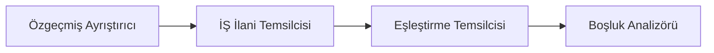
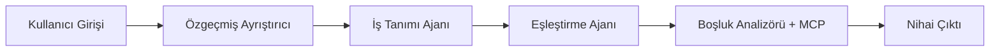

# Modül 4 - Orkestrasyon Desenleri

⏱️ ~10 dakika

Bu modülde, Resume İş Uyumu Değerlendiricisinde kullanılan orkestrasyon desenlerini keşfedecek ve iş akışı grafiğini nasıl okuyacağınızı, değiştireceğinizi ve genişleteceğinizi öğreneceksiniz. Bu desenleri anlamak, veri akışı sorunlarını hatadan arındırmak ve kendi [çoklu ajan iş akışlarınızı](https://learn.microsoft.com/agent-framework/workflows/) oluşturmak için hayati öneme sahiptir.

---

## Desen 1: Ardışık zincir

İş akışındaki temel desen **ardışık zincir**dir - her ajanın çıktısı doğrudan bir sonraki ajana beslenir.


```mermaid
flowchart LR
    RP[Özgeçmiş Ayrıştırıcı] --> JD[İŞ İlani Temsilcisi]
    JD --> MA[Eşleştirme Temsilcisi]
    MA --> GA[Boşluk Analizörü]
```

Kodda, her `add_edge()` çağrısı zincirde bir adım yaratır:

```python
.add_edge(resume_executor, jd_executor)       # ResumeParser çıktısı → JD Agent
.add_edge(jd_executor, matching_executor)     # JD Agent çıktısı → MatchingAgent
.add_edge(matching_executor, gap_executor)    # MatchingAgent çıktısı → GapAnalyzer
```

> **Neden ardışık, neden dağıtım/toplanma değil?** `WorkflowBuilder` gelen kenarlar için **VEYA-semantik (OR-semantics)** kullanır: aşağıdaki çalıştırıcı herhangi bir önceki işlem tamamlanır tamamlanmaz tetiklenir. Eğer `matching_executor` iki giriş kenarına sahip olsaydı (hem `resume_executor` hem `jd_executor`'dan), birisi ResumeParser bittiğinde, diğeri JD Agent bittiğinde olmak üzere iki kez tetiklenirdi - bu da GapAnalyzer'ın iki kez çalışmasına ve çıktının iki kez görünmesine neden olur. Ardışık boru hattı bunu tamamen önler.

## Desen 2: İçerik Aktarımı

Çünkü `context_mode="last_agent"` her çalıştırıcının sadece **doğrudan önceki ajanın çıktısını** görmesini sağlıyor, bu yüzden ardışık zincirde bulunan ajanlar aşağıdaki ajanların ihtiyaç duyduğu verileri açıkça iletmek zorundadır.

Bu iş akışında:
- **ResumeParser** JD'yi tam olarak `[JOB DESCRIPTION PASS-THROUGH]` içine kopyalar (böylece JD Agent onu bulabilir).
- **JD Agent** `[PARSED RESUME]`'yi tam olarak `[PARSED RESUME PASS-THROUGH]` içine kopyalar (böylece MatchingAgent iki profili karşılaştırabilir).

```
ResumeParser output
└─ [PARSED RESUME]               ← extracted by JD Agent
└─ [JOB DESCRIPTION PASS-THROUGH] ← extracted by JD Agent

JD Agent output
└─ [JD REQUIREMENTS]             ← extracted by MatchingAgent
└─ [PARSED RESUME PASS-THROUGH]  ← extracted by MatchingAgent
```

Her aktarma bölümü **tam olarak** kopyalanmalıdır - özetlemek veya farklı ifade etmek, ona bağlı olan aşağıdaki ajanı bozar.

---

## Tam grafik

Ardışık zincir ve içerik aktarımı desenlerinin birleştirilmesi tam iş akışını oluşturur:


```mermaid
flowchart LR
    U[Kullanıcı Girişi] --> RP[Özgeçmiş Ayrıştırıcı]
    RP --> JD[İş Tanımı Ajanı]
    JD --> MA[Eşleştirme Ajanı]
    MA --> GA[Boşluk Analizörü + MCP]
    GA --> O[Nihai Çıktı]
```

Agent Inspector, ajan yerel olarak çalışırken bu aynı grafik yapısını gösterir. Ekran görüntüleri için [Modül 5 - Yerel Test](05-test-locally.md) bölümüne bakın.

---

## WorkflowBuilder kodunu okuma

Tam `create_workflow()` fonksiyonu [`PersonalCareerCopilot/main.py`](../../../../../workshop/lab02-multi-agent/PersonalCareerCopilot/main.py) dosyasında bulunur. Üç `add_edge()` çağrısı ardışık boru hattını oluşturur:

| # | Kenar | Etki |
|---|-------|-------|
| 1 | `resume_executor → jd_executor` | JD Agent `[PARSED RESUME]` + `[JOB DESCRIPTION PASS-THROUGH]` alır |
| 2 | `jd_executor → matching_executor` | MatchingAgent `[JD REQUIREMENTS]` + `[PARSED RESUME PASS-THROUGH]` alır |
| 3 | `matching_executor → gap_executor` | GapAnalyzer uyum raporu + boşluk listesi alır |

---

## Grafiği değiştirme

### Yeni bir ajan ekleme

Beşinci bir ajan eklemek için (örneğin GapAnalyzer'dan sonra bir **InterviewPrepAgent**):

1. Bir `INTERVIEW_PREP_INSTRUCTIONS` sabitini tanımlayın.
2. `Agent` + `AgentExecutor` nesneleri oluşturun (mevcut dört ajandaki aynı desen gibi).
3. `WorkflowBuilder` içine `.add_edge(gap_executor, interview_exec)` ekleyin.
4. `output_executors=[interview_exec]`'i güncelleyin.

> **Önemli:** `start_executor` ham kullanıcı girdisi alan tek ajandır. Diğer tüm ajanlar yukarı akış kenarlarından çıktı alır.

---

## Yaygın grafik hataları

| Hata | Belirti | Çözüm |
|-------|----------|-------|
| `output_executors`'e eksik kenar | Ajan çalışır ama çıktı boş | `start_executor`'dan `output_executors` içindeki her ajana bir yol olduğundan emin olun |
| Döngüsel bağımlılık | Sonsuz döngü veya zaman aşımı | Hiçbir ajanın yukarı akıştaki bir ajana geribildirim vermediğini kontrol edin |
| Gelen kenarı olmayan `output_executors` ajanı | Boş çıktı | En az bir `add_edge(kaynak, o_ajan)` ekleyin |
| Fan-in olmayan birden çok `output_executors` | Çıktı sadece bir ajanın yanıtını içerir | Toplayan tek bir çıktı ajanı kullanın veya birden fazla çıktıyı kabul edin |
| Eksik `start_executor` | Oluşturma zamanında `ValueError` | Her zaman `WorkflowBuilder()`'da `start_executor`'ı belirtin |

---

## Grafiği hata ayıklama

### Agent Inspector kullanımı

1. Ajanı yerel olarak F5 ile başlatın.
2. Agent Inspector'ı açın (`Ctrl+Shift+P` → **Foundry Toolkit: Open Agent Inspector**).
3. Test mesajı gönderin.
4. Inspector yanıt panelinde, ajanın sıralı katkısını gösteren **akışkan çıktı**yı arayın.


### Günlük kaydı kullanımı

Veri akışını izlemek için `main.py` dosyasına günlük kaydı ekleyin:

```python
import logging
logger = logging.getLogger("resume-job-fit")

# main() içinde, iş akışı oluşturulduktan sonra:
logger.info("Workflow graph built with edges: RP→JD, JD→MA, MA→GA")
```

Sunucu günlükleri ajan yürütme sırasını ve MCP araç çağrılarını gösterir:

```
INFO:agent_framework:Executing agent: ResumeParser
INFO:agent_framework:Executing agent: JobDescriptionAgent
INFO:agent_framework:Executing agent: MatchingAgent
INFO:agent_framework:Executing agent: GapAnalyzer
INFO:agent_framework:Tool call: search_microsoft_learn_for_plan(skill="Kubernetes")
POST https://learn.microsoft.com/api/mcp → 200
INFO:agent_framework:Tool call: search_microsoft_learn_for_plan(skill="Terraform")
POST https://learn.microsoft.com/api/mcp → 200
```

---

### Kontrol noktası

- [ ] İş akışındaki iki orkestrasyon desenini tanımlayabilirsiniz: ardışık zincir ve içerik aktarımı
- [ ] `context_mode="last_agent"`'ın neden ajanlar arasında açık veri aktarımı gerektirdiğini anlarsınız
- [ ] `WorkflowBuilder` kodunu okuyabilir ve her `add_edge()` çağrısını görsel grafikle eşleştirebilirsiniz
- [ ] Boru hattının sonuna yeni bir ajan eklemeyi biliyorsunuz
- [ ] Yaygın grafik hatalarını ve belirtilerini tanımlayabilirsiniz

---

**Önceki:** [03 - Ajanları ve Ortamı Yapılandırma](03-configure-agents.md) · **Sonraki:** [05 - Yerel Test →](05-test-locally.md)

---

<!-- CO-OP TRANSLATOR DISCLAIMER START -->
**Feragatname**:
Bu belge, AI çeviri hizmeti [Co-op Translator](https://github.com/Azure/co-op-translator) kullanılarak çevrilmiştir. Doğruluk için çaba sarf etsek de, otomatik çevirilerin hata veya yanlışlık içerebileceğini lütfen unutmayınız. Orijinal belge, kendi dilinde yetkili kaynak olarak kabul edilmelidir. Kritik bilgiler için profesyonel insan çevirisi önerilir. Bu çevirinin kullanımı sonucu ortaya çıkabilecek yanlış anlamalardan veya yanlış yorumlamalardan sorumlu değiliz.
<!-- CO-OP TRANSLATOR DISCLAIMER END -->