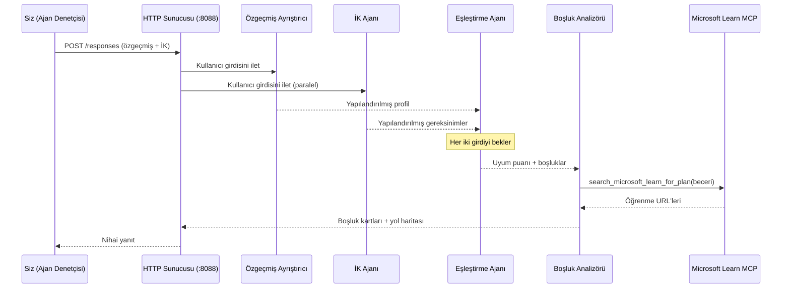
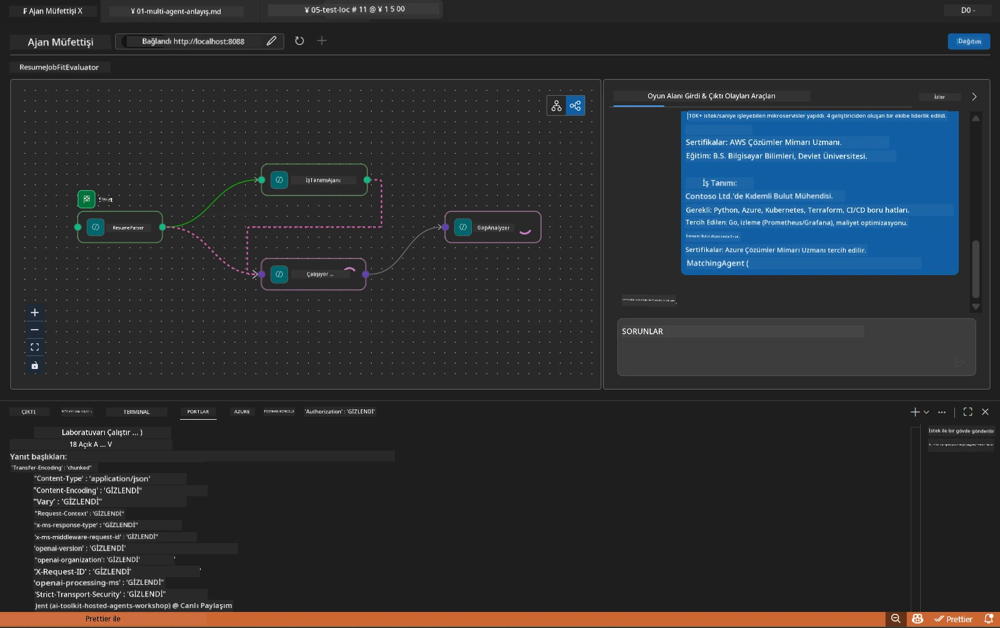

# Modül 5 - Yerel Test (Çoklu Ajan)

Bu modülde, çoklu ajan iş akışını yerel olarak çalıştırır, Agent Inspector ile test eder ve Foundry'e dağıtmadan önce tüm dört ajanın ve MCP aracının doğru çalıştığını doğrularsınız.

### Yerel test çalışması sırasında ne olur


---

## Adım 1: Ajan sunucusunu başlatın

### Seçenek A: VS Code görevi kullanarak (önerilen)

1. `Ctrl+Shift+P` tuşlarına basın → **Tasks: Run Task** yazın → **Run Lab02 HTTP Server** seçeneğini seçin.
2. Görev, `5679` portunda debugpy bağlı olarak ve `8088` portunda ajanla birlikte sunucuyu başlatır.
3. Çıktının şu şekilde olmasını bekleyin:

```
INFO:resume-job-fit:Starting Resume -> Job Fit Evaluator HTTP server...
INFO:resume-job-fit:Server running on http://localhost:8088
```

### Seçenek B: Terminali manuel kullanarak

```powershell
cd workshop\lab02-multi-agent\PersonalCareerCopilot
```

Sanal ortamı etkinleştirin:

**PowerShell (Windows):**
```powershell
.\.venv\Scripts\Activate.ps1
```

**macOS/Linux:**
```bash
source .venv/bin/activate
```

Sunucuyu başlatın:

```powershell
python -m debugpy --listen 127.0.0.1:5679 -m agentdev run main.py --verbose --port 8088
```

### Seçenek C: F5 kullanarak (hata ayıklama modu)

1. `F5` tuşuna basın veya **Run and Debug** (`Ctrl+Shift+D`) menüsüne gidin.
2. Açılır menüden **Lab02 - Multi-Agent** başlatma yapılandırmasını seçin.
3. Sunucu tam kesme noktası desteği ile başlar.

> **İpucu:** Hata ayıklama modu, MCP yanıtlarını incelemek için `search_microsoft_learn_for_plan()` içinde kesme noktaları ayarlamanıza veya her ajanın aldığı talimat dizgilerini görmenize olanak sağlar.

---

## Adım 2: Agent Inspector'ı açın

1. `Ctrl+Shift+P` tuşlarına basın → **Foundry Toolkit: Open Agent Inspector** yazın.
2. Agent Inspector, `http://localhost:5679` adresinde bir tarayıcı sekmesinde açılır.
3. Ajan arayüzünün mesajları kabul etmeye hazır olduğunu görmelisiniz.

> **Agent Inspector açılmazsa:** Sunucunun tamamen başlatıldığından emin olun ("Server running" kaydını görüyorsunuz). 5679 portu meşgulse, bkz. [Modül 8 - Sorun Giderme](08-troubleshooting.md).

---

## Adım 3: Duman testlerini çalıştırın

Bu üç testi sırayla çalıştırın. Her biri iş akışının giderek daha fazlasını test eder.

### Test 1: Temel özgeçmiş + iş tanımı

Aşağıdakini Agent Inspector'a yapıştırın:

```
Resume:
Jane Doe
Senior Software Engineer with 5 years of experience in Python, Django, and AWS.
Built microservices handling 10K+ requests/second. Led a team of 4 developers.
Certifications: AWS Solutions Architect Associate.
Education: B.S. Computer Science, State University.

Job Description:
Senior Cloud Engineer at Contoso Ltd.
Required: Python, Azure, Kubernetes, Terraform, CI/CD pipelines.
Preferred: Go, monitoring (Prometheus/Grafana), cost optimization.
Experience: 5+ years in cloud infrastructure.
Certifications: Azure Solutions Architect Expert preferred.
```

**Beklenen çıktı yapısı:**

Yanıt, dört ajanın sırasıyla çıktısını içermelidir:

1. **Özgeçmiş Ayrıştırıcı çıktısı** - Kategorilere göre gruplanmış becerilerle yapılandırılmış aday profili
2. **İş Tanımı Ajanı çıktısı** - Gereken ve tercih edilen becerilerin ayrıldığı yapılandırılmış gereksinimler
3. **Eşleşme Ajanı çıktısı** - Kırılımıyla birlikte uygunluk puanı (0-100), eşleşen beceriler, eksik beceriler, boşluklar
4. **Boşluk Analizörü çıktısı** - Her eksik beceri için bireysel boşluk kartları, her biri Microsoft Learn URL’leri içerir



### Test 1'de ne doğrulanmalı

| Kontrol | Beklenen | Başarılı mı? |
|---------|----------|--------------|
| Yanıt bir uygunluk puanı içeriyor | 0-100 arası sayı ve kırılım | |
| Eşleşen beceriler listeleniyor | Python, CI/CD (kısmi), vs. | |
| Eksik beceriler listeleniyor | Azure, Kubernetes, Terraform, vs. | |
| Her eksik beceri için boşluk kartı var | Her beceri için bir kart | |
| Microsoft Learn URL’leri mevcut | Gerçek `learn.microsoft.com` linkleri | |
| Yanıtta hata mesajı yok | Temiz yapılandırılmış çıktı | |

### Test 2: MCP aracı yürütmesini doğrulayın

Test 1 çalışırken, MCP günlük girdileri için **sunucu terminalini** kontrol edin:

```
GET https://learn.microsoft.com/api/mcp → 405 (Method Not Allowed)
POST https://learn.microsoft.com/api/mcp → 200
DELETE https://learn.microsoft.com/api/mcp → 405 (Method Not Allowed)
```

| Günlük girdisi | Anlamı | Beklenen? |
|----------------|---------|-----------|
| `GET ... → 405` | MCP istemcisi başlatma sırasında GET ile deneme yapıyor | Evet - normal |
| `POST ... → 200` | Microsoft Learn MCP sunucusuna gerçek araç çağrısı | Evet - gerçek çağrı bu |
| `DELETE ... → 405` | MCP istemcisi temizleme sırasında DELETE ile deneme yapıyor | Evet - normal |
| `POST ... → 4xx/5xx` | Araç çağrısı başarısız oldu | Hayır - bkz. [Sorun Giderme](08-troubleshooting.md) |

> **Önemli:** `GET 405` ve `DELETE 405` satırları **beklenen davranış**dır. Sadece `POST` çağrıları 200 olmayan durum kodları dönerse endişelenin.

### Test 3: Kenar durumu - yüksek uygunluklu aday

JD’ye çok yakın eşleşen bir özgeçmiş yapıştırarak GapAnalyzer’ın yüksek uygunluk senaryolarını doğru işlediğini doğrulayın:

```
Resume:
Alex Chen
Senior Cloud Engineer with 7 years of experience.
Skills: Python, Azure (AKS, Functions, DevOps), Kubernetes, Terraform, CI/CD (GitHub Actions, Azure Pipelines), Go, Prometheus, Grafana, cost optimization.
Certifications: Azure Solutions Architect Expert, Azure DevOps Engineer Expert.
Led infrastructure migration to Azure for 3 enterprise clients.
Education: M.S. Computer Science, Tech University.

Job Description:
Senior Cloud Engineer at Contoso Ltd.
Required: Python, Azure, Kubernetes, Terraform, CI/CD pipelines.
Preferred: Go, monitoring (Prometheus/Grafana), cost optimization.
Experience: 5+ years in cloud infrastructure.
Certifications: Azure Solutions Architect Expert preferred.
```

**Beklenen davranış:**
- Uygunluk puanı **80+** olmalı (çoğu beceri eşleşiyor)
- Boşluk kartları temel öğrenim yerine cilalama/mülakat hazırlığına odaklanmalı
- GapAnalyzer talimatları: "Uygunluk >= 80 ise cilalama/mülakata hazırlığa odaklan"

---

## Adım 4: Çıktının tamlığını doğrulayın

Testleri çalıştırdıktan sonra çıktı aşağıdaki kriterlere uymalıdır:

### Çıktı yapısı kontrol listesi

| Bölüm | Ajan | Mevcut mu? |
|-------|-------|------------|
| Aday Profili | Özgeçmiş Ayrıştırıcı | |
| Teknik Beceriler (gruplu) | Özgeçmiş Ayrıştırıcı | |
| Rol Özeti | İş Tanımı Ajanı | |
| Gereken vs. Tercih Edilen Beceriler | İş Tanımı Ajanı | |
| Kırılımlı Uygunluk Puanı | Eşleşme Ajanı | |
| Eşleşen / Eksik / Kısmi beceriler | Eşleşme Ajanı | |
| Eksik beceri başına boşluk kartı | Boşluk Analizörü | |
| Boşluk kartlarında Microsoft Learn URL’leri | Boşluk Analizörü (MCP) | |
| Öğrenme sırası (numaralandırılmış) | Boşluk Analizörü | |
| Zaman çizelgesi özeti | Boşluk Analizörü | |

### Bu aşamadaki yaygın sorunlar

| Sorun | Neden | Çözüm |
|-------|--------|-------|
| Sadece 1 boşluk kartı (diğerleri kırpılmış) | GapAnalyzer talimatlarında CRITICAL blok eksik | `GAP_ANALYZER_INSTRUCTIONS` içine `CRITICAL:` paragrafını ekleyin - bkz. [Modül 3](03-configure-agents.md) |
| Microsoft Learn URL yok | MCP uç noktası erişilemez | İnternet bağlantısını kontrol edin. `.env` içindeki `MICROSOFT_LEARN_MCP_ENDPOINT` değeri `https://learn.microsoft.com/api/mcp` olmalı |
| Boş yanıt | `PROJECT_ENDPOINT` veya `MODEL_DEPLOYMENT_NAME` ayarlı değil | `.env` dosyasındaki değerleri kontrol edin. Terminalde `echo $env:PROJECT_ENDPOINT` komutunu çalıştırın |
| Uygunluk puanı 0 veya eksik | MatchingAgent üst akıştan veri alamadı | `create_workflow()` içinde `add_edge(resume_parser, matching_agent)` ve `add_edge(jd_agent, matching_agent)` satırları olmalı |
| Ajan başlıyor ama hemen kapanıyor | İçe aktarma hatası veya eksik bağımlılık | `pip install -r requirements.txt` yeniden çalıştırın. Terminalde yığın izlerini kontrol edin |
| `validate_configuration` hatası | Eksik ortam değişkenleri | `.env` oluşturun ve `PROJECT_ENDPOINT=<your-endpoint>` ve `MODEL_DEPLOYMENT_NAME=<your-model>` ayarlarını yapın |

---

## Adım 5: Kendi verinizle test edin (isteğe bağlı)

Kendi özgeçmişinizi ve gerçek bir iş tanımı yapıştırmayı deneyin. Bu şunları doğrulamaya yardımcı olur:

- Ajanların farklı özgeçmiş formatlarını (kronolojik, fonksiyonel, karma) işleyebilmesi
- İş Tanımı Ajanının farklı JD stillerini (madde işaretleri, paragraflar, yapılandırılmış) desteklemesi
- MCP aracının gerçek beceriler için ilgili kaynakları döndürmesi
- Boşluk kartlarının sizin özel geçmişinize kişiselleştirilmesi

> **Gizlilik notu:** Yerelde test yaparken verileriniz sadece bilgisayarınızda kalır ve yalnızca sizin Azure OpenAI dağıtımınıza gönderilir. Atölye altyapısı tarafından kaydedilmez veya saklanmaz. İsterseniz yer tutucu isimler kullanabilirsiniz (örneğin, gerçek adınız yerine "Jane Doe").

---

### Kontrol listesi

- [ ] Sunucu `8088` portunda başarıyla başlatıldı ("Server running" kaydı görünüyor)
- [ ] Agent Inspector açıldı ve ajanla bağlantı kurdu
- [ ] Test 1: Uygunluk puanı, eşleşen/eksik beceriler, boşluk kartları ve Microsoft Learn URL’leriyle tam yanıt
- [ ] Test 2: MCP günlükleri `POST ... → 200` gösteriyor (araç çağrıları başarılı)
- [ ] Test 3: Yüksek uygunluklu aday 80+ puan ve cilalama odaklı öneriler alıyor
- [ ] Tüm boşluk kartları mevcut (her eksik beceriye bir kart, kırpma yok)
- [ ] Sunucu terminalinde hata veya yığın izi yok

---

**Önceki:** [04 - Orkestrasyon Kalıpları](04-orchestration-patterns.md) · **Sonraki:** [06 - Foundry’e Dağıtım →](06-deploy-to-foundry.md)

---

<!-- CO-OP TRANSLATOR DISCLAIMER START -->
**Feragatname**:  
Bu belge, AI çeviri hizmeti [Co-op Translator](https://github.com/Azure/co-op-translator) kullanılarak çevrilmiştir. Doğruluk için çaba sarf etsek de, otomatik çevirilerin hata veya yanlışlık içerebileceğini lütfen unutmayın. Orijinal belge, kendi ana dilinde yetkili kaynak olarak kabul edilmelidir. Kritik bilgiler için profesyonel insan çevirisi önerilir. Bu çevirinin kullanımı sonucu oluşabilecek herhangi bir yanlış anlaşılma veya yanlış yorumdan dolayı sorumluluk kabul etmiyoruz.
<!-- CO-OP TRANSLATOR DISCLAIMER END -->