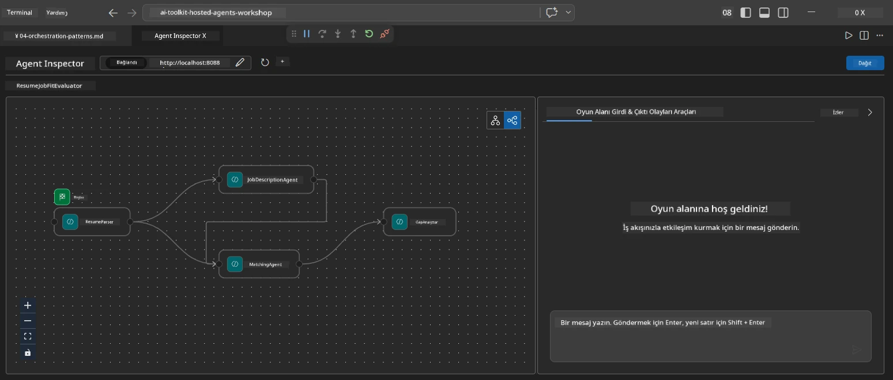
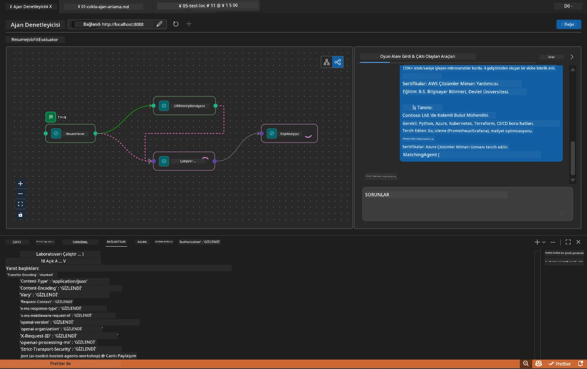
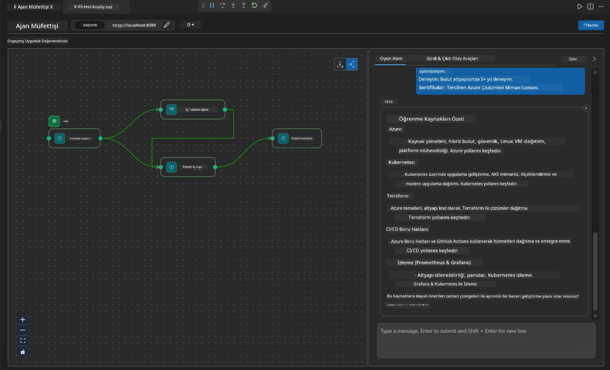

# Modül 5 - Yerelde Test Etme

⏱️ ~15 dakika

Bu modülde, çok ajanlı iş akışını yerelde çalıştıracak, Agent Inspector ile test edecek ve dağıtımdan önce dört ajan ile MCP aracının düzgün çalıştığını doğrulayacaksınız.

---

## Adım 1: Ajan sunucusunu başlat

### Seçenek A: VS Code görevi kullanarak (önerilen)

1. `workshop/lab02-multi-agent/PersonalCareerCopilot/` klasörünü VS Code klasörünüz olarak açın.
2. `Ctrl+Shift+P` tuşlarına basın → **Tasks: Run Task** yazın → **Run Agent HTTP Server** seçin.
3. Görev, `5679` portunda debugpy bağlı olarak ve ajanın `8088` portunda çalıştığı sunucuyu başlatır.
4. Çıktının şu mesajı göstermesini bekleyin:

```
INFO:resume-job-fit:Starting Resume -> Job Fit Evaluator HTTP server...
INFO:resume-job-fit:Server running on http://localhost:8088
```

### Seçenek B: F5 kullanarak (hata ayıklama modu)

1. `F5` tuşuna basın → **Debug Local Agent HTTP Server** seçin.
2. Sunucu tam kesme noktası desteği ile başlar - MCP yanıtlarını veya ajan çıktıları incelemek için faydalıdır.

---

## Adım 2: Agent Inspector'ı aç

1. `Ctrl+Shift+P` tuşlarına basın → **Foundry Toolkit: Open Agent Inspector** yazın.
2. Agent Inspector, `http://localhost:8088` adresine bağlı bir VS Code paneli olarak açılır.
3. Mesaj kabul etmeye hazır ajan arayüzünü görmelisiniz.



> **Agent Inspector açılmazsa:** Sunucunun tamamen başladığından (günlükte "Server running" görünmeli) emin olun. 5679 portu meşgulse, bkz. [Modül 8 - Sorun Giderme](08-troubleshooting.md).

---

## Adım 2b: (İsteğe Bağlı) İş Akışı Görselleştiriciyi Aç

Foundry Toolkit, ajanların grafik çalıştırılırken nasıl etkileşime girdiğini gösteren gerçek zamanlı bir **İş Akışı Görselleştirici** içerir. Bu, çok ajanlı hata ayıklama için özellikle faydalıdır.

1. `Ctrl+Shift+P` tuşlarına basın → **Foundry Toolkit: Open Visualizer for Hosted Agents** yazın.
2. Canlı yürütme grafiğini gösteren yeni bir VS Code sekmesi açılır.
3. Agent Inspector'da mesaj gönderirken, görselleştirici otomatik olarak güncellenir - yeşil düğümler tamamlanmış ajanları, animasyonlu kenarlar ise aralarındaki veri akışını gösterir.

> **Port çakışması:** Eğer görselleştirici portu zaten kullanılıyorsa, VS Code Ayarları → **Extensions** → **Microsoft Foundry Configuration** → **Hosted Agents: Visualizer Port** üzerinden değiştirin.

---

## Adım 3: Smoke testlerini çalıştır

Bu üç testi sırayla çalıştırın. Her biri iş akışının artan seviyede bölümünü test eder.

### Test 1: Temel özgeçmiş + iş tanımı

Aşağıdakini Agent Inspector'a yapıştırın:

```
Resume:
Jane Doe
Senior Software Engineer with 5 years of experience in Python, Django, and AWS.
Built microservices handling 10K+ requests/second. Led a team of 4 developers.
Certifications: AWS Solutions Architect Associate.
Education: B.S. Computer Science, State University.

Job Description:
Senior Cloud Engineer at Contoso Ltd.
Required: Python, Azure, Kubernetes, Terraform, CI/CD pipelines.
Preferred: Go, monitoring (Prometheus/Grafana), cost optimization.
Experience: 5+ years in cloud infrastructure.
Certifications: Azure Solutions Architect Expert preferred.
```

**Beklenen çıktı yapısı:**

Yanıt, dört ajanın art arda çıktılarını içermelidir:

1. **Özgeçmiş Ayrıştırıcı çıktısı** - İki etiketli bölüm: `[PARSED RESUME]` (yetenek gruplandırılmış aday profili) ve `[JOB DESCRIPTION PASS-THROUGH]` (JD Ajanına beslenen yazılı JD metni)
2. **İş Tanımı Ajanı çıktısı** - Gerekli ve tercih edilen yetenekler ayrılmış yapısal gereksinimler
3. **Eşleştirme Ajanı çıktısı** - 0-100 arası puanlama ve açıklaması, eşleşen yetenekler, eksik yetenekler, boşluklar
4. **Boşluk Analizörü çıktısı** - Her eksik yetenek için Microsoft Learn URL'leriyle bireysel boşluk kartları





### Test 1'de doğrulanacaklar

| Kontrol Et | Beklenen | Geçti mi? |
|-------|----------|-------|
| Yanıt puanlama içeriyor | 0-100 arası sayı ve detay | |
| Eşleşen yetenekler listelenmiş | Python, CI/CD (kısmi), vb. | |
| Eksik yetenekler listelenmiş | Azure, Kubernetes, Terraform, vb. | |
| Her eksik yetenek için boşluk kartları var | Her yetenek için bir kart | |
| Microsoft Learn URL'leri mevcut | Gerçek `learn.microsoft.com` bağlantıları | |
| Yanıtta hata mesajı yok | Temiz yapısal çıktı | |

### Test 2: Sınır durumu - yüksek puanlı aday

BoşlukAnalizörünün yüksek puanlı senaryoları doğru işlediğini doğrulamak için işi yakından eşleyen bir özgeçmiş yapıştırın:

```
Resume:
Alex Chen
Senior Cloud Engineer with 7 years of experience.
Skills: Python, Azure (AKS, Functions, DevOps), Kubernetes, Terraform, CI/CD (GitHub Actions, Azure Pipelines), Go, Prometheus, Grafana, cost optimization.
Certifications: Azure Solutions Architect Expert, Azure DevOps Engineer Expert.
Led infrastructure migration to Azure for 3 enterprise clients.
Education: M.S. Computer Science, Tech University.

Job Description:
Senior Cloud Engineer at Contoso Ltd.
Required: Python, Azure, Kubernetes, Terraform, CI/CD pipelines.
Preferred: Go, monitoring (Prometheus/Grafana), cost optimization.
Experience: 5+ years in cloud infrastructure.
Certifications: Azure Solutions Architect Expert preferred.
```

**Beklenen davranış:**
- Puanlama **80+** olmalı (çoğu yetenek eşleşiyor)
- Boşluk kartları temel öğrenmeden çok hazırlık/görünüşe odaklanmalı
- Boşluk Analizörü talimatları: "Fit >= 80 ise, hazırlık/görünüşe odaklan"

---

## Adım 4: Kendi verinizle test edin (isteğe bağlı)

Kendi özgeçmişinizi ve gerçek bir iş tanımını yapıştırmayı deneyin. Bu şunları doğrulamaya yardımcı olur:

- Ajanlar farklı özgeçmiş formatlarını (kronolojik, fonksiyonel, karma) idare ediyor
- JD Ajanı farklı iş tanımı stillerini (madde işaretleri, paragraflar, yapısal) idare ediyor
- MCP aracı gerçek yetenekler için ilgili kaynakları döndürüyor
- Boşluk kartları sizin özel geçmişinize göre kişiselleştirilmiş

> **Gizlilik - Yol A (Foundry bulut):** Özgeçmiş ve JD metni çıkarım için Azure OpenAI dağıtımınıza gönderilir. Atölye altyapısı tarafından kaydedilmez veya saklanmaz. İsterseniz yer tutucu isimler kullanabilirsiniz (örneğin "Jane Doe").
>
> **Gizlilik - Yol B (Foundry Yerel):** Dört ajanın tüm çıkarımları tamamen cihazınızda çalışır. Özgeçmiş ve iş tanımı metniniz **makinenizden asla çıkmaz**. Tek dış çağrı MCP aracının `https://learn.microsoft.com/api/mcp` adresinden kaynakları çekmesidir; bu sorgu sadece yetenek adı içerir, kişisel veriniz değil.

---

### Kontrol Noktası

- [ ] Sunucu `8088` portunda başarıyla başlatıldı (günlükte "Server running" yazıyor)
- [ ] Agent Inspector açıldı ve ajana bağlı
- [ ] Test 1: Puanlama, eşleşen/eksik yetenekler, boşluk kartları ve Microsoft Learn URL'leri ile tam yanıt
- [ ] Test 2: Yüksek puanlı aday 80+ puan alıyor, görünüş odaklı öneriler içeriyor
- [ ] Tüm boşluk kartları mevcut (her eksik yetenek için bir, hiç kırpılma yok)
- [ ] Sunucu terminalinde hata veya yığın izi yok

---

**Önceki:** [04 - Orkestrasyon Desenleri](04-orchestration-patterns.md) · **Sonraki:** [06 - Foundry'e Dağıt →](06-deploy-to-foundry.md)

---

<!-- CO-OP TRANSLATOR DISCLAIMER START -->
**Feragatname**:
Bu belge, AI çeviri hizmeti [Co-op Translator](https://github.com/Azure/co-op-translator) kullanılarak çevrilmiştir. Doğruluk için çaba sarf etsek de, otomatik çevirilerin hata veya yanlışlık içerebileceğini lütfen unutmayınız. Orijinal belge, kendi dilinde yetkili kaynak olarak kabul edilmelidir. Kritik bilgiler için profesyonel insan çevirisi önerilir. Bu çevirinin kullanımı sonucu ortaya çıkabilecek yanlış anlamalardan veya yanlış yorumlamalardan sorumlu değiliz.
<!-- CO-OP TRANSLATOR DISCLAIMER END -->