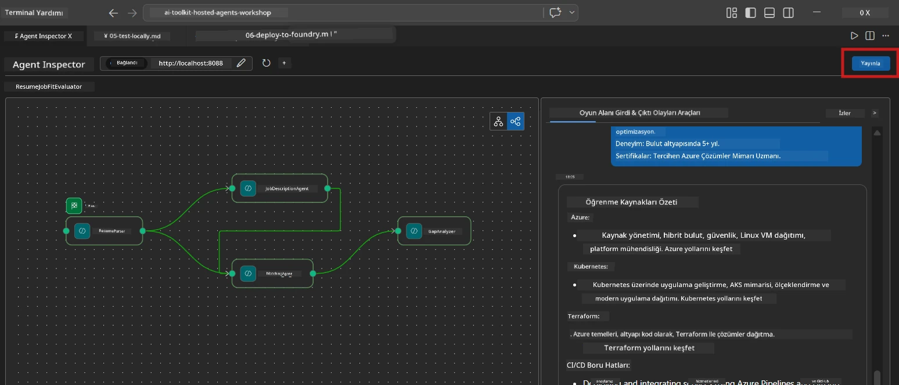
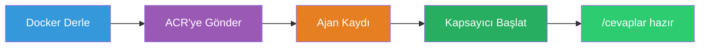
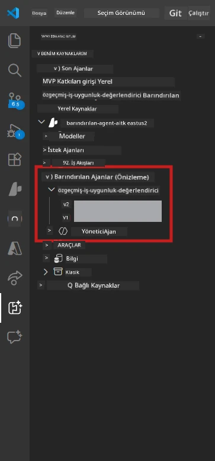

# Modül 6 - Foundry Agent Servisine Dağıtım

Bu modülde, yerel olarak test edilmiş çoklu ajan iş akışınızı [Microsoft Foundry](https://learn.microsoft.com/azure/foundry/agents/concepts/hosted-agents) üzerine **Barındırılan Ajan** olarak dağıtırsınız. Dağıtım süreci bir Docker konteyner imajı oluşturur, bunu [Azure Container Registry (ACR)](https://learn.microsoft.com/azure/container-registry/container-registry-intro) üzerine iter ve [Foundry Agent Service](https://learn.microsoft.com/azure/foundry/agents/how-to/publish-agent) içinde barındırılan ajan sürümü oluşturur.

> **Lab 01’den önemli fark:** Dağıtım süreci aynıdır. Foundry çoklu ajan iş akışınızı tek bir barındırılan ajan olarak ele alır - karmaşıklık konteyner içindedir, ancak dağıtım yüzeyi aynı `/responses` uç noktasıdır.

---

## Ön Gereksinimler Kontrolü

Dağıtımdan önce, aşağıdaki her maddeyi doğrulayın:

1. **Ajan yerel duman testlerinden geçti:**
   - [Modül 5](05-test-locally.md) içindeki tüm 3 testi tamamladınız ve iş akışı tam çıktı üretti, eksik kartlar ve Microsoft Learn URL’leri vardı.

2. **[Azure AI Kullanıcısı](https://learn.microsoft.com/azure/foundry/concepts/rbac-foundry) rolüne sahipsiniz:**
   - [Lab 01, Modül 2](../../lab01-single-agent/docs/02-create-foundry-project.md) içinde atandı. Doğrulama:
   - [Azure Portal](https://portal.azure.com) → Foundry **projeniz** kaynağı → **Erişim denetimi (IAM)** → **Rol atamaları** → hesabınız için **[Azure AI User](https://aka.ms/foundry-ext-project-role)** listelendiğini onaylayın.

3. **VS Code’da Azure’a giriş yaptınız:**
   - VS Code'un sol alt köşesindeki Hesap simgesine bakın. Hesap adınız görünmelidir.

4. **`agent.yaml` doğru değerlere sahip:**
   - `PersonalCareerCopilot/agent.yaml` dosyasını açın ve doğrulayın:
     ```yaml
     environment_variables:
       - name: PROJECT_ENDPOINT
         value: ${PROJECT_ENDPOINT}
       - name: MODEL_DEPLOYMENT_NAME
         value: ${MODEL_DEPLOYMENT_NAME}
     ```
   - Bunlar `main.py` tarafından okunan ortam değişkenleriyle eşleşmelidir.

5. **`requirements.txt` doğru sürümlerde:**
   ```
   agent-framework-azure-ai==1.0.0rc3
   agent-framework-core==1.0.0rc3
   azure-ai-agentserver-agentframework==1.0.0b16
   azure-ai-agentserver-core==1.0.0b16
   debugpy
   agent-dev-cli --pre
   ```

---

## Adım 1: Dağıtımı Başlat

### Seçenek A: Agent Inspector üzerinden dağıtım (önerilir)

Ajan F5 ile Agent Inspector açıkken çalışıyorsa:

1. Agent Inspector panelinin **sağ üst köşesine** bakın.
2. **Deploy** butonuna (yukarı ok işaretli bulut ikonu) tıklayın.
3. Dağıtım sihirbazı açılır.



### Seçenek B: Komut Paleti üzerinden dağıtım

1. `Ctrl+Shift+P` tuşlarına basarak **Komut Paleti**ni açın.
2. Yazın: **Microsoft Foundry: Deploy Hosted Agent** ve seçin.
3. Dağıtım sihirbazı açılır.

---

## Adım 2: Dağıtımı Yapılandır

### 2.1 Hedef projeyi seçin

1. Açılır menü Foundry projelerinizi gösterir.
2. Atölye boyunca kullandığınız projeyi seçin (örneğin, `workshop-agents`).

### 2.2 Konteyner ajan dosyasını seçin

1. Ajan giriş noktası seçmeniz istenir.
2. `workshop/lab02-multi-agent/PersonalCareerCopilot/` dizinine gidin ve **`main.py`** dosyasını seçin.

### 2.3 Kaynakları yapılandırın

| Ayar | Önerilen Değer | Notlar |
|---------|------------------|-------|
| **CPU** | `0.25` | Varsayılan. Çoklu ajan iş akışları daha fazla CPU’ya ihtiyaç duymaz çünkü model çağrıları I/O-bağlıdır |
| **Bellek** | `0.5Gi` | Varsayılan. Büyük veri işleme araçları ekliyorsanız `1Gi`'ye çıkarın |

---

## Adım 3: Onayla ve Dağıt

1. Sihirbaz dağıtım özetini gösterir.
2. İnceleyin ve **Onayla ve Dağıt** düğmesine tıklayın.
3. İlerlemeyi VS Code’da izleyin.

### Dağıtım sırasında neler olur

VS Code **Output** panelini izleyin ("Microsoft Foundry" açılır menüsünü seçin):


1. **Docker build** - `Dockerfile`’ınızdan konteyner oluşturur:
   ```
   Step 1/6 : FROM python:3.14-slim
   Step 2/6 : WORKDIR /app
   ...
   Successfully built abc123def456
   ```

2. **Docker push** - Görüntüyü ACR’ye iter (ilk dağıtımda 1-3 dakika sürer).

3. **Ajan kaydı** - Foundry, `agent.yaml` meta verisini kullanarak barındırılan ajan oluşturur. Ajan adı `resume-job-fit-evaluator`dır.

4. **Konteyner başlatma** - Konteyner Foundry'nin yönetilen altyapısında sistem tarafından yönetilen kimlikle başlatılır.

> **İlk dağıtım daha yavaştır** (Docker tüm katmanları iter). Sonraki dağıtımlar önbelleğe alınmış katmanları kullanarak daha hızlıdır.

### Çoklu ajan ile ilgili notlar

- **Tüm dört ajan tek konteyner içindedir.** Foundry bunu tek barındırılan ajan olarak görür. WorkflowBuilder grafiği dahili olarak çalışır.
- **MCP çağrıları dışa gider.** Konteyner `https://learn.microsoft.com/api/mcp` adresine ulaşmak için internete erişmelidir. Foundry’nin yönetilen altyapısı bunu varsayılan sağlar.
- **[Yönetilen Kimlik](https://learn.microsoft.com/python/api/overview/azure/identity-readme#managed-identity-support).** Barındırılan ortamda, `main.py` içindeki `get_credential()` `ManagedIdentityCredential()` döner (çünkü `MSI_ENDPOINT` ayarlanmıştır). Bu otomatikdir.

---

## Adım 4: Dağıtım Durumunu Doğrula

1. **Microsoft Foundry** yan çubuğunu açın (Aktivite Çubuğundaki Foundry simgesine tıklayın).
2. Proje altında **Hosted Agents (Preview)** öğesini genişletin.
3. **resume-job-fit-evaluator** (veya ajan adınızı) bulun.
4. Ajan adına tıklayın → sürümleri genişletin (örneğin `v1`).
5. Sürüme tıklayın → **Container Details** → **Durum** aşağıdaki gibidir:



| Durum | Anlamı |
|--------|---------|
| **Started** / **Running** | Konteyner çalışıyor, ajan hazır |
| **Pending** | Konteyner başlatılıyor (30-60 saniye bekleyin) |
| **Failed** | Konteyner başlatılamadı (logları kontrol edin - aşağıya bakın) |

> **Çoklu ajan başlatma süresi single-agenta göre daha uzundur** çünkü konteyner başlatma sırasında 4 ajan örneği oluşturur. "Pending" durumunun 2 dakikaya kadar sürmesi normaldir.

---

## Yaygın dağıtım hataları ve çözümleri

### Hata 1: İzin reddedildi - `agents/write`

```
Error: lacks the required data action 
Microsoft.CognitiveServices/accounts/AIServices/agents/write
```

**Çözüm:** **[Azure AI User](https://learn.microsoft.com/azure/foundry/concepts/rbac-foundry)** rolünü **proje** düzeyinde atayın. Adım adım talimatlar için [Modül 8 - Sorun Giderme](08-troubleshooting.md) bölümüne bakın.

### Hata 2: Docker çalışmıyor

```
Error: Docker build failed / Cannot connect to Docker daemon
```

**Çözüm:**
1. Docker Desktop’u başlatın.
2. "Docker Desktop is running" bildirisi çıkana kadar bekleyin.
3. Doğrulamak için: `docker info`
4. **Windows:** Docker Desktop ayarlarında WSL 2 backend’in etkin olduğundan emin olun.
5. Tekrar deneyin.

### Hata 3: Docker build sırasında pip install başarısız oluyor

```
Error: Could not find a version that satisfies the requirement agent-dev-cli
```

**Çözüm:** `requirements.txt` içindeki `--pre` bayrağı Docker’da farklı işlenir. Dosyanızda şu olduğundan emin olun:
```
agent-dev-cli --pre
```

Docker hata vermeye devam ederse, bir `pip.conf` oluşturun veya `--pre` bayrağını build argümanı ile geçirin. Detaylar için [Modül 8](08-troubleshooting.md) bölümüne bakın.

### Hata 4: MCP aracı barındırılan ajanda başarısız oluyor

Dağıtımdan sonra Gap Analyzer Microsoft Learn URL’leri üretmeyi durdurursa:

**Temel neden:** Ağ politikası konteynerden çıkan HTTPS bağlantısını engelliyor olabilir.

**Çözüm:**
1. Bu genellikle Foundry’nin varsayılan konfigürasyonunda sorun yaratmaz.
2. Oluşursa, Foundry projenizin sanal ağına bir NSG’nin çıkışta HTTPS’yi engelleyip engellemediğini kontrol edin.
3. MCP aracında yedek URL’ler mevcuttur, bu yüzden ajan çıktı üretmeye devam eder (canlı URL’ler olmadan).

---

### Kontrol Listesi

- [ ] Dağıtım komutu VS Code’da hata vermeden tamamlandı
- [ ] Ajan Foundry yan çubuğundaki **Hosted Agents (Preview)** altında görünüyor
- [ ] Ajan adı `resume-job-fit-evaluator` (veya seçtiğiniz ad)
- [ ] Konteyner durumu **Started** veya **Running** olarak gösteriliyor
- [ ] (Hata varsa) Hatanın kaynağını belirlediniz, çözümü uyguladınız ve yeniden dağıttınız

---

**Önceki:** [05 - Yerel Test](05-test-locally.md) · **Sonraki:** [07 - Playground’da Doğrulama →](07-verify-in-playground.md)

---

<!-- CO-OP TRANSLATOR DISCLAIMER START -->
**Feragatname**:  
Bu belge, AI çeviri hizmeti [Co-op Translator](https://github.com/Azure/co-op-translator) kullanılarak çevrilmiştir. Doğruluk için çaba gösterilse de, otomatik çevirilerin hatalar veya yanlışlıklar içerebileceğini lütfen unutmayın. Orijinal belge, kendi dilinde yetkili kaynak olarak kabul edilmelidir. Kritik bilgiler için profesyonel insan çevirisi önerilir. Bu çevirinin kullanımı sonucunda ortaya çıkabilecek yanlış anlamalar veya yanlış yorumlamalardan dolayı sorumluluk kabul edilmemektedir.
<!-- CO-OP TRANSLATOR DISCLAIMER END -->