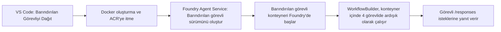
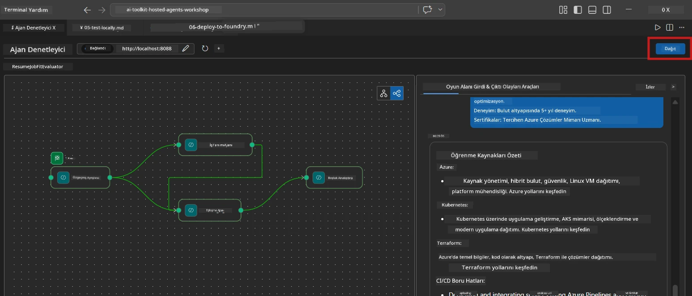
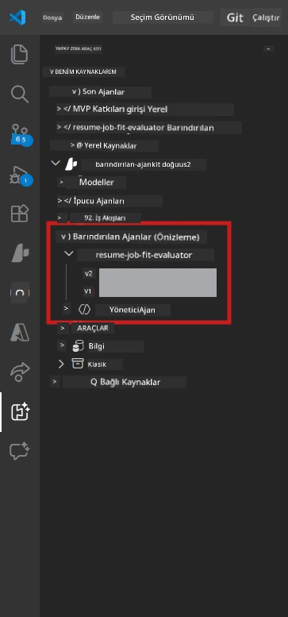

# Modül 6 - Foundry Agent Servisine Dağıtım

⏱️ ~10 dk

Bu modülde, yerel olarak test ettiğiniz çoklu ajan iş akışınızı [Microsoft Foundry](https://learn.microsoft.com/azure/foundry/agents/concepts/hosted-agents) üzerinde bir **Barındırılan Ajan** olarak dağıtırsınız. Dağıtım işlemi bir Docker konteyner imajı oluşturur, bunu [Azure Container Registry (ACR)](https://learn.microsoft.com/azure/container-registry/container-registry-intro) üzerine iter ve [Foundry Agent Service](https://learn.microsoft.com/azure/foundry/agents/how-to/publish-agent) içinde barındırılan bir ajan sürümü oluşturur.

> **Lab 01’den önemli fark:** Dağıtım süreci aynıdır. Foundry çoklu ajan iş akışınızı tek bir barındırılan ajan olarak ele alır - karmaşıklık konteynerin içindedir, ancak dağıtım yüzeyi aynı `/responses` uç noktasıdır.

### Dağıtım hattı


```mermaid
flowchart LR
    A[VS Code: Barındırılan Görevliyi Dağıt] --> B[Docker oluşturma ve ACR'ye itme]
    B --> C[Foundry Agent Service: Barındırılan görevli sürümünü oluştur]
    C --> D[Barındırılan görevli konteyneri Foundry'de başlar]
    D --> E[WorkflowBuilder, konteyner içinde 4 görevlide ardışık olarak çalışır]
    E --> F[Görevli /responses isteklerine yanıt verir]
```

---

## Önkoşullar kontrolü

Dağıtıma başlamadan önce, aşağıdaki maddelerin her birini doğrulayın:

1. **Ajan yerel duman testlerini geçti:**
   - [Modül 5](05-test-locally.md) içinde yer alan 3 testi tamamladınız ve iş akışı tam çıktıyı, boşluk kartları ve Microsoft Learn URL’leri ile oluşturdu.

2. **[Foundry Kullanıcısı](https://learn.microsoft.com/azure/foundry/concepts/rbac-foundry) rolüne sahipsiniz** (dağıtım için en az **Foundry Proje Yöneticisi** rolü proje kapsamına atanmış olmalıdır):

   > **Not:** Foundry RBAC rolleri yakın zamanda yeniden adlandırıldı - **Foundry Kullanıcısı**, **Foundry Sahibi**, ve **Foundry Proje Yöneticisi** daha önce Azure AI Kullanıcısı, Azure AI Sahibi ve Azure AI Proje Yöneticisi olarak adlandırılıyordu. Rol kimlikleri ve izinler değişmedi.

   - [Azure Portal](https://portal.azure.com) → Foundry **proje** kaynağınıza → **Erişim denetimi (IAM)** → **Rol atamaları** → hesabınız için **Foundry Kullanıcısı** (veya daha yüksek) rolünün listelendiğini doğrulayın.

3. **VS Code’da Azure’a giriş yaptınız:**
   - VS Code’un sol alt köşesindeki Hesaplar simgesini kontrol edin. Hesap adınız görünmelidir.

4. **`agent.yaml` dosyası doğru değerleri içeriyor:**
   - `PersonalCareerCopilot/agent.yaml` dosyasını açın ve doğrulayın:
     ```yaml
     environment_variables:
       - name: AZURE_AI_MODEL_DEPLOYMENT_NAME
         value: ${AZURE_AI_MODEL_DEPLOYMENT_NAME}
     ```
   - `FOUNDRY_PROJECT_ENDPOINT` burada listelenmez - Foundry bunu çalışma zamanında ekler. Sadece `AZURE_AI_MODEL_DEPLOYMENT_NAME` beyan edilmelidir.

5. **`requirements.txt` doğru sürümleri içeriyor:**
   ```
   agent-framework-foundry
   agent-framework-foundry-hosting
   mcp<2,>=1.24.0
   debugpy
   ```

---

## Adım 1: Dağıtımı başlat

### Seçenek A: Agent Inspector üzerinden dağıtım (önerilir)

Ajan, Agent Inspector açıkken F5 ile çalışıyorsa:

1. Agent Inspector panelinin **sağ üst köşesine** bakın.
2. **Deploy** butonuna tıklayın (yukarı ok ↑ olan bulut simgesi).
3. Dağıtım sihirbazı açılır.



### Seçenek B: Komut Paletinden dağıtım

1. `Ctrl+Shift+P` tuşlarına basarak **Komut Paletini** açın.
2. Yazın: **Foundry Toolkit: Deploy Hosted Agent** ve seçin.
3. Dağıtım sihirbazı açılır.

---

## Adım 2: Dağıtımı yapılandır

### 2.1 Hedef projeyi seç

1. Açılır menü Foundry projelerinizi gösterir.
2. Atölye genelinde kullandığınız projeyi seçin (örn. `workshop-agents`).

### 2.2 Konteyner ajan dosyasını seç

1. Ajan giriş noktasını seçmeniz istenecektir.
2. `workshop/lab02-multi-agent/PersonalCareerCopilot/` yoluna gidin ve **`main.py`** dosyasını seçin.

### 2.3 Kaynakları yapılandır

| Ayar | Önerilen değer | Notlar |
|---------|------------------|-------|
| **Dağıtım Yöntemi** | **Container** (önerilir) veya **Code** | Container Docker imajı oluşturur; Code kaynak kodunu ZIP olarak yükler (önizleme) |
| **Konteyner Kaydı** | **Varsayılan ACR** | Foundry sizin için bir tane oluşturur ve yönetir |
| **CPU** | `0.25` | Varsayılan. Çoklu ajan iş akışları daha fazla CPU’ya ihtiyaç duymaz çünkü model çağrıları G/Ç ağırlıklıdır |
| **Bellek** | `0.5Gi` | Varsayılan. Büyük veri işleme araçları eklenirse `1Gi` olarak arttırın |

---

## Adım 3: Onayla ve dağıt

1. Sihirbaz dağıtım özetini gösterir.
2. İnceleyin ve **Onayla ve Dağıt**a tıklayın.
3. İlerlemeyi VS Code’da izleyin.

### Dağıtım sırasında olanlar

VS Code **Çıktı** panelini izleyin (açılır menüden "Microsoft Foundry" seçin):

1. **Docker build** - Konteynerinizi `Dockerfile` dosyasından oluşturur
   ```
   Step 1/6 : FROM python:3.12-slim
   Step 2/6 : WORKDIR /app
   ...
   Successfully built abc123def456
   ```

2. **Docker push** - İmajı ACR’ye iter (ilk dağıtımda 1-3 dakika sürer).

3. **Ajan kaydı** - Foundry `agent.yaml` meta verilerini kullanarak barındırılan bir ajan oluşturur. Ajan adı `resume-job-fit-evaluator`dır.

4. **Konteyner başlatma** - Konteyner Foundry’nin yönetilen altyapısında sistem yönetilen kimlik ile başlatılır.

> **İlk dağıtım daha yavaştır** (Docker tüm katmanları iter). Sonraki dağıtımlar önbellekteki katmanları kullanır ve daha hızlıdır.

### Çoklu ajanlara özgü notlar

- **Dört ajanın tamamı tek konteyner içindedir.** Foundry tek bir barındırılan ajan görür. WorkflowBuilder grafiği dahili olarak çalışır.
- **MCP çağrıları dışa gider.** Konteynerin `https://learn.microsoft.com/api/mcp` adresine erişmek için internet erişimi gerekir. Foundry’nin yönetilen altyapısı bunu varsayılan olarak sağlar.
- **[Yönetilen Kimlik](https://learn.microsoft.com/azure/foundry/agents/concepts/agent-identity).** Foundry her barındırılan ajana deploy sırasında otomatik olarak **özel bir Entra kimliği** oluşturur. Barındırılan ortamda, `DefaultAzureCredential` otomatik olarak bu ajan kimliğini çözer - manuel yönetilen kimlik yapılandırması gerekmez.

---

## Adım 4: Dağıtım durumunu doğrula

1. **Microsoft Foundry** yan panelini açın (Etkinlik Çubuğundaki Foundry simgesine tıklayın).
2. Projeniz altında **Barındırılan Ajanlar (Önizleme)** bölümünü genişletin.
3. **resume-job-fit-evaluator** (veya sizin ajan adınız) öğesini bulun.
4. Ajan adına tıklayın → sürümleri genişletin (örn. `v1`).
5. Sürüme tıklayın → **Konteyner Detayları** → **Durum**u kontrol edin:



| Durum | Anlamı |
|--------|---------|
| **active** | Ajan çalışıyor ve istek kabul etmeye hazır |
| **creating** | Konteyner başlatılıyor (30–60 saniye bekleyin) |
| **failed** | Konteyner başlatılamadı (günlüklere bakın - aşağıya bakınız) |

> **Not:** VS Code yan paneli "Çalışıyor" veya "Başlatıldı" gibi etiketler gösterebilir, ancak altta yatan API durumu `active`/`creating` kullanır. Her iki gösterim de aynı durumu belirtir.

> **Çoklu ajan başlatması tek ajana göre daha uzun sürer** çünkü konteyner başlatıldığında 4 ajan örneği yaratılır. `creating` durumunun 2 dakikaya kadar sürmesi normaldir.

---

## Yaygın dağıtım hataları ve çözümleri

### Hata 1: İzin reddedildi - `agents/write`

```
Error: lacks the required data action 
Microsoft.CognitiveServices/accounts/AIServices/agents/write
```

**Çözüm:** **[Foundry Kullanıcısı](https://learn.microsoft.com/azure/foundry/concepts/rbac-foundry)** rolünü (önceden **Azure AI Kullanıcısı**) **proje** düzeyinde atayın. Adım adım talimatlar için [Modül 8 - Sorun Giderme](08-troubleshooting.md)’ya bakın.

### Hata 2: Docker çalışmıyor

```
Error: Docker build failed / Cannot connect to Docker daemon
```

**Çözüm:**
1. Docker Desktop'u başlatın.
2. "Docker Desktop çalışıyor" mesajını bekleyin.
3. Doğrulayın: `docker info`
4. **Windows:** Docker Desktop ayarlarında WSL 2 backend'in etkin olduğundan emin olun.
5. Tekrar deneyin.

### Hata 3: Docker build sırasında pip install başarısız oluyor

```
Error: Could not find a version that satisfies the requirement agent-framework-foundry
```

**Çözüm:** `requirements.txt` dosyasının aşağıdakiyle eşleştiğinden emin olun:
```
agent-framework-foundry
agent-framework-foundry-hosting
mcp<2,>=1.24.0
debugpy
```

Eğer build yine başarısız oluyorsa, Docker ağınız PyPI’ye erişimi engelliyor olabilir. Proxy ayarlarını kontrol etmek için `docker info` komutuna bakın.

### Hata 4: Barındırılan ajanda MCP aracı başarısız oluyor

Dağıtımdan sonra Gap Analyzer Microsoft Learn URL’leri üretmeyi keserse:

**Temel neden:** Ağ politikası konteynerden dışa doğru HTTPS trafiğini engelliyor olabilir.

**Çözüm:**
1. Bu genellikle Foundry’nin varsayılan konfigürasyonunda bir sorun değildir.
2. Olursa, Foundry projesinin sanal ağında dışa HTTPS trafiğini engelleyen bir NSG olup olmadığını kontrol edin.
3. MCP aracı gömülü yedek URL’lere sahiptir, bu nedenle ajan çıktı üretmeye devam edecektir (canlı URL’ler olmadan).

---

### Kontrol noktası

- [ ] Dağıtım komutu VS Code’da hatasız tamamlandı
- [ ] Ajan Foundry yan panelinde **Barındırılan Ajanlar (Önizleme)** altında görünüyor
- [ ] Ajan adı `resume-job-fit-evaluator` (veya sizin belirlediğiniz ad)
- [ ] Konteyner durumu **Başlatıldı** veya **Çalışıyor** olarak gösteriliyor
- [ ] (Hata varsa) Hatayı tespit ettiniz, çözümü uyguladınız ve başarıyla yeniden dağıttınız

---

**Önceki:** [05 - Yerelde Test Et](05-test-locally.md) · **Sonraki:** [07 - Playground’da Doğrulama →](07-verify-in-playground.md)

---

<!-- CO-OP TRANSLATOR DISCLAIMER START -->
**Feragatname**:
Bu belge, AI çeviri hizmeti [Co-op Translator](https://github.com/Azure/co-op-translator) kullanılarak çevrilmiştir. Doğruluk için çaba sarf etsek de, otomatik çevirilerin hata veya yanlışlık içerebileceğini lütfen unutmayınız. Orijinal belge, kendi dilinde yetkili kaynak olarak kabul edilmelidir. Kritik bilgiler için profesyonel insan çevirisi önerilir. Bu çevirinin kullanımı sonucu ortaya çıkabilecek yanlış anlamalardan veya yanlış yorumlamalardan sorumlu değiliz.
<!-- CO-OP TRANSLATOR DISCLAIMER END -->