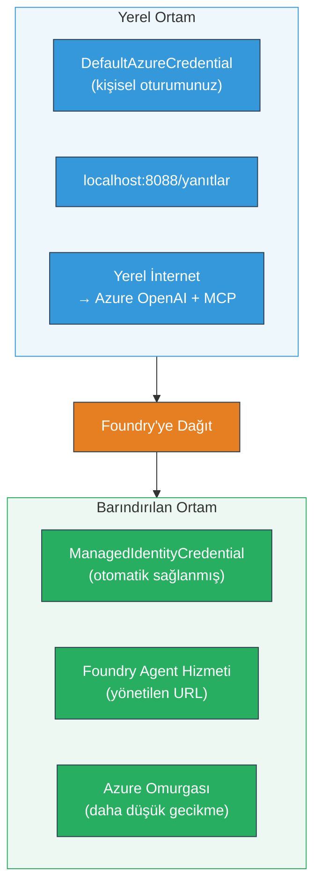

# Modül 7 - Playground'da Doğrulama

Bu modülde, dağıtılmış çoklu ajan iş akışınızı hem **VS Code** hem de **[Foundry Portal](https://ai.azure.com)** içinde test eder, ajanın yerel testlerle aynı şekilde davrandığını doğrularsınız.

---

## Neden dağıtımdan sonra doğrulama yapılmalı?

Çoklu ajan iş akışınız yerelde mükemmel çalıştıysa neden tekrar test yapıyorsunuz? Barındırılan ortam birkaç yönden farklıdır:


| Fark | Yerel | Barındırılan |
|-----------|-------|--------|
| **Kimlik** | [`DefaultAzureCredential`](https://learn.microsoft.com/azure/developer/python/sdk/authentication/credential-chains#defaultazurecredential-overview) (kişisel oturum açma) | [`ManagedIdentityCredential`](https://learn.microsoft.com/python/api/overview/azure/identity-readme#managed-identity-support) (otomatik sağlanan) |
| **Uç Nokta** | `http://localhost:8088/responses` | [Foundry Agent Service](https://learn.microsoft.com/azure/foundry/agents/concepts/hosted-agents) uç noktası (yönetilen URL) |
| **Ağ** | Yerel makine → Azure OpenAI + MCP çıkış | Azure omurgası (servisler arasında daha düşük gecikme) |
| **MCP bağlantısı** | Yerel internet → `learn.microsoft.com/api/mcp` | Konteyner çıkışı → `learn.microsoft.com/api/mcp` |

Herhangi bir ortam değişkeni yanlış yapılandırıldıysa, RBAC farklıysa veya MCP çıkışı engellendiyse, buradan yakalarsınız.

---

## Seçenek A: VS Code Playground'da Test Etme (ilk önerilen)

[Foundry eklentisi](https://marketplace.visualstudio.com/items?itemName=TeamsDevApp.vscode-ai-foundry), VS Code'dan çıkmadan dağıtılan ajanınızla sohbet etmenizi sağlayan entegre bir Playground içerir.

### Adım 1: Barındırılan ajanınıza gidin

1. VS Code **Aktivite Çubuğu**nda (sol kenar çubuğu) **Microsoft Foundry** simgesine tıklayarak Foundry panelini açın.
2. Bağlı projenizi genişletin (örneğin `workshop-agents`).
3. **Hosted Agents (Önizleme)** öğesini genişletin.
4. Ajan adınızı görmelisiniz (örneğin `resume-job-fit-evaluator`).

### Adım 2: Bir sürüm seçin

1. Ajan adına tıklayarak sürümlerini genişletin.
2. Dağıttığınız sürüme tıklayın (örneğin `v1`).
3. Bir **detay paneli** açılır ve Konteyner Ayrıntılarını gösterir.
4. Durumun **Başlatıldı** veya **Çalışıyor** olduğundan emin olun.

### Adım 3: Playground'u açın

1. Detay panelinde **Playground** düğmesine tıklayın (veya sürüme sağ tıklayıp → **Playground'da Aç**).
2. VS Code sekmesinde bir sohbet arayüzü açılır.

### Adım 4: Duman testlerinizi çalıştırın

[Modül 5](05-test-locally.md) içindeki aynı 3 testi kullanın. Her mesajı Playground giriş kutusuna yazıp **Gönder** (veya **Enter**) tuşuna basın.

#### Test 1 - Tam özgeçmiş + İş Tanımı (standart akış)

Modül 5, Test 1’den tam özgeçmiş + İş Tanımı istemini yapıştırın (Jane Doe + Contoso Ltd'de Kıdemli Bulut Mühendisi).

**Beklenen:**
- Parçalanmış matematikle uyum puanı (100 puan ölçeğinde)
- Eşleşen Yetkinlikler bölümü
- Eksik Yetkinlikler bölümü
- Eksik yetkinlik başına **bir boşluk kartı** ve Microsoft Learn URL'leri
- Zaman çizelgeli öğrenme yol haritası

#### Test 2 - Hızlı kısa test (minimum giriş)

```
RESUME: 3 years Python developer, knows Django and PostgreSQL, no cloud experience.

JOB: Cloud DevOps Engineer requiring AWS, Kubernetes, Terraform, CI/CD. 5 years needed.
```

**Beklenen:**
- Düşük uyum puanı (< 40)
- Aşamalı öğrenme yolu ile dürüst değerlendirme
- Çoklu boşluk kartları (AWS, Kubernetes, Terraform, CI/CD, deneyim boşluğu)

#### Test 3 - Yüksek uygunluklu aday

```
RESUME:
10 years Azure Cloud Architect. AZ-305 certified. Expert in AKS, Terraform, Azure DevOps, 
Azure Functions, Helm, Prometheus, Grafana, Python, Go. Led platform team of 8.

JOB:
Senior Cloud Engineer. Required: AKS, Terraform, Azure DevOps, Python. Preferred: Helm, Go.
5+ years experience. AZ-305 preferred.
```

**Beklenen:**
- Yüksek uyum puanı (≥ 80)
- Mülakat hazırlığına ve parlatmaya odaklı
- Az veya hiç boşluk kartı yok
- Hazırlığa odaklı kısa zaman çizelgesi

### Adım 5: Yerel sonuçlarla karşılaştırın

Modül 5'te yerel yanıtları kaydettiğiniz notlarınızı veya tarayıcı sekmenizi açın. Her test için:

- Yanıt **aynı yapıda mı** (uyum puanı, boşluk kartları, yol haritası)?
- **Aynı puanlama kurallarına mı** uyuyor (100 puanlık parçalanmış hesaplama)?
- Boşluk kartlarında hala **Microsoft Learn URL’leri** var mı?
- Eksik yetkinlik başına **bir boşluk kartı** var mı (kısaltılmamış)?

> **Küçük ifade farklılıkları normaldir** - model deterministik değildir. Yapı, puanlama tutarlılığı ve MCP aracı kullanımı üzerine odaklanın.

---

## Seçenek B: Foundry Portal’da Test Etme

[Foundry Portal](https://ai.azure.com), takım arkadaşları veya paydaşlarla paylaşım için kullanışlı web tabanlı bir playground sunar.

### Adım 1: Foundry Portal’ı açın

1. Tarayıcınızı açın ve [https://ai.azure.com](https://ai.azure.com) adresine gidin.
2. Atölye boyunca kullandığınız aynı Azure hesabınızla oturum açın.

### Adım 2: Projenize gidin

1. Ana sayfada, sol kenar çubuğunda **Son projeler** bölümünü bulun.
2. Proje adınıza tıklayın (örneğin `workshop-agents`).
3. Görmüyorsanız, **Tüm projeler**e tıklayın ve arama yapın.

### Adım 3: Dağıtılan ajanınızı bulun

1. Proje sol navigasyonda **Build** → **Agents** tıklayın (veya **Agents** bölümüne bakın).
2. Ajan listesi göreceksiniz. Dağıtılan ajanınızı bulun (örneğin `resume-job-fit-evaluator`).
3. Ajan adına tıklayarak detay sayfasını açın.

### Adım 4: Playground’u açın

1. Ajan detay sayfasında, üst araç çubuğuna bakın.
2. **Playground’da aç** (veya **Playground’da dene**) düğmesine tıklayın.
3. Sohbet arayüzü açılır.

### Adım 5: Aynı duman testlerini çalıştırın

Yukarıdaki VS Code Playground bölümündeki tüm 3 testi tekrarlayın. Her yanıtı yerel sonuçlar (Modül 5) ve VS Code Playground sonuçları (Yukarıdaki Seçenek A) ile karşılaştırın.

---

## Çoklu ajan özel doğrulama

Temel doğruluğun ötesinde, şu çoklu ajan özel davranışları doğrulayın:

### MCP aracı çalıştırma

| Kontrol | Nasıl doğrulanır | Geçme koşulu |
|-------|---------------|----------------|
| MCP çağrıları başarılı | Boşluk kartlarında `learn.microsoft.com` URL’leri var | Gerçek URL’ler, yedek mesajlar değil |
| Birden çok MCP çağrısı | Yüksek/Orta öncelikli boşlukların her birinde kaynaklar var | Sadece ilk boşluk kartı değil |
| MCP yedeği çalışıyor | URL’ler yoksa yedek metin aranır | Ajan hâlâ boşluk kartları üretir (URL'li veya URL’siz) |

### Ajan koordinasyonu

| Kontrol | Nasıl doğrulanır | Geçme koşulu |
|-------|---------------|----------------|
| Tüm 4 ajan çalıştı | Çıktı hem uyum puanı hem boşluk kartları içeriyor | Puan MatchingAgent’dan, kartlar GapAnalyzer’dan gelir |
| Paralel yayılım | Yanıt süresi makul (< 2 dk) | > 3 dk ise, paralel yürütme çalışmıyor olabilir |
| Veri akışı bütünlüğü | Boşluk kartları eşleştirme raporundaki yetkinliklere referans verir | JD’de olmayan hayali yetkinlik yok |

---

## Doğrulama rubriği

Barındırılan çoklu ajan iş akışınızın davranışını değerlendirmek için bu rubriği kullanın:

| # | Kriter | Geçme koşulu | Geçti mi? |
|---|----------|---------------|-------|
| 1 | **Fonksiyonel doğruluk** | Ajan, özgeçmiş + JD’ye uyum skoru ve boşluk analizi ile yanıt verir | |
| 2 | **Puanlama tutarlılığı** | Uyum puanı 100 puan ölçeğinde parçalanmış matematik kullanır | |
| 3 | **Boşluk kartı bütünlüğü** | Eksik yetkinlik başına bir kart (kısaltılmış veya birleştirilmiş değil) | |
| 4 | **MCP araç entegrasyonu** | Boşluk kartlarında gerçek Microsoft Learn URL’leri var | |
| 5 | **Yapısal tutarlılık** | Çıktı yapısı yerel ve barındırılan çalıştırmalar arasında eşleşir | |
| 6 | **Yanıt süresi** | Barındırılan ajan tam değerlendirme için 2 dakika içinde yanıt verir | |
| 7 | **Hata yok** | HTTP 500 hatası, zaman aşımı veya boş yanıt yok | |

> "Geçti" demek, tüm 3 duman testi için en az bir playground’da (VS Code veya Portal) tüm 7 kriterin karşılandığı anlamına gelir.

---

## Playground sorun giderme

| Belirti | Muhtemel neden | Çözüm |
|---------|-------------|-----|
| Playground yüklenmiyor | Konteyner durumu "Başlatıldı" değil | [Modül 6](06-deploy-to-foundry.md) geri dönün, dağıtım durumunu kontrol edin. "Beklemede" ise bekleyin |
| Ajan boş yanıt veriyor | Model dağıtım adı uyumsuz | `agent.yaml` → `environment_variables` → `MODEL_DEPLOYMENT_NAME` dağıtılan model ile eşleşiyor mu kontrol edin |
| Ajan hata mesajı veriyor | [RBAC](https://learn.microsoft.com/azure/foundry/concepts/rbac-foundry) izni eksik | Proje kapsamına **[Azure AI Kullanıcısı](https://aka.ms/foundry-ext-project-role)** atayın |
| Boşluk kartlarında Microsoft Learn URL’si yok | MCP çıkışı engellendi veya MCP sunucusu kullanılamıyor | Konteynerin `learn.microsoft.com` erişebildiğini kontrol edin. Bakın: [Modül 8](08-troubleshooting.md) |
| Sadece 1 boşluk kartı var (kısaltılmış) | GapAnalyzer talimatlarında "CRITICAL" bloğu eksik | [Modül 3, Adım 2.4](03-configure-agents.md)’u gözden geçirin |
| Uyum puanı yerelden çok farklı | Farklı model veya talimat dağıtıldı | `agent.yaml` ortam değişkenlerini yereldeki `.env` ile karşılaştırın. Gerekirse yeniden dağıtın |
| Portal'da "Ajan bulunamadı" | Dağıtım hâlâ yayılıyor veya başarısız oldu | 2 dakika bekleyin, sayfayı yenileyin. Hala yoksa [Modül 6](06-deploy-to-foundry.md)’den yeniden dağıtın |

---

### Kontrol noktası

- [ ] VS Code Playground’da ajanı test ettim - tüm 3 duman testini geçti
- [ ] [Foundry Portal](https://ai.azure.com) Playground’da ajanı test ettim - tüm 3 duman testini geçti
- [ ] Yanıtlar yerel testlerle yapısal olarak tutarlı (uyum puanı, boşluk kartları, yol haritası)
- [ ] Microsoft Learn URL’leri boşluk kartlarında mevcut (barındırılan ortamda MCP aracı çalışıyor)
- [ ] Eksik yetkinlik başına bir boşluk kartı (kısaltma yok)
- [ ] Test sırasında hata veya zaman aşımı olmadı
- [ ] Doğrulama rubriğini tamamladım (tüm 7 kriter geçti)

---

**Önceki:** [06 - Foundry’e dağıt](06-deploy-to-foundry.md) · **Sonraki:** [08 - Sorun Giderme →](08-troubleshooting.md)

---

<!-- CO-OP TRANSLATOR DISCLAIMER START -->
**Feragatname**:  
Bu belge, AI çeviri hizmeti [Co-op Translator](https://github.com/Azure/co-op-translator) kullanılarak çevrilmiştir. Doğruluk için çaba göstersek de, otomatik çevirilerin hata veya yanlışlık içerebileceğini lütfen unutmayın. Orijinal belge, kendi ana dilinde yetkili kaynak olarak kabul edilmelidir. Kritik bilgiler için profesyonel insan çevirisi tavsiye edilir. Bu çevirinin kullanımı sonucunda ortaya çıkabilecek herhangi bir yanlış anlama veya yorum hatasından sorumlu değiliz.
<!-- CO-OP TRANSLATOR DISCLAIMER END -->