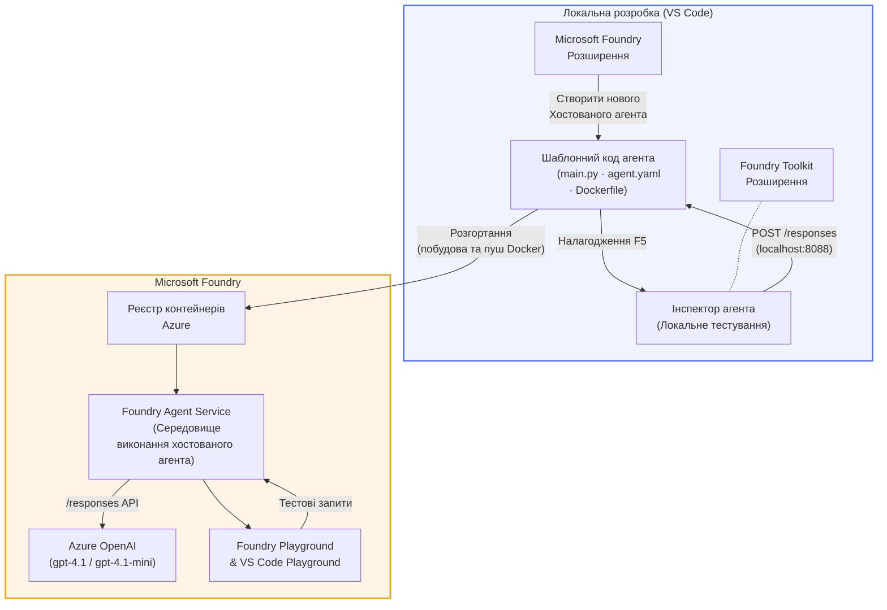

# Foundry Toolkit + Майстерня знайомства з Hosted Agents у Foundry

[](https://www.python.org/)
[](https://github.com/microsoft/agents)
[](https://learn.microsoft.com/azure/ai-foundry/agents/concepts/hosted-agents/)
[](https://ai.azure.com/)
[](https://learn.microsoft.com/azure/ai-services/openai/)
[](https://learn.microsoft.com/cli/azure/install-azure-cli)
[](https://learn.microsoft.com/azure/developer/azure-developer-cli/install-azd)
[](https://www.docker.com/)
[](https://marketplace.visualstudio.com/items?itemName=ms-windows-ai-studio.windows-ai-studio)
[](LICENSE)

Створюйте, тестуйте та розгортайте AI-агентів у **Microsoft Foundry Agent Service** як **Hosted Agents** - повністю з VS Code за допомогою розширення **Microsoft Foundry** та **Foundry Toolkit**.

> **Hosted Agents наразі знаходяться на стадії прев’ю.** Підтримувані регіони обмежені - див. [доступність регіонів](https://learn.microsoft.com/azure/foundry/agents/concepts/hosted-agents#region-availability).

> Папка `agent/` всередині кожної лабораторії **автоматично створюється** за допомогою розширення Foundry - далі ви налаштовуєте код, тестуєте локально та розгортаєте.

<!-- CO-OP TRANSLATOR LANGUAGES TABLE START -->
[Arabic](../ar/README.md) | [Bengali](../bn/README.md) | [Bulgarian](../bg/README.md) | [Burmese (Myanmar)](../my/README.md) | [Chinese (Simplified)](../zh-CN/README.md) | [Chinese (Traditional, Hong Kong)](../zh-HK/README.md) | [Chinese (Traditional, Macau)](../zh-MO/README.md) | [Chinese (Traditional, Taiwan)](../zh-TW/README.md) | [Croatian](../hr/README.md) | [Czech](../cs/README.md) | [Danish](../da/README.md) | [Dutch](../nl/README.md) | [Estonian](../et/README.md) | [Finnish](../fi/README.md) | [French](../fr/README.md) | [German](../de/README.md) | [Greek](../el/README.md) | [Hebrew](../he/README.md) | [Hindi](../hi/README.md) | [Hungarian](../hu/README.md) | [Indonesian](../id/README.md) | [Italian](../it/README.md) | [Japanese](../ja/README.md) | [Kannada](../kn/README.md) | [Khmer](../km/README.md) | [Korean](../ko/README.md) | [Lithuanian](../lt/README.md) | [Malay](../ms/README.md) | [Malayalam](../ml/README.md) | [Marathi](../mr/README.md) | [Nepali](../ne/README.md) | [Nigerian Pidgin](../pcm/README.md) | [Norwegian](../no/README.md) | [Persian (Farsi)](../fa/README.md) | [Polish](../pl/README.md) | [Portuguese (Brazil)](../pt-BR/README.md) | [Portuguese (Portugal)](../pt-PT/README.md) | [Punjabi (Gurmukhi)](../pa/README.md) | [Romanian](../ro/README.md) | [Russian](../ru/README.md) | [Serbian (Cyrillic)](../sr/README.md) | [Slovak](../sk/README.md) | [Slovenian](../sl/README.md) | [Spanish](../es/README.md) | [Swahili](../sw/README.md) | [Swedish](../sv/README.md) | [Tagalog (Filipino)](../tl/README.md) | [Tamil](../ta/README.md) | [Telugu](../te/README.md) | [Thai](../th/README.md) | [Turkey](../tr/README.md) | [Ukrainian](./README.md) | [Urdu](../ur/README.md) | [Vietnamese](../vi/README.md)

> **Віддаєте перевагу клону локально?**
>
> Цей репозиторій містить понад 50 мовних перекладів, що значно збільшує розмір завантаження. Щоб клонувати без перекладів, використовуйте sparse checkout:
>
> **Bash / macOS / Linux:**
> ```bash
> git clone --filter=blob:none --sparse https://github.com/microsoft-foundry/Foundry_Toolkit_for_VSCode_Lab.git
> cd Foundry_Toolkit_for_VSCode_Lab
> git sparse-checkout set --no-cone '/*' '!translations' '!translated_images'
> ```
>
> **CMD (Windows):**
> ```cmd
> git clone --filter=blob:none --sparse https://github.com/microsoft-foundry/Foundry_Toolkit_for_VSCode_Lab.git
> cd Foundry_Toolkit_for_VSCode_Lab
> git sparse-checkout set --no-cone "/*" "!translations" "!translated_images"
> ```
>
> Це дасть змогу отримати все необхідне для проходження курсу із значно швидшим завантаженням.
<!-- CO-OP TRANSLATOR LANGUAGES TABLE END -->

---

## Архітектура


**Потік:** розширення Foundry створює каркас агента → ви налаштовуєте код і інструкції → тестуєте локально з Agent Inspector → розгортаєте в Foundry (Docker-образ завантажується в ACR) → перевіряєте в Playground.

---

## Що ви створите

| Лабораторія | Опис | Статус |
|-----|-------------|--------|
| **Лабораторія 01 - Один агент** | Створіть **"Поясніть як для керівника"** агента, протестуйте його локально та розгорніть у Foundry | ✅ Доступно |
| **Лабораторія 02 - Робочий процес із кількома агентами** | Створіть **"Оцінювач резюме → відповідність посаді"** - 4 агенти співпрацюють для оцінки відповідності резюме та створення плану навчання | ✅ Доступно |

---

## Знайомтеся з агентом для керівника

У цій майстерні ви створите **"Поясніть як для керівника"** агента — AI-агента, який спрощує складний технічний жаргон до спокійних, готових для засідання рад резюме. Адже давайте чесно, ніхто в керівництві не хоче чути про "виснаження пулу потоків, спричинене синхронними викликами, введеними у версії 3.2."

Я створив цього агента після кількох випадків, коли моє досконале посмертне розслідування отримувало відповідь: *"То... сайт працює чи ні?"*

### Як це працює

Ви даєте йому технічне оновлення. Він повертає резюме для керівника - три пунктові тези, без жаргону, без трасування стеку, без екзистенціального страху. Лише **що сталося**, **вплив на бізнес** та **наступний крок**.

### Подивіться, як це працює

**Ви кажете:**
> "Час відгуку API збільшився через виснаження пулу потоків, спричинене синхронними викликами, введеними у версії 3.2."

**Агент відповідає:**

> **Резюме для керівника:**
> - **Що сталося:** Після останнього релізу система сповільнилася.
> - **Вплив на бізнес:** Деякі користувачі зіткнулися з затримками під час користування сервісом.
> - **Наступний крок:** Зміни було скасовано, готується виправлення перед повторним розгортанням.

### Чому саме цей агент?

Це надзвичайно простий, однозадачний агент — ідеально підходить для вивчення робочого процесу hosted agent повністю без ускладнень із складними ланцюжками інструментів. І чесно кажучи? Кожній команді інженерів такий потрібен.

---

## Структура майстерні

```
📂 Foundry_Toolkit_for_VSCode_Lab/
├── 📄 README.md                      ← You are here
├── 📂 ExecutiveAgent/                ← Standalone hosted agent project
│   ├── agent.yaml
│   ├── Dockerfile
│   ├── main.py
│   └── requirements.txt
└── 📂 workshop/
    ├── 📂 lab01-single-agent/        ← Full lab: docs + agent code
    │   ├── README.md                 ← Hands-on lab instructions
    │   ├── 📂 docs/                  ← Step-by-step tutorial modules
    │   │   ├── 00-prerequisites.md
    │   │   ├── 01-install-foundry-toolkit.md
    │   │   ├── 02-create-foundry-project.md
    │   │   ├── 03-create-hosted-agent.md
    │   │   ├── 04-configure-and-code.md
    │   │   ├── 05-test-locally.md
    │   │   ├── 06-deploy-to-foundry.md
    │   │   ├── 07-verify-in-playground.md
    │   │   └── 08-troubleshooting.md
    │   └── 📂 agent/                 ← Reference solution (auto-scaffolded by Foundry extension)
    │       ├── agent.yaml
    │       ├── Dockerfile
    │       ├── main.py
    │       └── requirements.txt
    └── 📂 lab02-multi-agent/         ← Resume → Job Fit Evaluator
        ├── README.md                 ← Hands-on lab instructions (end-to-end)
        ├── 📂 docs/                  ← Step-by-step tutorial modules
        │   ├── 00-prerequisites.md
        │   ├── 01-understand-multi-agent.md
        │   ├── 02-scaffold-multi-agent.md
        │   ├── 03-configure-agents.md
        │   ├── 04-orchestration-patterns.md
        │   ├── 05-test-locally.md
        │   ├── 06-deploy-to-foundry.md
        │   ├── 07-verify-in-playground.md
        │   └── 08-troubleshooting.md
        └── 📂 PersonalCareerCopilot/ ← Reference solution (multi-agent workflow)
            ├── agent.yaml
            ├── Dockerfile
            ├── main.py
            └── requirements.txt
```

> **Примітка:** папка `agent/` всередині кожної лабораторії — це те, що **створює розширення Microsoft Foundry**, коли ви запускаєте команду `Microsoft Foundry: Create a New Hosted Agent` із Command Palette. Файли далі налаштовуються вашими інструкціями, інструментами та конфігураціями агента. Лабораторія 01 проведе вас через цей процес з самого початку.

---

## Початок роботи

### 1. Склонуйте репозиторій

```bash
git clone https://github.com/microsoft-foundry/Foundry_Toolkit_for_VSCode_Lab.git
cd Foundry_Toolkit_for_VSCode_Lab
```

### 2. Налаштуйте віртуальне середовище Python

```bash
python -m venv venv
```

Активуйте його:

- **Windows (PowerShell):**
  ```powershell
  .\venv\Scripts\Activate.ps1
  ```
- **macOS / Linux:**
  ```bash
  source venv/bin/activate
  ```

### 3. Встановіть залежності

```bash
pip install -r workshop/lab01-single-agent/agent/requirements.txt
```

### 4. Налаштуйте змінні середовища

Скопіюйте приклад `.env` файлу у папку агента і заповніть свої значення:

```bash
cp workshop/lab01-single-agent/agent/.env.example workshop/lab01-single-agent/agent/.env
```

Редагуйте `workshop/lab01-single-agent/agent/.env`:

```env
AZURE_AI_PROJECT_ENDPOINT=https://<your-account>.services.ai.azure.com/api/projects/<your-project>
MODEL_DEPLOYMENT_NAME=<your-model-deployment-name>
```

### 5. Дотримуйтесь лабораторій майстерні

Кожна лабораторія є автономною і має власні модулі. Почніть з **Лабораторії 01**, щоб вивчити основи, а потім переходьте до **Лабораторії 02** для роботи з кількома агентами.

#### Лабораторія 01 - Один агент ([повні інструкції](workshop/lab01-single-agent/README.md))

| № | Модуль | Посилання |
|---|--------|------|
| 1 | Ознайомлення з вимогами | [00-prerequisites.md](workshop/lab01-single-agent/docs/00-prerequisites.md) |
| 2 | Встановлення Foundry Toolkit та розширення Foundry | [01-install-foundry-toolkit.md](workshop/lab01-single-agent/docs/01-install-foundry-toolkit.md) |
| 3 | Створення Foundry проекту | [02-create-foundry-project.md](workshop/lab01-single-agent/docs/02-create-foundry-project.md) |
| 4 | Створення hosted агента | [03-create-hosted-agent.md](workshop/lab01-single-agent/docs/03-create-hosted-agent.md) |
| 5 | Налаштування інструкцій та середовища | [04-configure-and-code.md](workshop/lab01-single-agent/docs/04-configure-and-code.md) |
| 6 | Локальне тестування | [05-test-locally.md](workshop/lab01-single-agent/docs/05-test-locally.md) |
| 7 | Розгортання у Foundry | [06-deploy-to-foundry.md](workshop/lab01-single-agent/docs/06-deploy-to-foundry.md) |
| 8 | Перевірка в playground | [07-verify-in-playground.md](workshop/lab01-single-agent/docs/07-verify-in-playground.md) |
| 9 | Вирішення проблем | [08-troubleshooting.md](workshop/lab01-single-agent/docs/08-troubleshooting.md) |

#### Лабораторія 02 - Робочий процес із кількома агентами ([повні інструкції](workshop/lab02-multi-agent/README.md))

| № | Модуль | Посилання |
|---|--------|------|
| 1 | Вимоги (Лабораторія 02) | [00-prerequisites.md](workshop/lab02-multi-agent/docs/00-prerequisites.md) |
| 2 | Розуміння архітектури з кількома агентами | [01-understand-multi-agent.md](workshop/lab02-multi-agent/docs/01-understand-multi-agent.md) |
| 3 | Каркас проєкту з кількома агентами | [02-scaffold-multi-agent.md](workshop/lab02-multi-agent/docs/02-scaffold-multi-agent.md) |
| 4 | Налаштування агентів та середовища | [03-configure-agents.md](workshop/lab02-multi-agent/docs/03-configure-agents.md) |
| 5 | Патерни оркестрації | [04-orchestration-patterns.md](workshop/lab02-multi-agent/docs/04-orchestration-patterns.md) |
| 6 | Локальне тестування (багатоагентне) | [05-test-locally.md](workshop/lab02-multi-agent/docs/05-test-locally.md) |
| 7 | Розгортання у Foundry | [06-deploy-to-foundry.md](workshop/lab02-multi-agent/docs/06-deploy-to-foundry.md) |
| 8 | Перевірка у playground | [07-verify-in-playground.md](workshop/lab02-multi-agent/docs/07-verify-in-playground.md) |
| 9 | Вирішення проблем (multi-agent) | [08-troubleshooting.md](workshop/lab02-multi-agent/docs/08-troubleshooting.md) |

---

## Відповідальний

<table>
<tr>
    <td align="center"><a href="https://github.com/ShivamGoyal03">
        <br />
        <sub><b>Шивам Гоял</b></sub>
    </a><br />
    </td>
</tr>
</table>

---

## Необхідні дозволи (швидке посилання)

| Сценарій | Необхідні ролі |
|----------|---------------|
| Створити новий проект Foundry | **Azure AI Owner** на ресурсі Foundry |
| Розгортання у існуючий проект (нові ресурси) | **Azure AI Owner** + **Contributor** у підписці |
| Розгортання у повністю налаштований проект | **Reader** в обліковому записі + **Azure AI User** у проекті |

> **Важливо:** Ролі Azure `Owner` та `Contributor` включають лише *керуючі* дозволи, а не *розробницькі* (дії з даними). Вам потрібен **Azure AI User** або **Azure AI Owner** для створення і розгортання агентів.

---

## Посилання

- [Швидкий старт: Розгорніть свого першого хостованого агента (VS Code)](https://learn.microsoft.com/azure/foundry/agents/quickstarts/quickstart-hosted-agent)
- [Що таке хостовані агенти?](https://learn.microsoft.com/azure/foundry/agents/concepts/hosted-agents)
- [Створення робочих процесів хостованих агентів у VS Code](https://learn.microsoft.com/azure/foundry/agents/how-to/vs-code-agents-workflow-pro-code)
- [Розгортання хостованого агента](https://learn.microsoft.com/azure/foundry/agents/how-to/deploy-hosted-agent)
- [RBAC для Microsoft Foundry](https://learn.microsoft.com/azure/foundry/concepts/rbac-foundry)
- [Приклад агента для огляду архітектури](https://github.com/Azure-Samples/agent-architecture-review-sample) - Реальний хостований агент із інструментами MCP, діаграмами Excalidraw та подвійним розгортанням

---


## Ліцензія

[MIT](../../LICENSE)

---

<!-- CO-OP TRANSLATOR DISCLAIMER START -->
**Відмова від відповідальності**:  
Цей документ був перекладений за допомогою сервісу автоматичного перекладу [Co-op Translator](https://github.com/Azure/co-op-translator). Хоч ми й прагнемо до точності, будь ласка, майте на увазі, що автоматичні переклади можуть містити помилки або неточності. Оригінальний документ рідною мовою слід вважати авторитетним джерелом. Для критично важливої інформації рекомендується звертатися до професійного людського перекладу. Ми не несемо відповідальності за будь-які непорозуміння чи неправильні тлумачення, що виникли внаслідок використання цього перекладу.
<!-- CO-OP TRANSLATOR DISCLAIMER END -->