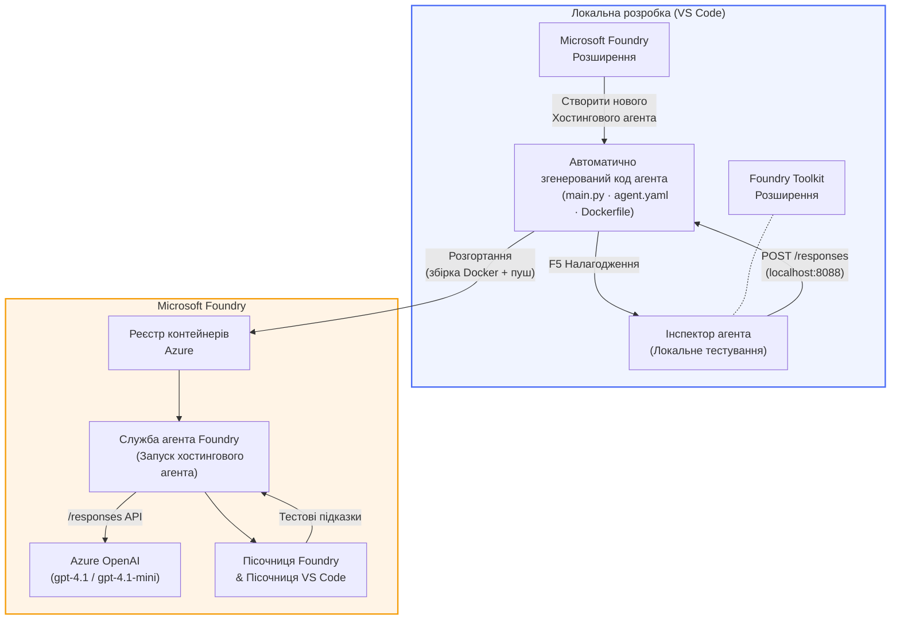

# Foundry Toolkit + Foundry Hosted Agents Workshop

[](https://www.python.org/)
[](https://github.com/microsoft/agents)
[](https://learn.microsoft.com/azure/ai-foundry/agents/concepts/hosted-agents/)
[](https://ai.azure.com/)
[](https://learn.microsoft.com/azure/ai-services/openai/)
[](https://learn.microsoft.com/cli/azure/install-azure-cli)
[](https://learn.microsoft.com/azure/developer/azure-developer-cli/install-azd)
[](https://www.docker.com/)
[](https://marketplace.visualstudio.com/items?itemName=ms-windows-ai-studio.windows-ai-studio)
[](LICENSE)

Створюйте, тестуйте та розгортайте AI агентів у **Microsoft Foundry Agent Service** як **Hosted Agents** — повністю з VS Code, використовуючи **Microsoft Foundry extension** та **Foundry Toolkit**.

> **Hosted Agents наразі у режимі попереднього перегляду.** Підтримувані регіони обмежені — див. [region availability](https://learn.microsoft.com/azure/foundry/agents/concepts/hosted-agents#region-availability).

> Папка `agent/` у кожній лабораторії **автоматично створюється** розширенням Foundry — ви потім налаштовуєте код, локально тестуєте та розгортаєте.

### 🌐 Підтримка кількох мов

#### Підтримувані за допомогою GitHub Action (автоматично і завжди актуальні)

<!-- CO-OP TRANSLATOR LANGUAGES TABLE START -->
[Arabic](../ar/README.md) | [Bengali](../bn/README.md) | [Bulgarian](../bg/README.md) | [Burmese (Myanmar)](../my/README.md) | [Chinese (Simplified)](../zh-CN/README.md) | [Chinese (Traditional, Hong Kong)](../zh-HK/README.md) | [Chinese (Traditional, Macau)](../zh-MO/README.md) | [Chinese (Traditional, Taiwan)](../zh-TW/README.md) | [Croatian](../hr/README.md) | [Czech](../cs/README.md) | [Danish](../da/README.md) | [Dutch](../nl/README.md) | [Estonian](../et/README.md) | [Finnish](../fi/README.md) | [French](../fr/README.md) | [German](../de/README.md) | [Greek](../el/README.md) | [Hebrew](../he/README.md) | [Hindi](../hi/README.md) | [Hungarian](../hu/README.md) | [Indonesian](../id/README.md) | [Italian](../it/README.md) | [Japanese](../ja/README.md) | [Kannada](../kn/README.md) | [Khmer](../km/README.md) | [Korean](../ko/README.md) | [Lithuanian](../lt/README.md) | [Malay](../ms/README.md) | [Malayalam](../ml/README.md) | [Marathi](../mr/README.md) | [Nepali](../ne/README.md) | [Nigerian Pidgin](../pcm/README.md) | [Norwegian](../no/README.md) | [Persian (Farsi)](../fa/README.md) | [Polish](../pl/README.md) | [Portuguese (Brazil)](../pt-BR/README.md) | [Portuguese (Portugal)](../pt-PT/README.md) | [Punjabi (Gurmukhi)](../pa/README.md) | [Romanian](../ro/README.md) | [Russian](../ru/README.md) | [Serbian (Cyrillic)](../sr/README.md) | [Slovak](../sk/README.md) | [Slovenian](../sl/README.md) | [Spanish](../es/README.md) | [Swahili](../sw/README.md) | [Swedish](../sv/README.md) | [Tagalog (Filipino)](../tl/README.md) | [Tamil](../ta/README.md) | [Telugu](../te/README.md) | [Thai](../th/README.md) | [Turkish](../tr/README.md) | [Ukrainian](./README.md) | [Urdu](../ur/README.md) | [Vietnamese](../vi/README.md)

> **Віддаєте перевагу клонувати локально?**
>
> Цей репозиторій містить понад 50 перекладів, що значно збільшує розмір завантаження. Щоб клонувати без перекладів, користуйтесь sparse checkout:
>
> **Bash / macOS / Linux:**
> ```bash
> git clone --filter=blob:none --sparse https://github.com/microsoft-foundry/Foundry_Toolkit_for_VSCode_Lab.git
> cd Foundry_Toolkit_for_VSCode_Lab
> git sparse-checkout set --no-cone '/*' '!translations' '!translated_images'
> ```
>
> **CMD (Windows):**
> ```cmd
> git clone --filter=blob:none --sparse https://github.com/microsoft-foundry/Foundry_Toolkit_for_VSCode_Lab.git
> cd Foundry_Toolkit_for_VSCode_Lab
> git sparse-checkout set --no-cone "/*" "!translations" "!translated_images"
> ```
>
> Це дасть вам усе необхідне для завершення курсу при значно швидшому завантаженні.
<!-- CO-OP TRANSLATOR LANGUAGES TABLE END -->

---

## Архітектура


**Потік:** Розширення Foundry створює шаблон агента → ви налаштовуєте код і інструкції → тестуєте локально через Agent Inspector → розгортаєте у Foundry (Docker-образ завантажується в ACR) → перевіряєте у Playground.

---

## Що ви створите

| Лабораторія | Опис | Статус |
|-------------|------|--------|
| **Lab 01 - Single Agent** | Створіть агента **"Поясни, ніби я керівник"**, протестуйте локально та розгорніть у Foundry | ✅ Доступно |
| **Lab 02 - Multi-Agent Workflow** | Створіть **"Оцінювач резюме → відповідність вакансії"** — 4 агенти співпрацюють для оцінки резюме та створення шляху навчання | ✅ Доступно |

---

## Познайомтесь з Executive Agent

У цьому семінарі ви створите агента **"Поясни, ніби я керівник"** — AI агента, який перетворює складну технічну термінологію у спокійні, готові для ради директорів резюме. Бо давайте чесно, ніхто у керівництві не хоче чути про «виснаження пулу потоків через синхронні виклики, впроваджені у версії 3.2».

Я створив цього агента після надто багатьох випадків, коли до моїх ідеально підготовлених аналізів було питання: *«Отже... сайт працює чи ні?»*

### Як це працює

Ви подаєте технічне оновлення. Агент відповідає виконавчою резюме — три пункти, без жаргону, без трасування стека, без зайвого тривожного настрою. Лише **що сталося**, **вплив на бізнес** і **наступний крок**.

### Побачте в дії

**Ви говорите:**
> "Затримка API збільшилася через виснаження пулу потоків, спричинене синхронними викликами, представленими у v3.2."

**Агент відповідає:**

> **Виконавче резюме:**
> - **Що сталося:** Після останнього релізу система сповільнилася.
> - **Вплив на бізнес:** Деякі користувачі зіткнулися з затримками під час користування сервісом.
> - **Наступний крок:** Зміни відкочено, готується виправлення до повторного розгортання.

### Чому саме цей агент?

Це простий, однозадачний агент — ідеальний для навчання повного процесу роботи з hosted agents без ускладнень складними наборами інструментів. І, чесно кажучи, кожна інженерна команда могла б мати такого.

---

## Структура семінару

```
📂 Foundry_Toolkit_for_VSCode_Lab/
├── 📄 README.md                      ← You are here
├── 📂 ExecutiveAgent/                ← Standalone hosted agent project
│   ├── agent.yaml
│   ├── Dockerfile
│   ├── main.py
│   └── requirements.txt
└── 📂 workshop/
    ├── 📂 lab01-single-agent/        ← Full lab: docs + agent code
    │   ├── README.md                 ← Hands-on lab instructions
    │   ├── 📂 docs/                  ← Step-by-step tutorial modules
    │   │   ├── 00-prerequisites.md
    │   │   ├── 01-install-foundry-toolkit.md
    │   │   ├── 02-create-foundry-project.md
    │   │   ├── 03-create-hosted-agent.md
    │   │   ├── 04-configure-and-code.md
    │   │   ├── 05-test-locally.md
    │   │   ├── 06-deploy-to-foundry.md
    │   │   ├── 07-verify-in-playground.md
    │   │   └── 08-troubleshooting.md
    │   └── 📂 agent/                 ← Reference solution (auto-scaffolded by Foundry extension)
    │       ├── agent.yaml
    │       ├── Dockerfile
    │       ├── main.py
    │       └── requirements.txt
    └── 📂 lab02-multi-agent/         ← Resume → Job Fit Evaluator
        ├── README.md                 ← Hands-on lab instructions (end-to-end)
        ├── 📂 docs/                  ← Step-by-step tutorial modules
        │   ├── 00-prerequisites.md
        │   ├── 01-understand-multi-agent.md
        │   ├── 02-scaffold-multi-agent.md
        │   ├── 03-configure-agents.md
        │   ├── 04-orchestration-patterns.md
        │   ├── 05-test-locally.md
        │   ├── 06-deploy-to-foundry.md
        │   ├── 07-verify-in-playground.md
        │   └── 08-troubleshooting.md
        └── 📂 PersonalCareerCopilot/ ← Reference solution (multi-agent workflow)
            ├── agent.yaml
            ├── Dockerfile
            ├── main.py
            └── requirements.txt
```

> **Примітка:** Папка `agent/` усередині кожної лабораторії створюється **Microsoft Foundry extension**, коли ви запускаєте `Microsoft Foundry: Create a New Hosted Agent` з Command Palette. Файли потім налаштовуються з інструкціями, інструментами та конфігурацією вашого агента. Лабораторія 01 допоможе вам відтворити це з нуля.

---

## Початок роботи

### 1. Клонуйте репозиторій

```bash
git clone https://github.com/microsoft-foundry/Foundry_Toolkit_for_VSCode_Lab.git
cd Foundry_Toolkit_for_VSCode_Lab
```

### 2. Налаштуйте віртуальне середовище Python

```bash
python -m venv venv
```

Активуйте його:

- **Windows (PowerShell):**
  ```powershell
  .\venv\Scripts\Activate.ps1
  ```
- **macOS / Linux:**
  ```bash
  source venv/bin/activate
  ```

### 3. Встановіть залежності

```bash
pip install -r workshop/lab01-single-agent/agent/requirements.txt
```

### 4. Налаштуйте змінні середовища

Скопіюйте приклад файлу `.env` у папці агента і заповніть ваші значення:

```bash
cp workshop/lab01-single-agent/agent/.env.example workshop/lab01-single-agent/agent/.env
```

Редагуйте `workshop/lab01-single-agent/agent/.env`:

```env
AZURE_AI_PROJECT_ENDPOINT=https://<your-account>.services.ai.azure.com/api/projects/<your-project>
MODEL_DEPLOYMENT_NAME=<your-model-deployment-name>
```

### 5. Виконуйте лабораторні роботи

Кожна лабораторія автономна з власними модулями. Почніть з **Lab 01**, щоб вивчити основи, потім переходьте до **Lab 02** для роботи з кількома агентами.

#### Lab 01 - Single Agent ([повні інструкції](workshop/lab01-single-agent/README.md))

| № | Модуль | Посилання |
|---|---------|-----------|
| 1 | Ознайомлення з вимогами | [00-prerequisites.md](workshop/lab01-single-agent/docs/00-prerequisites.md) |
| 2 | Встановлення Foundry Toolkit та Foundry extension | [01-install-foundry-toolkit.md](workshop/lab01-single-agent/docs/01-install-foundry-toolkit.md) |
| 3 | Створення проєкту Foundry | [02-create-foundry-project.md](workshop/lab01-single-agent/docs/02-create-foundry-project.md) |
| 4 | Створення hosted агента | [03-create-hosted-agent.md](workshop/lab01-single-agent/docs/03-create-hosted-agent.md) |
| 5 | Налаштування інструкцій та середовища | [04-configure-and-code.md](workshop/lab01-single-agent/docs/04-configure-and-code.md) |
| 6 | Локальне тестування | [05-test-locally.md](workshop/lab01-single-agent/docs/05-test-locally.md) |
| 7 | Розгортання у Foundry | [06-deploy-to-foundry.md](workshop/lab01-single-agent/docs/06-deploy-to-foundry.md) |
| 8 | Перевірка у playground | [07-verify-in-playground.md](workshop/lab01-single-agent/docs/07-verify-in-playground.md) |
| 9 | Усунення несправностей | [08-troubleshooting.md](workshop/lab01-single-agent/docs/08-troubleshooting.md) |

#### Lab 02 - Multi-Agent Workflow ([повні інструкції](workshop/lab02-multi-agent/README.md))

| № | Модуль | Посилання |
|---|---------|-----------|
| 1 | Вимоги (Lab 02) | [00-prerequisites.md](workshop/lab02-multi-agent/docs/00-prerequisites.md) |
| 2 | Розуміння архітектури з кількома агентами | [01-understand-multi-agent.md](workshop/lab02-multi-agent/docs/01-understand-multi-agent.md) |
| 3 | Створення шаблону проєкту з кількома агентами | [02-scaffold-multi-agent.md](workshop/lab02-multi-agent/docs/02-scaffold-multi-agent.md) |
| 4 | Налаштування агентів та середовища | [03-configure-agents.md](workshop/lab02-multi-agent/docs/03-configure-agents.md) |
| 5 | Патерни оркестрації | [04-orchestration-patterns.md](workshop/lab02-multi-agent/docs/04-orchestration-patterns.md) |
| 6 | Локальне тестування (багатоагентне) | [05-test-locally.md](workshop/lab02-multi-agent/docs/05-test-locally.md) |
| 7 | Розгортання у Foundry | [06-deploy-to-foundry.md](workshop/lab02-multi-agent/docs/06-deploy-to-foundry.md) |
| 8 | Перевірка у playground | [07-verify-in-playground.md](workshop/lab02-multi-agent/docs/07-verify-in-playground.md) |
| 9 | Вирішення проблем (multi-agent) | [08-troubleshooting.md](workshop/lab02-multi-agent/docs/08-troubleshooting.md) |

---

## Відповідальний

<table>
<tr>
    <td align="center"><a href="https://github.com/ShivamGoyal03">
        <br />
        <sub><b>Шівам Гоял</b></sub>
    </a><br />
    </td>
</tr>
</table>

---

## Необхідні дозволи (швидке посилання)

| Сценарій | Необхідні ролі |
|----------|---------------|
| Створення нового проєкту Foundry | **Azure AI Owner** на ресурсі Foundry |
| Розгортання у існуючому проєкті (нові ресурси) | **Azure AI Owner** + **Contributor** на підписці |
| Розгортання у повністю налаштованому проєкті | **Reader** на акаунті + **Azure AI User** на проєкті |

> **Важливо:** Ролі Azure `Owner` та `Contributor` включають лише *керуючі* дозволи, а не *розробницькі* (дії з даними). Для побудови та розгортання агентів потрібні **Azure AI User** або **Azure AI Owner**.

---

## Посилання

- [Швидкий старт: Розгортання вашого першого розміщеного агента (VS Code)](https://learn.microsoft.com/azure/foundry/agents/quickstarts/quickstart-hosted-agent)
- [Що таке розміщені агенти?](https://learn.microsoft.com/azure/foundry/agents/concepts/hosted-agents)
- [Створення робочих процесів розміщених агентів у VS Code](https://learn.microsoft.com/azure/foundry/agents/how-to/vs-code-agents-workflow-pro-code)
- [Розгортання розміщеного агента](https://learn.microsoft.com/azure/foundry/agents/how-to/deploy-hosted-agent)
- [RBAC для Microsoft Foundry](https://learn.microsoft.com/azure/foundry/concepts/rbac-foundry)
- [Приклад агента для перевірки архітектури](https://github.com/Azure-Samples/agent-architecture-review-sample) - Реальний розміщений агент із інструментами MCP, діаграмами Excalidraw та подвійним розгортанням

---


## Ліцензія

[MIT](../../LICENSE)

---

<!-- CO-OP TRANSLATOR DISCLAIMER START -->
**Відмова від відповідальності**:
Цей документ був перекладений за допомогою сервісу автоматичного перекладу [Co-op Translator](https://github.com/Azure/co-op-translator). Хоча ми прагнемо до точності, будь ласка, майте на увазі, що автоматичні переклади можуть містити помилки або неточності. Оригінальний документ рідною мовою слід вважати авторитетним джерелом. Для критичної інформації рекомендується професійний переклад людиною. Ми не несемо відповідальності за будь-які непорозуміння чи неправильне тлумачення, що виникли внаслідок використання цього перекладу.
<!-- CO-OP TRANSLATOR DISCLAIMER END -->