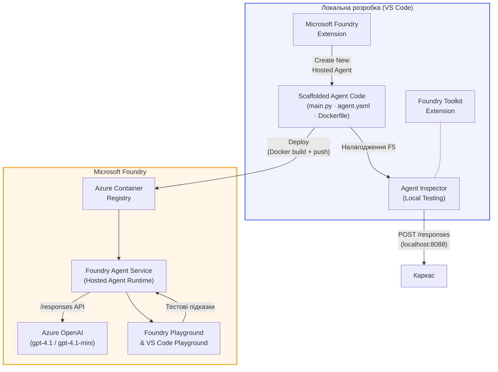

# Foundry Toolkit + Практикум з розміщеними агентами Foundry

[](https://www.python.org/)
[](https://github.com/microsoft/agents)
[](https://learn.microsoft.com/azure/foundry/agents/concepts/hosted-agents)
[](https://ai.azure.com/)
[](https://learn.microsoft.com/azure/ai-services/openai/)
[](https://learn.microsoft.com/cli/azure/install-azure-cli)
[](https://learn.microsoft.com/azure/developer/azure-developer-cli/install-azd)
[](https://www.docker.com/)
[](https://marketplace.visualstudio.com/items?itemName=ms-windows-ai-studio.windows-ai-studio)
[](LICENSE)

Створюйте, тестуйте та розгортайте AI-агентів у **Microsoft Foundry Agent Service** як **Розміщені агенти** — повністю з VS Code за допомогою **розширення Microsoft Foundry** та **Foundry Toolkit**.

> **Розміщені агенти наразі перебувають у режимі попереднього перегляду.** Підтримувані регіони обмежені — див. [доступність регіонів](https://learn.microsoft.com/azure/foundry/agents/concepts/hosted-agents#region-availability).

> Папка `agent/` у кожній лабораторії **автоматично створюється** розширенням Foundry — далі ви налаштовуєте код, тестуєте локально і розгортаєте.

### 🌐 Підтримка кількох мов

#### Підтримується через GitHub Action (автоматично і завжди актуально)

<!-- CO-OP TRANSLATOR LANGUAGES TABLE START -->
[Арабська](../ar/README.md) | [Бенгальська](../bn/README.md) | [Болгарська](../bg/README.md) | [Бирманська (Мʼянма)](../my/README.md) | [Китайська (спрощена)](../zh-CN/README.md) | [Китайська (традиційна, Гонконг)](../zh-HK/README.md) | [Китайська (традиційна, Макао)](../zh-MO/README.md) | [Китайська (традиційна, Тайвань)](../zh-TW/README.md) | [Хорватська](../hr/README.md) | [Чеська](../cs/README.md) | [Данська](../da/README.md) | [Голландська](../nl/README.md) | [Естонська](../et/README.md) | [Фінська](../fi/README.md) | [Французька](../fr/README.md) | [Німецька](../de/README.md) | [Грецька](../el/README.md) | [Іврит](../he/README.md) | [Гінді](../hi/README.md) | [Угорська](../hu/README.md) | [Індонезійська](../id/README.md) | [Італійська](../it/README.md) | [Японська](../ja/README.md) | [Каннада](../kn/README.md) | [Кхмер](../km/README.md) | [Корейська](../ko/README.md) | [Литовська](../lt/README.md) | [Малайська](../ms/README.md) | [Малаялам](../ml/README.md) | [Маратхі](../mr/README.md) | [Непальська](../ne/README.md) | [Нігерійський підігнін](../pcm/README.md) | [Норвезька](../no/README.md) | [Перська (фарсі)](../fa/README.md) | [Польська](../pl/README.md) | [Португальська (Бразилія)](../pt-BR/README.md) | [Португальська (Португалія)](../pt-PT/README.md) | [Пенджабі (гурмухі)](../pa/README.md) | [Румунська](../ro/README.md) | [Російська](../ru/README.md) | [Сербська (кирилиця)](../sr/README.md) | [Словацька](../sk/README.md) | [Словенська](../sl/README.md) | [Іспанська](../es/README.md) | [Суахілі](../sw/README.md) | [Шведська](../sv/README.md) | [Тагальська (філіппінська)](../tl/README.md) | [Тамільська](../ta/README.md) | [Телугу](../te/README.md) | [Тайська](../th/README.md) | [Турецька](../tr/README.md) | [Українська](./README.md) | [Урду](../ur/README.md) | [Вʼєтнамська](../vi/README.md)

> **Віддаєте перевагу клонуванню локально?**
>
> Цей репозиторій містить понад 50 перекладів мов, що значно збільшує розмір завантаження. Щоб клонувати без перекладів, використовуйте розріджене клонування:
>
> **Bash / macOS / Linux:**
> ```bash
> git clone --filter=blob:none --sparse https://github.com/microsoft-foundry/Foundry_Toolkit_for_VSCode_Lab.git
> cd Foundry_Toolkit_for_VSCode_Lab
> git sparse-checkout set --no-cone '/*' '!translations' '!translated_images'
> ```
>
> **CMD (Windows):**
> ```cmd
> git clone --filter=blob:none --sparse https://github.com/microsoft-foundry/Foundry_Toolkit_for_VSCode_Lab.git
> cd Foundry_Toolkit_for_VSCode_Lab
> git sparse-checkout set --no-cone "/*" "!translations" "!translated_images"
> ```
>
> Це надає все необхідне для проходження курсу з набагато швидшим завантаженням.
<!-- CO-OP TRANSLATOR LANGUAGES TABLE END -->

---

## Архітектура


```mermaid
flowchart TB
    subgraph Local["Локальна розробка (VS Code)"]
        direction TB
        FE["Microsoft Foundry
        Extension"]
        FoundryToolkit["Foundry Toolkit
        Extension"]
        Scaffold["Scaffolded Agent Code
        (main.py · agent.yaml · Dockerfile)"]
        Inspector["Agent Inspector
        (Local Testing)"]
        FE -- "Create New
        Hosted Agent" --> Scaffold
        Scaffold -- "Налагодження F5" --> Inspector
        FoundryToolkit -.- Inspector
    end

    subgraph Cloud["Microsoft Foundry"]
        direction TB
        ACR["Azure Container
        Registry"]
        AgentService["Foundry Agent Service
        (Hosted Agent Runtime)"]
        Model["Azure OpenAI
        (gpt-4.1 / gpt-4.1-mini)"]
        Playground["Foundry Playground
        & VS Code Playground"]
        ACR --> AgentService
        AgentService -- "/responses API" --> Model
        AgentService --> Playground
    end

    Scaffold -- "Deploy
    (Docker build + push)" --> ACR
    Inspector -- "POST /responses
    (localhost:8088)" --> Каркас
    Playground -- "Тестові підказки" --> AgentService

    style Local fill:#f0f4ff,stroke:#4a6cf7,stroke-width:2px
    style Cloud fill:#fff4e6,stroke:#f59e0b,stroke-width:2px
```

**Потік:** розширення Foundry генерує агента → ви налаштовуєте код і інструкції → тестуєте локально за допомогою Agent Inspector → розгортаєте у Foundry (образ Docker відправляється в ACR) → перевіряєте у Playground.

---

## Що ви побудуєте

| Лабораторія | Опис | Статус |
|-----|-------------|--------|
| **Лабораторія 01 - Один агент** | Створіть агента **"Поясни як керівнику"**, протестуйте локально та розгорніть у Foundry | ✅ Доступно |
| **Лабораторія 02 - Багатоагентний робочий процес** | Створіть **"Оцінювач відповідності резюме до посади"** — 4 агенти співпрацюють для оцінки відповідності резюме та генерують план навчання | ✅ Доступно |

---

## Познайомтесь з агентом для керівника

У цьому практикумі ви створите агента **"Поясни як керівнику"** — AI-агента, який перетворює складні технічні терміни на спокійні, готові для нарад резюме. Бо, чесно кажучи, ніхто в керівництві не хоче чути про "вичерпання пулу потоків через синхронні виклики, введені у v3.2."

Я створив цього агента після надто багатьох випадків, коли моє досконале постмортем отримувало відповідь: *"Отже... сайт упав чи ні?"*

### Як це працює

Ви подаєте технічне оновлення. Він видає резюме для керівника — три основні пункти, без жаргону, без трасування стеків, без екзистенційного страху. Просто **що сталося**, **вплив на бізнес** та **наступний крок**.

### Побачте це в дії

**Ви кажете:**
> "Затримка API зросла через вичерпання пулу потоків через синхронні виклики, введені у v3.2."

**Агент відповідає:**

> **Резюме для керівника:**
> - **Що сталося:** Після останнього оновлення система загальмувала.
> - **Вплив на бізнес:** Деякі користувачі відчували затримки при використанні сервісу.
> - **Наступний крок:** Змінено було відкотити, і готується виправлення перед новим розгортанням.

### Чому саме цей агент?

Це простий, однозадачний агент — ідеально підходить для вивчення робочого процесу розміщеного агента "від і до", без ускладнень зі складними інструментами. І чесно? Кожна команда інженерів могла б мати такого.

---

## Структура практикуму

```
📂 Foundry_Toolkit_for_VSCode_Lab/
├── 📄 README.md                      ← You are here
└── 📂 workshop/
    ├── 📂 lab01-single-agent/        ← Full lab: docs + agent code
    │   ├── README.md                 ← Hands-on lab instructions
    │   ├── 📂 docs/                  ← Step-by-step tutorial modules
    │   │   ├── 00-prerequisites.md
    │   │   ├── 01-setup.md
    │   │   ├── 02-create-hosted-agent.md
    │   │   ├── 03-configure-and-code.md
    │   │   ├── 04-test-locally.md
    │   │   ├── 05-deploy-to-foundry.md
    │   │   ├── 06-verify-in-playground.md
    │   │   ├── 07-summary.md
    │   │   └── 08-troubleshooting.md
    │   └── 📂 agent/                 ← Reference solution (auto-scaffolded by Foundry extension)
    │       ├── agent.yaml
    │       ├── Dockerfile
    │       ├── main.py
    │       └── requirements.txt
    └── 📂 lab02-multi-agent/         ← Resume → Job Fit Evaluator
        ├── README.md                 ← Hands-on lab instructions (end-to-end)
        ├── 📂 docs/                  ← Step-by-step tutorial modules
        │   ├── 00-prerequisites.md
        │   ├── 01-understand-multi-agent.md
        │   ├── 02-scaffold-multi-agent.md
        │   ├── 03-configure-agents.md
        │   ├── 04-orchestration-patterns.md
        │   ├── 05-test-locally.md
        │   ├── 06-deploy-to-foundry.md
        │   ├── 07-verify-in-playground.md
        │   └── 08-troubleshooting.md
        └── 📂 PersonalCareerCopilot/ ← Reference solution (multi-agent workflow)
            ├── agent.yaml
            ├── Dockerfile
            ├── main.py
            └── requirements.txt
```

> **Примітка:** Папка `agent/` у кожній лабораторії створюється **розширенням Microsoft Foundry**, коли ви запускаєте команду `Microsoft Foundry: Create a New Hosted Agent` у Command Palette. Файли потім налаштовуються вашими інструкціями, інструментами та конфігурацією агента. Лабораторія 01 проведе вас через процес створення цього з нуля.

---

## Початок роботи

### 1. Клонуйте репозиторій

```bash
git clone https://github.com/microsoft-foundry/Foundry_Toolkit_for_VSCode_Lab.git
cd Foundry_Toolkit_for_VSCode_Lab
```

### 2. Створіть віртуальне середовище Python

```bash
python -m venv venv
```

Активуйте його:

- **Windows (PowerShell):**
  ```powershell
  .\venv\Scripts\Activate.ps1
  ```
- **macOS / Linux:**
  ```bash
  source venv/bin/activate
  ```

### 3. Встановіть залежності

```bash
pip install -r workshop/lab01-single-agent/agent/requirements.txt
```

### 4. Налаштуйте змінні середовища

Скопіюйте приклад файлу `.env` у папці агента та заповніть свої значення:

```bash
cp workshop/lab01-single-agent/agent/.env.example workshop/lab01-single-agent/agent/.env
```

Відредагуйте `workshop/lab01-single-agent/agent/.env`:

```env
AZURE_AI_PROJECT_ENDPOINT=https://<your-account>.services.ai.azure.com/api/projects/<your-project>
AZURE_AI_MODEL_DEPLOYMENT_NAME=<your-model-deployment-name>
```

### 5. Слідуйте лабораторіям практикуму

Кожна лабораторія є самодостатньою з власними модулями. Розпочніть з **Лабораторії 01**, щоб вивчити основи, потім переходьте до **Лабораторії 02** для багатофункціональних робочих процесів.

#### Лабораторія 01 - Один агент ([повні інструкції](workshop/lab01-single-agent/README.md))

| № | Модуль | Посилання |
|---|--------|------|
| 1 | Прочитайте передумови | [00-prerequisites.md](workshop/lab01-single-agent/docs/00-prerequisites.md) |
| 2 | Встановіть Foundry Toolkit та розширення Foundry | [01-setup.md](workshop/lab01-single-agent/docs/01-setup.md) |
| 3 | Створіть проєкт Foundry | [01-setup.md](workshop/lab01-single-agent/docs/01-setup.md) |
| 4 | Створіть розміщеного агента | [02-create-hosted-agent.md](workshop/lab01-single-agent/docs/02-create-hosted-agent.md) |
| 5 | Налаштуйте інструкції та середовище | [03-configure-and-code.md](workshop/lab01-single-agent/docs/03-configure-and-code.md) |
| 6 | Протестуйте локально | [04-test-locally.md](workshop/lab01-single-agent/docs/04-test-locally.md) |
| 7 | Розгорніть у Foundry | [05-deploy-to-foundry.md](workshop/lab01-single-agent/docs/05-deploy-to-foundry.md) |
| 8 | Перевірте у playground | [06-verify-in-playground.md](workshop/lab01-single-agent/docs/06-verify-in-playground.md) |
| 9 | Вирішення проблем | [08-troubleshooting.md](workshop/lab01-single-agent/docs/08-troubleshooting.md) |

#### Лабораторія 02 - Багатоагентний робочий процес ([повні інструкції](workshop/lab02-multi-agent/README.md))

| № | Модуль | Посилання |
|---|--------|------|
| 1 | Передумови (Лабораторія 02) | [00-prerequisites.md](workshop/lab02-multi-agent/docs/00-prerequisites.md) |
| 2 | Зрозумійте архітектуру багатоагентності | [01-understand-multi-agent.md](workshop/lab02-multi-agent/docs/01-understand-multi-agent.md) |
| 3 | Створіть структуру проєкту багатоагентності | [02-scaffold-multi-agent.md](workshop/lab02-multi-agent/docs/02-scaffold-multi-agent.md) |
| 4 | Налаштуйте агентів та середовище | [03-configure-agents.md](workshop/lab02-multi-agent/docs/03-configure-agents.md) |
| 5 | Шаблони оркестрації | [04-orchestration-patterns.md](workshop/lab02-multi-agent/docs/04-orchestration-patterns.md) |
| 6 | Тестуйте локально (багатоагентний) | [05-test-locally.md](workshop/lab02-multi-agent/docs/05-test-locally.md) |

| 7 | Розгортання у Foundry | [06-deploy-to-foundry.md](workshop/lab02-multi-agent/docs/06-deploy-to-foundry.md) |
| 8 | Перевірка в середовищі playground | [07-verify-in-playground.md](workshop/lab02-multi-agent/docs/07-verify-in-playground.md) |
| 9 | Вирішення проблем (multi-agent) | [08-troubleshooting.md](workshop/lab02-multi-agent/docs/08-troubleshooting.md) |

---

## Відповідальний за підтримку

<table>
<tr>
    <td align="center"><a href="https://github.com/ShivamGoyal03">
        <br />
        <sub><b>Шивам Гоял</b></sub>
    </a><br />
    </td>
</tr>
</table>

---

## Необхідні дозволи (швидкий довідник)

| Сценарій | Необхідні ролі |
|----------|---------------|
| Створення нового проекту Foundry | **Azure AI Owner** на ресурсі Foundry |
| Розгортання у існуючий проект (нові ресурси) | **Azure AI Owner** + **Contributor** на підписці |
| Розгортання у повністю налаштований проект | **Reader** на акаунті + **Azure AI User** на проекті |

> **Важливо:** Ролі Azure `Owner` та `Contributor` включають лише *управлінські* дозволи, а не *дозволи на розробку* (операції з даними). Для створення і розгортання агентів потрібні ролі **Azure AI User** або **Azure AI Owner**.

---

## Посилання

- [Швидкий старт: Розгорніть свого першого хостингового агента (VS Code)](https://learn.microsoft.com/azure/foundry/agents/quickstarts/quickstart-hosted-agent)
- [Що таке хостингові агенти?](https://learn.microsoft.com/azure/foundry/agents/concepts/hosted-agents)
- [Створення робочих процесів хостингових агентів у VS Code](https://learn.microsoft.com/azure/foundry/agents/how-to/vs-code-agents-workflow-pro-code)
- [Розгортання хостингового агента](https://learn.microsoft.com/azure/foundry/agents/how-to/deploy-hosted-agent)
- [RBAC для Microsoft Foundry](https://learn.microsoft.com/azure/foundry/concepts/rbac-foundry)
- [Приклад агента для огляду архітектури](https://github.com/Azure-Samples/agent-architecture-review-sample) - Реальний хостинговий агент з інструментами MCP, діаграмами Excalidraw та подвійним розгортанням

---


## Ліцензія

[MIT](../../LICENSE)

---

<!-- CO-OP TRANSLATOR DISCLAIMER START -->
**Відмова від відповідальності**:
Цей документ було перекладено за допомогою сервісу штучного інтелекту для перекладу [Co-op Translator](https://github.com/Azure/co-op-translator). Хоча ми прагнемо до точності, будь ласка, майте на увазі, що автоматичні переклади можуть містити помилки або неточності. Оригінальний документ рідною мовою слід вважати авторитетним джерелом. Для критично важливої інформації рекомендується професійний людський переклад. Ми не несемо відповідальності за будь-які непорозуміння або неправильні тлумачення, що виникли внаслідок використання цього перекладу.
<!-- CO-OP TRANSLATOR DISCLAIMER END -->