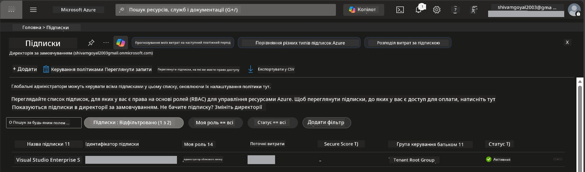

# Module 0 - Необхідні умови

Перш ніж розпочати воркшоп, переконайтеся, що у вас є наступні інструменти, доступи та налаштоване середовище. Виконуйте кожен крок нижче - не пропускайте їх.

---

## 1. Обліковий запис та підписка Azure

### 1.1 Створіть або підтвердіть наявність підписки Azure

1. Відкрийте браузер і перейдіть за посиланням [https://azure.microsoft.com/free/](https://azure.microsoft.com/free/).
2. Якщо у вас немає облікового запису Azure, натисніть **Start free** і дотримуйтеся інструкцій реєстрації. Вам знадобиться обліковий запис Microsoft (або створіть його) та кредитна карта для підтвердження особистості.
3. Якщо у вас вже є обліковий запис, увійдіть на [https://portal.azure.com](https://portal.azure.com).
4. У порталі натисніть на панель **Subscriptions** у лівій навігації (або шукайте "Subscriptions" у верхньому полі пошуку).
5. Переконайтеся, що ви бачите принаймні одну підписку зі станом **Active**. Запишіть **Subscription ID** - він знадобиться пізніше.



### 1.2 Розуміння необхідних ролей RBAC

Для розгортання [Hosted Agent](https://learn.microsoft.com/azure/foundry/agents/concepts/hosted-agents) потрібні дозволи на **доступ до даних**, яких немає у стандартних ролях Azure `Owner` та `Contributor`. Вам знадобиться одна з цих [комбінацій ролей](https://learn.microsoft.com/azure/foundry/concepts/rbac-foundry#built-in-roles):

| Сценарій | Необхідні ролі | Де їх призначати |
|----------|---------------|------------------|
| Створення нового проєкту Foundry | **Azure AI Owner** на ресурсі Foundry | Ресурс Foundry у порталі Azure |
| Розгортання в існуючий проєкт (нові ресурси) | **Azure AI Owner** + **Contributor** на підписку | Підписка + ресурс Foundry |
| Розгортання у повністю налаштований проєкт | **Reader** на акаунт + **Azure AI User** на проєкт | Акаунт + проєкт у порталі Azure |

> **Ключовий момент:** ролі Azure `Owner` та `Contributor` покривають лише дозволи *керування* (операції ARM). Для *операцій з даними*, таких як `agents/write`, потрібна роль [**Azure AI User**](https://learn.microsoft.com/azure/foundry/concepts/rbac-foundry#built-in-roles) (або вища). Ці ролі ви призначите у [Модулі 2](02-create-foundry-project.md).

---

## 2. Встановлення локальних інструментів

Встановіть кожен інструмент нижче. Після встановлення перевірте його роботу за допомогою команди перевірки.

### 2.1 Visual Studio Code

1. Перейдіть на [https://code.visualstudio.com/](https://code.visualstudio.com/).
2. Завантажте інсталятор для вашої ОС (Windows/macOS/Linux).
3. Запустіть інсталятор з типовими налаштуваннями.
4. Відкрийте VS Code, щоб переконатися, що він запускається.

### 2.2 Python 3.10+

1. Перейдіть на [https://www.python.org/downloads/](https://www.python.org/downloads/).
2. Завантажте Python 3.10 або новішу версію (рекомендується 3.12+).
3. **Windows:** Під час встановлення встановіть прапорець **"Add Python to PATH"** на першому екрані.
4. Відкрийте термінал і перевірте:

   ```powershell
   python --version
   ```

   Очікуваний результат: `Python 3.10.x` або вище.

### 2.3 Azure CLI

1. Перейдіть на [https://learn.microsoft.com/cli/azure/install-azure-cli](https://learn.microsoft.com/cli/azure/install-azure-cli).
2. Дотримуйтесь інструкцій встановлення для вашої ОС.
3. Перевірте:

   ```powershell
   az --version
   ```

   Очікувано: `azure-cli 2.80.0` або вище.

4. Увійдіть у систему:

   ```powershell
   az login
   ```

### 2.4 Azure Developer CLI (azd)

1. Перейдіть на [https://learn.microsoft.com/azure/developer/azure-developer-cli/install-azd](https://learn.microsoft.com/azure/developer/azure-developer-cli/install-azd).
2. Дотримуйтесь інструкцій встановлення для вашої ОС. У Windows:

   ```powershell
   winget install microsoft.azd
   ```

3. Перевірте:

   ```powershell
   azd version
   ```

   Очікувано: `azd version 1.x.x` або вище.

4. Увійдіть у систему:

   ```powershell
   azd auth login
   ```

### 2.5 Docker Desktop (необов’язково)

Docker потрібен лише, якщо ви хочете локально збирати та тестувати контейнерний образ перед розгортанням. Розширення Foundry автоматично виконує збірку контейнерів під час розгортання.

1. Перейдіть на [https://docs.docker.com/get-docker/](https://docs.docker.com/get-docker/).
2. Завантажте та встановіть Docker Desktop відповідно до вашої ОС.
3. **Windows:** Під час інсталяції виберіть бекенд WSL 2.
4. Запустіть Docker Desktop і дочекайтеся появи піктограми в системному треї зі статусом **"Docker Desktop is running"**.
5. Відкрийте термінал і перевірте:

   ```powershell
   docker info
   ```

   Команда має вивести інформацію про систему Docker без помилок. Якщо бачите `Cannot connect to the Docker daemon`, зачекайте ще кілька секунд, поки Docker повністю запуститься.

---

## 3. Встановлення розширень VS Code

Вам потрібні три розширення. Встановіть їх **до **початку воркшопу.

### 3.1 Microsoft Foundry для VS Code

1. Відкрийте VS Code.
2. Натисніть `Ctrl+Shift+X`, щоб відкрити панель розширень.
3. В полі пошуку введіть **"Microsoft Foundry"**.
4. Знайдіть **Microsoft Foundry for Visual Studio Code** (видавець: Microsoft, ID: `TeamsDevApp.vscode-ai-foundry`).
5. Натисніть **Install**.
6. Після встановлення у панелі активності (лівий сайдбар) з’явиться іконка **Microsoft Foundry**.

### 3.2 Foundry Toolkit

1. У панелі розширень (`Ctrl+Shift+X`) знайдіть **"Foundry Toolkit"**.
2. Знайдіть **Foundry Toolkit** (видавець: Microsoft, ID: `ms-windows-ai-studio.windows-ai-studio`).
3. Натисніть **Install**.
4. Іконка **Foundry Toolkit** з’явиться у панелі активності.

### 3.3 Python

1. У панелі розширень знайдіть **"Python"**.
2. Знайдіть **Python** (видавець: Microsoft, ID: `ms-python.python`).
3. Натисніть **Install**.

---

## 4. Увійдіть у Azure через VS Code

[Microsoft Agent Framework](https://learn.microsoft.com/agent-framework/overview/) використовує [`DefaultAzureCredential`](https://learn.microsoft.com/azure/developer/python/sdk/authentication/credential-chains#defaultazurecredential-overview) для автентифікації. Вам потрібно бути увійшовшим в Azure у VS Code.

### 4.1 Вхід через VS Code

1. Знизу зліва у VS Code натисніть на іконку **Accounts** (силует людини).
2. Клікніть **Sign in to use Microsoft Foundry** (або **Sign in with Azure**).
3. Відкриється вікно браузера - увійдіть з обліковим записом Azure, що має доступ до вашої підписки.
4. Поверніться до VS Code. Ви маєте побачити ім'я вашого облікового запису знизу зліва.

### 4.2 (Необов’язково) Вхід через Azure CLI

Якщо ви встановили Azure CLI і віддаєте перевагу автентифікації через CLI:

```powershell
az login
```

Відкриється браузер для входу. Після входу встановіть потрібну підписку:

```powershell
az account set --subscription "<your-subscription-id>"
```

Перевірте:

```powershell
az account show --query "{name:name, id:id, state:state}" --output table
```

Ви маєте побачити ім'я, ID підписки та стан = `Enabled`.

### 4.3 (Альтернативно) Аутентифікація через service principal

Для CI/CD або спільних середовищ задайте ці змінні середовища замість вхідних даних:

```powershell
$env:AZURE_TENANT_ID = "<your-tenant-id>"
$env:AZURE_CLIENT_ID = "<your-client-id>"
$env:AZURE_CLIENT_SECRET = "<your-client-secret>"
```

---

## 5. Обмеження в попередньому перегляді

Перед тим як продовжити, зверніть увагу на поточні обмеження:

- [**Hosted Agents**](https://learn.microsoft.com/azure/foundry/agents/concepts/hosted-agents) наразі в **публічному попередньому перегляді** - не рекомендуються для виробничих робочих навантажень.
- **Підтримувані регіони обмежені** – перевірте [доступність регіонів](https://learn.microsoft.com/azure/foundry/agents/concepts/hosted-agents#region-availability) перед створенням ресурсів. Якщо виберете регіон, що не підтримується, розгортання не вдасться.
- Пакет `azure-ai-agentserver-agentframework` є передрелізним (`1.0.0b16`) - API можуть змінюватися.
- Ліміти масштабування: hosted agents підтримують від 0 до 5 реплік (включно з масштабуванням до нуля).

---

## 6. Контрольний список готовності

Перевірте кожен пункт нижче. Якщо якийсь крок не вдається, поверніться назад і виправте його перед продовженням.

- [ ] VS Code відкривається без помилок
- [ ] Python 3.10+ в PATH (`python --version` покаже `3.10.x` або вище)
- [ ] Azure CLI встановлено (`az --version` покаже `2.80.0` або вище)
- [ ] Azure Developer CLI встановлено (`azd version` покаже інформацію про версію)
- [ ] Розширення Microsoft Foundry встановлене (іконка є у панелі активності)
- [ ] Розширення Foundry Toolkit встановлене (іконка є у панелі активності)
- [ ] Розширення Python встановлене
- [ ] Ви увійшли в Azure у VS Code (перевірте іконку Accounts внизу зліва)
- [ ] `az account show` повертає вашу підписку
- [ ] (Необов’язково) Docker Desktop запущено (`docker info` повертає інформацію без помилок)

### Контрольна точка

Відкрийте панель активності VS Code і переконайтеся, що бачите бокові панелі **Foundry Toolkit** та **Microsoft Foundry**. Натисніть на кожну, щоб впевнитися, що вони завантажуються без помилок.

---

**Далі:** [01 - Встановлення Foundry Toolkit та розширення Foundry →](01-install-foundry-toolkit.md)

---

<!-- CO-OP TRANSLATOR DISCLAIMER START -->
**Відмова від відповідальності**:
Цей документ було перекладено за допомогою AI сервісу перекладу [Co-op Translator](https://github.com/Azure/co-op-translator). Хоча ми прагнемо до точності, зверніть увагу, що автоматичні переклади можуть містити помилки або неточності. Оригінальний документ рідною мовою слід вважати авторитетним джерелом. Для критичної інформації рекомендується професійний людський переклад. Ми не несемо відповідальності за будь-які непорозуміння або неправильні тлумачення, що виникли внаслідок використання цього перекладу.
<!-- CO-OP TRANSLATOR DISCLAIMER END -->