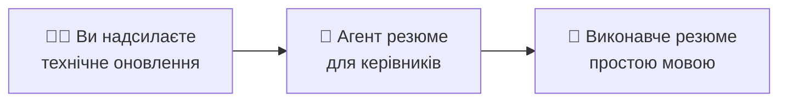

# Модуль 0 - Вступ

⏱️ ~10 хв

> [!WARNING]
> **Попередній перегляд і обмеження:** [Хостинговані агенти](https://learn.microsoft.com/azure/foundry/agents/concepts/hosted-agents) наразі перебувають у **публічному превʼю** - не рекомендовані для виробничих навантажень. Зауважте наступне:
> - **Підтримувані регіони обмежені** - перевірте [доступність регіонів](https://learn.microsoft.com/azure/foundry/agents/concepts/hosted-agents#region-availability) перед створенням ресурсів. Якщо вибрати непідтримуваний регіон, розгортання завершиться помилкою.
> - Пакет `azure-ai-agentserver-agentframework` є пре-релізним – API можуть змінюватися між версіями.
> - Обмеження масштабування: хостинговані агенти підтримують 0–5 реплік (включно з масштабуванням до нуля).
> - Деякі функції, показані у цьому майстер-класі, можуть змінюватися по мірі наближення служби до GA.

## Що ви створите

У цьому майстер-класі ви створите агента **"Поясни, як для керівника"** — хостингованого AI агента, який приймає складні технічні оновлення і переписує їх у вигляді простих виконавчих підсумків англійською мовою.

```mermaid
flowchart LR
    A["🧑‍💻 Ви надсилаєте\nтехнічне оновлення"] --> B["🤖 Агент резюме\nдля керівників"]
    B --> C["📝 Виконавче резюме\nпростою мовою"]
```

**Агент використовує:**
- **Microsoft Agent Framework** - для логіки та структури агента
- **Foundry Toolkit для VS Code** - для створення структури, локального тестування та розгортання
- **AI-модель** (наприклад, `gpt-4.1-mini/gpt-5-mini`) - для генерації підсумків

До кінця цього заняття у вас буде працюючий агент, який ви зможете протестувати локально через Agent Inspector і, за бажанням, розгорнути в хмарі.

---

## Що таке хостинговані агенти?

**Хостингований агент** — це AI агент, який працює як керована служба у Microsoft Foundry. Замість того, щоб керувати своєю інфраструктурою, ви пакуєте код агента у контейнер, а Foundry обробляє масштабування, хостинг та надає його через стандартний HTTP-інтерфейс.

| Поняття | Що це означає |
|---------|--------------|
| **Агент** | Ваш Python код, який приймає повідомлення користувача, звертається до AI моделі та повертає структуровану відповідь |
| **Хостингований** | Foundry запускає ваш контейнер за вас — без віртуальних машин, Kubernetes чи управління інфраструктурою |
| **Протокол відповідей** | Стандартний HTTP API (`POST /responses`), який будь-який клієнт може викликати для взаємодії з вашим агентом |
| **Agent Inspector** | Локальний інтерфейс для тестування (вбудований у Foundry Toolkit), що дозволяє спілкуватися з вашим агентом перед розгортанням |

У цьому майстер-класі ви пройдете шлях від нуля до повністю хостингованого агента — або зупинитесь на локальному тестуванні, якщо бажаєте.

---

## Оберіть свій шлях

> ⚠️ **Оберіть один шлях перед тим, як продовжити.** Ваш вибір визначає, які інструменти встановлювати і які модулі застосовувати. Ви можете пізніше переключитись з шляху B → на шлях A, якщо отримаєте підписку.

<strong>🅰️ Шлях A - Хмара Azure (потрібна підписка Azure)</strong>

| | Деталі |
|---|---|
| **Кому підходить?** | У вас активна підписка Azure і є можливість створювати Foundry ресурси |
| **Модель** | Azure OpenAI через Foundry (наприклад, `gpt-4.1-mini/gpt-5-mini`) |
| **Охоплені модулі** | Всі модулі (00–07) |
| **Розгортання в хмарі?** | ✅ Так - повне скрізне розгортання |

<strong>🅱️ Шлях B - Локально / безкоштовний рівень (підписка Azure не потрібна)</strong>

| | Деталі |
|---|---|
| **Кому підходить?** | MVP, студенти або будь-хто без доступу до Azure |
| **Модель** | **Foundry Local** (безкоштовно, працює на вашому ПК) |
| **Охоплені модулі** | Модулі 00–04 (пропускають розгортання і перевірку в хмарі) |
| **Розгортання в хмарі?** | ❌ Ні - лише локальне тестування через Agent Inspector |

---

## Всі шляхи: Необхідні інструменти

Встановіть кожен інструмент нижче. Після встановлення перевірте його роботу за допомогою команди перевірки.

| # | Інструмент | Версія | Встановлення | Перевірка (очікуваний результат) |
|---|------|---------|---------|---------------------------|
| 1 | **Visual Studio Code** | Остання | [code.visualstudio.com](https://code.visualstudio.com/) | Відкривається без помилок |
| 2 | **Python** | 3.12 або вище | [python.org/downloads](https://www.python.org/downloads/) | `python --version` → `Python 3.12.x` |
| 3 | **Foundry Toolkit для VS Code** | Остання | ID розширення: `ms-windows-ai-studio.windows-ai-studio` | Іконка Foundry в Activity Bar |
| 4 | **Розширення Python для VS Code** | Остання | ID розширення: `ms-python.python` | Встановлено в панелі Extensions |

> [!TIP]
> **Поради для встановлення:**
> - **Python PATH (Windows):** Завжди вибирайте **"Add Python to PATH"** на першому екрані інсталятора Python. Без цього `python` не буде розпізнано в терміналі.
> - **Декілька версій Python:** Якщо у вас встановлені Python 3.10 і 3.12, використовуйте `python3.12 -m venv .venv` для віртуального середовища, щоб впевнитися в правильній версії.
> - **Docker WSL 2 (Windows):** Під час встановлення Docker Desktop оберіть **WSL 2 backend**. Docker на Hyper-V працює повільніше і може викликати проблеми зі збіркою контейнерів Foundry.
> - **Docker не запускається?** Почекайте 30–60 секунд після запуску Docker Desktop. Виконайте `docker info` — якщо бачите "Cannot connect to the Docker daemon," Docker ще ініціалізується.
> - **Розширення VS Code не завантажуються?** Після встановлення розширень перезавантажте вікно: `Ctrl+Shift+P` → `Developer: Reload Window`.

> **Користувачам Windows:** Під час встановлення Python вибирайте **"Add Python to PATH"**.

**Далі:** [01 - Налаштування →](01-setup.md)

---

<!-- CO-OP TRANSLATOR DISCLAIMER START -->
**Відмова від відповідальності**:
Цей документ було перекладено за допомогою сервісу штучного інтелекту для перекладу [Co-op Translator](https://github.com/Azure/co-op-translator). Хоча ми прагнемо до точності, будь ласка, майте на увазі, що автоматичні переклади можуть містити помилки або неточності. Оригінальний документ рідною мовою слід вважати авторитетним джерелом. Для критично важливої інформації рекомендується професійний людський переклад. Ми не несемо відповідальності за будь-які непорозуміння або неправильні тлумачення, що виникли внаслідок використання цього перекладу.
<!-- CO-OP TRANSLATOR DISCLAIMER END -->