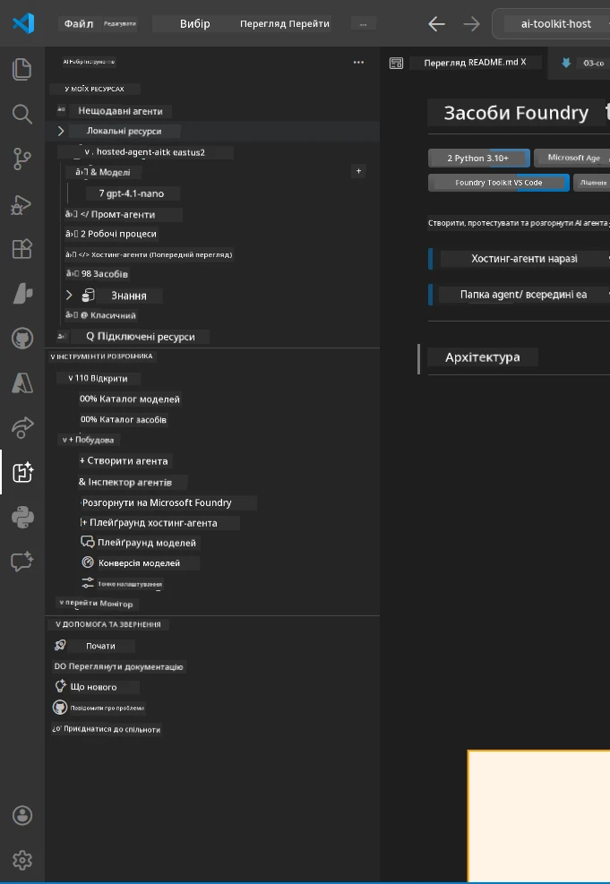
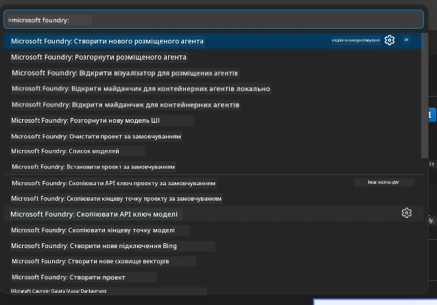

# Модуль 1 - Встановлення Foundry Toolkit & Foundry Extension

Цей модуль проведе вас через процес встановлення та перевірки двох ключових розширень VS Code для цього воркшопу. Якщо ви вже встановили їх під час [Модуля 0](00-prerequisites.md), скористайтеся цим модулем, щоб переконатися, що вони працюють правильно.

---

## Крок 1: Встановлення розширення Microsoft Foundry

Розширення **Microsoft Foundry for VS Code** є вашим основним інструментом для створення проєктів Foundry, розгортання моделей, створення шаблонів хостингових агентів і розгортання безпосередньо з VS Code.

1. Відкрийте VS Code.
2. Натисніть `Ctrl+Shift+X`, щоб відкрити панель **Розширення**.
3. У поле пошуку вгорі введіть: **Microsoft Foundry**
4. Знайдіть результат під назвою **Microsoft Foundry for Visual Studio Code**.
   - Видавець: **Microsoft**
   - Ідентифікатор розширення: `TeamsDevApp.vscode-ai-foundry`
5. Натисніть кнопку **Install**.
6. Дочекайтеся завершення встановлення (ви побачите індикатор прогресу).
7. Після встановлення подивіться на **Панель активності** (вертикальна панель іконок зліва у VS Code). Ви повинні побачити нову іконку **Microsoft Foundry** (виглядає як діамант/AI іконка).
8. Натисніть іконку **Microsoft Foundry**, щоб відкрити бічну панель. Ви побачите розділи:
   - **Resources** (або Projects)
   - **Agents**
   - **Models**

> **Якщо іконка не з'являється:** Спробуйте перезавантажити VS Code (`Ctrl+Shift+P` → `Developer: Reload Window`).

---

## Крок 2: Встановлення розширення Foundry Toolkit

Розширення **Foundry Toolkit** забезпечує [**Agent Inspector**](https://learn.microsoft.com/azure/foundry/agents/how-to/vs-code-agents-workflow-pro-code) — візуальний інтерфейс для тестування та налагодження агентів локально, а також інструменти для робочої зони, управління моделями та оцінювання.

1. У панелі розширень (`Ctrl+Shift+X`) очистіть поле пошуку та введіть: **Foundry Toolkit**
2. Знайдіть у результатах розширення **Foundry Toolkit**.
   - Видавець: **Microsoft**
   - Ідентифікатор розширення: `ms-windows-ai-studio.windows-ai-studio`
3. Натисніть **Install**.
4. Після встановлення в панелі активності з’явиться іконка **Foundry Toolkit** (виглядає як робот/іскра).
5. Натисніть іконку **Foundry Toolkit**, щоб відкрити бічну панель. Ви побачите вітальний екран Foundry Toolkit з опціями:
   - **Models**
   - **Playground**
   - **Agents**

---

## Крок 3: Перевірте, що обидва розширення працюють

### 3.1 Перевірка розширення Microsoft Foundry

1. Натисніть іконку **Microsoft Foundry** в панелі активності.
2. Якщо ви увійшли до Azure (під час Модуля 0), то під **Resources** має відображатися список ваших проєктів.
3. Якщо з’явиться запит на вхід, натисніть **Sign in** і дотримуйтеся інструкцій для аутентифікації.
4. Переконайтеся, що бічна панель відкривається без помилок.

### 3.2 Перевірка розширення Foundry Toolkit

1. Натисніть іконку **Foundry Toolkit** в панелі активності.
2. Переконайтеся, що вітальний екран або головна панель завантажуються без помилок.
3. Наразі налаштовувати нічого не потрібно — ми використовуватимемо Agent Inspector у [Модулі 5](05-test-locally.md).

### 3.3 Перевірка через Command Palette

1. Натисніть `Ctrl+Shift+P`, щоб відкрити Command Palette.
2. Введіть **"Microsoft Foundry"** — ви повинні побачити команди, такі як:
   - `Microsoft Foundry: Create a New Hosted Agent`
   - `Microsoft Foundry: Deploy Hosted Agent`
   - `Microsoft Foundry: Open Model Catalog`
3. Натисніть `Escape`, щоб закрити Command Palette.
4. Знову відкрийте Command Palette та введіть **"Foundry Toolkit"** — ви побачите команди, як:
   - `Foundry Toolkit: Open Agent Inspector`

> Якщо ви не бачите цих команд, можливо розширення встановлені некоректно. Спробуйте їх видалити та встановити знову.

---

## Що роблять ці розширення у цьому воркшопі

| Розширення | Що воно робить | Коли ви користуєтесь |
|------------|----------------|---------------------|
| **Microsoft Foundry for VS Code** | Створення проєктів Foundry, розгортання моделей, **створення шаблонів [hosted agents](https://learn.microsoft.com/azure/foundry/agents/concepts/hosted-agents)** (автоматично генерує `agent.yaml`, `main.py`, `Dockerfile`, `requirements.txt`), розгортання на [Foundry Agent Service](https://learn.microsoft.com/azure/foundry/agents/overview) | Модулі 2, 3, 6, 7 |
| **Foundry Toolkit** | Agent Inspector для локального тестування/налагодження, робоча зона, управління моделями | Модулі 5, 7 |

> **Розширення Foundry — найважливіший інструмент у цьому воркшопі.** Воно управляє усім життєвим циклом: створення шаблону → налаштування → розгортання → перевірка. Foundry Toolkit доповнює його, надаючи візуальний Agent Inspector для локального тестування.

---

### Контрольна точка

- [ ] Іконка Microsoft Foundry видима на Панелі активності
- [ ] Натискання відкриває бічну панель без помилок
- [ ] Іконка Foundry Toolkit видима на Панелі активності
- [ ] Натискання відкриває бічну панель без помилок
- [ ] `Ctrl+Shift+P` → введення "Microsoft Foundry" показує доступні команди
- [ ] `Ctrl+Shift+P` → введення "Foundry Toolkit" показує доступні команди

---

**Попередній:** [00 - Вимоги](00-prerequisites.md) · **Наступний:** [02 - Створення проєкту Foundry →](02-create-foundry-project.md)

---

<!-- CO-OP TRANSLATOR DISCLAIMER START -->
**Відмова від відповідальності**:
Цей документ було перекладено за допомогою сервісу автоматичного перекладу [Co-op Translator](https://github.com/Azure/co-op-translator). Хоча ми прагнемо до точності, будь ласка, майте на увазі, що автоматичні переклади можуть містити помилки чи неточності. Оригінальний документ рідною мовою слід розглядати як авторитетне джерело. Для критично важливої інформації рекомендується використовувати професійний людський переклад. Ми не несемо відповідальності за будь-які непорозуміння чи неправильні тлумачення, що виникли внаслідок використання цього перекладу.
<!-- CO-OP TRANSLATOR DISCLAIMER END -->