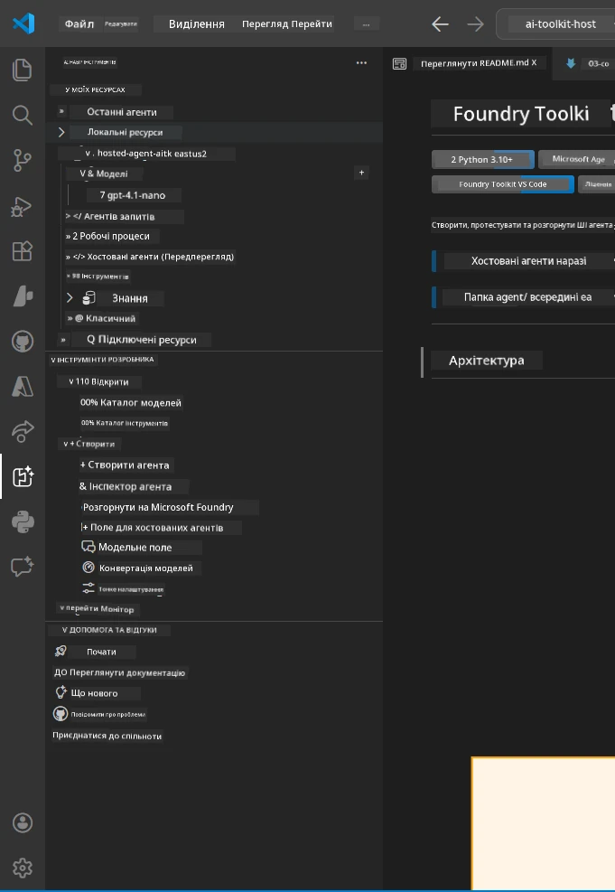
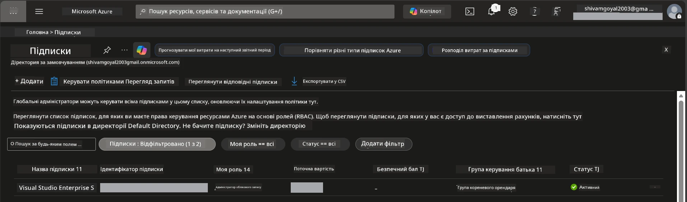
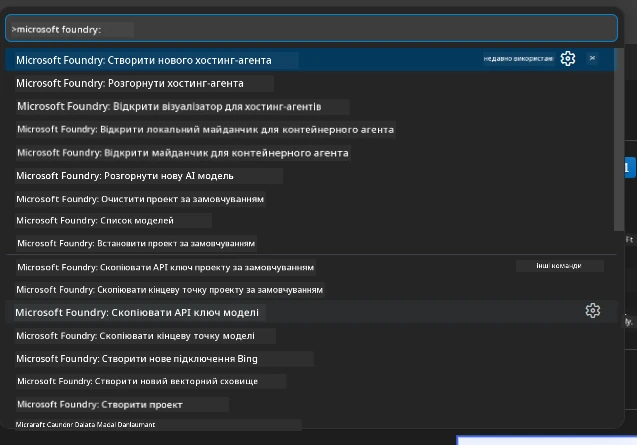
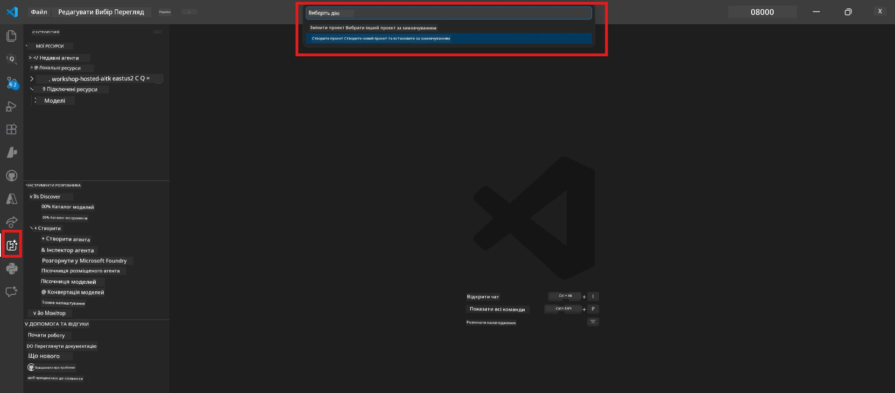
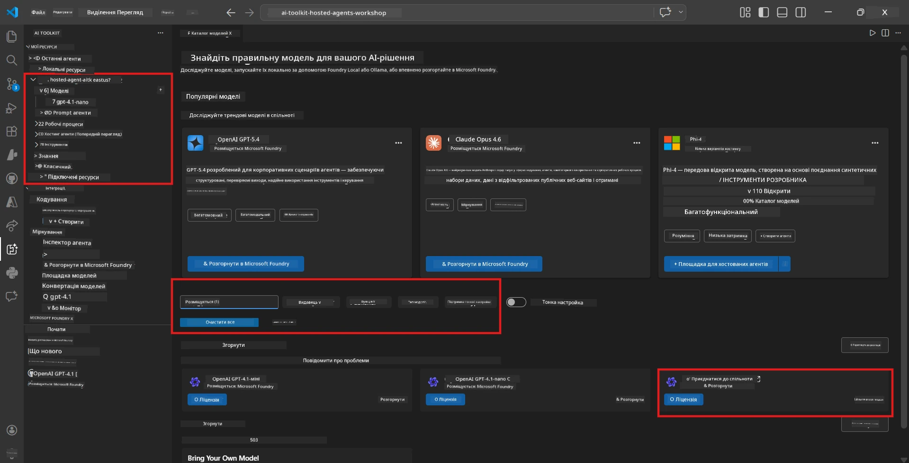
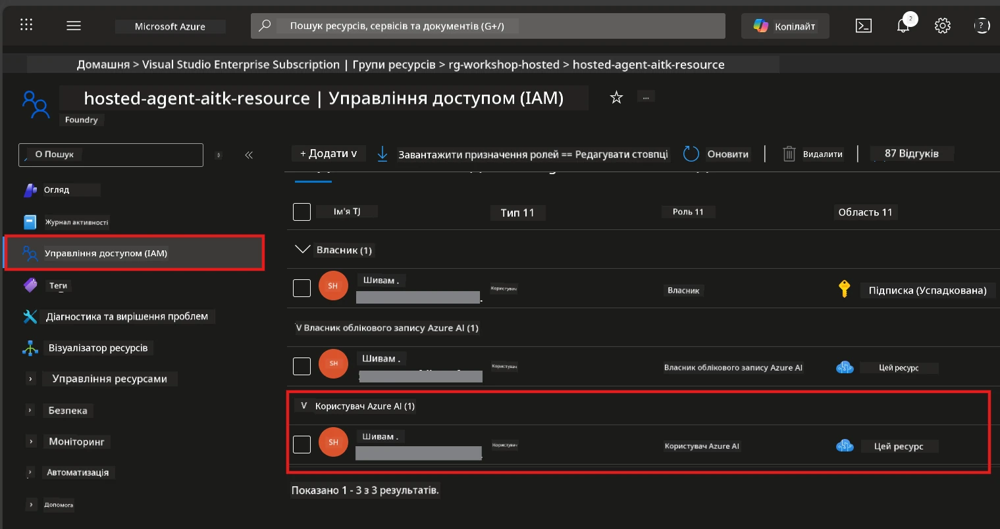

# Налаштування: розширення, проект і модель

⏱️ ~15 хв

У цьому модулі ви встановите й перевірите розширення Foundry Toolkit, створите (або підключитесь до) проекту Foundry і розгорнете модель, яку використовуватиме ваш агент.

## Крок 1: Встановлення Foundry Toolkit

**Foundry Toolkit для VS Code** — основне розширення для цього воркшопу. Воно забезпечує створення проектів, розгортання моделей, створення агентів, локальне тестування (Agent Inspector) та розгортання в хмарі — усе це у VS Code.

1. Відкрийте VS Code, потім натисніть `Ctrl+Shift+X` для відкриття панелі **Розширення**.
2. Знайдіть **Foundry Toolkit**.
3. Встановіть **Foundry Toolkit для VS Code** (Видавець: Microsoft, ID: `ms-windows-ai-studio.windows-ai-studio`).
4. Після встановлення у Панелі Завдань ( Activity Bar, ліва бічна панель) з’явиться іконка **Foundry Toolkit**.

> *Примітка: у старіших версіях розширення в Панелі Завдань може відображатися "AI TOOLKIT". Функціонал однаковий.*



## Крок 2: Налаштування залежно від вашого доступу

> **Обрати ваш шлях:** Розкрийте розділ, який відповідає вашому налаштуванню. Потрібно виконати лише **один** шлях.

<details>
<summary><strong>🅰️ Шлях А - хмара Azure (потрібна підписка Azure)</strong></summary>

### Azure CLI

1. Встановіть з [learn.microsoft.com/cli/azure/install-azure-cli](https://learn.microsoft.com/cli/azure/install-azure-cli).
2. Перевірте: `az --version` (очікуйте 2.80.0+).
3. Увійдіть: `az login`

### Варіанти автентифікації

[Microsoft Agent Framework](https://learn.microsoft.com/agent-framework/overview/) використовує [`DefaultAzureCredential`](https://learn.microsoft.com/azure/developer/python/sdk/authentication/credential-chains#defaultazurecredential-overview), який послідовно намагається декілька методів автентифікації. Оберіть той, що підходить для вашого середовища:

#### Варіант 1: Облікові записи VS Code (рекомендується для воркшопів)
1. Клікніть на іконку **Accounts** (силует людини) у нижньому лівому куті VS Code.
2. Оберіть **Sign in to use Microsoft Foundry** (або **Sign in with Azure**).
3. Відкриється браузер — увійдіть із обліковим записом Azure, який має доступ до вашої підписки.
4. Поверніться у VS Code. Ви повинні побачити своє ім’я облікового запису внизу зліва.

#### Варіант 2: Azure CLI
```bash
az login
az account set --subscription "<your-subscription-id>"
```

#### Варіант 3: Сервісний принципал (корпоративний/CI)
Для ізольованих середовищ або CI/CD-пайплайнів встановіть ці змінні оточення у ваш `.env` файл:
```env
AZURE_TENANT_ID=<your-tenant-id>
AZURE_CLIENT_ID=<your-client-id>
AZURE_CLIENT_SECRET=<your-client-secret>
```

> **Як працює `DefaultAzureCredential`:** спочатку перевіряє змінні оточення, потім керовану ідентичність, потім вхід у VS Code, потім Azure CLI — і використовує перший успішний метод. Докладніше див. [документація по ланцюгу облікових даних](https://learn.microsoft.com/azure/developer/python/sdk/authentication/credential-chains#defaultazurecredential-overview).

### Azure Developer CLI (azd)

1. Встановіть: `winget install microsoft.azd` (Windows) або див. [документи з установки](https://learn.microsoft.com/azure/developer/azure-developer-cli/install-azd).
2. Перевірте: `azd version`
3. Увійдіть: `azd auth login`

### Docker Desktop (опційно)

Docker потрібен лише, якщо хочете збирати контейнери локально. Розширення Foundry автоматично виконує збірку під час розгортання.

1. Встановіть з [docs.docker.com/get-docker](https://docs.docker.com/get-docker/).
2. Перевірте: `docker info`

### Підписка Azure & RBAC

1. Увійдіть на [portal.azure.com](https://portal.azure.com).
2. Перейдіть до **Підписок** і переконайтесь, що хоча б одна є **Активною**.
3. Запишіть свій **Subscription ID** — він знадобиться у Модулі 01.



#### Таблиця RBAC сценаріїв

Розгортання [хостованого агента](https://learn.microsoft.com/azure/foundry/agents/concepts/hosted-agents) потребує дозволів на **дії з даними**, яких стандартні ролі Azure `Owner` і `Contributor` не мають. Використовуйте таблицю нижче, щоб визначити, які ролі вам потрібні:

| Сценарій | Необхідні ролі | Де їх призначати |
|---------|---------------|------------------|
| Створення нового проекту Foundry | **Azure AI Owner** для ресурсу Foundry | Ресурс Foundry в Azure Portal |
| Розгортання у існуючий проект (нові ресурси) | **Azure AI Owner** + **Contributor** на підписці | Підписка + ресурс Foundry |
| Розгортання у повністю налаштований проект | **Reader** на обліковий запис + **Azure AI User** на проект | Обліковий запис + проект в Azure Portal |
| Локальне тестування (без розгортання) | **Azure AI User** на проект | Проект в Azure Portal |

> **Ключовий момент:** ролі Azure `Owner` і `Contributor` охоплюють лише *управлінські* дозволи (операції ARM). Для *дій з даними* на кшталт `agents/write`, необхідних для створення та розгортання агентів, потрібна роль [**Azure AI User**](https://learn.microsoft.com/azure/foundry/concepts/rbac-foundry#built-in-roles) (або вища).

## Підключення або створення проекту Foundry



1. Натисніть `Ctrl+Shift+P` → введіть **Foundry Toolkit: Create Project** → виберіть цю команду.
2. Оберіть свою **підписку Azure** у спадному меню.
3. Оберіть або створіть **групу ресурсів** (наприклад, `rg-hosted-agents-workshop`).
4. Оберіть регіон, який підтримує хостованих агентів: `East US`, `West US 2` або `Sweden Central`. Див. [доступність регіонів](https://learn.microsoft.com/azure/foundry/agents/concepts/hosted-agents#region-availability).
5. Введіть ім’я проекту (наприклад, `workshop-agents`).
6. Зачекайте 2–5 хвилин до завершення створення. У VS Code з’явиться сповіщення про процес.
7. Після завершення проект з’явиться в бічній панелі **Foundry Toolkit** у розділі **МОЇ РЕСУРСИ**.



## Розгортання моделі та призначення RBAC

Вашому хостованому агенту потрібна модель ШІ для генерації відповідей.

#### Матриця вибору моделі
Залежно від потреб ви можете вибрати різні рівні моделей:

| Модель | Найкраще для | Вартість | Примітки |
|--------|-------------|----------|----------|
| `gpt-4.1` | Високоякісні, детальні відповіді | Вища | Найкращі результати, рекомендовано для фінального тестування |
| `gpt-4.1-mini/gpt-5-mini` | Швидкі ітерації, нижча вартість | Нижча | Підходить для розробки на воркшопі та швидкого тестування |
| `gpt-4.1-nano` | Легкі завдання | Найнижча | Найекономніша, але з простішими відповідями |

1. Натисніть `Ctrl+Shift+P` → **Foundry Toolkit: Open Model Catalog** (або клацніть **Model Catalog** у бічній панелі в розділі ІНСТРУМЕНТИ РОЗРОБНИКА → Відкрити).
2. Знайдіть у каталозі **gpt-4.1**.
3. Знайдіть **OpenAI GPT-4.1-mini** (або `gpt-5-mini` для кращої якості) і натисніть **Deploy**.



4. У налаштуваннях розгортання:
   - **Ім'я розгортання:** залиште за замовчуванням або введіть своє. **Запам’ятайте це ім’я.**
   - **Ціль:** виберіть **Deploy to Foundry Toolkit** → оберіть свій проект.
5. Клікніть **Deploy** і зачекайте 1–3 хвилини.

> **Рекомендація:** для воркшопу використовуйте `gpt-4.1-mini/gpt-5-mini` — швидко, доступно та дає гарні результати.

### Запишіть свої значення

Після розгортання запишіть ці два значення (вони знадобляться у Модулі 03):

| Значення | Де знайти |
|---------|----------|
| **Крайова точка проекту** | Натисніть на проект у бічній панелі → у деталях відобразиться URL (наприклад, `https://<account>.services.ai.azure.com/api/projects/<project>`) |
| **Назва розгортання моделі** | Розкрийте проект → **Models** → ім’я поруч із розгорнутою моделлю (наприклад, `gpt-4.1-mini/gpt-5-mini`) |

### Призначення ролі RBAC

> ⚠️ **Цей крок найчастіше пропускають.** Без правильної ролі розгортання у Модулі 05 не вдасться.

#### Яку роль мені потрібно?
Залежно від вашого сценарію потрібні такі комбінації ролей:

| Сценарій | Необхідні ролі | Де їх призначати |
|---------|---------------|------------------|
| Створення нового проекту Foundry | **Azure AI Owner** для ресурсу Foundry | Ресурс Foundry в Azure Portal |
| Розгортання у існуючий проект (нові ресурси) | **Azure AI Owner** + **Contributor** на підписці | Підписка + ресурс Foundry |
| Розгортання у повністю налаштований проект | **Reader** на обліковий запис + **Azure AI User** на проект | Обліковий запис + проект в Azure Portal |

**Ключовий момент:** ролі Azure `Owner` і `Contributor` охоплюють лише *управлінські* дозволи. Для *дій з даними* потрібна роль **Azure AI User** (або вища), наприклад, `agents/write`, необхідна для створення та розгортання агентів.

1. Відкрийте [portal.azure.com](https://portal.azure.com).
2. Знайдіть назву свого **проекту Foundry** → клацніть результат типу **"Foundry Toolkit project"** (НЕ батьківський обліковий запис).
3. Клацніть **Контроль доступу (IAM)** у лівій навігації.
4. Клацніть **+ Додати** → **Додати призначення ролі**.
5. **Вкладка Ролі:** Знайдіть **Azure AI User**, виберіть її, натисніть **Далі**.
6. **Вкладка Учасники:** Виберіть **Користувач, група або сервісний принципал** → натисніть **+ Вибрати учасників** → знайдіть і виберіть себе → натисніть **Вибрати**.
7. Натисніть **Переглянути + призначити** → знову **Переглянути + призначити**.
8. **Зачекайте 1–2 хвилини** для поширення змін.

> **Чому ця роль?** Azure `Owner`/`Contributor` дають лише управлінські дозволи. Роль **Azure AI User** дає дію з даними `agents/write`, необхідну для створення та розгортання агентів. Див. [документацію Foundry RBAC](https://learn.microsoft.com/azure/foundry/concepts/rbac-foundry#built-in-roles).



</details>

<details>
<summary><strong>🅱️ Шлях B - Локально / безкоштовний рівень (підписка Azure не потрібна)</strong></summary>

### Foundry Local

Foundry Local дозволяє запускати моделі штучного інтелекту на вашому комп’ютері — хмарний акаунт не потрібен. Ви можете отримати доступ до моделей Foundry Local через Foundry Toolkit через каталог моделей так:

1. Перейдіть у розширення Foundry Toolkit.
2. У навігації Foundry Toolkit перейдіть до **Інструменти Розробника** > і оберіть **Каталог Моделей**.
3. У новому вікні виберіть **local** у панелі навігації.
4. Прокрутіть вниз до **Phi 4 Mini,** і натисніть кнопку **додати**, з’явиться спливаюче вікно, що вказує на завантаження моделі.
5. Після завантаження моделі можна переходити до наступного кроку.

</details>

### ✅ Контрольна точка


- [ ] `Ctrl+Shift+P` → у "Foundry Toolkit" показуються доступні команди
- [ ] Розширення Foundry Toolkit встановлено та бічна панель загружається без помилок
- [ ] VS Code відкривається і працює коректно
- [ ] `python --version` показує 3.10+
- [ ] Іконка Foundry Toolkit видима в Панелі Завдань VS Code
- [ ] **Шлях А:** `az login` успішний, підписка активна
- [ ] **Шлях Б:** Foundry Local запущений (`foundry local status`)
- [ ] **Шлях А:** Проект Foundry видно в бічній панелі, модель розгорнута, роль Azure AI User призначена
- [ ] **Шлях Б:** Foundry Local запущено з моделлю
- [ ] Ви записали свої **крайню точку** і **назву розгортання моделі**


**Попередній:** [00 - Вимоги](00-prerequisites.md) · **Наступний:** [02 - Створення хостованого агента →](02-create-hosted-agent.md)

---

<!-- CO-OP TRANSLATOR DISCLAIMER START -->
**Відмова від відповідальності**:
Цей документ було перекладено за допомогою сервісу штучного інтелекту для перекладу [Co-op Translator](https://github.com/Azure/co-op-translator). Хоча ми прагнемо до точності, будь ласка, майте на увазі, що автоматичні переклади можуть містити помилки або неточності. Оригінальний документ рідною мовою слід вважати авторитетним джерелом. Для критично важливої інформації рекомендується професійний людський переклад. Ми не несемо відповідальності за будь-які непорозуміння або неправильні тлумачення, що виникли внаслідок використання цього перекладу.
<!-- CO-OP TRANSLATOR DISCLAIMER END -->