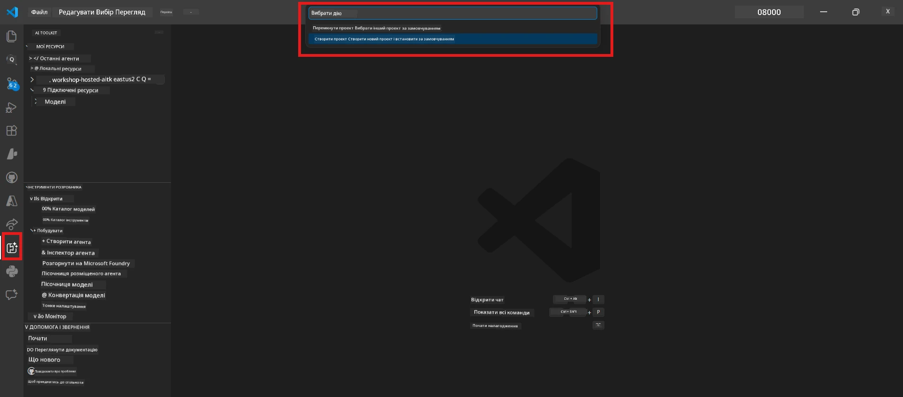
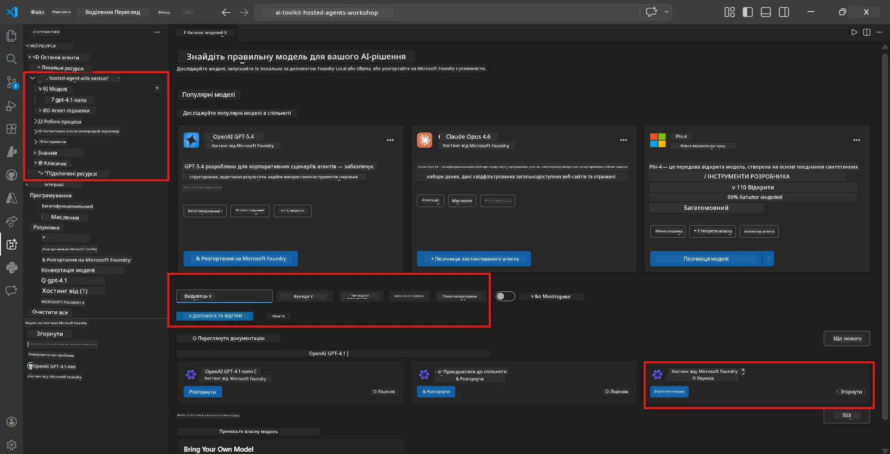
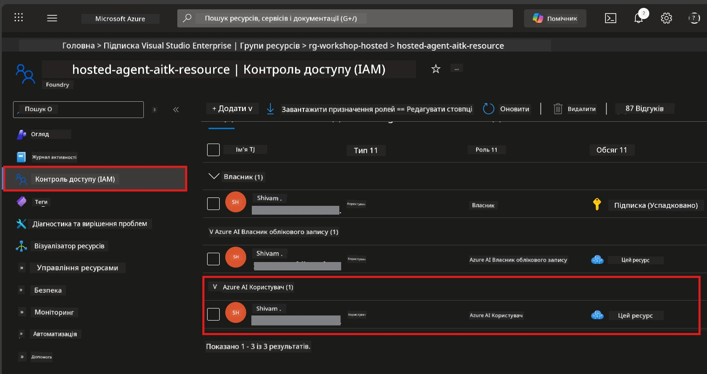

# Модуль 2 - Створення проекту Foundry та розгортання моделі

У цьому модулі ви створюєте (або вибираєте) проект Microsoft Foundry та розгортаєте модель, яку використовуватиме ваш агент. Кожен крок описано докладно — виконуйте їх послідовно.

> Якщо у вас вже є проект Foundry з розгорнутою моделлю, переходьте до [Модуля 3](03-create-hosted-agent.md).

---

## Крок 1: Створіть проект Foundry з VS Code

Ви скористаєтеся розширенням Microsoft Foundry, щоб створити проект, не покидаючи VS Code.

1. Натисніть `Ctrl+Shift+P`, щоб відкрити **Палет команд**.
2. Введіть: **Microsoft Foundry: Create Project** і виберіть цю команду.
3. З’явиться список — виберіть вашу **підписку Azure**.
4. Вам запропонують вибрати або створити **групу ресурсів**:
   - Щоб створити нову: введіть ім’я (наприклад, `rg-hosted-agents-workshop`) і натисніть Enter.
   - Щоб використати існуючу: виберіть її зі списку.
5. Виберіть **регіон**. **Важливо:** Оберіть регіон, який підтримує розміщені агенти. Перевірте [доступність регіонів](https://learn.microsoft.com/azure/foundry/agents/concepts/hosted-agents#region-availability) — найпопулярніші варіанти: `East US`, `West US 2` або `Sweden Central`.
6. Введіть **назву** проекту Foundry (наприклад, `workshop-agents`).
7. Натисніть Enter і зачекайте на завершення створення.

> **Створення триває 2-5 хвилин.** Ви побачите повідомлення про прогрес у правому нижньому куті VS Code. Не закривайте VS Code під час створення.

8. Після завершення в бічній панелі **Microsoft Foundry** побачите новий проект у розділі **Resources**.
9. Клікніть на ім’я проекту, щоб розгорнути його, і переконайтеся, що там є розділи **Models + endpoints** і **Agents**.



### Альтернатива: створення через портал Foundry

Якщо ви віддаєте перевагу браузеру:

1. Відкрийте [https://ai.azure.com](https://ai.azure.com) та увійдіть.
2. Натисніть на головній сторінці кнопку **Create project**.
3. Введіть назву проекту, виберіть підписку, групу ресурсів і регіон.
4. Натисніть **Create** і зачекайте, поки проект створиться.
5. Після створення повертайтеся до VS Code — проект з’явиться в бічній панелі Foundry після оновлення (клацніть на іконку оновлення).

---

## Крок 2: Розгортання моделі

Вашому [розміщеному агенту](https://learn.microsoft.com/azure/foundry/agents/concepts/hosted-agents) потрібна модель Azure OpenAI для генерації відповідей. Зараз ви [розгорнете одну](https://learn.microsoft.com/azure/ai-foundry/openai/how-to/create-resource#deploy-a-model).

1. Натисніть `Ctrl+Shift+P`, щоб відкрити **Палет команд**.
2. Введіть: **Microsoft Foundry: Open [Model Catalog](https://learn.microsoft.com/azure/ai-foundry/openai/concepts/models)** і виберіть цю команду.
3. Відкриється перегляд Каталогу моделей у VS Code. Пошукайте або скористайтеся пошуком, щоб знайти **gpt-4.1**.
4. Клікніть на картці моделі **gpt-4.1** (або `gpt-4.1-mini`, якщо хочете з меншими витратами).
5. Натисніть **Deploy**.


6. У конфігурації розгортання:
   - **Deployment name**: залиште значення за замовчуванням (наприклад, `gpt-4.1`) або введіть власне ім’я. **Запам’ятайте це ім’я** — воно знадобиться у Модулі 4.
   - **Target**: виберіть **Deploy to Microsoft Foundry** та оберіть проект, який щойно створили.
7. Натисніть **Deploy** і зачекайте на завершення розгортання (1-3 хвилини).

### Вибір моделі

| Модель | Найкраще для | Вартість | Примітки |
|--------|--------------|----------|----------|
| `gpt-4.1` | Відповіді високої якості з нюансами | Вища | Найкращі результати, рекомендована для фінального тестування |
| `gpt-4.1-mini` | Швидка ітерація, нижча вартість | Нижча | Добре підходить для розробки на воркшопі та швидкого тестування |
| `gpt-4.1-nano` | Легкі завдання | Найнижча | Найекономічніша, але відповіді простіші |

> **Рекомендація для цього воркшопу:** використовуйте `gpt-4.1-mini` для розробки та тестування. Швидко, дешево й дає добрі результати для вправ.

### Перевірка розгортання моделі

1. У бічній панелі **Microsoft Foundry**, розгорніть ваш проект.
2. Перегляньте розділ **Models + endpoints** (або подібний).
3. Там має бути розгорнута модель (наприклад, `gpt-4.1-mini`) зі статусом **Succeeded** або **Active**.
4. Клікніть на розгортання моделі, щоб переглянути деталі.
5. **Запишіть** ці два значення — вони знадобляться вам у Модулі 4:

   | Налаштування | Де знайти | Приклад значення |
   |--------------|-----------|------------------|
   | **Project endpoint** | Клікніть на ім’я проекту у бічній панелі Foundry. URL кінцевої точки показано у деталях. | `https://<account>.services.ai.azure.com/api/projects/<project>` |
   | **Model deployment name** | Ім’я, що показується поруч із розгорнутою моделлю. | `gpt-4.1-mini` |

---

## Крок 3: Призначення необхідних ролей RBAC

Цей крок — **найчастіше пропускається**. Без належних ролей розгортання у Модулі 6 завершиться помилкою доступу.

### 3.1 Призначте собі роль Azure AI User

1. Відкрийте браузер і перейдіть на [https://portal.azure.com](https://portal.azure.com).
2. У верхній панелі пошуку введіть назву вашого **проєкту Foundry** та клікніть його у результатах.
   - **Важливо:** Перейдіть до ресурсу **проєкту** (тип: "Microsoft Foundry project"), а не до батьківського ресурсу акаунту/хаба.
3. У лівому меню проєкту виберіть **Access control (IAM)**.
4. Натисніть кнопку **+ Add** угорі → оберіть **Add role assignment**.
5. У вкладці **Role** знайдіть і виберіть [**Azure AI User**](https://learn.microsoft.com/azure/foundry/concepts/rbac-foundry#built-in-roles). Натисніть **Next**.
6. У вкладці **Members**:
   - Оберіть **User, group, or service principal**.
   - Клікніть **+ Select members**.
   - Знайдіть своє ім’я або email, виберіть себе і натисніть **Select**.
7. Натисніть **Review + assign** → а потім ще раз **Review + assign** для підтвердження.



### 3.2 (Опційно) Призначте роль Azure AI Developer

Якщо потрібно створювати додаткові ресурси в проєкті або керувати розгортаннями програмно:

1. Повторіть попередні кроки, але на 5-му кроці оберіть роль **Azure AI Developer**.
2. Призначте її на рівні **Foundry resource (account)**, а не лише на рівні проєкту.

### 3.3 Перевірте призначення ролей

1. На сторінці **Access control (IAM)** проєкту перейдіть на вкладку **Role assignments**.
2. Знайдіть своє ім’я.
3. Ви маєте бачити принаймні роль **Azure AI User** в межах проєкту.

> **Чому це важливо:** Роль [`Azure AI User`](https://learn.microsoft.com/azure/foundry/concepts/rbac-foundry#built-in-roles) надає дію даних `Microsoft.CognitiveServices/accounts/AIServices/agents/write`. Без неї під час розгортання з’явиться така помилка:
>
> ```
> Error: lacks the required data action 
> Microsoft.CognitiveServices/accounts/AIServices/agents/write 
> to perform POST /api/projects/{projectName}/assistants operation.
> ```
>
> Див. [Модуль 8 - Вирішення проблем](08-troubleshooting.md) для докладнішої інформації.

---

### Контрольний список

- [ ] Проєкт Foundry створено і він видно у бічній панелі Microsoft Foundry у VS Code
- [ ] Принаймні одна модель розгорнута (наприклад, `gpt-4.1-mini`) зі статусом **Succeeded**
- [ ] Ви записали URL **project endpoint** та ім’я **model deployment**
- [ ] У вас призначено роль **Azure AI User** на рівні **проекту** (перевірте в Azure Portal → IAM → Role assignments)
- [ ] Проєкт знаходиться в [підтримуваному регіоні](https://learn.microsoft.com/azure/foundry/agents/concepts/hosted-agents#region-availability) для розміщених агентів

---

**Попередній:** [01 - Встановлення Foundry Toolkit](01-install-foundry-toolkit.md) · **Наступний:** [03 - Створення розміщеного агента →](03-create-hosted-agent.md)

---

<!-- CO-OP TRANSLATOR DISCLAIMER START -->
**Відмова від відповідальності**:
Цей документ було перекладено за допомогою сервісу автоматичного перекладу [Co-op Translator](https://github.com/Azure/co-op-translator). Хоча ми прагнемо до точності, будь ласка, майте на увазі, що автоматичні переклади можуть містити помилки або неточності. Оригінальний документ рідною мовою слід вважати авторитетним джерелом. Для критично важливої інформації рекомендується звертатися до професійного перекладу людиною. Ми не несемо відповідальності за будь-які непорозуміння чи неправильні тлумачення, що виникли через використання цього перекладу.
<!-- CO-OP TRANSLATOR DISCLAIMER END -->