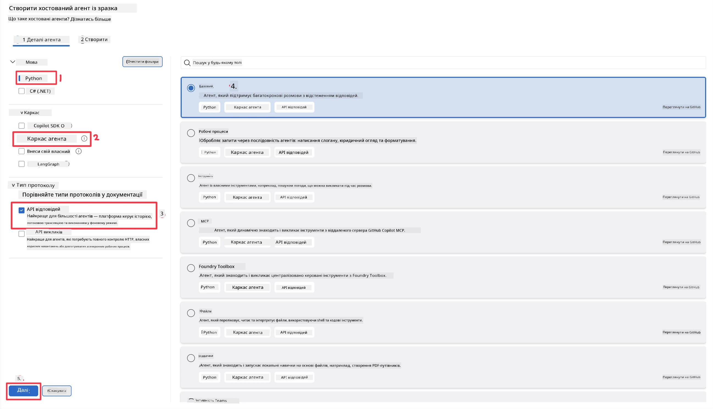
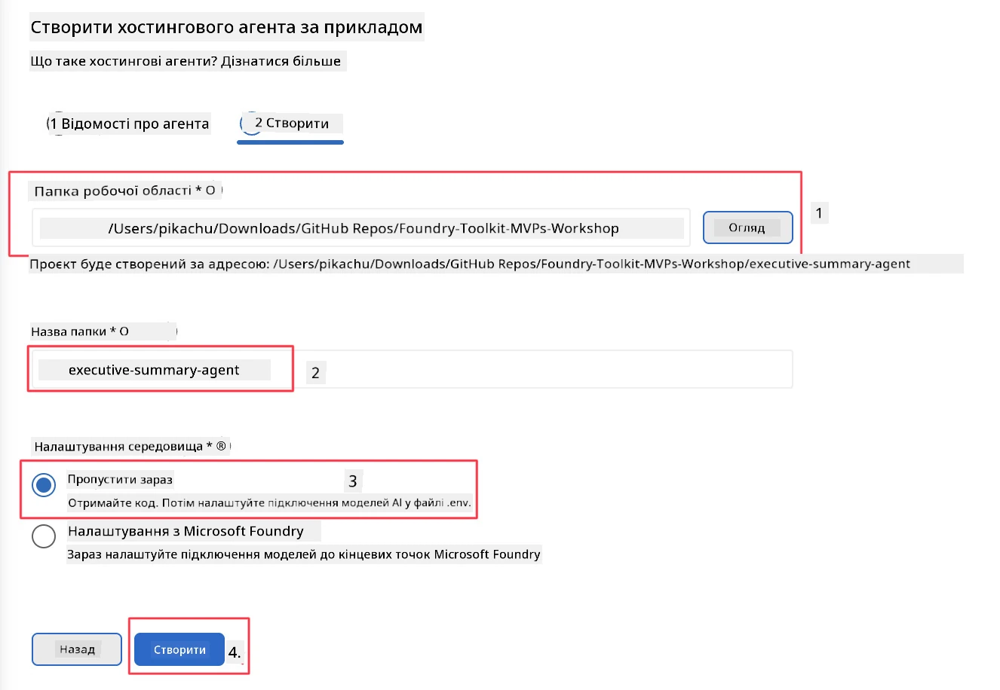

# Модуль 2 - Створення нового розміщеного агента

⏱️ ~5 хв

У цьому модулі ви використовуєте Foundry Toolkit, щоб **створити проект розміщеного агента**. Шаблон генерує повну структуру проекту — `agent.yaml`, `main.py`, `Dockerfile`, `requirements.txt` та конфігурацію налагодження VS Code — щоб ви могли зосередитись на налаштуванні поведінки агента.

> **Ключова концепція:** папка `agent/` у цій лабораторній роботі є прикладом того, що генерує Foundry Toolkit. Ви не пишете ці файли з нуля.

### Потік майстра створення шаблону

```mermaid
flowchart LR
    A["Command Palette:
    Create new Hosted Agent"] --> B["Language:
    Python"]
    B --> C["API type:
    Response API"]
    C --> D["Template:
    Basic - Agent Framework"]
    D --> E["Вибрати модель"]
    E --> F["Workspace folder
    & agent name"]
    F --> G["Згенерований проєкт"]

    style A fill:#4A90D9,color:#fff
    style B fill:#7B68EE,color:#fff
    style C fill:#7B68EE,color:#fff
    style D fill:#7B68EE,color:#fff
    style E fill:#7B68EE,color:#fff
    style F fill:#7B68EE,color:#fff
    style G fill:#27AE60,color:#fff
```



---

## Крок 1: Відкрийте майстер створення розміщеного агента

1. Натисніть `Ctrl+Shift+P`, щоб відкрити **Палітру команд**.
2. Введіть: **Foundry Toolkit: Create new Hosted Agent** і оберіть цю команду.

> **Альтернатива: створіть через Foundry Portal**
> Якщо ви віддаєте перевагу браузеру, можете створити проект на [https://ai.azure.com](https://ai.azure.com). Після створення проекту поверніться до VS Code і використайте бічну панель **Foundry Toolkit** для підключення.

> **Альтернативно:** натисніть іконку **+** поруч із **Hosted Agents (Preview)** на бічній панелі Foundry Toolkit.

## Крок 2: Виберіть налаштування



1. У лівому розділі навігації/опцій виберіть наступне:

| Меню | Вибір | Примітки |
|--------|-----------|-------|
| **Мова** | Python | Підтримується також C# |
| **Фреймворк** | Agent Framework | Простий старт за допомогою Agent Framework SDK |
| **Тип API** | Response API | `POST /responses` — для розмовного режиму з історією, що управляється платформою |
| **Шаблон** | Basic | Простий старт за допомогою Agent Framework SDK |

2. Після вибору натисніть **Next**



3. У наступному вікні виберіть наступне:

| Меню | Вибір | Примітки |
|--------|-----------|-------|
| **Тека робочого простору** | Оберіть цільову теку | наприклад, `/workspace/Foundry_Toolkit_for_VSCode_Lab/` або підтеку в цьому репозиторії |
| **Назва агента** | Введіть ім'я | наприклад, `executive-summary-agent` |
| **Налаштування середовища** | поки пропустіть налаштування |  |

Натисніть **create**, щоб створити агента. Буде створено нову теку з назвою розміщеного агента.

## Крок 3: Ознайомтесь із згенерованим проектом

Після завершення створення перевірте, що в Провіднику (`Ctrl+Shift+E`) відображаються такі файли:

```
📂 my-agent/
├── .env                ← Environment variables (placeholders)
├── .vscode/
│   ├── launch.json     ← Debug config (F5 → run + Agent Inspector)
│   └── tasks.json      ← VS Code task definitions
├── agent.yaml          ← Agent definition (kind: hosted)
├── Dockerfile          ← Container config for deployment
├── main.py             ← Agent entry point (your main code)
└── requirements.txt    ← Python dependencies
```

### Пояснення ключових файлів

| Файл | Призначення |
|------|---------|
| `agent.yaml` | Оголошує агента як `kind: hosted`, ставить змінні середовища, визначає протокол `/responses` |
| `main.py` | Створює `FoundryChatClient` → обгортає його в `Agent` з інструкціями → запускає через `ResponsesHostServer` на порті 8088 |
| `Dockerfile` | Використовує `python:3.12-slim`, встановлює залежності, відкриває порт 8088, запускає `main.py` |
| `requirements.txt` | `agent-framework-foundry`, `agent-framework-foundry-hosting`, `mcp`, `debugpy` |

> **Важливо:** Відкривайте створену теку агента напряму у VS Code (саму теку `agent/`), щоб `.vscode/launch.json` і `tasks.json` коректно працювали для налагодження F5.

---

### ✅ Перевірочний пункт

- [ ] Створений шаблон проекту містить усі очікувані файли
- [ ] У `agent.yaml` зазначено `kind: hosted` та `protocol: responses`
- [ ] `main.py` імпортує `Agent`, `FoundryChatClient`, `ResponsesHostServer`
- [ ] Папка агента відкрита у VS Code як корінь робочого простору

---

**Попередній:** [01 - Налаштування](01-setup.md) · **Наступний:** [03 - Конфігурування та код →](03-configure-and-code.md)

---

<!-- CO-OP TRANSLATOR DISCLAIMER START -->
**Відмова від відповідальності**:
Цей документ було перекладено за допомогою сервісу штучного інтелекту для перекладу [Co-op Translator](https://github.com/Azure/co-op-translator). Хоча ми прагнемо до точності, будь ласка, майте на увазі, що автоматичні переклади можуть містити помилки або неточності. Оригінальний документ рідною мовою слід вважати авторитетним джерелом. Для критично важливої інформації рекомендується професійний людський переклад. Ми не несемо відповідальності за будь-які непорозуміння або неправильні тлумачення, що виникли внаслідок використання цього перекладу.
<!-- CO-OP TRANSLATOR DISCLAIMER END -->