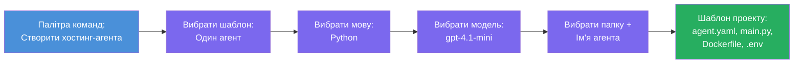

# Module 3 - Створення нового розміщеного агента (автоматично створеного розширенням Foundry)

У цьому модулі ви використовуєте розширення Microsoft Foundry, щоб **створити новий проект [hosted agent](https://learn.microsoft.com/azure/foundry/agents/concepts/hosted-agents)**. Розширення генерує для вас всю структуру проєкту – включно з `agent.yaml`, `main.py`, `Dockerfile`, `requirements.txt`, файлом `.env` та конфігурацією налагодження VS Code. Після створення каркаса ви налаштовуєте ці файли інструкціями, інструментами та конфігурацією вашого агента.

> **Ключова ідея:** Папка `agent/` у цій лабораторній роботі є прикладом того, що генерує розширення Foundry, коли ви запускаєте цю команду scaffold. Ви не пишете ці файли з нуля – розширення створює їх, а потім ви їх змінюєте.

### Послідовність роботи майстра scaffold


---

## Крок 1: Відкрийте майстер створення Hosted Agent

1. Натисніть `Ctrl+Shift+P`, щоб відкрити **Command Palette**.
2. Введіть: **Microsoft Foundry: Create a New Hosted Agent** і виберіть цю команду.
3. Відкриється майстер створення розміщеного агента.

> **Альтернативний шлях:** Ви також можете відкрити цей майстер із бічної панелі Microsoft Foundry → натиснувши значок **+** поряд з **Agents** або клацнути правою кнопкою та обрати **Create New Hosted Agent**.

---

## Крок 2: Виберіть шаблон

Майстер попросить вас вибрати шаблон. Ви побачите опції, такі як:

| Шаблон | Опис | Коли використовувати |
|----------|-------------|-------------|
| **Single Agent** | Один агент із власною моделлю, інструкціями та опціональними інструментами | Цей воркшоп (Лабораторна 01) |
| **Multi-Agent Workflow** | Кілька агентів, які спільно працюють послідовно | Лабораторна 02 |

1. Оберіть **Single Agent**.
2. Натисніть **Next** (або вибір відбудеться автоматично).

---

## Крок 3: Виберіть мову програмування

1. Оберіть **Python** (рекомендується для цього воркшопу).
2. Натисніть **Next**.

> **Підтримується також C#**, якщо ви віддаєте перевагу .NET. Структура scaffold подібна (використовується `Program.cs` замість `main.py`).

---

## Крок 4: Виберіть модель

1. Майстер покаже моделі, розгорнуті у вашому проєкті Foundry (з Модуля 2).
2. Оберіть модель, яку ви розгорнули – наприклад, **gpt-4.1-mini**.
3. Натисніть **Next**.

> Якщо ви не бачите моделей, поверніться до [Модуля 2](02-create-foundry-project.md) і спершу розгорніть модель.

---

## Крок 5: Виберіть папку та ім’я агента

1. Відкриється діалог вибору файлу – виберіть **папку призначення**, куди буде створено проєкт. Для цього воркшопу:
   - Якщо починаєте з нуля: оберіть будь-яку папку (наприклад, `C:\Projects\my-agent`)
   - Якщо працюєте у репозиторії воркшопу: створіть нову підпапку в `workshop/lab01-single-agent/agent/`
2. Введіть **ім’я** для розміщеного агента (наприклад, `executive-summary-agent` або `my-first-agent`).
3. Натисніть **Create** (або Enter).

---

## Крок 6: Зачекайте, поки scaffold завершиться

1. VS Code відкриває **нове вікно** з сгенерованим проєктом.
2. Зачекайте кілька секунд, поки проєкт повністю завантажиться.
3. Ви повинні побачити такі файли у панелі Explorer (`Ctrl+Shift+E`):

```
📂 my-first-agent/
├── .env                ← Environment variables (auto-generated with placeholders)
├── .vscode/
│   └── launch.json     ← Debug configuration (F5 to run + Agent Inspector)
├── agent.yaml          ← Agent definition (kind: hosted)
├── Dockerfile          ← Container configuration for deployment
├── main.py             ← Agent entry point (your main code file)
└── requirements.txt    ← Python dependencies
```

> **Це та сама структура, що і в папці `agent/`** у цій лабораторній роботі. Розширення Foundry генерує ці файли автоматично – вам не потрібно створювати їх вручну.

> **Зауваження для воркшопу:** У цьому репозиторії воркшопу папка `.vscode/` знаходиться у **корені робочої області** (не всередині кожного проєкту). Вона містить спільні файли `launch.json` та `tasks.json` із двома конфігураціями налагодження – **"Lab01 - Single Agent"** та **"Lab02 - Multi-Agent"** – кожна з яких вказує на правильну `cwd` відповідної лабораторної роботи. Коли ви натискаєте F5, оберіть у випадаючому списку конфігурацію, що відповідає робочій лабораторній.

---

## Крок 7: Ознайомтесь із кожним згенерованим файлом

Відведіть хвилину, щоб переглянути кожен файл, створений майстром. Розуміння їх важливе для Модуля 4 (налаштування).

### 7.1 `agent.yaml` – визначення агента

Відкрийте `agent.yaml`. Він виглядає так:

```yaml
# yaml-language-server: $schema=https://raw.githubusercontent.com/microsoft/AgentSchema/refs/heads/main/schemas/v1.0/ContainerAgent.yaml

kind: hosted
name: my-first-agent
description: >
  A hosted agent deployed to Microsoft Foundry Agent Service.
metadata:
  authors:
    - Microsoft
  tags:
    - Azure AI AgentServer
    - Microsoft Agent Framework
    - Hosted Agent
protocols:
  - protocol: responses
    version: v1
environment_variables:
  - name: AZURE_AI_PROJECT_ENDPOINT
    value: ${PROJECT_ENDPOINT}
  - name: AZURE_AI_MODEL_DEPLOYMENT_NAME
    value: ${MODEL_DEPLOYMENT_NAME}
dockerfile_path: Dockerfile
resources:
  cpu: '0.25'
  memory: 0.5Gi
```

**Ключові поля:**

| Поле | Призначення |
|-------|---------|
| `kind: hosted` | Оголошує, що це розміщений агент (на базі контейнера, розгорнутий у [Foundry Agent Service](https://learn.microsoft.com/azure/foundry/agents/overview)) |
| `protocols: responses v1` | Агент відкриває HTTP-ендпоінт `/responses`, сумісний з OpenAI |
| `environment_variables` | Відображає значення з `.env` на змінні середовища контейнера під час розгортання |
| `dockerfile_path` | Вказує на Dockerfile, що використовується для побудови образу контейнера |
| `resources` | Призначення CPU і пам’яті для контейнера (0.25 CPU, 0.5Gi пам’яті) |

### 7.2 `main.py` – точка входу агента

Відкрийте `main.py`. Це головний Python-файл, де знаходиться логіка агента. Каркас містить:

```python
from agent_framework.azure import AzureAIAgentClient
from azure.ai.agentserver.agentframework import from_agent_framework
from azure.identity.aio import DefaultAzureCredential
```

**Ключові імпорти:**

| Імпорт | Призначення |
|--------|--------|
| `AzureAIAgentClient` | Підключається до вашого проєкту Foundry і створює агентів через `.as_agent()` |
| [`DefaultAzureCredential`](https://learn.microsoft.com/azure/developer/python/sdk/authentication/credential-chains#defaultazurecredential-overview) | Обробляє автентифікацію (Azure CLI, вхід у VS Code, керована ідентичність або service principal) |
| `from_agent_framework` | Обгортає агента як HTTP-сервер, що відкриває кінцеву точку `/responses` |

Основний потік такий:
1. Створення credentials → створення клієнта → виклик `.as_agent()` для отримання агента (асинхронний контекстний менеджер) → обгортання як сервера → запуск

### 7.3 `Dockerfile` – образ контейнера

```dockerfile
FROM python:3.14-slim

WORKDIR /app

COPY ./ .

RUN pip install --upgrade pip && \
    if [ -f requirements.txt ]; then \
        pip install -r requirements.txt; \
    else \
        echo "No requirements.txt found" >&2; exit 1; \
    fi

EXPOSE 8088

CMD ["python", "main.py"]
```

**Ключові відомості:**
- Використовує `python:3.14-slim` як базовий образ.
- Копіює всі файли проєкту у `/app`.
- Оновлює `pip`, встановлює залежності з `requirements.txt` і швидко зупиняється, якщо цей файл відсутній.
- **Відкриває порт 8088** – це обов'язковий порт для розміщених агентів. Не змінюйте його.
- Запускає агента командою `python main.py`.

### 7.4 `requirements.txt` – залежності

```
agent-framework-azure-ai==1.0.0rc3
agent-framework-core==1.0.0rc3
azure-ai-agentserver-agentframework==1.0.0b16
azure-ai-agentserver-core==1.0.0b16
debugpy
agent-dev-cli
```

| Пакет | Призначення |
|---------|---------|
| `agent-framework-azure-ai` | Інтеграція Azure AI для Microsoft Agent Framework |
| `agent-framework-core` | Основне середовище виконання для створення агентів (містить `python-dotenv`) |
| `azure-ai-agentserver-agentframework` | Серверний runtime для розміщених агентів Foundry Agent Service |
| `azure-ai-agentserver-core` | Основні абстракції серверів агентів |
| `debugpy` | Підтримка налагодження Python (дозволяє налагоджувати через F5 у VS Code) |
| `agent-dev-cli` | Локальний CLI для розробки і тестування агентів (використовується конфігурацією налагодження/запуску) |

---

## Розуміння протоколу агента

Розміщені агенти спілкуються через протокол **OpenAI Responses API**. Під час роботи (локально чи в хмарі) агент відкриває єдиний HTTP-ендпоінт:

```
POST http://localhost:8088/responses
Content-Type: application/json

{
  "input": "Your prompt here",
  "stream": false
}
```

Foundry Agent Service звертається до цього ендпоінта, щоб надсилати запити користувача та отримувати відповіді агента. Це той самий протокол, що і API OpenAI, тому ваш агент сумісний з будь-яким клієнтом, який підтримує формат OpenAI Responses.

---

### Перевірка

- [ ] Майстер scaffold успішно завершився і відкрився **новий вікно VS Code**
- [ ] Ви бачите всі 5 файлів: `agent.yaml`, `main.py`, `Dockerfile`, `requirements.txt`, `.env`
- [ ] Файл `.vscode/launch.json` існує (дозволяє налагоджувати через F5 – у цьому воркшопі він у корені робочої області з конфігураціями для конкретних лабораторних)
- [ ] Ви ознайомилися з кожним файлом і розумієте його призначення
- [ ] Ви розумієте, що порт `8088` є обов’язковим і що `/responses` є протоколом

---

**Попередній:** [02 - Create Foundry Project](02-create-foundry-project.md) · **Наступний:** [04 - Configure & Code →](04-configure-and-code.md)

---

<!-- CO-OP TRANSLATOR DISCLAIMER START -->
**Відмова від відповідальності**:  
Цей документ було перекладено за допомогою сервісу AI-перекладу [Co-op Translator](https://github.com/Azure/co-op-translator). Хоча ми прагнемо до точності, будь ласка, майте на увазі, що автоматизовані переклади можуть містити помилки або неточності. Оригінальний документ рідною мовою слід вважати авторитетним джерелом. Для критично важливої інформації рекомендується професійний людський переклад. Ми не несемо відповідальність за будь-які непорозуміння або неправильні тлумачення, що виникли внаслідок використання цього перекладу.
<!-- CO-OP TRANSLATOR DISCLAIMER END -->