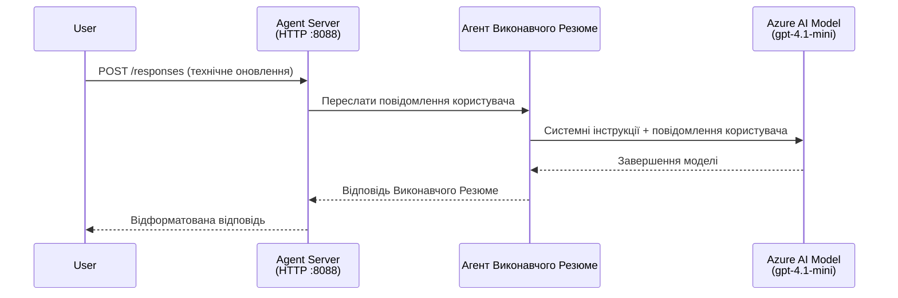
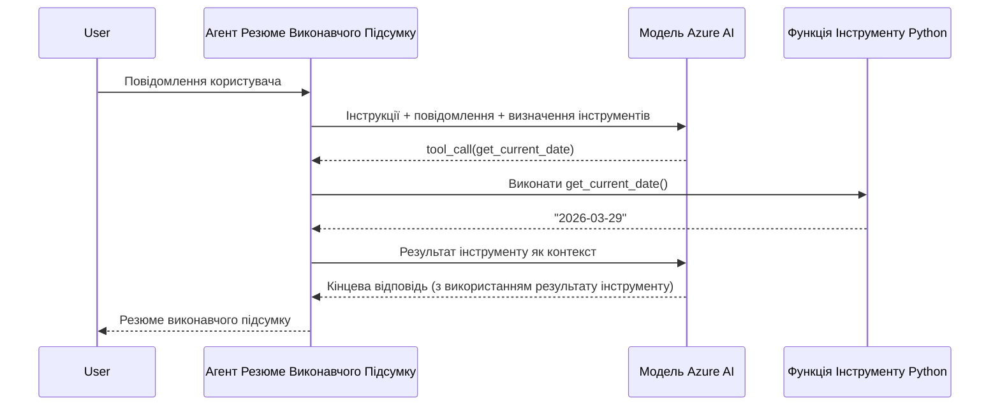

# Модуль 4 - Налаштування інструкцій, середовища та встановлення залежностей

У цьому модулі ви налаштовуєте автоматично створені файли агента з Модуля 3. Тут ви перетворюєте загальний скелет у **вашого** агента — написанням інструкцій, встановленням змінних середовища, за бажанням додаванням інструментів і встановленням залежностей.

> **Нагадування:** Розширення Foundry автоматично згенерувало файли вашого проєкту. Тепер ви їх модифікуєте. Дивіться папку [`agent/`](../../../../../workshop/lab01-single-agent/agent) для повного робочого прикладу налаштованого агента.

---

## Як компоненти взаємодіють

### Життєвий цикл запиту (один агент)


> **З інструментами:** Якщо агент має зареєстровані інструменти, модель може повернути виклик інструменту замість прямої відповіді. Фреймворк виконує інструмент локально, передає результат назад моделі, і модель тоді генерує остаточну відповідь.


---

## Крок 1: Налаштуйте змінні середовища

Скелет створив файл `.env` з тимчасовими значеннями. Вам потрібно заповнити реальні значення з Модуля 2.

1. У вашому проєкті відкрийте файл **`.env`** (в корені проєкту).
2. Змініть значення-заповнювачі на реальні деталі вашого проєкту Foundry:

   ```env
   PROJECT_ENDPOINT=https://<your-account>.services.ai.azure.com/api/projects/<your-project>
   MODEL_DEPLOYMENT_NAME=gpt-4.1-mini
   ```

3. Збережіть файл.

### Де знайти ці значення

| Значення | Як знайти |
|----------|-----------|
| **Проєктний endpoint** | Відкрийте бічну панель **Microsoft Foundry** у VS Code → клацніть на ваш проєкт → URL endpoint видно у вікні деталей. Він виглядає так: `https://<account-name>.services.ai.azure.com/api/projects/<project-name>` |
| **Ім’я розгортання моделі** | В бічній панелі Foundry розгорніть ваш проєкт → перегляньте секцію **Models + endpoints** → ім’я вказане поруч з розгорнутою моделлю (наприклад, `gpt-4.1-mini`) |

> **Безпека:** Ніколи не комітьте файл `.env` у систему контролю версій. Він уже стандартно доданий у `.gitignore`. Якщо ні — додайте його:
> ```
> .env
> ```

### Як проходять змінні середовища

Послідовність: `.env` → `main.py` (читає через `os.getenv`) → `agent.yaml` (відповідність зі змінними середовища контейнера під час розгортання).

У `main.py` скелет читає ці значення так:

```python
PROJECT_ENDPOINT = os.getenv("AZURE_AI_PROJECT_ENDPOINT") or os.getenv("PROJECT_ENDPOINT")
MODEL_DEPLOYMENT_NAME = os.getenv("AZURE_AI_MODEL_DEPLOYMENT_NAME", os.getenv("MODEL_DEPLOYMENT_NAME", "gpt-4.1-mini"))
```

Приймаються обидва: `AZURE_AI_PROJECT_ENDPOINT` і `PROJECT_ENDPOINT` (у `agent.yaml` використовується префікс `AZURE_AI_*`).

---

## Крок 2: Напишіть інструкції агента

Це найважливіший крок налаштування. Інструкції визначають особистість агента, його поведінку, формат виводу та обмеження з безпеки.

1. Відкрийте `main.py` у вашому проєкті.
2. Знайдіть рядок інструкцій (у скелеті є за замовчуванням/загальна інструкція).
3. Замініть його на детальні, структуровані інструкції.

### Що мають містити хороші інструкції

| Компонент | Призначення | Приклад |
|-----------|-------------|---------|
| **Роль** | Хто агент і що робить | "Ви — агент виконавчого резюме" |
| **Аудиторія** | Для кого будуть відповіді | "Вищі керівники з обмеженим технічним досвідом" |
| **Визначення вхідних даних** | Які типи запитів обробляє | "Технічні звіти про інциденти, оновлення операцій" |
| **Формат виводу** | Точна структура відповідей | "Виконавче резюме: - Що сталося: ... - Бізнес-наслідки: ... - Наступний крок: ..." |
| **Правила** | Обмеження і умови відмови | "НЕ додавайте інформацію понад надану" |
| **Безпека** | Запобігання неправильному використанню та вигадкам | "Якщо запит незрозумілий, попросіть уточнення" |
| **Приклади** | Вхідні/вихідні пари для керування поведінкою | Включіть 2-3 приклади з різними вхідними даними |

### Приклад: Інструкції агента для виконавчого резюме

Ось інструкції, які використані в майстер-класі у [`agent/main.py`](../../../../../workshop/lab01-single-agent/agent/main.py):

```python
AGENT_INSTRUCTIONS = """You are an "Explain Like I'm an Executive" agent.

Purpose:
Your job is to translate complex technical or operational information into
clear, concise, and outcome-focused summaries that can be easily understood
by non-technical executives.

Audience:
Senior leaders with limited technical background who care about impact,
risk, and what happens next.

What you must do:
- Rephrase the input so it is understandable to a non-technical audience
- Prioritize clarity, brevity, and outcomes over technical accuracy
- Remove technical jargon, logs, metrics, stack traces, and deep root-cause details
- Translate technical causes into simple cause-and-effect statements
- Explicitly call out business impact
- Always include a clear next step or action
- Maintain a neutral, factual, and calm executive tone
- Do NOT add new facts or speculate beyond the input

Standard Output Structure (always use this wording):

Executive Summary:
- What happened: <plain-language description>
- Business impact: <clear, non-technical impact>
- Next step: <clear action or mitigation>

Rules:
- Keep responses under 100 words
- Do NOT add facts beyond the input
- If input is unclear, ask for clarification
"""
```

4. Замініть наявний рядок інструкцій у `main.py` на ваші власні.
5. Збережіть файл.

---

## Крок 3: (За бажанням) Додайте власні інструменти

Хостовані агенти можуть виконувати **локальні Python-функції** як [інструменти](https://learn.microsoft.com/azure/foundry/agents/concepts/tool-catalog). Це ключова перевага кодових хостованих агентів над агентами лише з підказками — ваш агент може виконувати довільну серверну логіку.

### 3.1 Визначте функцію інструменту

Додайте функцію-інструмент у `main.py`:

```python
from agent_framework import tool

@tool
def get_current_date() -> str:
    """Returns the current date in YYYY-MM-DD format."""
    from datetime import date
    return str(date.today())
```

Декоратор `@tool` перетворює звичайну Python-функцію на інструмент агента. Докстрінг стає описом інструменту, який бачить модель.

### 3.2 Зареєструйте інструмент в агенті

Під час створення агента через контекстний менеджер `.as_agent()` передайте інструмент у параметр `tools`:

```python
async with AzureAIAgentClient(
    project_endpoint=PROJECT_ENDPOINT,
    model_deployment_name=MODEL_DEPLOYMENT_NAME,
    credential=credential,
).as_agent(
    name="my-agent",
    instructions=AGENT_INSTRUCTIONS,
    tools=[get_current_date],
) as agent:
    server = from_agent_framework(agent)
    await server.run_async()
```

### 3.3 Як працюють виклики інструментів

1. Користувач надсилає запит.
2. Модель вирішує, чи потрібен інструмент (на основі запиту, інструкцій і описів інструментів).
3. Якщо потрібен, фреймворк викликає вашу Python-функцію локально (усередині контейнера).
4. Повернене значення інструменту передається назад моделі як контекст.
5. Модель генерує остаточну відповідь.

> **Інструменти виконуються серверно** – вони працюють всередині вашого контейнера, а не в браузері користувача або в моделі. Це означає, що ви можете використовувати бази даних, API, файлову систему чи будь-які Python-бібліотеки.

---

## Крок 4: Створіть і активуйте віртуальне середовище

Перед встановленням залежностей створіть ізольоване Python-середовище.

### 4.1 Створення віртуального середовища

Відкрийте термінал у VS Code (`` Ctrl+` ``) і виконайте:

```powershell
python -m venv .venv
```

Це створить папку `.venv` у каталозі вашого проєкту.

### 4.2 Активуйте віртуальне середовище

**PowerShell (Windows):**

```powershell
.\.venv\Scripts\Activate.ps1
```

**Command Prompt (Windows):**

```cmd
.venv\Scripts\activate.bat
```

**macOS/Linux (Bash):**

```bash
source .venv/bin/activate
```

У підказці терміналу має з’явитися `(.venv)`, що означає активоване віртуальне середовище.

### 4.3 Встановіть залежності

З активованим середовищем виконайте:

```powershell
pip install -r requirements.txt
```

Встановлюються:

| Пакет | Призначення |
|--------|-------------|
| `agent-framework-azure-ai==1.0.0rc3` | Інтеграція Azure AI для [Microsoft Agent Framework](https://learn.microsoft.com/agent-framework/overview/) |
| `agent-framework-core==1.0.0rc3` | Основне виконання для створення агентів (містить `python-dotenv`) |
| `azure-ai-agentserver-agentframework==1.0.0b16` | Виконуюче середовище хостованого агента для [Foundry Agent Service](https://learn.microsoft.com/azure/foundry/agents/overview) |
| `azure-ai-agentserver-core==1.0.0b16` | Основні абстракції агентного сервера |
| `debugpy` | Відладка Python (підтримує відладку з F5 у VS Code) |
| `agent-dev-cli` | Локальний CLI для розробки і тестування агентів |

### 4.4 Перевірте встановлення

```powershell
pip list | Select-String "agent-framework|agentserver"
```

Очікуваний результат:
```
agent-framework-azure-ai   1.0.0rc3
agent-framework-core       1.0.0rc3
azure-ai-agentserver-agentframework 1.0.0b16
azure-ai-agentserver-core  1.0.0b16
```

---

## Крок 5: Перевірте аутентифікацію

Агент використовує [`DefaultAzureCredential`](https://learn.microsoft.com/azure/developer/python/sdk/authentication/credential-chains#defaultazurecredential-overview), який намагається різні методи автентифікації у такому порядку:

1. **Змінні середовища** — `AZURE_CLIENT_ID`, `AZURE_TENANT_ID`, `AZURE_CLIENT_SECRET` (службовий обліковий запис)
2. **Azure CLI** — використовує ваш сеанс `az login`
3. **VS Code** — використовує акаунт, з яким ви увійшли у VS Code
4. **Managed Identity** — використовується при запуску в Azure (під час розгортання)

### 5.1 Перевірка для локальної розробки

Повинен працювати принаймні один із способів:

**Варіант A: Azure CLI (рекомендується)**

```powershell
az account show --query "{name:name, id:id}" --output table
```

Очікувано: показує назву підписки та її ID.

**Варіант B: Вхід у VS Code**

1. Подивіться внизу зліва у VS Code іконку **Облікові записи**.
2. Якщо ви бачите своє ім’я облікового запису — ви автентифіковані.
3. Якщо ні, натисніть іконку → **Увійти для використання Microsoft Foundry**.

**Варіант C: Службовий обліковий запис (для CI/CD)**

```powershell
$env:AZURE_TENANT_ID = "<your-tenant-id>"
$env:AZURE_CLIENT_ID = "<your-client-id>"
$env:AZURE_CLIENT_SECRET = "<your-client-secret>"
```

### 5.2 Типова проблема з автентифікацією

Якщо ви увійшли у декілька акаунтів Azure, переконайтеся, що обрана правильна підписка:

```powershell
az account set --subscription "<your-subscription-id>"
```

---

### Контрольний список

- [ ] Файл `.env` містить дійсні `PROJECT_ENDPOINT` та `MODEL_DEPLOYMENT_NAME` (не плейсхолдери)
- [ ] Інструкції агента налаштовані у `main.py` — вони визначають роль, аудиторію, формат виводу, правила й обмеження безпеки
- [ ] (За бажанням) Визначені та зареєстровані власні інструменти
- [ ] Віртуальне середовище створене і активоване (`(.venv)` видно у підказці терміналу)
- [ ] Встановлення `pip install -r requirements.txt` пройшло без помилок
- [ ] `pip list | Select-String "azure-ai-agentserver"` показує, що пакет встановлено
- [ ] Аутентифікація валідна — `az account show` повертає вашу підписку АБО ви увійшли у VS Code

---

**Попередній:** [03 - Створення хостованого агента](03-create-hosted-agent.md) · **Наступний:** [05 - Тест локально →](05-test-locally.md)

---

<!-- CO-OP TRANSLATOR DISCLAIMER START -->
**Відмова від відповідальності**:
Цей документ був перекладений за допомогою сервісу автоматичного перекладу штучного інтелекту [Co-op Translator](https://github.com/Azure/co-op-translator). Хоча ми прагнемо до точності, будь ласка, майте на увазі, що автоматичні переклади можуть містити помилки або неточності. Оригінальний документ рідною мовою слід вважати авторитетним джерелом. Для критичної інформації рекомендується професійний людський переклад. Ми не несемо відповідальності за будь-які непорозуміння чи неправильні тлумачення, що виникли внаслідок використання цього перекладу.
<!-- CO-OP TRANSLATOR DISCLAIMER END -->