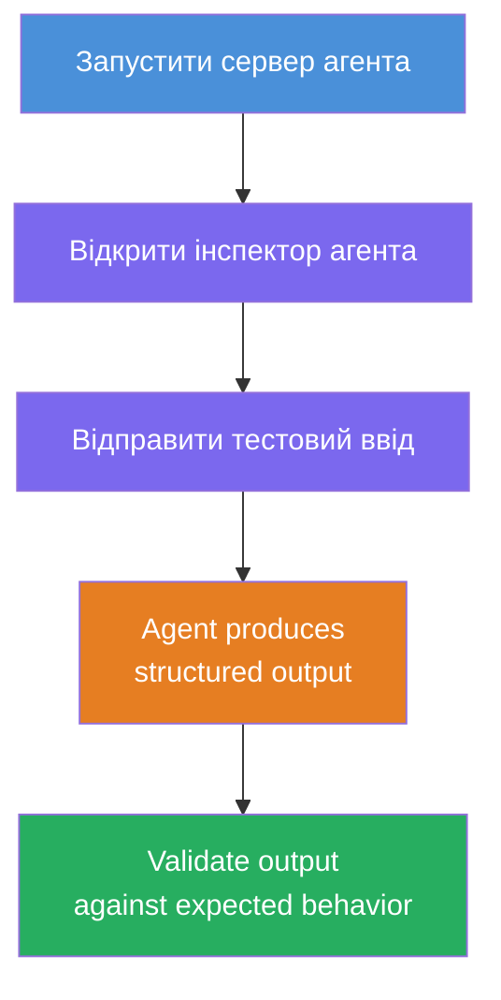
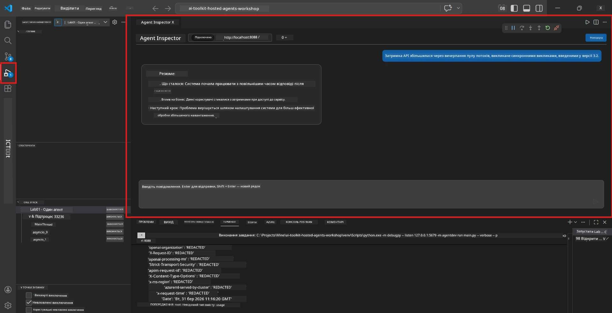
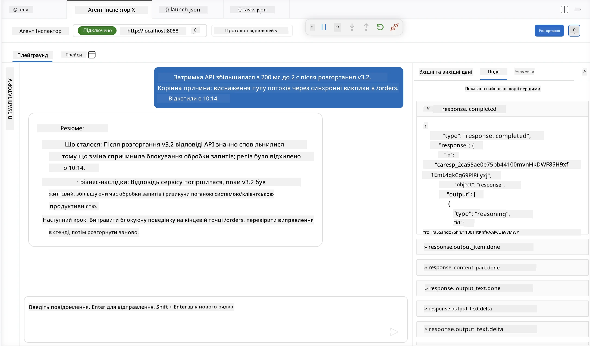

# Модуль 4 - Тестування локально

⏱️ ~10 хв

У цьому модулі ви запускаєте агента локально та перевіряєте, що він працює правильно, використовуючи **функціональні тести з «щасливим шляхом»**. Ви використовуватимете Agent Inspector (візуальний інтерфейс) або прямі HTTP-запити, щоб підтвердити, що агент генерує структуровані, точні відповіді.

### Потік локального тестування



---

## Варіант 1: Натисніть F5 - Налагодження з Agent Inspector (рекомендовано)

### Запуск налагоджувача

1. Відкрийте папку **executive-summary-agent/** безпосередньо у VS Code (`File → Open Folder`).
2. Відкрийте панель **Run and Debug** (`Ctrl+Shift+D`).
3. Виберіть **Debug Local Agent Server** у випадаючому списку.
4. Натисніть **F5** (або клацніть ▶ Start Debugging).

> ⚠️ **Критично: Виберіть інтерпретатор Python**
> Якщо виникає "ModuleNotFoundError" або налагоджувач не запускається, потрібно вказати VS Code використовувати ваше віртуальне середовище:
  > 1. Натисніть `Ctrl+Shift+P` $\rightarrow$ введіть **Python: Select Interpreter**.
  > 2. Виберіть інтерпретатор, який знаходиться у папці `.venv` вашого проєкту (наприклад, `.\.venv\Scripts\python.exe` у Windows).
  > 3. Перезапустіть сесію налагодження.
> Якщо помилки залишаються, вручну оновіть файл `tasks.json` таким чином:
  > 1. Відкрийте файл `.vscode/tasks.json`
  > 2. Знайдіть команду з міткою: `Run Agent/Workflow HTTP Server`
  > 3. Оновіть значення команди наступним чином: `"value": "${workspaceFolder}/.venv/bin/python",`

### Що відбувається

1. HTTP сервер запускається на `http://localhost:8088/responses`.
2. Панель **Agent Inspector** відкривається автоматично — візуальний чат для тестування.
3. В `main.py` активовані точки зупинки.

Спостерігайте за Терминалом:
```
Starting executive summary hosted agent
Executive agent server running on http://localhost:8088
```

> **Якщо Agent Inspector не відкривається:** натисніть `Ctrl+Shift+P` → **Foundry Toolkit: Open Agent Inspector**.



> *Скріншот може містити старий бренд 'AI TOOLKIT' з попередньої версії розширення.*

---

## Варіант 2: Тестування через Терминал (альтернатива)

Запустіть агента в одному терміналі, надсилайте запити з іншого:

```bash
# Термінал 1: Запустити агент
cd executive-summary-agent/
source .venv/bin/activate
python main.py
```

```bash
# Термінал 2: Надіслати тест (curl)
curl -sS -X POST http://localhost:8088/responses \
  -H "Content-Type: application/json" \
  -d '{"input": "The API latency increased due to thread pool exhaustion caused by sync calls in v3.2.", "stream": false}'
```

---

## Тести сценаріїв: Функціональна перевірка щасливого шляху

Запустіть **усі три** сценарії нижче. Вони перевіряють, що ваш агент генерує правильний, структурований результат для реалістичних вхідних даних.



### Сценарій 1: ІТ-інцидент - сплеск затримки API

**Вхідні дані:**
```
The API latency increased from 200ms to 2s after deploying v3.2.
Root cause: thread pool starvation from synchronous calls in /orders.
Rolled back at 10:14.
```

**Очікувана поведінка:**
- ✅ Відповідає структурі "Executive Summary" (Що трапилось / Вплив на бізнес / Наступний крок)
- ✅ Відсутня технічна термінологія (без "thread pool", без "/orders", без "v3.2")
- ✅ Чітко вказано вплив на бізнес (наприклад, користувачі зазнали затримок)
- ✅ Відображено наступний крок (наприклад, розгортання виправлення, налаштований моніторинг)

---

### Сценарій 2: Канал передачі даних - збій ETL

**Вхідні дані:**
```
The nightly ETL job failed because the upstream schema changed. APAC dashboards show missing data.
```

**Очікувана поведінка:**
- ✅ Підсумовує збій оновлення даних простою мовою
- ✅ Зазначає вплив на панель APAC
- ✅ Включає наступний крок для усунення проблеми
- ✅ НЕ містить термінів "ETL", "schema" чи інших технічних термінів

---

### Сценарій 3: Безпека - Відкриті облікові дані

**Вхідні дані:**
```
Static analysis flagged a hardcoded secret in the repository.
The secret may have been exposed in commit history.
```

**Очікувана поведінка:**
- ✅ Описує проблему з обліковими даними/безпекою у дружній для керівництва мові
- ✅ Зазначає потенційний ризик (несанкціонований доступ)
- ✅ Вказує дію з усунення проблеми (ротація облікових даних, аудит)
- ✅ НЕ містить термінів типу "static analysis", "commit history" або "hardcoded"

---

## Критерії валідації

Для кожного сценарію перевірте:

| # | Критерії | Умова проходження |
|---|----------|-------------------|
| 1 | **Структура** | Відповідь використовує формат "Executive Summary" з усіма трьома пунктами |
| 2 | **Проста мова** | Відсутня технічна термінологія, незрозуміла для керівника |
| 3 | **Точність** | Підсумок відображає вхідні дані - без вигаданих деталей |
| 4 | **Лаконічність** | Відповідь містить менше 100 слів |
| 5 | **Наступний крок** | Вказано чітку дію або спосіб усунення проблеми |

---

## Поради для налагодження

| Проблема | Виправлення |
|---------|------------|
| Агент не запускається | Перевірте значення у `.env`, впевніться, що віртуальне середовище активоване, виконайте `pip install -r requirements.txt` |
| Порожня або загальна відповідь | Перегляньте інструкції в `main.py` - переконайтесь, що формат виводу задано |
| Відповідь містить жаргон | Посиліть правила «видалення технічних термінів» в інструкціях |
| Agent Inspector не відкривається | `Ctrl+Shift+P` → **Foundry Toolkit: Open Agent Inspector** |
| Помилки моделі в Терминалі | Перевірте точність `AZURE_AI_MODEL_DEPLOYMENT_NAME` (регістр має значення) |

---

### ✅ Контрольна точка

- [ ] Агент запускається локально без помилок
- [ ] Agent Inspector відкривається та показує інтерфейс чату (якщо використовується F5)
- [ ] **Сценарій 1** (ІТ-інцидент) - структурований Executive Summary, без жаргону
- [ ] **Сценарій 2** (дані) - релевантний підсумок із впливом на бізнес
- [ ] **Сценарій 3** (сповіщення про безпеку) - належне повідомлення про ризики
- [ ] Усі відповіді відповідають визначеній структурі виводу

> **Збережіть свої відповіді** (скопіюйте або зробіть скріншот) - їх порівняють із результатами в хмарі в Модулі 06.

---

**Попередній:** [03 - Налаштування та код](03-configure-and-code.md) · **Наступний:** [05 - Розгортання у Foundry →](05-deploy-to-foundry.md)

---

<!-- CO-OP TRANSLATOR DISCLAIMER START -->
**Відмова від відповідальності**:
Цей документ було перекладено за допомогою сервісу штучного інтелекту для перекладу [Co-op Translator](https://github.com/Azure/co-op-translator). Хоча ми прагнемо до точності, будь ласка, майте на увазі, що автоматичні переклади можуть містити помилки або неточності. Оригінальний документ рідною мовою слід вважати авторитетним джерелом. Для критично важливої інформації рекомендується професійний людський переклад. Ми не несемо відповідальності за будь-які непорозуміння або неправильні тлумачення, що виникли внаслідок використання цього перекладу.
<!-- CO-OP TRANSLATOR DISCLAIMER END -->