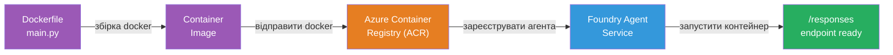
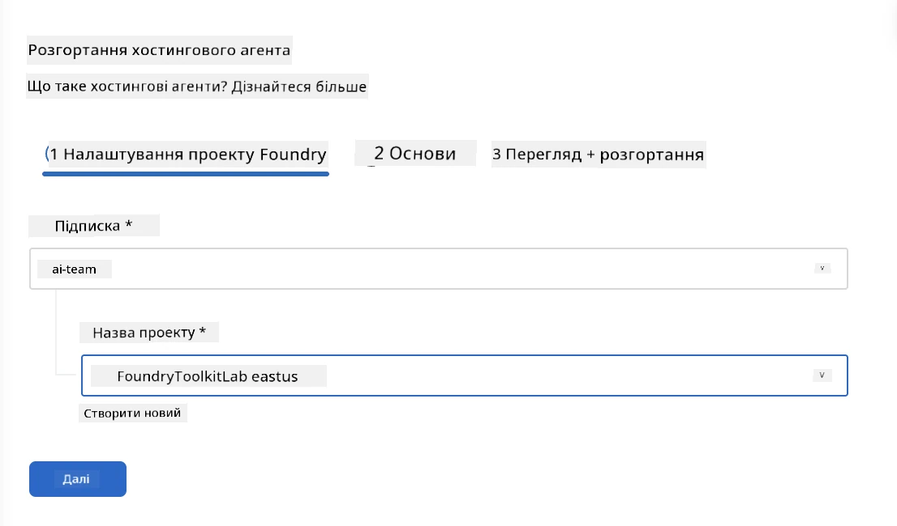
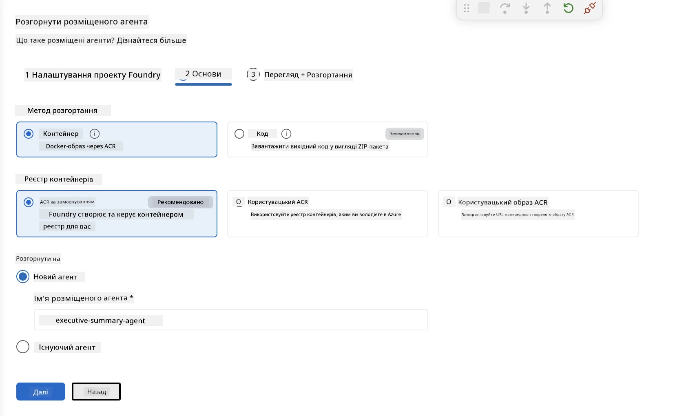
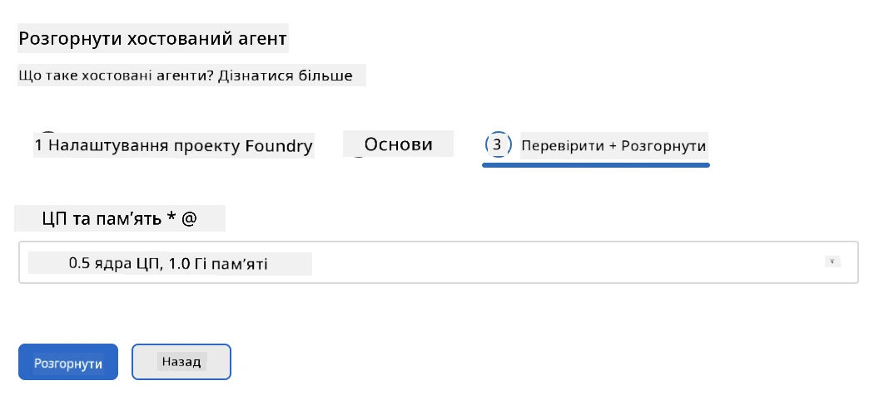
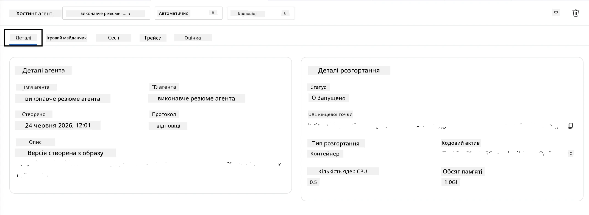

# Модуль 5 - Розгортання в Foundry Agent Service

⏱️ ~10 хв

> ⚠️ **Користувачі Path B:** Цей модуль вимагає підписки Foundry. Якщо ви використовуєте Foundry Local, пропустіть цей модуль і перейдіть до [Модуль 07 - Підсумок](07-summary.md). Ви успішно завершили локальний робочий процес розробки!

У цьому модулі ви розгортаєте ваш локально протестований агент у Microsoft Foundry як **хостинговий агент**. Розгортання будує образ контейнера, завантажує його в Azure Container Registry і запускає агента в керованій інфраструктурі Foundry.

### Конвеєр розгортання

---

## Перевірка вимог

Перед розгортанням перевірте:

- [ ] Агент проходить всі 3 локальні сценарії з [Модуль 04](04-test-locally.md)
- [ ] У вас є роль **Azure AI User** на рівні проєкту ([Модуль 01, Призначення RBAC](01-setup.md#deploy-a-model--assign-rbac))
- [ ] Ви увійшли до Azure в VS Code (іконка Облікові записи показує ваше ім'я)

---

## Крок 1: Почати розгортання

### Варіант А: Розгортання з Agent Inspector (рекомендується)

Якщо Agent Inspector відкритий (після тестування):
1. Натисніть кнопку **Deploy** у верхньому правому куті (іконка хмари ↑).

### Варіант Б: Розгортання з командної палітри

1. Натисніть `Ctrl+Shift+P` → **Foundry Toolkit: Deploy Hosted Agent**.

---

## Крок 2: Налаштування розгортання

Майстер запитає у вас:

| Запит | Вибір |
|--------|-----------|
| **Підписка** | Ваша підписка Azure |
| **Цільовий проєкт** | Ваш проєкт Foundry (наприклад, `workshop-agents`) |

Клікніть **next**, щоб налаштувати агента.

| Запит | Вибір |
|--------|-----------|
| **Метод розгортання** | Контейнер |
| **Реєстр контейнерів** | **За замовчуванням ACR** (Microsoft Foundry створює та управляє для вас) |
| **Розгорнути до** | Новий агент (ім’я, `executive-summary-agent`) |

Клікніть **next**, щоб переглянути та розгорнути агента.

| Запит | Вибір |
|--------|-----------|
| **CPU і пам’ять** | **0.25 ядра CPU, 0.5 Gi пам’яті** (достатньо для воркшопу) |

---

## Крок 3: Розгортання та моніторинг

1. Натисніть **Deploy**.
2. Слідкуйте за панеллю **Output** (виберіть **Microsoft Foundry** у випадаючому меню).
3. Розгортання проходить через такі етапи:
   - **Збірка Docker** — створює контейнер з вашого Dockerfile
   - **Відправка Docker** — завантажує образ до ACR (1–3 хв при першому розгортанні)
   - **Реєстрація агента** — створює хостингового агента у Foundry
   - **Запуск контейнера** — запускається з системною керованою ідентичністю

4. Після завершення з’явиться повідомлення:
   > **my-agent успішно розгорнуто.** `Переглянути логи` `Запустити агента`

5. Натисніть **Run agent**, щоб відкрити Agent Playground.

### Стани розгортання

| Статус | Значення |
|--------|---------|
| **Running** | Контейнер готовий, агент відповідає |
| **Pending** | Контейнер запускається - зачекайте 30–60 секунд |
| **Failed** | Перевірте логи (див. усунення неполадок нижче) |

---

## Поширені помилки розгортання

| Помилка | Причина | Виправлення |
|-------|-----------|-----|
| `agents/write` відмовлено в доступі | Відсутня роль **Azure AI User** на рівні проєкту | [Модуль 01, Призначення RBAC](01-setup.md#deploy-a-model--assign-rbac) |
| Docker не працює | Docker Desktop не запущений | Запустіть Docker Desktop → перевірте через `docker info` |
| Авторизація в ACR | Керована ідентичність не може завантажити образ | Див. [Модуль 08 - Усунення неполадок](08-troubleshooting.md) |

---

### ✅ Контрольний пункт

- [ ] Розгортання завершено без помилок
- [ ] Агент відображається у **Hosted Agents (Preview)** в бічній панелі Foundry
- [ ] Статус контейнера показує **Running**
- [ ] Вкладка Agent Playground відкрита з деталями агента та URL кінцевої точки

---

**Попередній:** [04 - Тестування локально](04-test-locally.md) · **Наступний:** [06 - Перевірка в Playground →](06-verify-in-playground.md)

---

<!-- CO-OP TRANSLATOR DISCLAIMER START -->
**Відмова від відповідальності**:
Цей документ було перекладено за допомогою сервісу штучного інтелекту для перекладу [Co-op Translator](https://github.com/Azure/co-op-translator). Хоча ми прагнемо до точності, будь ласка, майте на увазі, що автоматичні переклади можуть містити помилки або неточності. Оригінальний документ рідною мовою слід вважати авторитетним джерелом. Для критично важливої інформації рекомендується професійний людський переклад. Ми не несемо відповідальності за будь-які непорозуміння або неправильні тлумачення, що виникли внаслідок використання цього перекладу.
<!-- CO-OP TRANSLATOR DISCLAIMER END -->