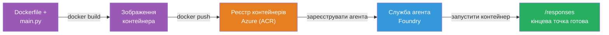
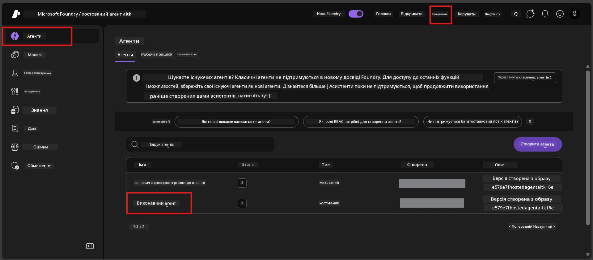

# Module 6 - Розгортання в Foundry Agent Service

У цьому модулі ви розгортаєте локально протестованого агента в Microsoft Foundry як [**Hosted Agent**](https://learn.microsoft.com/azure/foundry/agents/concepts/hosted-agents). Процес розгортання створює образ контейнера Docker з вашого проєкту, пушить його до [Azure Container Registry (ACR)](https://learn.microsoft.com/azure/container-registry/container-registry-intro) та створює версію хостованого агента у [Foundry Agent Service](https://learn.microsoft.com/azure/foundry/agents/overview).

### Канал розгортання


---

## Перевірка передумов

Перед розгортанням перевірте кожен пункт нижче. Пропуск цих кроків є найпоширенішою причиною помилок розгортання.

1. **Агент проходить локальні smock тести:**
   - Ви виконали всі 4 тести в [Module 5](05-test-locally.md) і агент відповів правильно.

2. **Ви маєте роль [Azure AI User](https://learn.microsoft.com/azure/foundry/concepts/rbac-foundry#built-in-roles):**
   - Вона була призначена в [Module 2, Step 3](02-create-foundry-project.md). Якщо не впевнені, перевірте зараз:
   - Azure Портал → ваш ресурс Foundry **проєкту** → **Access control (IAM)** → вкладка **Role assignments** → знайдіть своє ім'я → підтвердіть, що є в списку **Azure AI User**.

3. **Ви увійшли в Azure у VS Code:**
   - Перевірте іконку «Облікові записи» внизу ліворуч у VS Code. Має бути видно ваше ім'я облікового запису.

4. **(Опційно) Docker Desktop запущено:**
   - Docker потрібен лише якщо розширення Foundry запитує вас для локальної збірки. У більшості випадків розширення автоматично керує збіркою контейнерів під час розгортання.
   - Якщо Docker встановлено, переконайтесь, що він запущений: `docker info`

---

## Крок 1: Початок розгортання

Є два способи розгорнути — обидва призводять до однакового результату.

### Варіант A: Розгортання з Agent Inspector (рекомендовано)

Якщо ви запускаєте агента з відлагоджувачем (F5) і панель Agent Inspector відкрита:

1. Подивіться у **верхній правий кут** панелі Agent Inspector.
2. Натисніть кнопку **Deploy** (значок хмари зі стрілкою вгору ↑).
3. Відкриється майстер розгортання.

### Варіант B: Розгортання з Command Palette

1. Натисніть `Ctrl+Shift+P` щоб відкрити **Command Palette**.
2. Введіть: **Microsoft Foundry: Deploy Hosted Agent** і виберіть цю команду.
3. Відкриється майстер розгортання.

---

## Крок 2: Налаштування розгортання

Майстер крок за кроком допоможе вам налаштувати розгортання. Заповніть кожен запит:

### 2.1 Виберіть цільовий проєкт

1. Випадаючий список покаже ваші проєкти Foundry.
2. Виберіть проєкт, створений у Модулі 2 (наприклад, `workshop-agents`).

### 2.2 Виберіть файл контейнера агента

1. Вас попросять вибрати початкову точку агента.
2. Оберіть **`main.py`** (Python) — цей файл майстер використовує для ідентифікації вашого проєкту агента.

### 2.3 Налаштуйте ресурси

| Налаштування | Рекомендоване значення | Примітки |
|--------------|-----------------------|----------|
| **CPU**      | `0.25`                | За замовчуванням, достатньо для воркшопу. Збільште для продуктивних навантажень |
| **Пам’ять**  | `0.5Gi`                | За замовчуванням, достатньо для воркшопу |

Ці значення співпадають із `agent.yaml`. Можете залишити за замовчуванням.

---

## Крок 3: Підтвердження та розгортання

1. Майстер покаже підсумок розгортання з:
   - Назвою цільового проєкту
   - Ім’ям агента (з `agent.yaml`)
   - Файлом контейнера та ресурсами
2. Перегляньте підсумок і натисніть **Confirm and Deploy** (або **Deploy**).
3. Спостерігайте за прогресом у VS Code.

### Що відбувається під час розгортання (покроково)

Процес розгортання багатоступеневий. Слідкуйте за панеллю **Output** у VS Code (виберіть "Microsoft Foundry" у списку), щоб бачити прогрес:

1. **Docker build** – VS Code збирає образ Docker з вашого `Dockerfile`. Ви побачите повідомлення про шари Docker:
   ```
   Step 1/6 : FROM python:<version>-slim
   Step 2/6 : WORKDIR /app
   ...
   Successfully built abc123def456
   ```

2. **Docker push** – образ пушиться до **Azure Container Registry (ACR)**, асоційованого з вашим проєктом Foundry. Перший раз це може займати 1–3 хвилини (базовий образ > 100 МБ).

3. **Реєстрація агента** – Foundry Agent Service створює нового хостованого агента (або нову версію, якщо агент існує). Використовується метадані з `agent.yaml`.

4. **Запуск контейнера** – контейнер запускається в керованій інфраструктурі Foundry. Платформа призначає [системну керовану ідентичність](https://learn.microsoft.com/azure/foundry/agents/concepts/agent-identity) і відкриває endpoint `/responses`.

> **Перше розгортання повільніше**, бо Docker пушить усі шари. Наступні розгортання швидші через кешування шарів.

---

## Крок 4: Перевірка статусу розгортання

Після завершення команди розгортання:

1. Відкрийте бокову панель **Microsoft Foundry** натисканням на іконку Foundry у Activity Bar.
2. Розгорніть розділ **Hosted Agents (Preview)** під вашим проєктом.
3. Ви маєте побачити ім’я свого агента (наприклад, `ExecutiveAgent` або ім’я з `agent.yaml`).
4. **Натисніть на ім’я агента**, щоб розгорнути.
5. Побачите одну або кілька **версій** (наприклад, `v1`).
6. Клікніть на версію, щоб побачити **Деталі контейнера**.
7. Перевірте поле **Status**:

   | Статус     | Значення                                    |
   |------------|---------------------------------------------|
   | **Started** чи **Running** | Контейнер запущений і агент готовий         |
   | **Pending**                | Контейнер запускається (почекайте 30-60 секунд) |
   | **Failed**                 | Контейнер не вдалося запустити (перевірте логи – див. нижче) |



> **Якщо статус "Pending" понад 2 хвилини:** Контейнер може завантажувати базовий образ. Почекайте ще трохи. Якщо статус не змінюється, перевірте логи контейнера.

---

## Типові помилки розгортання і їх вирішення

### Помилка 1: Доступ заборонено - `agents/write`

```
Error: lacks the required data action 
Microsoft.CognitiveServices/accounts/AIServices/agents/write 
to perform POST /api/projects/{projectName}/assistants operation.
```

**Причина:** У вас немає ролі `Azure AI User` на рівні **проєкту**.

**Покрокове вирішення:**

1. Відкрийте [https://portal.azure.com](https://portal.azure.com).
2. В рядку пошуку введіть назву свого Foundry **проєкту** та оберіть його.
   - **Важливо:** переконайтесь, що ви потрапили у ресурс **проєкту** (тип: "Microsoft Foundry project"), а не в ресурс облікового запису/хаба.
3. У лівому меню натисніть **Access control (IAM)**.
4. Натисніть **+ Add** → **Add role assignment**.
5. У вкладці **Role** знайдіть [**Azure AI User**](https://learn.microsoft.com/azure/foundry/concepts/rbac-foundry#built-in-roles) та оберіть її. Натисніть **Next**.
6. У вкладці **Members** оберіть **User, group, or service principal**.
7. Натисніть **+ Select members**, знайдіть своє ім'я/емейл, виберіть себе та натисніть **Select**.
8. Натисніть **Review + assign** → знову **Review + assign**.
9. Почекайте 1–2 хвилини для поширення ролі.
10. **Повторіть розгортання** з Кроку 1.

> Роль має бути призначена на рівні **проєкту**, а не лише на рівні облікового запису. Це найчастіша причина помилок розгортання.

### Помилка 2: Docker не запущено

```
Error: Docker build failed / Cannot connect to Docker daemon
```

**Вирішення:**
1. Запустіть Docker Desktop (знайдіть у меню Пуск або треї системи).
2. Почекайте, поки з'явиться повідомлення "Docker Desktop is running" (30-60 секунд).
3. Перевірте: `docker info` у терміналі.
4. **Для Windows:** Переконайтесь, що увімкнено WSL 2 backend у налаштуваннях Docker Desktop → **General** → **Use the WSL 2 based engine**.
5. Повторіть розгортання.

### Помилка 3: Авторизація ACR – `AcrPullUnauthorized`

```
Error: AcrPullUnauthorized
```

**Причина:** Керована ідентичність проєкту Foundry не має доступу на pull до реєстру контейнерів.

**Вирішення:**
1. В Azure Portal перейдіть до свого **[Container Registry](https://learn.microsoft.com/azure/container-registry/container-registry-intro)** (в тому ж ресурсному пулі, що й ваш проєкт Foundry).
2. Зайдіть в **Access control (IAM)** → **Add** → **Add role assignment**.
3. Оберіть роль **[AcrPull](https://learn.microsoft.com/azure/container-registry/container-registry-roles)**.
4. У розділі Members оберіть **Managed identity** → знайдіть керовану ідентичність проєкту Foundry.
5. Натисніть **Review + assign**.

> Зазвичай це налаштовується автоматично розширенням Foundry. Якщо ви бачите цю помилку, це може свідчити, що автоматичне налаштування не спрацювало.

### Помилка 4: Несумісність платформи контейнера (Apple Silicon)

Якщо розгортаєте з Mac Apple Silicon (M1/M2/M3), контейнер має бути зібраний для `linux/amd64`:

```bash
docker build --platform linux/amd64 -t myagent:v1 .
```

> Розширення Foundry автоматично обробляє це для більшості користувачів.

---

### Контрольний список

- [ ] Команда розгортання виконана без помилок у VS Code
- [ ] Агент з’явився в розділі **Hosted Agents (Preview)** у бічній панелі Foundry
- [ ] Ви клікнули на агента → обрали версію → побачили **Деталі контейнера**
- [ ] Статус контейнера показує **Started** або **Running**
- [ ] (Якщо були помилки) Ви ідентифікували помилку, застосували виправлення і повторно розгорнули успішно

---

**Попередній:** [05 - Тестування локально](05-test-locally.md) · **Наступний:** [07 - Перевірка у Playground →](07-verify-in-playground.md)

---

<!-- CO-OP TRANSLATOR DISCLAIMER START -->
**Відмова від відповідальності**:  
Цей документ було перекладено за допомогою сервісу штучного інтелекту [Co-op Translator](https://github.com/Azure/co-op-translator). Хоча ми прагнемо до точності, просимо враховувати, що автоматичні переклади можуть містити помилки або неточності. Оригінальний документ рідною мовою слід вважати авторитетним джерелом. Для критичної інформації рекомендується звертатися до професійного людського перекладу. Ми не несемо відповідальності за будь-які непорозуміння чи неправильні тлумачення, що виникли внаслідок використання цього перекладу.
<!-- CO-OP TRANSLATOR DISCLAIMER END -->