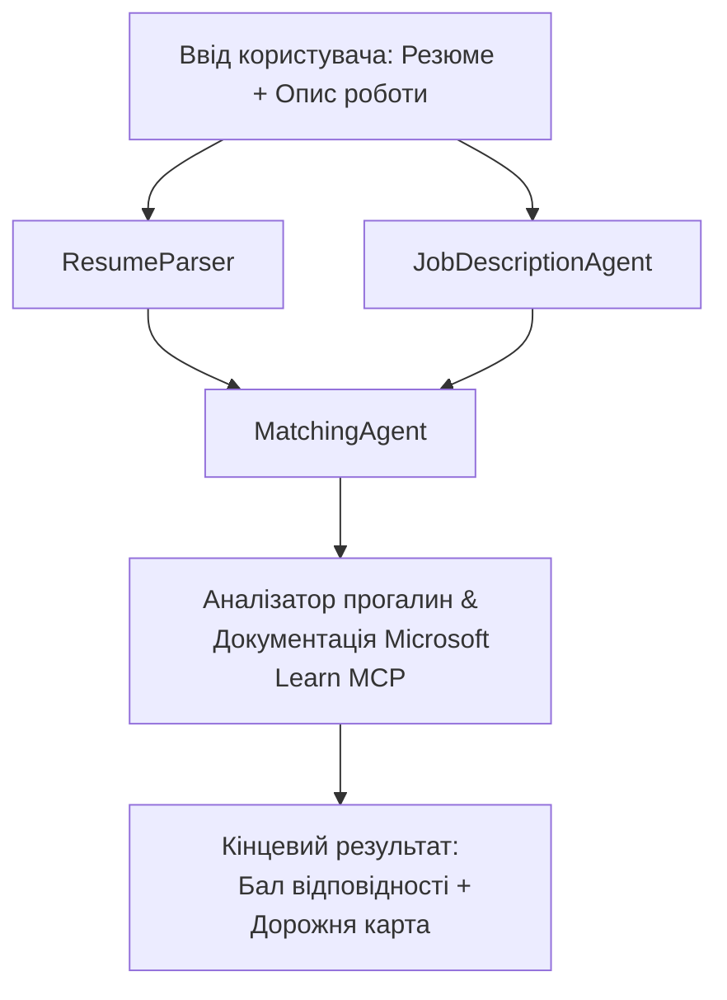

# PersonalCareerCopilot - Оцінювач відповідності резюме вакансії

Багатоагентний робочий процес, який оцінює наскільки резюме відповідає опису вакансії, а потім генерує персоналізовану навчальну дорожню карту для усунення прогалин.

---

## Агенти

| Агент | Роль | Інструменти |
|-------|------|-------------|
| **ResumeParser** | Витягує структуровані навички, досвід, сертифікати з тексту резюме | - |
| **JobDescriptionAgent** | Витягує потрібні/пріоритетні навички, досвід, сертифікати з JD | - |
| **MatchingAgent** | Порівнює профіль із вимогами → оцінка відповідності (0-100) + співпадаючі/відсутні навички | - |
| **GapAnalyzer** | Будує персоналізовану навчальну дорожню карту з ресурсів Microsoft Learn | `search_microsoft_learn_for_plan` (MCP) |

## Робочий процес


---

## Швидкий старт

### 1. Налаштуйте середовище

```powershell
cd workshop\lab02-multi-agent\PersonalCareerCopilot
python -m venv .venv
.\.venv\Scripts\Activate.ps1          # Windows PowerShell
# source .venv/bin/activate            # macOS / Linux
pip install -r requirements.txt
```

### 2. Налаштуйте облікові дані

Скопіюйте приклад файлу env і заповніть деталями вашого проекту Foundry:

```powershell
cp .env.example .env
```

Відредагуйте `.env`:

```env
PROJECT_ENDPOINT=https://<your-account>.services.ai.azure.com/api/projects/<your-project>
MODEL_DEPLOYMENT_NAME=gpt-4.1-mini
```

| Значення | Де знайти |
|----------|------------|
| `PROJECT_ENDPOINT` | Бічна панель Microsoft Foundry у VS Code → правий клік на вашому проекті → **Copy Project Endpoint** |
| `MODEL_DEPLOYMENT_NAME` | Бічна панель Foundry → розгорніть проект → **Models + endpoints** → ім'я розгортання |

### 3. Запустіть локально

```powershell
python -m debugpy --listen 127.0.0.1:5679 -m agentdev run main.py --verbose --port 8088
```

Або використайте завдання VS Code: `Ctrl+Shift+P` → **Tasks: Run Task** → **Run Lab02 HTTP Server**.

### 4. Тестуйте з Agent Inspector

Відкрийте Agent Inspector: `Ctrl+Shift+P` → **Foundry Toolkit: Open Agent Inspector**.

Вставте цей тестовий запит:

```
Resume:
Jane Doe
Senior Software Engineer with 5 years of experience in Python, Django, and AWS.
Built microservices handling 10K+ requests/second. Led a team of 4 developers.
Certifications: AWS Solutions Architect Associate.
Education: B.S. Computer Science, State University.

Job Description:
Senior Cloud Engineer at Contoso Ltd.
Required: Python, Azure, Kubernetes, Terraform, CI/CD pipelines.
Preferred: Go, monitoring (Prometheus/Grafana), cost optimization.
Experience: 5+ years in cloud infrastructure.
Certifications: Azure Solutions Architect Expert preferred.
```

**Очікувано:** Оцінка відповідності (0-100), співпадаючі/відсутні навички, та персоналізована навчальна дорожня карта з URL Microsoft Learn.

### 5. Розгорніть у Foundry

`Ctrl+Shift+P` → **Microsoft Foundry: Deploy Hosted Agent** → виберіть ваш проект → підтвердіть.

---

## Структура проекту

```
PersonalCareerCopilot/
├── .env.example        ← Template for environment variables
├── .env                ← Your credentials (git-ignored)
├── agent.yaml          ← Hosted agent definition (name, resources, env vars)
├── Dockerfile          ← Container image for Foundry deployment
├── main.py             ← 4-agent workflow (instructions, MCP tool, WorkflowBuilder)
└── requirements.txt    ← Python dependencies
```

## Основні файли

### `agent.yaml`

Визначає хостингового агента для Foundry Agent Service:
- `kind: hosted` - запускається як керований контейнер
- `protocols: [responses v1]` - відкриває HTTP endpoint `/responses`
- `environment_variables` - `PROJECT_ENDPOINT` і `MODEL_DEPLOYMENT_NAME` впроваджуються під час розгортання

### `main.py`

Містить:
- **Інструкції для агента** - чотири константи `*_INSTRUCTIONS`, по одній на агента
- **Інструмент MCP** - `search_microsoft_learn_for_plan()` викликає `https://learn.microsoft.com/api/mcp` через Streamable HTTP
- **Створення агента** - `create_agents()` як контекстний менеджер із `AzureAIAgentClient.as_agent()`
- **Граф робочого процесу** - `create_workflow()` використовує `WorkflowBuilder` для зв’язування агентів за схемами fan-out/fan-in/послідовності
- **Запуск сервера** - `from_agent_framework(agent).run_async()` на порті 8088

### `requirements.txt`

| Пакет | Версія | Призначення |
|-------|--------|-------------|
| `agent-framework-azure-ai` | `1.0.0rc3` | Інтеграція Azure AI для Microsoft Agent Framework |
| `agent-framework-core` | `1.0.0rc3` | Ядро runtime (включає WorkflowBuilder) |
| `azure-ai-agentserver-agentframework` | `1.0.0b16` | Runtime хостингового агента |
| `azure-ai-agentserver-core` | `1.0.0b16` | Основні абстракції агента сервера |
| `debugpy` | остання | Налагодження Python (F5 у VS Code) |
| `agent-dev-cli` | `--pre` | Локальний CLI для розробки + бекенд Agent Inspector |

---

## Усунення несправностей

| Проблема | Вирішення |
|----------|-----------|
| `RuntimeError: Missing required environment variable(s)` | Створіть `.env` з `PROJECT_ENDPOINT` і `MODEL_DEPLOYMENT_NAME` |
| `ModuleNotFoundError: No module named 'agent_framework'` | Активуйте віртуальне оточення та виконайте `pip install -r requirements.txt` |
| Вихідні дані не містять URL Microsoft Learn | Перевірте підключення до інтернету до `https://learn.microsoft.com/api/mcp` |
| Лише 1 картка прогалин (обрізана) | Перевірте, що `GAP_ANALYZER_INSTRUCTIONS` містить блок `CRITICAL:` |
| Порт 8088 зайнятий | Зупиніть інші сервіси: `netstat -ano \| findstr :8088` |

Для детального усунення несправностей див. [Module 8 - Troubleshooting](../docs/08-troubleshooting.md).

---

**Повний посібник:** [Lab 02 Docs](../docs/README.md) · **Назад:** [Lab 02 README](../README.md) · [Головна сторінка воркшопу](../../../README.md)

---

<!-- CO-OP TRANSLATOR DISCLAIMER START -->
**Відмова від відповідальності**:  
Цей документ був перекладений за допомогою сервісу автоматичного перекладу [Co-op Translator](https://github.com/Azure/co-op-translator). Хоча ми прагнемо до точності, будь ласка, майте на увазі, що автоматичні переклади можуть містити помилки або неточності. Оригінальний документ рідною мовою слід вважати офіційним джерелом. Для критично важливої інформації рекомендується звертатися до професійного людського перекладу. Ми не несемо відповідальність за будь-які непорозуміння чи неправильні тлумачення, які можуть виникнути внаслідок використання цього перекладу.
<!-- CO-OP TRANSLATOR DISCLAIMER END -->