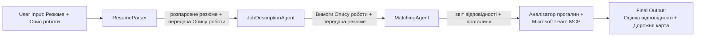

# PersonalCareerCopilot - Оцінювач відповідності резюме вакансії

Багатоагентський додаток, орієнтований на робочий процес, який оцінює, наскільки резюме відповідає опису роботи, а потім створює персоналізований план навчання для подолання прогалин.

---

## Агенти

| Агент | Роль | Інструменти |
|-------|------|-------|
| **ResumeParser** | Витягує структуровані навички, досвід, сертифікати з тексту резюме | - |
| **JobDescriptionAgent** | Витягує необхідні/бажані навички, досвід, сертифікати з опису вакансії | - |
| **MatchingAgent** | Порівнює профіль з вимогами → оцінка відповідності (0-100) + співпадаючі/відсутні навички | - |
| **GapAnalyzer** | Створює персоналізований план навчання з ресурсів Microsoft Learn | `search_microsoft_learn_for_plan` (MCP) |

## Робочий процес


```mermaid
flowchart LR
    UserInput["User Input: Резюме + Опис роботи"] --> ResumeParser
    ResumeParser -- "розпарсене резюме + передача Опису роботи" --> JobDescriptionAgent
    JobDescriptionAgent -- "Вимоги Опису роботи + передача резюме" --> MatchingAgent
    MatchingAgent -- "звіт відповідності + прогалини" --> GapAnalyzerMCP["Аналізатор прогалин +\nMicrosoft Learn MCP"]
    GapAnalyzerMCP --> FinalOutput["Final Output:\nОцінка відповідності + Дорожня карта"]
```

---

## Швидкий старт

### 1. Налаштування середовища

Ця папка — довідкова реалізація каркасу лабораторної роботи 02, заснованої на робочому процесі. Файл `main.py` використовує існуючі блоки запитів разом із `WorkflowBuilder` для зв’язування чотирьох агентів.

```powershell
cd workshop\lab02-multi-agent\PersonalCareerCopilot
python -m venv .venv
.\.venv\Scripts\Activate.ps1          # Windows PowerShell
# source .venv/bin/activate            # macOS / Linux
pip install -r requirements.txt
```

### 2. Конфігурація облікових даних

Створіть файл `.env` у цій папці:

```powershell
copy .env .env.bak 2>$null; echo $null > .env
```

Відредагуйте `.env`:

```env
FOUNDRY_PROJECT_ENDPOINT=https://<your-account>.services.ai.azure.com/api/projects/<your-project>
AZURE_AI_MODEL_DEPLOYMENT_NAME=gpt-4.1-mini
```

| Значення | Де знайти |
|-------|------------------|
| `FOUNDRY_PROJECT_ENDPOINT` | Бічна панель Foundry Toolkit → клацніть правою кнопкою на вашому проєкті → **Copy Project Endpoint** |
| `AZURE_AI_MODEL_DEPLOYMENT_NAME` | Бічна панель Foundry → розгорніть проєкт → **Models + endpoints** → ім’я розгортання |

### 3. Запуск локально

```powershell
python -m debugpy --listen 127.0.0.1:5679 main.py --port 8088
```

Або використовуйте задачу VS Code: `Ctrl+Shift+P` → **Tasks: Run Task** → **Run Agent HTTP Server**.

Для відлагодження F5 — використовуйте **Debug Local Agent HTTP Server**.

### 4. Тестування з Agent Inspector

Відкрийте Agent Inspector: `Ctrl+Shift+P` → **Foundry Toolkit: Open Agent Inspector**.

Вставте цей тестовий запит:

```
Resume:
Jane Doe
Senior Software Engineer with 5 years of experience in Python, Django, and AWS.
Built microservices handling 10K+ requests/second. Led a team of 4 developers.
Certifications: AWS Solutions Architect Associate.
Education: B.S. Computer Science, State University.

Job Description:
Senior Cloud Engineer at Contoso Ltd.
Required: Python, Azure, Kubernetes, Terraform, CI/CD pipelines.
Preferred: Go, monitoring (Prometheus/Grafana), cost optimization.
Experience: 5+ years in cloud infrastructure.
Certifications: Azure Solutions Architect Expert preferred.
```

**Очікувано:** Оцінка відповідності (0-100), співпадаючі/відсутні навички та персоналізований план навчання з URL-адресами Microsoft Learn.

### 5. Розгортання у Foundry

`Ctrl+Shift+P` → **Foundry Toolkit: Deploy Hosted Agent** → виберіть ваш проєкт → підтвердіть.

---

## Структура проєкту

```
PersonalCareerCopilot/
├── .env                ← Your credentials (git-ignored)
├── agent.yaml          ← Hosted agent definition (name, resources, env vars)
├── Dockerfile          ← Container image for Foundry deployment
├── main.py             ← 4-agent workflow (instructions, MCP tool, WorkflowBuilder)
└── requirements.txt    ← Python dependencies
```

## Ключові файли

### `agent.yaml`

Визначає розміщеного агента для Foundry Agent Service:
- `kind: hosted` - запускається як керований контейнер
- `protocols` - протокол `responses` з `version: 1.0.0`, відкриває HTTP кінцеву точку `/responses`
- `environment_variables` - тут оголошено `AZURE_AI_MODEL_DEPLOYMENT_NAME`; `FOUNDRY_PROJECT_ENDPOINT` автоматично додається під час розгортання

### `main.py`

Містить:
- **Інструкції агентам** - чотири константи `*_INSTRUCTIONS`, по одній на кожного агента
- **Інструмент MCP** - `search_microsoft_learn_for_plan()` виконує виклик `https://learn.microsoft.com/api/mcp` через Streamable HTTP
- **Створення агентів** - чотири екземпляри `Agent()` + `AgentExecutor()`, що спільно використовують `FoundryChatClient`
- **Граф робочого процесу** - `WorkflowBuilder` зв’язує агентів послідовною конвеєрною схемою: ResumeParser → JD Agent → MatchingAgent → GapAnalyzer
- **Запуск сервера** - `ResponsesHostServer` працює на порті 8088

### `requirements.txt`

| Пакет | Призначення |
|---------|----------|
| `agent-framework-foundry` | Основне середовище виконання: `Agent`, `AgentExecutor`, `WorkflowBuilder`, `@tool`, `FoundryChatClient` |
| `agent-framework-foundry-hosting` | `ResponsesHostServer` + інтеграція розміщення у Foundry |
| `mcp<2,>=1.24.0` | MCP клієнт для GapAnalyzer (`streamable_http_client`) |
| `debugpy` | Відлагодження Python (F5 у VS Code) |

---

## Усунення несправностей

| Проблема | Вирішення |
|-------|-----|
| `KeyError: 'FOUNDRY_PROJECT_ENDPOINT'` або `KeyError: 'AZURE_AI_MODEL_DEPLOYMENT_NAME'` | Створіть файл `.env` з обома змінними `FOUNDRY_PROJECT_ENDPOINT` і `AZURE_AI_MODEL_DEPLOYMENT_NAME` |
| `ModuleNotFoundError: No module named 'agent_framework'` | Активуйте віртуальне середовище та виконайте `pip install -r requirements.txt` |
| У результаті відсутні URL Microsoft Learn | Перевірте підключення до інтернету для `https://learn.microsoft.com/api/mcp` |
| Тільки 1 картка з прогалиною (обрізана) | Переконайтеся, що `GAP_ANALYZER_INSTRUCTIONS` включає блок `CRITICAL:` |
| Порт 8088 зайнятий | Зупиніть інші сервери: `netstat -ano \| findstr :8088` |

Для детального усунення несправностей див. [Module 8 - Troubleshooting](../docs/08-troubleshooting.md).

---

**Повний посібник:** [Lab 02 Docs](../docs/README.md) · **Назад до:** [Lab 02 README](../README.md) · [Головна сторінка воркшопу](../../../README.md)

---

<!-- CO-OP TRANSLATOR DISCLAIMER START -->
**Відмова від відповідальності**:
Цей документ було перекладено за допомогою сервісу штучного інтелекту для перекладу [Co-op Translator](https://github.com/Azure/co-op-translator). Хоча ми прагнемо до точності, будь ласка, майте на увазі, що автоматичні переклади можуть містити помилки або неточності. Оригінальний документ рідною мовою слід вважати авторитетним джерелом. Для критично важливої інформації рекомендується професійний людський переклад. Ми не несемо відповідальності за будь-які непорозуміння або неправильні тлумачення, що виникли внаслідок використання цього перекладу.
<!-- CO-OP TRANSLATOR DISCLAIMER END -->