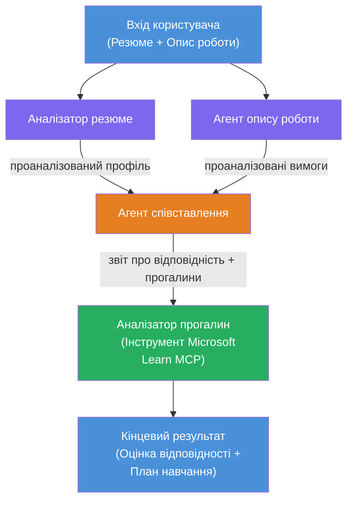

# Лабораторна робота 02 - Багатоагентний робочий процес: Резюме → Оцінка відповідності вакансії

---

## Що ви створите

**Оцінювач відповідності резюме вакансії** — багатоагентний робочий процес, у якому чотири спеціалізовані агенти співпрацюють, щоб оцінити, наскільки добре резюме кандидата відповідає опису вакансії, а потім формують персоналізовану дорожню карту навчання для усунення прогалин.

### Агенти

| Агент | Роль |
|-------|------|
| **Парсер резюме** | Витягує структуровані навички, досвід, сертифікати з тексту резюме |
| **Агент опису вакансії** | Витягує необхідні/переважні навички, досвід, сертифікати з опису вакансії |
| **Агент відповідності** | Порівнює профіль vs вимоги → оцінка відповідності (0-100) + співпадаючі/відсутні навички |
| **Аналізатор прогалин** | Створює персоналізовану дорожню карту навчання з ресурсами, термінами та швидкими проєктами |

### Демонстраційний потік

Завантажте **резюме + опис вакансії** → отримайте **оцінку відповідності + відсутні навички** → отримайте **персоналізовану дорожню карту навчання**.

### Архітектура робочого процесу

> Фіолетовий = паралельні агенти | Помаранчевий = точка агрегації | Зелений = фінальний агент із інструментами. Дивіться [Модуль 1 - Розуміння архітектури](docs/01-understand-multi-agent.md) та [Модуль 4 - Патерни оркестрації](docs/04-orchestration-patterns.md) для детальних діаграм та потоку даних.

### Теми, які розглядаються

- Створення багатоагентного робочого процесу за допомогою **WorkflowBuilder**
- Визначення ролей агентів та потоку оркестрації (паралельний + послідовний)
- Патерни комунікації між агентами
- Локальне тестування з Agent Inspector
- Розгортання багатоагентних робочих процесів у Foundry Agent Service

---

## Вимоги

Спочатку виконайте Лабораторну роботу 01:

- [Лабораторна робота 01 - Один агент](../lab01-single-agent/README.md)

---

## Початок роботи

Повні інструкції з налаштування, огляд коду та команди для тестування дивіться у:

- [Документація Лабораторної роботи 2 - Вимоги](docs/00-prerequisites.md)
- [Документація Лабораторної роботи 2 - Повний навчальний шлях](docs/README.md)
- [Посібник із запуску PersonalCareerCopilot](PersonalCareerCopilot/README.md)

## Патерни оркестрації (агентні альтернативи)

Лабораторна робота 2 включає типовий потік **паралельний → агрегатор → планувальник**, а також у документації описані альтернативні патерни для демонстрації більш сильної агентної поведінки:

- **Розподіл і збір із зваженим консенсусом**
- **Перегляд/критичний прохід перед фінальною дорожньою картою**
- **Умовний маршрутизатор** (вибір шляху залежно від оцінки відповідності та відсутніх навичок)

Дивіться [docs/04-orchestration-patterns.md](docs/04-orchestration-patterns.md).

---

**Попередня:** [Лабораторна робота 01 - Один агент](../lab01-single-agent/README.md) · **Назад до:** [Головна сторінка воркшопу](../../README.md)

---

<!-- CO-OP TRANSLATOR DISCLAIMER START -->
**Застереження**:
Цей документ було перекладено за допомогою сервісу штучного інтелекту [Co-op Translator](https://github.com/Azure/co-op-translator). Хоча ми прагнемо до точності, будь ласка, майте на увазі, що автоматичні переклади можуть містити помилки або неточності. Оригінальний документ рідною мовою слід вважати авторитетним джерелом. Для критично важливої інформації рекомендується звертатися до професійного людського перекладу. Ми не несемо відповідальності за будь-які непорозуміння або неправильні тлумачення, що виникли внаслідок використання цього перекладу.
<!-- CO-OP TRANSLATOR DISCLAIMER END -->