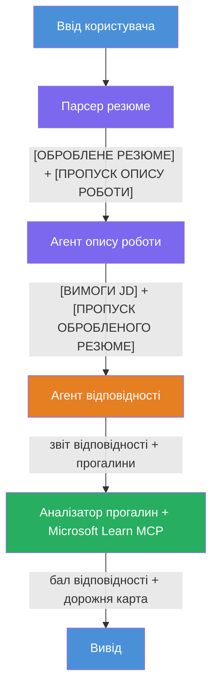

# Лабораторна робота 02 - Багатозадачний робочий процес: Оцінювач відповідності резюме до роботи

## Огляд

У цій практичній лабораторній роботі ви створите **багатозадачний додаток із пріоритетом робочого процесу**, використовуючи Foundry Toolkit у VS Code, і розгорнете його у Microsoft Foundry Agent Service.

**Що ви створите:** Оцінювач відповідності резюме до роботи, який аналізує резюме та опис вакансії, оцінює співпадіння та формує персоналізовану дорожню карту навчання за допомогою ресурсів Microsoft Learn.

---

## Архітектура

```mermaid
flowchart TD
    A["Ввід користувача"] --> B["Парсер резюме"]
    B -->|"[ОБРОБЛЕНЕ РЕЗЮМЕ] + [ПРОПУСК ОПИСУ РОБОТИ]"| C["Агент опису роботи"]
    C -->|"[ВИМОГИ JD] + [ПРОПУСК ОБРОБЛЕНОГО РЕЗЮМЕ]"| D["Агент відповідності"]
    D -->|звіт відповідності + прогалини| E["Аналізатор прогалин + Microsoft Learn MCP"]
    E -->|бал відповідності + дорожня карта| F["Вивід"]

    style A fill:#4A90D9,color:#fff
    style B fill:#7B68EE,color:#fff
    style C fill:#7B68EE,color:#fff
    style D fill:#E67E22,color:#fff
    style E fill:#27AE60,color:#fff
    style F fill:#4A90D9,color:#fff
```

**Як це працює:**
1. Користувач вставляє резюме та опис вакансії.
2. **ResumeParser** аналізує резюме і копіює опис вакансії дослівно у розділ `[JOB DESCRIPTION PASS-THROUGH]`.
3. **JD Agent** витягує структуровані вимоги з цього розділу, а потім передає `[PARSED RESUME]` далі як `[PARSED RESUME PASS-THROUGH]`.
4. **MatchingAgent** порівнює `[PARSED RESUME PASS-THROUGH]` та `[JD REQUIREMENTS]` і генерує оцінку відповідності.
5. **GapAnalyzer** перетворює виявлені прогалини у практичну дорогу карту та отримує реальні посилання Microsoft Learn через MCP.

---

## Вимоги

Спочатку виконайте Лабораторну роботу 01:

- [Лабораторна робота 01 - Один агент](../lab01-single-agent/README.md)

---

## Частина 1: Читайте модулі по черзі

Повний навчальний шлях дивіться у:

- [Документація Лабораторної 2 - Вимоги](docs/00-prerequisites.md)
- [Документація Лабораторної 2 - Повний навчальний шлях](docs/README.md)
- [Посібник з запуску PersonalCareerCopilot](PersonalCareerCopilot/README.md)

---

## Частина 2: Створіть і протестуйте робочий процес

1. Використайте майстер Foundry Toolkit для створення проекту на основі робочого процесу.
2. Скопіюйте блоки підказок і граф робочого процесу з `PersonalCareerCopilot/main.py` у вашу робочу директорію.
3. Запустіть локально через Agent Inspector та перевірте роботу всіх чотирьох агентів і інструмент MCP.
4. Розгорніть хостингового агента у Foundry, коли локальне тестування успішне.

---

## Патерни оркестрації

Лабораторна робота 02 містить типовий потік **fan-out → fan-in → послідовний**, а документація також описує альтернативні патерни оркестрації для експериментів.

- **Fan-out/Fan-in з зваженим консенсусом**
- **Перевірка/критика перед формуванням фінальної дорожньої карти**
- **Умовний маршрутизатор** на основі оцінки відповідності та відсутніх навичок

Дивіться [docs/04-orchestration-patterns.md](docs/04-orchestration-patterns.md).

---

**Попередня:** [Лабораторна робота 01 - Один агент](../lab01-single-agent/README.md) · **Назад до:** [Головна сторінка семінару](../../README.md)

---

<!-- CO-OP TRANSLATOR DISCLAIMER START -->
**Відмова від відповідальності**:
Цей документ було перекладено за допомогою сервісу штучного інтелекту для перекладу [Co-op Translator](https://github.com/Azure/co-op-translator). Хоча ми прагнемо до точності, будь ласка, майте на увазі, що автоматичні переклади можуть містити помилки або неточності. Оригінальний документ рідною мовою слід вважати авторитетним джерелом. Для критично важливої інформації рекомендується професійний людський переклад. Ми не несемо відповідальності за будь-які непорозуміння або неправильні тлумачення, що виникли внаслідок використання цього перекладу.
<!-- CO-OP TRANSLATOR DISCLAIMER END -->