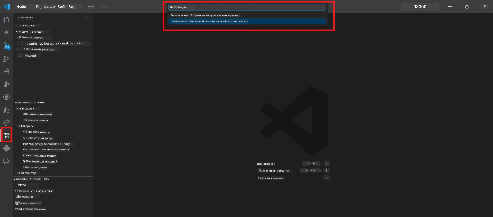

# Модуль 0 - Попередні умови

Перед початком Лабораторної роботи 02 переконайтеся, що ви виконали наступне. Ця лабораторна робота базується безпосередньо на Лабораторній роботі 01 - не пропускайте її.

---

## 1. Завершіть Лабораторну роботу 01

Лабораторна робота 02 передбачає, що ви вже:

- [x] Завершили всі 8 модулів [Лабораторної роботи 01 - Одиночний агент](../../lab01-single-agent/README.md)
- [x] Успішно розгорнули одиночного агента на Foundry Agent Service
- [x] Переконалися, що агент працює як у локальному Agent Inspector, так і у Foundry Playground

Якщо ви не завершили Лабораторну роботу 01, поверніться назад і завершіть її зараз: [Документи Лабораторної роботи 01](../../lab01-single-agent/docs/00-prerequisites.md)

---

## 2. Перевірте існуюче налаштування

Усі інструменти з Лабораторної роботи 01 повинні бути все ще встановлені та працювати. Виконайте ці швидкі перевірки:

### 2.1 Azure CLI

```powershell
az account show --query "{name:name, id:id}" --output table
```

Очікується: Показує назву вашої підписки та її ID. Якщо це не вдається, виконайте [`az login`](https://learn.microsoft.com/cli/azure/authenticate-azure-cli-interactively).

### 2.2 Розширення VS Code

1. Натисніть `Ctrl+Shift+P` → введіть **"Microsoft Foundry"** → переконайтеся, що ви бачите команди (наприклад, `Microsoft Foundry: Create a New Hosted Agent`).
2. Натисніть `Ctrl+Shift+P` → введіть **"Foundry Toolkit"** → переконайтеся, що ви бачите команди (наприклад, `Foundry Toolkit: Open Agent Inspector`).

### 2.3 Проєкт та модель Foundry

1. Натисніть на іконку **Microsoft Foundry** у панелі активності VS Code.
2. Переконайтеся, що ваш проєкт відображається у списку (наприклад, `workshop-agents`).
3. Розгорніть проєкт → перевірте, чи є розгорнута модель (наприклад, `gpt-4.1-mini`) зі статусом **Succeeded**.

> **Якщо термін дії розгортання моделі минув:** Деякі розгортання безкоштовного рівня автоматично припиняються. Розгорніть її повторно з [Каталогу моделей](https://learn.microsoft.com/azure/foundry/foundry-models/concepts/models-sold-directly-by-azure) (`Ctrl+Shift+P` → **Microsoft Foundry: Open Model Catalog**).



### 2.4 Ролі RBAC

Переконайтеся, що у вас є роль **Azure AI User** у вашому проєкті Foundry:

1. [Портал Azure](https://portal.azure.com) → ресурс вашого **проєкту** Foundry → **Контроль доступу (IAM)** → вкладка **[Призначення ролей](https://learn.microsoft.com/azure/foundry/concepts/rbac-foundry)**.
2. Знайдіть ваше ім'я → переконайтеся, що в списку є **[Azure AI User](https://aka.ms/foundry-ext-project-role)**.

---

## 3. Розуміння концепцій мультиагентної роботи (нове для Лабораторної роботи 02)

Лабораторна робота 02 вводить концепції, які не були охоплені в Лабораторній роботі 01. Ознайомтеся з ними перед продовженням:

### 3.1 Що таке мультиагентний робочий процес?

Замість того, щоб один агент обробляв усе, **мультиагентний робочий процес** розподіляє роботу між кількома спеціалізованими агентами. Кожен агент має:

- Власні **інструкції** (системний запит)
- Власну **роль** (за що він відповідає)
- Опціональні **інструменти** (функції, які він може викликати)

Агенти спілкуються через **оргструктурований граф**, який визначає, як дані передаються між ними.

### 3.2 WorkflowBuilder

Клас [`WorkflowBuilder`](https://learn.microsoft.com/agent-framework/workflows/agents-in-workflows) з `agent_framework` — це SDK-компонент, який зв’язує агентів разом:

```python
from agent_framework import WorkflowBuilder

workflow = (
    WorkflowBuilder(
        name="MyWorkflow",
        start_executor=agent_a,
        output_executors=[agent_d],
    )
    .add_edge(agent_a, agent_b)
    .add_edge(agent_a, agent_c)
    .add_edge(agent_b, agent_d)
    .add_edge(agent_c, agent_d)
    .build()
)
```

- **`start_executor`** - Перший агент, що отримує введення користувача
- **`output_executors`** - Агенти, чиї вихідні дані стають фінальною відповіддю
- **`add_edge(source, target)`** - Визначає, що `target` отримує вихідні дані від `source`

### 3.3 Інструменти MCP (Model Context Protocol)

Лабораторна робота 02 використовує **інструмент MCP**, який викликає Microsoft Learn API для отримання навчальних ресурсів. [MCP (Model Context Protocol)](https://modelcontextprotocol.io/introduction) — це стандартизований протокол для підключення моделей ШІ до зовнішніх джерел даних і інструментів.

| Термін | Визначення |
|--------|------------|
| **Сервер MCP** | Сервіс, який надає інструменти/ресурси через [протокол MCP](https://learn.microsoft.com/azure/foundry/agents/how-to/tools/model-context-protocol) |
| **Клієнт MCP** | Ваш код агента, який підключається до MCP-сервера та викликає його інструменти |
| **[Streamable HTTP](https://learn.microsoft.com/agent-framework/agents/tools/hosted-mcp-tools)** | Метод транспорту, що використовується для зв’язку з MCP-сервером |

### 3.4 Чим Лабораторна робота 02 відрізняється від Лабораторної роботи 01

| Аспект | Лабораторна робота 01 (Одиночний агент) | Лабораторна робота 02 (Мультиагентна) |
|--------|---------------------------------------|------------------------------------|
| Агенти | 1 | 4 (спеціалізовані ролі) |
| Оркестрація | Відсутня | WorkflowBuilder (паралельна + послідовна) |
| Інструменти | Опціональна функція `@tool` | Інструмент MCP (зовнішній виклик API) |
| Складність | Простий запит → відповідь | Резюме + JD → оцінка відповідності → дорожня карта |
| Потік контексту | Прямий | Передача від агента до агента |

---

## 4. Структура репозиторію для Лабораторної роботи 02

Переконайтеся, що ви знаєте, де знаходяться файли Лабораторної роботи 02:

```
workshop/
└── lab02-multi-agent/
    ├── README.md                       ← Lab overview
    ├── docs/                           ← You are here
    │   ├── README.md                   ← Learning path index
    │   ├── 00-prerequisites.md         ← This file
    │   ├── 01-understand-multi-agent.md
    │   ├── ...
    │   └── 08-troubleshooting.md
    └── PersonalCareerCopilot/          ← The agent project
        ├── agent.yaml                  ← Agent definition
        ├── main.py                     ← 4-agent workflow code
        ├── Dockerfile                  ← Container configuration
        └── requirements.txt            ← Python dependencies
```

---

### Контрольний пункт

- [ ] Лабораторна робота 01 повністю завершена (всі 8 модулів, агент розгорнутий та перевірений)
- [ ] `az account show` показує вашу підписку
- [ ] Розширення Microsoft Foundry та Foundry Toolkit встановлені та працюють
- [ ] У проєкті Foundry розгорнута модель (наприклад, `gpt-4.1-mini`)
- [ ] У вас є роль **Azure AI User** у проєкті
- [ ] Ви прочитали розділ про концепції мультиагентної роботи вище і розумієте WorkflowBuilder, MCP та оркестрацію агентів

---

**Далі:** [01 - Розуміння мультиагентної архітектури →](01-understand-multi-agent.md)

---

<!-- CO-OP TRANSLATOR DISCLAIMER START -->
**Відмова від відповідальності**:
Цей документ було перекладено за допомогою сервісу автоматичного перекладу [Co-op Translator](https://github.com/Azure/co-op-translator). Хоча ми прагнемо до точності, просимо враховувати, що автоматичні переклади можуть містити помилки або неточності. Оригінальний документ його рідною мовою слід вважати авторитетним джерелом. Для важливої інформації рекомендується звертатися до професійного людського перекладу. Ми не несемо відповідальності за будь-які непорозуміння або неправильні тлумачення, що виникли внаслідок використання цього перекладу.
<!-- CO-OP TRANSLATOR DISCLAIMER END -->