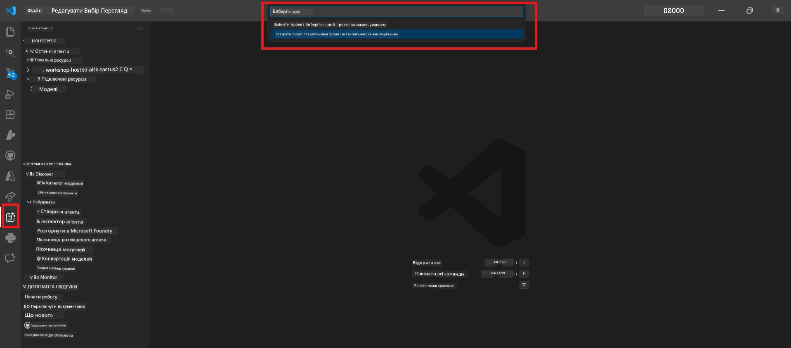

# Модуль 0 - Вступ

⏱️ ~10 хв

> [!WARNING]
> **Перегляд та Обмеження:** [Hosted Agents](https://learn.microsoft.com/azure/foundry/agents/concepts/hosted-agents) наразі перебувають у **публічному перегляді** - не рекомендуються для робочих навантажень у виробничому середовищі. Деякі функції, показані в цьому воркшопі, можуть змінитися у міру наближення сервісу до GA.

## Що ви створите

У цій лабораторній роботі ви розширите навички одного агента з Лабораторної роботи 01, щоб побудувати **багатоагентський робочий процес** - Оцінювач відповідності резюме до вакансії.

Ви вставляєте **резюме** та **опис вакансії**. Чотири спеціалізовані агенти послідовно обробляють введені дані, а потім повертають:
- Оцінку відповідності (0–100 з розбиттям за балами)
- Список відсутніх навичок та сертифікацій
- Персоналізовану дорожню карту навчання з реальними посиланнями Microsoft Learn для кожного пропуску

**Робочий процес використовує:**
- **Microsoft Agent Framework** - `WorkflowBuilder` для послідовної оркестрації конвеєра
- **Foundry Toolkit для VS Code** - каркас, локальне тестування, розгортання
- **Штучний інтелект** (наприклад, `gpt-4.1-mini`) - використовується усіма чотирма агентами
- **Microsoft Learn MCP server** - надає реальні посилання на навчальні ресурси для кожного пропуску навички

---

## Оберіть свій шлях

> ⚠️ **Продовжуйте тим самим шляхом, який ви використовували в Лаб 01.**

<details open>
<summary><strong>🅰️ Шлях A - хмарний Azure (потрібна підписка Azure)</strong></summary>

| | Деталі |
|---|---|
| **Для кого?** | Ви завершили Лаб 01, використовуючи підписку Azure |
| **Модель** | Azure OpenAI через Foundry (наприклад, `gpt-4.1-mini`) |
| **Покриті модулі** | Всі модулі (00–09) |
| **Розгорнення у хмарі?** | ✅ Так - повне розгортання від початку до кінця |

</details>

<details open>
<summary><strong>🅱️ Шлях B - Foundry Local (підписка Azure не потрібна)</strong></summary>

| | Деталі |
|---|---|
| **Для кого?** | Ви завершили Лаб 01, використовуючи Foundry Local |
| **Модель** | Foundry Local (безкоштовна, працює на вашому комп’ютері) |
| **Покриті модулі** | Модулі 00–05 (пропустіть 06–07 - розгортання та перевірка хмари) |
| **Розгорнення у хмарі?** | ❌ Ні - лише локальне тестування через Agent Inspector |

</details>

---

## Перевірка Лаб 01

Лаб 02 будується безпосередньо на Лаб 01. Спочатку завершіть Лаб 01, перш ніж починати тут.

Ще не робили Лаб 01? Почніть тут: [Lab 01 - Introduction](../../lab01-single-agent/docs/00-prerequisites.md)

<details open>
<summary><strong>🅰️ Шлях A - хмара Azure</strong></summary>

```powershell
az account show --query "{name:name, id:id}" --output table
```

Якщо це не вдається, виконайте `az login`. Потім перевірте у VS Code:

1. `Ctrl+Shift+P` → введіть **Foundry Toolkit** → переконайтеся, що з’являються команди.
2. Натисніть піктограму **Foundry Toolkit** → ваш проект та розгорнута модель відображають статус **Succeeded**.



> **RBAC:** Ви призначили роль **Foundry User** в Лаб 01. Якщо потрібно переназначити, дивіться [Лаб 01, Модуль 1](../../lab01-single-agent/docs/01-setup.md#deploy-a-model--assign-rbac). Роль раніше називалася **Azure AI User** — з тими ж правами.

</details>

<details open>
<summary><strong>🅱️ Шлях B - Foundry Local</strong></summary>

```powershell
Invoke-WebRequest -Uri "http://localhost:5273/v1/health" -UseBasicParsing | Select-Object StatusCode
```

Очікувано: `StatusCode: 200`. Якщо ні, перезапустіть Foundry Local із сайдбару Foundry Toolkit.

> Вся інференція виконується на вашому комп’ютері. Єдиний вихідний виклик — інструмент MCP на `https://learn.microsoft.com/api/mcp`.

</details>

---

## Що нового в Лаб 02

| | Лаб 01 | Лаб 02 |
|--|--------|--------|
| Агенти | 1 | 4 (послідовно через WorkflowBuilder) |
| Шаблон каркаса | Базовий - Agent Framework | Робочі процеси - Agent Framework |
| Новий пакет | - | `mcp` |
| Оркестрація | Один агент для розмови | Послідовний конвеєр (WorkflowBuilder) |
| Новий інструмент | - | `search_microsoft_learn_for_plan` (MCP) |

---

**Далі:** [01 - Розуміння архітектури →](01-understand-multi-agent.md)

---

<!-- CO-OP TRANSLATOR DISCLAIMER START -->
**Відмова від відповідальності**:
Цей документ було перекладено за допомогою сервісу штучного інтелекту для перекладу [Co-op Translator](https://github.com/Azure/co-op-translator). Хоча ми прагнемо до точності, будь ласка, майте на увазі, що автоматичні переклади можуть містити помилки або неточності. Оригінальний документ рідною мовою слід вважати авторитетним джерелом. Для критично важливої інформації рекомендується професійний людський переклад. Ми не несемо відповідальності за будь-які непорозуміння або неправильні тлумачення, що виникли внаслідок використання цього перекладу.
<!-- CO-OP TRANSLATOR DISCLAIMER END -->