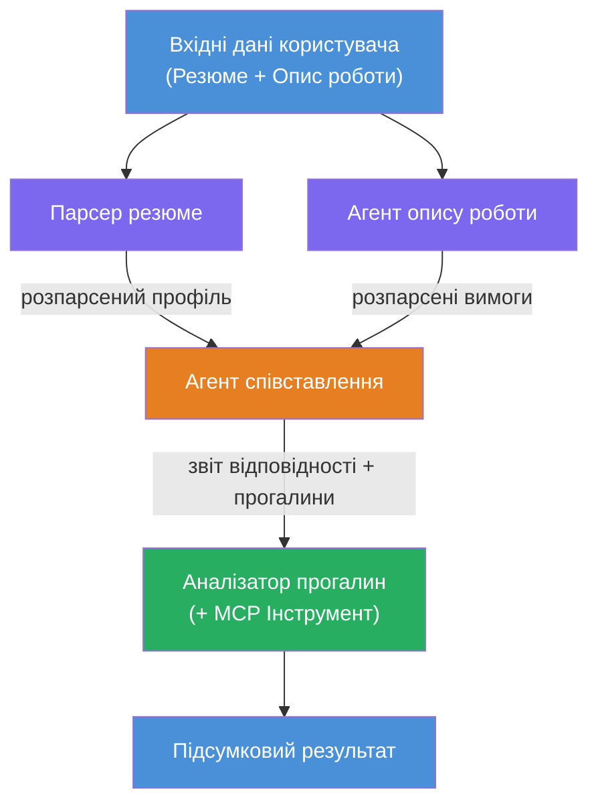
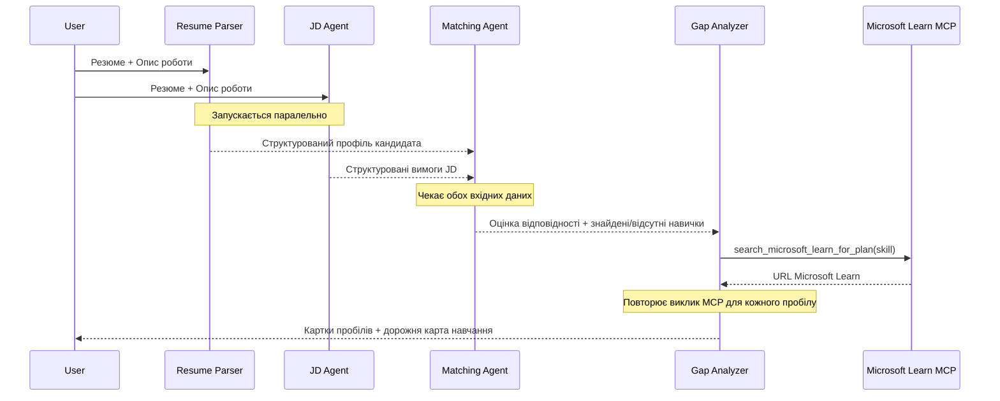
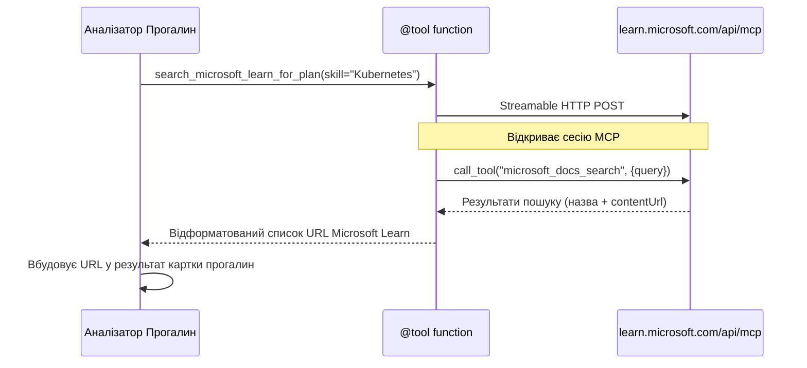

# Модуль 1 - Розуміння багатоярусної архітектури агентів

У цьому модулі ви вивчаєте архітектуру Оцінювача відгуків → Відповідність вакансії перед написанням будь-якого коду. Розуміння оркеструвальної схеми, ролей агентів і потоку даних є критичним для налагодження та розширення [багатоярусних робочих процесів агентів](https://learn.microsoft.com/azure/architecture/ai-ml/idea/multiple-agent-workflow-automation).

---

## Проблема, яку це вирішує

Підбір резюме до опису вакансії включає кілька різних навичок:

1. **Парсинг** - вилучення структурованих даних із неструктурованого тексту (резюме)
2. **Аналіз** - вилучення вимог з опису вакансії
3. **Порівняння** - оцінка відповідності між двома
4. **Планування** - створення навчальної дорожньої карти для усунення прогалин

Один агент, який виконує всі чотири завдання в одному запиті, часто виробляє:
- Неповне вилучення (він поспішно проходить парсинг, щоб отримати оцінку)
- Поверхневу оцінку (без доказової деталізації)
- Загальні дорожні карти (не адаптовані до конкретних прогалин)

Розділяючи на **чотири спеціалізовані агенти**, кожен зосереджується на своїй задачі з чіткими інструкціями, що забезпечує більш якісний результат на кожному етапі.

---

## Чотири агенти

Кожен агент є повноцінним агентом [Microsoft Foundry](https://learn.microsoft.com/azure/foundry/agents/concepts/hosted-agents), створеним через `AzureAIAgentClient.as_agent()`. Вони використовують однакове розгортання моделі, але мають різні інструкції та (за бажанням) різні інструменти.

| # | Назва агента        | Роль                            | Вхід                          | Вихід                                                           |
|---|---------------------|--------------------------------|-------------------------------|----------------------------------------------------------------|
| 1 | **ResumeParser**     | Вилучає структурований профіль із тексту резюме | Різаний текст резюме (від користувача) | Профіль кандидата, технічні навички, м'які навички, сертифікати, досвід у галузі, досягнення |
| 2 | **JobDescriptionAgent** | Вилучає структуровані вимоги з опису вакансії | Різаний текст опису вакансії (від користувача, передається через ResumeParser) | Огляд ролі, необхідні навички, бажані навички, досвід, сертифікати, освіта, обов'язки |
| 3 | **MatchingAgent**    | Обчислює оцінку відповідності на основі доказів | Виходи ResumeParser + JobDescriptionAgent | Оцінка відповідності (0-100 з розбивкою), співпадіння навичок, відсутні навички, прогалини |
| 4 | **GapAnalyzer**      | Створює персоналізовану навчальну дорожню карту | Вихід з MatchingAgent       | Картки прогалин (на кожну навичку), порядок навчання, строк, ресурси з Microsoft Learn |

---

## Оркеструвальна схема

Робочий процес використовує **паралельне розгалуження** з наступною **послідовною агрегацією**:


> **Легенда:** Фіолетовий = паралельні агенти, Помаранчевий = точка агрегації, Зелений = фінальний агент з інструментами

### Потік даних


1. **Користувач надсилає** повідомлення, що містить резюме та опис вакансії.
2. **ResumeParser** отримує повний вхід користувача і вилучає структурований профіль кандидата.
3. **JobDescriptionAgent** отримує дані користувача паралельно і вилучає структуровані вимоги.
4. **MatchingAgent** отримує вихідні дані **обох** ResumeParser і JobDescriptionAgent (фреймворк чекає завершення обох перед запуском MatchingAgent).
5. **GapAnalyzer** отримує вихід MatchingAgent і викликає **інструмент Microsoft Learn MCP** для отримання реальних навчальних ресурсів для кожної прогалини.
6. **Фінальний вихід** - відповідь GapAnalyzer, що містить оцінку відповідності, картки прогалин і повну навчальну дорожню карту.

### Чому важливо паралельне розгалуження

ResumeParser та JobDescriptionAgent працюють **паралельно**, оскільки жоден не залежить від іншого. Це:
- Зменшує загальну затримку (обидва працюють одночасно, а не послідовно)
- Це природний поділ (парсинг резюме і парсинг опису вакансії — незалежні завдання)
- Демонструє поширений патерн багатоярусних агентів: **розгалуження → агрегація → дія**

---

## WorkflowBuilder у коді

Ось як схема зверху відображається у викликах API [`WorkflowBuilder`](https://learn.microsoft.com/agent-framework/workflows/agents-in-workflows) у `main.py`:

```python
from agent_framework import WorkflowBuilder

workflow = (
    WorkflowBuilder(
        name="ResumeJobFitEvaluator",
        start_executor=resume_parser,       # Перший агент, який отримує введення користувача
        output_executors=[gap_analyzer],     # Останній агент, чиї результати повертаються
    )
    .add_edge(resume_parser, jd_agent)      # ResumeParser → JobDescriptionAgent
    .add_edge(resume_parser, matching_agent) # ResumeParser → MatchingAgent
    .add_edge(jd_agent, matching_agent)      # JobDescriptionAgent → MatchingAgent
    .add_edge(matching_agent, gap_analyzer)  # MatchingAgent → GapAnalyzer
    .build()
)
```

**Розуміння зв’язків:**

| Зв’язок                | Що означає                                 |
|------------------------|--------------------------------------------|
| `resume_parser → jd_agent` | Агент опису вакансії отримує вихід ResumeParser |
| `resume_parser → matching_agent` | MatchingAgent отримує вихід ResumeParser      |
| `jd_agent → matching_agent` | MatchingAgent також отримує вихід агента опису вакансії (чекає обох) |
| `matching_agent → gap_analyzer` | GapAnalyzer отримує вихід MatchingAgent           |

Оскільки `matching_agent` має **два вхідних посилання** (`resume_parser` і `jd_agent`), фреймворк автоматично чекає на виконання обох перед запуском MatchingAgent.

---

## Інструмент MCP

Агент GapAnalyzer має один інструмент: `search_microsoft_learn_for_plan`. Це **[інструмент MCP](https://learn.microsoft.com/agent-framework/agents/tools/hosted-mcp-tools)**, що викликає API Microsoft Learn для отримання курованих навчальних ресурсів.

### Як це працює

```python
@tool
async def search_microsoft_learn_for_plan(
    skill: str, role: str = "", max_results: int = 5
) -> str:
    """Search Microsoft Learn MCP and return curated official links."""
    # Підключається до https://learn.microsoft.com/api/mcp через Streamable HTTP
    # Виконує виклик інструменту 'microsoft_docs_search' на сервері MCP
    # Повертає відформатований список URL-адрес Microsoft Learn
```

### Потік виклику MCP


1. GapAnalyzer визначає, що потрібні навчальні ресурси для навички (наприклад, "Kubernetes")
2. Фреймворк викликає `search_microsoft_learn_for_plan(skill="Kubernetes")`
3. Функція відкриває [Streamable HTTP](https://learn.microsoft.com/agent-framework/agents/tools/hosted-mcp-tools) підключення до `https://learn.microsoft.com/api/mcp`
4. Викликає інструмент `microsoft_docs_search` на [MCP сервері](https://learn.microsoft.com/azure/foundry/agents/how-to/tools/model-context-protocol)
5. MCP сервер повертає результати пошуку (назва + URL)
6. Функція форматує результати і повертає їх у вигляді рядка
7. GapAnalyzer використовує повернені URL у результатах карток прогалин

### Очікувані журнали MCP

Коли інструмент виконується, ви побачите такі записі у журналі:

```
GET https://learn.microsoft.com/api/mcp → 405 (Method Not Allowed)
POST https://learn.microsoft.com/api/mcp → 200
DELETE https://learn.microsoft.com/api/mcp → 405 (Method Not Allowed)
```

**Це нормально.** MCP клієнт під час ініціалізації робить запити GET і DELETE — повернення 405 є очікуваною поведінкою. Фактичний виклик інструменту використовує POST і повертає 200. Варто турбуватися лише у випадку помилок POST.

---

## Патерн створення агента

Кожен агент створюється за допомогою **асинхронного контекстного менеджера [`AzureAIAgentClient.as_agent()`](https://learn.microsoft.com/python/api/overview/azure/ai-agents-readme)**. Це патерн Foundry SDK для створення агентів, які автоматично очищуються:

```python
async with (
    get_credential() as credential,
    AzureAIAgentClient(
        project_endpoint=PROJECT_ENDPOINT,
        model_deployment_name=MODEL_DEPLOYMENT_NAME,
        credential=credential,
    ).as_agent(
        name="ResumeParser",
        instructions=RESUME_PARSER_INSTRUCTIONS,
    ) as resume_parser,
    # ... повторюйте для кожного агента ...
):
    # Тут існують всі 4 агенти
    workflow = create_workflow(resume_parser, jd_agent, matching_agent, gap_analyzer)
```

**Ключові моменти:**
- Кожен агент отримує власний екземпляр `AzureAIAgentClient` (SDK вимагає, щоб ім’я агента було прив’язане до клієнта)
- Всі агенти використовують однакові `credential`, `PROJECT_ENDPOINT` та `MODEL_DEPLOYMENT_NAME`
- Блок `async with` гарантує очистку агентів при завершенні роботи сервера
- GapAnalyzer додатково отримує `tools=[search_microsoft_learn_for_plan]`

---

## Запуск сервера

Після створення агентів і побудови робочого процесу сервер запускається:

```python
from azure.ai.agentserver.agentframework import from_agent_framework

agent = create_workflow(resume_parser, jd_agent, matching_agent, gap_analyzer)
await from_agent_framework(agent).run_async()
```

`from_agent_framework()` обгортає робочий процес у HTTP сервер, що відкриває кінцеву точку `/responses` на порту 8088. Це той самий патерн, що і в Лабораторній роботі 01, але "агентом" тепер є увесь [граф робочого процесу](https://learn.microsoft.com/agent-framework/workflows/as-agents).

---

### Контрольний список

- [ ] Ви розумієте архітектуру з 4 агентів і роль кожного агента
- [ ] Ви можете простежити потік даних: Користувач → ResumeParser → (паралельно) Агент опису вакансії + MatchingAgent → GapAnalyzer → Вихід
- [ ] Ви розумієте, чому MatchingAgent чекає на ResumeParser та агента опису вакансії (два вхідних зв’язки)
- [ ] Ви розумієте інструмент MCP: що він робить, як викликається і що журнали GET 405 є нормальними
- [ ] Ви розумієте патерн `AzureAIAgentClient.as_agent()` і чому кожен агент має свій клієнтський екземпляр
- [ ] Ви можете читати код `WorkflowBuilder` і зіставляти його з візуальним графом

---

**Попередній:** [00 - Передумови](00-prerequisites.md) · **Наступний:** [02 - Підготовка багатоярусного проекту →](02-scaffold-multi-agent.md)

---

<!-- CO-OP TRANSLATOR DISCLAIMER START -->
**Відмова від відповідальності**:  
Цей документ було перекладено за допомогою сервісу автоматичного перекладу [Co-op Translator](https://github.com/Azure/co-op-translator). Хоча ми прагнемо до точності, будь ласка, майте на увазі, що автоматичні переклади можуть містити помилки або неточності. Оригінальний документ рідною мовою слід вважати авторитетним джерелом. Для критичної інформації рекомендується професійний людський переклад. Ми не несемо відповідальності за будь-які неправильні тлумачення або непорозуміння, що виникли внаслідок використання цього перекладу.
<!-- CO-OP TRANSLATOR DISCLAIMER END -->