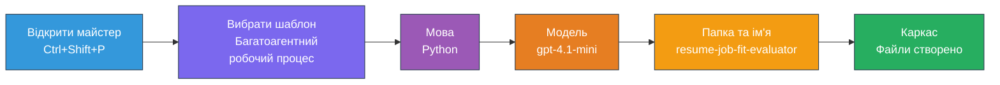
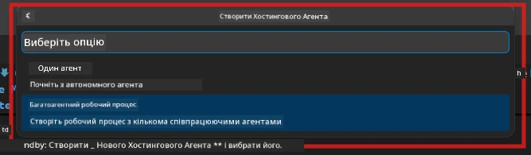

# Модуль 2 — Створення скелету багатос агентного проєкту

У цьому модулі ви використовуєте [розширення Microsoft Foundry](https://marketplace.visualstudio.com/items?itemName=TeamsDevApp.vscode-ai-foundry), щоб **створити скелет багатос агентного проєкту з робочим процесом**. Розширення генерує всю структуру проєкту — `agent.yaml`, `main.py`, `Dockerfile`, `requirements.txt`, `.env` та конфігурацію налагодження. Потім ви налаштовуєте ці файли у модулях 3 і 4.

> **Примітка:** Папка `PersonalCareerCopilot/` у цій лабораторії є повним, робочим прикладом налаштованого багатос агентного проєкту. Ви можете або створити новий проєкт (рекомендовано для навчання), або напряму вивчати існуючий код.

---

## Крок 1: Відкрийте майстер створення hosted agent


1. Натисніть `Ctrl+Shift+P`, щоб відкрити **Палітру команд**.
2. Введіть: **Microsoft Foundry: Create a New Hosted Agent** і виберіть цю команду.
3. Відкриється майстер створення hosted agent.

> **Альтернатива:** Клікніть на іконку **Microsoft Foundry** в панелі активності → натисніть іконку **+** поруч із **Agents** → **Create New Hosted Agent**.

---

## Крок 2: Оберіть шаблон багатос агентного робочого процесу

Майстер запропонує вибрати шаблон:

| Шаблон | Опис | Коли використовувати |
|----------|-------------|-------------|
| Одиночний агент | Один агент з інструкціями та опціональними інструментами | Лаб 01 |
| **Багатос агентний робочий процес** | Кілька агентів, які співпрацюють через WorkflowBuilder | **Цей лаб (Лаб 02)** |

1. Виберіть **Багатос агентний робочий процес**.
2. Натисніть **Далі**.



---

## Крок 3: Оберіть мову програмування

1. Виберіть **Python**.
2. Натисніть **Далі**.

---

## Крок 4: Оберіть модель

1. Майстер покаже моделі, розгорнуті у вашому проєкті Foundry.
2. Оберіть ту саму модель, що ви використовували в Лаб 01 (наприклад, **gpt-4.1-mini**).
3. Натисніть **Далі**.

> **Порада:** [`gpt-4.1-mini`](https://learn.microsoft.com/azure/foundry/foundry-models/concepts/models-sold-directly-by-azure#gpt-41-series) рекомендована для розробки — вона швидка, недорога та добре працює у багатос агентних робочих процесах. Для фінального продакшен-розгортання можна переключитися на `gpt-4.1` для більш якісного результату.

---

## Крок 5: Оберіть папку розміщення та ім'я агента

1. Відкриється діалог вибору файлу. Оберіть цільову папку:
   - Якщо виконуєте вправи з репозиторію майстер-класу: перейдіть до `workshop/lab02-multi-agent/` та створіть там нову підпапку
   - Якщо починаєте з нуля: оберіть будь-яку папку
2. Введіть **назву** hosted agent (наприклад, `resume-job-fit-evaluator`).
3. Натисніть **Створити**.

---

## Крок 6: Дочекайтесь завершення створення скелета

1. VS Code відкриває нове вікно (або оновлює поточне) зі створеним проєктом.
2. Ви побачите таку структуру файлів:

```
resume-job-fit-evaluator/
├── .env                ← Environment variables (placeholders)
├── .vscode/
│   └── launch.json     ← Debug configuration
├── agent.yaml          ← Agent definition (kind: hosted)
├── Dockerfile          ← Container configuration
├── main.py             ← Multi-agent workflow code (scaffold)
└── requirements.txt    ← Python dependencies
```

> **Примітка до майстер-класу:** У репозиторії майстер-класу папка `.vscode/` знаходиться у **корені робочого простору** з загальними `launch.json` та `tasks.json`. Конфігурації налагодження для Лаб 01 і Лаб 02 включені. При натисканні F5 оберіть зі списку **"Lab02 - Multi-Agent"**.

---

## Крок 7: Розуміємо створені файли (особливості багатос агентного)

Скелет багатос агентного відрізняється від скелету одиночного агента кількома ключовими моментами:

### 7.1 `agent.yaml` — визначення агента

```yaml
kind: hosted
name: resume-job-fit-evaluator
description: >
  A multi-agent workflow that evaluates resume-to-job fit.
metadata:
  authors:
    - Microsoft
  tags:
    - Multi-Agent Workflow
    - Resume Evaluator
protocols:
  - protocol: responses
    version: v1
environment_variables:
  - name: PROJECT_ENDPOINT
    value: ${PROJECT_ENDPOINT}
  - name: MODEL_DEPLOYMENT_NAME
    value: ${MODEL_DEPLOYMENT_NAME}
```

**Ключова відмінність від Лаб 01:** у розділі `environment_variables` можуть бути додаткові змінні для кінцевих точок MCP або конфігурації інших інструментів. `name` і `description` відображають багатос агентний варіант використання.

### 7.2 `main.py` — код багатос агентного робочого процесу

Скелет містить:
- **Декілька рядків інструкцій для агентів** (по одному константі на агента)
- **Декілька контекстних менеджерів [`AzureAIAgentClient.as_agent()`](https://learn.microsoft.com/python/api/overview/azure/ai-agents-readme)** (по одному на агента)
- **[`WorkflowBuilder`](https://learn.microsoft.com/agent-framework/workflows/agents-in-workflows)** для з’єднання агентів у робочий процес
- **`from_agent_framework()`** для подання робочого процесу як HTTP-ендпоінт

```python
from agent_framework import WorkflowBuilder, tool
from agent_framework.azure import AzureAIAgentClient
from azure.ai.agentserver.agentframework import from_agent_framework
```

Додатковий імпорт [`WorkflowBuilder`](https://learn.microsoft.com/agent-framework/workflows/agents-in-workflows) є новим у порівнянні з Лаб 01.

### 7.3 `requirements.txt` — додаткові залежності

Багатос агентний проєкт використовує ті ж базові пакети, що і Лаб 01, плюс пакети, пов’язані з MCP:

```
agent-framework-azure-ai==1.0.0rc3
agent-framework-core==1.0.0rc3
azure-ai-agentserver-agentframework==1.0.0b16
azure-ai-agentserver-core==1.0.0b16
debugpy
agent-dev-cli --pre
```

> **Важлива інформація по версіях:** пакет `agent-dev-cli` вимагає прапорець `--pre` у `requirements.txt` для встановлення останньої прев’ю-версії. Це потрібно для сумісності Agent Inspector з `agent-framework-core==1.0.0rc3`. Деталі дивіться в [Модуль 8 — Вирішення проблем](08-troubleshooting.md).

| Пакет | Версія | Призначення |
|---------|---------|---------|
| [`agent-framework-azure-ai`](https://learn.microsoft.com/agent-framework/overview/) | `1.0.0rc3` | Інтеграція Azure AI для [Microsoft Agent Framework](https://github.com/microsoft/agent-framework) |
| [`agent-framework-core`](https://learn.microsoft.com/agent-framework/overview/) | `1.0.0rc3` | Основне середовище виконання (включно з WorkflowBuilder) |
| `azure-ai-agentserver-agentframework` | `1.0.0b16` | Середовище виконання сервера hosted agent |
| `azure-ai-agentserver-core` | `1.0.0b16` | Основні абстракції сервера агента |
| `debugpy` | остання версія | Налагодження Python (F5 у VS Code) |
| `agent-dev-cli` | `--pre` | Локальний CLI для розробки + бекенд Agent Inspector |

### 7.4 `Dockerfile` — той самий, що й у Лаб 01

Dockerfile ідентичний Лаб 01 — копіює файли, встановлює залежності з `requirements.txt`, відкриває порт 8088 і запускає `python main.py`.

```dockerfile
FROM python:3.14-slim
WORKDIR /app
COPY ./ .
RUN pip install --upgrade pip && \
    if [ -f requirements.txt ]; then \
        pip install -r requirements.txt; \
    else \
      echo "No requirements.txt found" >&2; exit 1; \
    fi
EXPOSE 8088
CMD ["python", "main.py"]
```

---

### Контрольний список

- [ ] Майстер скелету завершено → нова структура проєкту відображена
- [ ] Видно всі файли: `agent.yaml`, `main.py`, `Dockerfile`, `requirements.txt`, `.env`
- [ ] У `main.py` імпортовано `WorkflowBuilder` (підтверджує, що вибрано шаблон багатос агентного)
- [ ] У `requirements.txt` присутні `agent-framework-core` та `agent-framework-azure-ai`
- [ ] Ви розумієте, чим скелет багатос агентного відрізняється від скелета одиночного агента (кілька агентів, WorkflowBuilder, інструменти MCP)

---

**Попередній:** [01 — Розуміння багатос агентної архітектури](01-understand-multi-agent.md) · **Наступний:** [03 — Налаштування агентів і середовища →](03-configure-agents.md)

---

<!-- CO-OP TRANSLATOR DISCLAIMER START -->
**Відмова від відповідальності**:
Цей документ було перекладено за допомогою сервісу автоматичного перекладу [Co-op Translator](https://github.com/Azure/co-op-translator). Хоча ми прагнемо до точності, будь ласка, враховуйте, що автоматичні переклади можуть містити помилки або неточності. Оригінальний документ рідною мовою слід вважати авторитетним джерелом. Для критичної інформації рекомендується звернутися до професійного людського перекладу. Ми не несемо відповідальності за будь-які непорозуміння або неправильні тлумачення, що виникли внаслідок використання цього перекладу.
<!-- CO-OP TRANSLATOR DISCLAIMER END -->